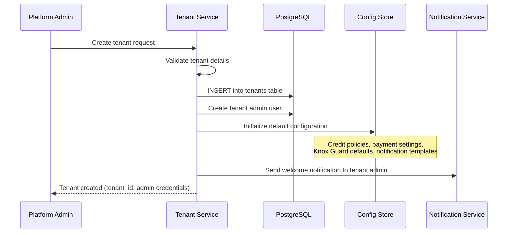
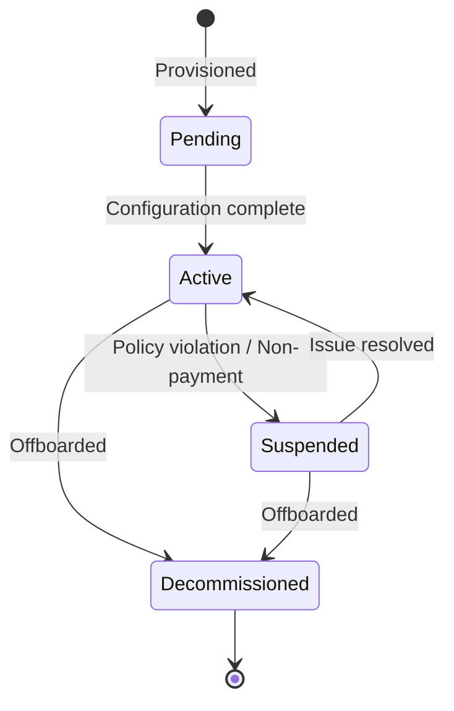
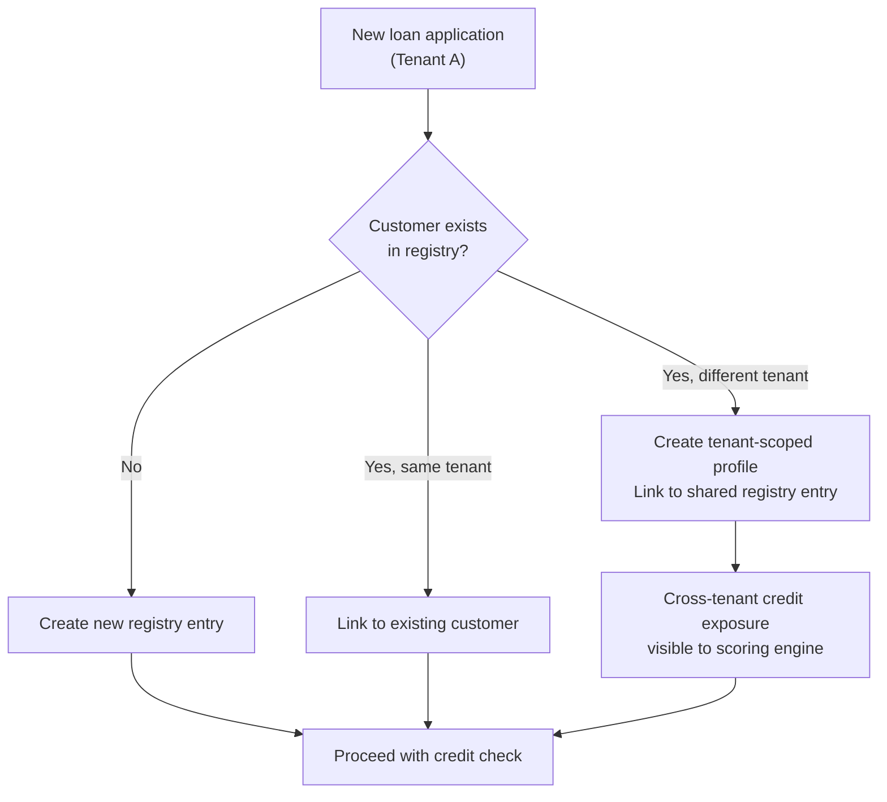

# Multi-Tenancy Architecture

## 1. Overview

IInovi uses a **shared-database, shared-schema** multi-tenancy model. All tenants coexist in a single PostgreSQL database, with isolation enforced at the row level through a mandatory `tenant_id` column and PostgreSQL Row-Level Security (RLS) policies. This approach balances operational simplicity (single database to manage, migrate, and back up) with strong data isolation guarantees.

### Design Goals

- **Data Isolation** -- a tenant must never see, modify, or infer another tenant's data
- **Operational Efficiency** -- single database instance to provision, patch, migrate, and monitor
- **Scalability** -- tenant onboarding requires no infrastructure changes
- **Configurability** -- each tenant can independently configure business rules, integrations, and branding
- **Auditability** -- all cross-tenant operations are explicitly logged

---

## 2. Tenant Isolation Strategy

### 2.1 The `tenant_id` Column

Every tenant-scoped table includes a non-nullable `tenant_id` UUID column. This column is:

- Part of the table's primary key or has a composite unique constraint alongside the entity's natural key
- Indexed for query performance
- Set automatically on INSERT via application-level middleware
- Never modifiable after creation (immutable by policy and database trigger)

```sql
CREATE TABLE devices (
    id          UUID PRIMARY KEY DEFAULT gen_random_uuid(),
    tenant_id   UUID NOT NULL REFERENCES tenants(id),
    imei        VARCHAR(15) NOT NULL,
    make        VARCHAR(100),
    model       VARCHAR(100),
    status      VARCHAR(20) NOT NULL DEFAULT 'available',
    created_at  TIMESTAMPTZ NOT NULL DEFAULT now(),
    updated_at  TIMESTAMPTZ NOT NULL DEFAULT now(),

    CONSTRAINT uq_device_tenant_imei UNIQUE (tenant_id, imei)
);

CREATE INDEX idx_devices_tenant_id ON devices(tenant_id);
```

### 2.2 Row-Level Security (RLS)

PostgreSQL RLS policies ensure that even if application code has a bug that omits the `tenant_id` filter, the database will enforce isolation. RLS acts as a defense-in-depth layer below the application.

```sql
ALTER TABLE devices ENABLE ROW LEVEL SECURITY;

CREATE POLICY tenant_isolation_policy ON devices
    USING (tenant_id = current_setting('app.current_tenant_id')::UUID);

CREATE POLICY tenant_insert_policy ON devices
    FOR INSERT
    WITH CHECK (tenant_id = current_setting('app.current_tenant_id')::UUID);
```

**How it works:**

1. On every API request, the authentication middleware extracts the `tenant_id` from the JWT token
2. Before executing any database query, the application sets the PostgreSQL session variable: `SET app.current_tenant_id = '<tenant-uuid>'`
3. RLS policies automatically filter all SELECT, UPDATE, and DELETE queries to only return rows matching the session's tenant
4. INSERT operations are validated to ensure the `tenant_id` matches the session context

### 2.3 Application-Level Enforcement

In addition to RLS, the application enforces tenant scoping at multiple layers:

```
Request -> JWT Extraction -> Tenant Context Middleware -> Service Layer -> Repository Layer -> RLS
```

| Layer | Enforcement Mechanism |
|---|---|
| **API Gateway** | Extracts `tenant_id` from JWT claims; rejects requests without valid tenant context |
| **Middleware** | Sets `tenant_id` in the request context and the database session variable |
| **Service Layer** | All service methods receive tenant context; business logic validates tenant ownership |
| **Repository Layer** | Base repository class automatically appends `tenant_id` filter to all queries |
| **Database (RLS)** | Final safety net; filters rows regardless of application query construction |

---

## 3. Tenant Provisioning Flow



### Provisioning Steps

1. **Tenant Record Creation** -- Insert into the `tenants` table with tenant metadata (name, registration details, status).
2. **Admin User Creation** -- Create the initial tenant admin user with the `partner_admin` role.
3. **Default Configuration** -- Seed tenant-scoped configuration with platform defaults. The tenant admin can customize these later.
4. **Integration Setup** -- Placeholder entries for ERP, payment provider, and Knox Guard configurations, to be completed by the tenant admin.
5. **Activation** -- The tenant starts in `pending` status and moves to `active` after completing required configuration (e.g., linking a payment provider).

### Tenant Lifecycle States



---

## 4. Data Isolation Guarantees

### 4.1 What Is Isolated

| Data Category | Isolation Level | Notes |
|---|---|---|
| Loans, applications, schedules | Fully isolated per tenant | No cross-tenant visibility |
| Devices, inventory | Fully isolated per tenant | Device IMEI is unique within a tenant |
| Partners, branches, staff | Fully isolated per tenant | Partner hierarchy is tenant-scoped |
| Payments, transactions | Fully isolated per tenant | Reconciliation is per-tenant |
| Audit logs | Fully isolated per tenant | Platform admins can query across tenants |
| Credit scoring strategies | Fully isolated per tenant | Each tenant configures independently |
| Notification templates | Fully isolated per tenant | Branding and messaging per tenant |

### 4.2 What Is Shared

| Data Category | Sharing Model | Rationale |
|---|---|---|
| Customer Registry | Cross-tenant (read-only lookup) | Enables deduplication and cross-tenant credit risk assessment |
| Device blacklists | Platform-wide | GSMA stolen device lists apply universally |
| Platform configuration | Platform-level | System-wide settings, feature flags |
| Tenant metadata | Platform admin only | Visible only to platform administrators |

### 4.3 Isolation Verification

The platform includes automated tests that verify tenant isolation:

- **Query leakage tests** -- Execute queries as Tenant A and assert zero rows from Tenant B
- **RLS bypass tests** -- Attempt queries without setting the session variable and assert failures
- **Cross-tenant write tests** -- Attempt to insert or update records with a mismatched `tenant_id` and assert rejection

---

## 5. Cross-Tenant Operations

### 5.1 Customer Registry Deduplication

The Customer Registry is the only service that intentionally performs cross-tenant lookups. When a new customer applies for a loan, the registry checks whether the customer (identified by national ID or phone number) exists under any tenant.



**Privacy controls for cross-tenant lookups:**
- Only the customer's existence and aggregate exposure (total outstanding balance) are shared
- PII (name, address, ID documents) is NOT visible across tenants
- Cross-tenant lookups are logged in the audit trail
- Tenants can opt out of cross-tenant data sharing via configuration

### 5.2 Platform-Level Reporting

Platform administrators can generate cross-tenant reports for portfolio-level oversight. These reports aggregate anonymized or summary-level data and never expose individual customer PII across tenant boundaries.

---

## 6. Tenant-Scoped Configuration

Each tenant can customize the platform behavior through a hierarchical configuration system. Configuration is resolved with the following precedence: **Tenant Override > Product Override > Platform Default**.

### 6.1 Configuration Categories

#### ERP Integration

```json
{
    "tenant_id": "uuid",
    "erp_config": {
        "provider": "sap_business_one",
        "base_url": "https://erp.partner.example.com/api",
        "auth_type": "oauth2",
        "sync_interval_minutes": 30,
        "inventory_sync_enabled": true,
        "order_push_enabled": true
    }
}
```

#### Payment Provider

```json
{
    "tenant_id": "uuid",
    "payment_config": {
        "primary_provider": "mpesa",
        "mpesa": {
            "shortcode": "174379",
            "passkey": "***",
            "callback_url": "https://api.platform.com/webhooks/mpesa/{tenant_id}",
            "environment": "production"
        },
        "fallback_provider": "airtel_money",
        "reconciliation_schedule": "0 */4 * * *"
    }
}
```

#### Knox Guard Policies

```json
{
    "tenant_id": "uuid",
    "knox_guard_config": {
        "api_key": "***",
        "lock_message_template": "This device is financed by {partner_name}. Contact {support_phone} for assistance.",
        "grace_period_days": 3,
        "auto_lock_on_arrears_days": 7,
        "unlock_on_final_payment": true,
        "wipe_on_write_off": false
    }
}
```

#### Credit Scoring Strategy

```json
{
    "tenant_id": "uuid",
    "scoring_config": {
        "strategy": "weighted_scorecard",
        "rules": [
            { "name": "crb_check", "weight": 0.4, "provider": "transunion" },
            { "name": "income_verification", "weight": 0.3, "source": "mpesa_statement" },
            { "name": "employment_check", "weight": 0.2, "source": "employer_api" },
            { "name": "blacklist_check", "weight": 0.1, "source": "internal" }
        ],
        "minimum_score": 600,
        "auto_approve_threshold": 750,
        "auto_decline_threshold": 400,
        "refer_range": { "min": 400, "max": 750 }
    }
}
```

---

## 7. Database Schema Considerations

### 7.1 Table Classification

Tables are classified into three categories based on their tenancy model:

| Category | `tenant_id` | RLS | Examples |
|---|---|---|---|
| **Tenant-scoped** | Required | Enabled | `loans`, `devices`, `payments`, `partners`, `branches` |
| **Platform-global** | Not present | Not applicable | `tenants`, `platform_config`, `device_blacklists` |
| **Cross-tenant** | Present but queryable across | Custom policies | `customer_registry` (with restricted cross-tenant read) |

### 7.2 Migration Strategy

Database migrations (managed by Alembic) must account for multi-tenancy:

- New tenant-scoped tables MUST include `tenant_id UUID NOT NULL REFERENCES tenants(id)`
- New tenant-scoped tables MUST have RLS enabled and policies created in the same migration
- Migrations run once against the shared database and apply to all tenants
- Data migrations that backfill or transform data must iterate over all tenants and set the session variable for each

### 7.3 Indexing Strategy

Every tenant-scoped table uses composite indexes that lead with `tenant_id` to ensure query performance at scale:

```sql
CREATE INDEX idx_loans_tenant_status ON loans(tenant_id, status);
CREATE INDEX idx_loans_tenant_customer ON loans(tenant_id, customer_id);
CREATE INDEX idx_payments_tenant_date ON payments(tenant_id, payment_date);
CREATE INDEX idx_devices_tenant_status ON devices(tenant_id, status);
```

### 7.4 Tenant-Aware Foreign Keys

Foreign keys between tenant-scoped tables include `tenant_id` to prevent cross-tenant referential integrity violations:

```sql
ALTER TABLE loans
    ADD CONSTRAINT fk_loans_customer
    FOREIGN KEY (tenant_id, customer_id)
    REFERENCES customers(tenant_id, id);
```

This ensures that a loan in Tenant A cannot reference a customer in Tenant B, even if the application layer has a bug.

---

## Related Documents

- [System Architecture Overview](overview.md) -- high-level architecture and service descriptions
- [Security Architecture](security.md) -- authentication, authorization, and data protection
- [Documentation Index](../README.md) -- full documentation map
