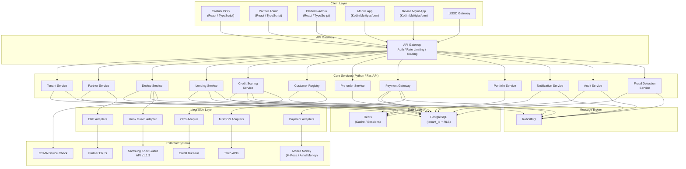
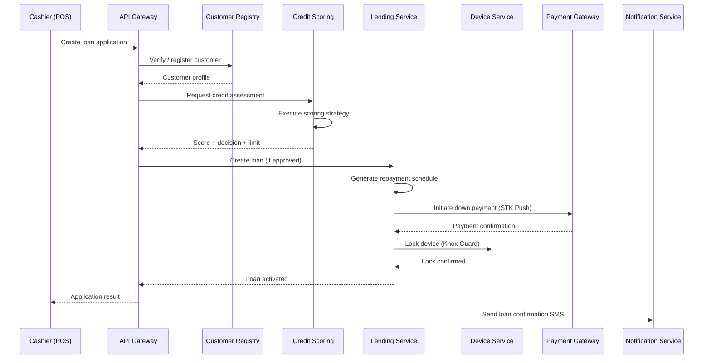
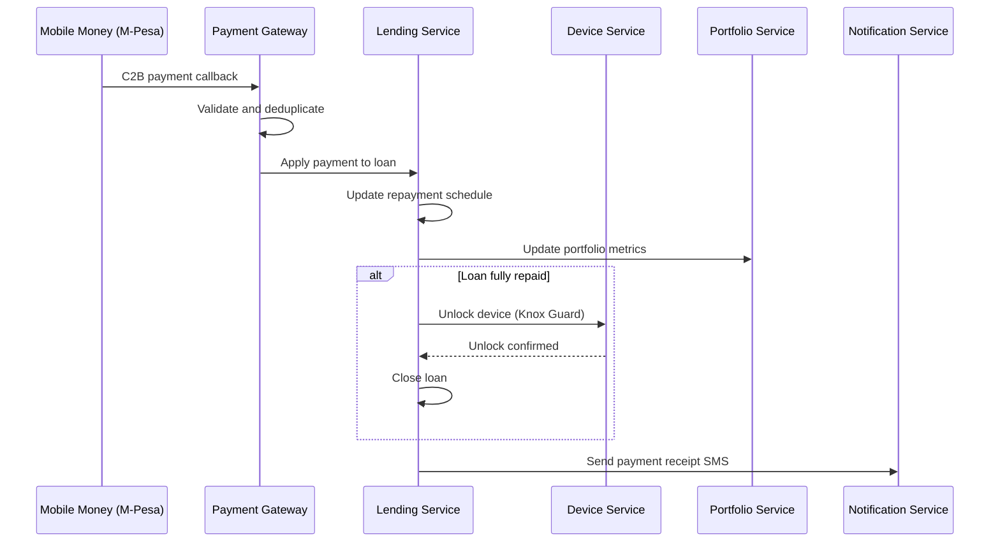
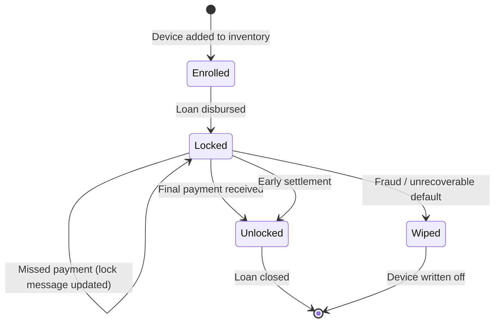
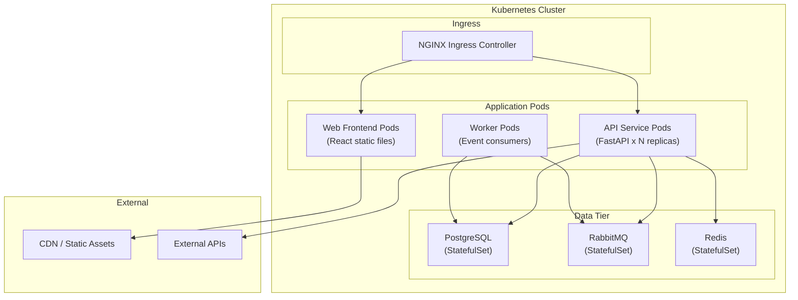

# System Architecture Overview

## 1. Introduction

IInovi is a **multi-tenant mobile device lending platform** that enables financing partners to originate and manage device loans (Buy Now, Pay Later) across multiple channels. The platform handles the full lending lifecycle from customer onboarding and credit assessment through device provisioning, repayment collection, and portfolio management.

### Purpose

The system exists to:

- Provide a scalable, multi-tenant infrastructure for device financing operations
- Unify multiple origination channels (web POS, mobile app, USSD) behind a single platform
- Integrate device lifecycle management (Samsung Knox Guard) with the lending workflow
- Support configurable credit scoring strategies per tenant and product
- Process mobile money payments with real-time reconciliation
- Deliver a complete loan portfolio management suite with reporting and analytics

### Scope

This document covers the high-level system architecture, service boundaries, technology choices, and primary data flows. Detailed designs for individual services and integrations are covered in their respective documentation.

---

## 2. Architecture Principles

| Principle | Description |
|---|---|
| **Multi-Tenant by Design** | Every data entity is scoped to a tenant. Row-Level Security (RLS) at the database layer enforces isolation. Tenant context propagates through all service calls. |
| **Service-Oriented Architecture** | The backend is organized into cohesive domain services with clear boundaries. Services communicate via synchronous REST APIs for queries and asynchronous message queues for events. |
| **Event-Driven Where It Matters** | State transitions in the lending lifecycle, payment confirmations, and device lock/unlock operations are published as domain events via RabbitMQ, enabling loose coupling and auditability. |
| **Strategy Pattern for Business Rules** | Credit scoring, pricing, and fee calculations use pluggable strategy interfaces, allowing each tenant to configure their own decision logic without code changes. |
| **API-First** | All functionality is exposed through versioned REST APIs. The frontend, mobile app, and USSD channel are all API consumers. |
| **Infrastructure Agnostic** | The platform runs in containers and can be deployed on any Kubernetes-compatible infrastructure, whether on-premise, cloud, or hybrid. |
| **Security in Depth** | Authentication, authorization, encryption, audit logging, and fraud detection are layered throughout the stack rather than bolted on at the edge. |

---

## 3. System Architecture Diagram

---

## 4. Technology Stack

| Layer | Technology | Purpose |
|---|---|---|
| **Backend Services** | Python 3.11+, FastAPI | REST API services, async request handling, OpenAPI documentation |
| **Web Frontend** | React 18, TypeScript, Vite | Cashier POS, Partner Admin, Platform Admin single-page applications |
| **Mobile Application** | Kotlin Multiplatform (KMP) | Cross-platform mobile app for customer self-service and device management |
| **USSD Channel** | Python, Africa's Talking / custom gateway | USSD menu-driven interface for feature phone access |
| **Database** | PostgreSQL 15+ | Primary data store with `tenant_id` column + Row-Level Security on all tenant-scoped tables |
| **Message Broker** | RabbitMQ 3.12+ | Asynchronous event publishing and consumption for domain events |
| **Cache / Sessions** | Redis 7+ | API response caching, session storage, rate limiting counters, distributed locks |
| **ORM / Migrations** | SQLAlchemy 2.x, Alembic | Database object mapping and schema migration management |
| **API Validation** | Pydantic v2 | Request/response schema validation and serialization |
| **Device Management** | Samsung Knox Guard REST API v1.1.3 | Remote device lock, unlock, wipe, and policy enforcement |
| **Payments** | M-Pesa Daraja API, Airtel Money API | STK push, C2B, B2C transactions, payment confirmation callbacks |
| **Containerization** | Docker, Docker Compose | Service packaging and local development environment |
| **Orchestration** | Kubernetes (K8s) | Production container orchestration, scaling, service discovery |
| **CI/CD** | GitHub Actions | Automated testing, building, and deployment pipelines |
| **Observability** | Prometheus, Grafana, structured logging | Metrics collection, dashboarding, and log aggregation |

---

## 5. Core Service Descriptions

### 5.1 Tenant Service

Manages the lifecycle of tenants (financing partners or business units) on the platform. Handles tenant provisioning, configuration management, feature toggles, and tenant-scoped settings such as branding, notification templates, and operational parameters.

**Key responsibilities:**
- Tenant CRUD and onboarding workflows
- Tenant-level configuration storage (credit policies, payment settings, Knox Guard policies)
- Feature flag management per tenant
- Tenant status management (active, suspended, decommissioned)

### 5.2 Partner Service

Manages partner organizations that operate under a tenant. Partners are the entities that originate loans--typically retail chains, mobile phone shops, or distribution networks. Each partner has its own set of branches, staff, and inventory.

**Key responsibilities:**
- Partner registration and KYC documentation
- Branch and outlet management
- Staff (cashier) enrollment and credential management
- Partner-level configuration and ERP integration settings

### 5.3 Device Service

Manages the device catalog, inventory, and device lifecycle. Integrates with Samsung Knox Guard for remote lock/unlock capabilities and GSMA Device Check for IMEI validation.

**Key responsibilities:**
- Device catalog management (makes, models, pricing)
- Inventory tracking per partner and branch
- IMEI validation via GSMA Device Check
- Knox Guard device enrollment, lock, unlock, and wipe operations
- Device status tracking through the lending lifecycle

### 5.4 Lending Service

The central domain service that orchestrates the end-to-end loan lifecycle. Manages loan applications, approvals, disbursements, repayment schedules, and loan closure.

**Key responsibilities:**
- Loan product configuration (terms, rates, fees, down payment rules)
- Loan application intake and validation
- Orchestration of credit scoring, device locking, and disbursement
- Repayment schedule generation and management
- Loan status state machine (applied, approved, disbursed, active, closed, defaulted, written-off)
- Early settlement and restructuring

### 5.5 Credit Scoring Service

Implements a strategy-based credit scoring engine. Each tenant can configure their own scoring strategy composed of pluggable rules, external bureau checks, and custom decision logic.

**Key responsibilities:**
- Strategy registration and configuration per tenant/product
- Rule engine execution (income verification, credit history, blacklist checks)
- External credit bureau (CRB) integration via adapter
- Score calculation, decisioning (approve, decline, refer), and limit assignment
- Scoring audit trail for regulatory compliance

### 5.6 Customer Registry

Maintains a deduplicated, cross-tenant customer identity store. Customers who borrow from multiple tenants are linked to a single registry entry while maintaining per-tenant data isolation for loan-specific information.

**Key responsibilities:**
- Customer identity resolution and deduplication (by national ID, phone number)
- KYC data collection and verification
- MSISDN ownership verification via telco adapters
- Cross-tenant customer lookup for credit risk assessment
- PII encryption and data protection

### 5.7 Pre-order Service

Manages the device pre-order workflow, allowing customers to reserve devices before they are available in inventory. Pre-orders feed into the lending pipeline once stock is allocated.

**Key responsibilities:**
- Pre-order creation and tracking
- Inventory reservation and allocation
- Pre-order to loan application conversion
- Notification triggers for stock availability
- Pre-order cancellation and refund handling

### 5.8 Payment Gateway

Abstracts mobile money payment processing behind a unified interface. Supports multiple payment providers and handles transaction lifecycle management, callback processing, and reconciliation.

**Key responsibilities:**
- M-Pesa STK Push initiation for customer-initiated payments
- C2B (Customer to Business) payment receipt processing
- B2C (Business to Customer) disbursement and refunds
- Payment callback processing and idempotency
- Transaction reconciliation with provider statements
- Multi-provider routing based on tenant configuration

### 5.9 Portfolio Service

Provides loan portfolio analytics, reporting, and risk management capabilities. Aggregates data from the lending and payment services to produce portfolio-level views.

**Key responsibilities:**
- Portfolio aging analysis (current, 1-30, 31-60, 61-90, 90+ days)
- Portfolio at Risk (PAR) calculations
- Collection efficiency tracking
- Write-off management and provisioning
- Regulatory reporting data preparation
- Tenant-level and platform-level dashboards

### 5.10 Notification Service

Manages multi-channel customer and staff notifications. Consumes domain events from the message broker and dispatches notifications via SMS, push, email, and in-app channels.

**Key responsibilities:**
- Notification template management per tenant
- SMS delivery via telco APIs
- Push notification delivery (FCM/APNs)
- Email dispatch
- Notification scheduling and throttling
- Delivery status tracking and retry logic

### 5.11 Audit Service

Records all significant operations and state changes across the platform for compliance, debugging, and forensic analysis.

**Key responsibilities:**
- Immutable audit log storage
- User action tracking (who did what, when, from where)
- Data change capture (before/after snapshots)
- Audit log querying and export
- Retention policy enforcement
- Integration with fraud detection for anomaly correlation

### 5.12 Fraud Detection Service

Monitors transactions and operations for suspicious patterns. Uses rule-based detection and anomaly scoring to flag potentially fraudulent activity.

**Key responsibilities:**
- Real-time transaction monitoring
- Velocity checks (e.g., multiple applications from same device/IP)
- Blacklist and watchlist screening
- Anomaly scoring based on historical patterns
- Alert generation and case management integration
- Device fingerprinting correlation

---

## 6. Integration Layer

The integration layer encapsulates all external system interactions behind adapter interfaces. This design allows the core services to remain agnostic to specific provider implementations and makes it straightforward to add new providers or swap existing ones.

### 6.1 ERP Adapters

Connect to partner ERP systems for inventory synchronization, order fulfillment, and financial reconciliation. Each partner may use a different ERP, so the adapter layer provides a common interface.

### 6.2 MSISDN Adapters

Integrate with telco APIs to verify mobile number ownership (MSISDN validation). Used during customer registration and KYC to confirm that the applicant controls the phone number provided.

### 6.3 Knox Guard Adapter

Wraps the Samsung Knox Guard REST API (v1.1.3) to manage device lock/unlock operations. The adapter translates internal device lifecycle events into Knox Guard API calls and processes asynchronous status callbacks.

**Key operations:**
- Device enrollment and profile assignment
- Remote lock with custom lock screen messaging
- Scheduled and immediate unlock
- Device wipe (factory reset)
- Policy group management

### 6.4 Payment Adapters

Integrate with mobile money providers (M-Pesa Daraja API, Airtel Money, etc.) for payment processing. Each adapter implements a common payment interface covering STK Push, C2B, B2C, and balance query operations.

### 6.5 CRB Adapter

Connects to credit reference bureaus for credit history checks and score retrieval. The adapter normalizes responses from different bureau providers into a standard credit report format consumed by the Credit Scoring Service.

---

## 7. Data Flow Overview

### 7.1 Loan Origination Flow

### 7.2 Repayment Flow

### 7.3 Device Lock/Unlock Lifecycle

---

## 8. Deployment Architecture

The platform is designed for horizontal scaling. API service pods are stateless and can be replicated freely. Worker pods consume from RabbitMQ queues and scale based on queue depth. The data tier uses StatefulSets with persistent volumes.

---

## Related Documents

- [Multi-Tenancy Model](multi-tenancy.md) -- tenant isolation strategy and data architecture
- [Security Architecture](security.md) -- authentication, authorization, and data protection
- [Documentation Index](../README.md) -- full documentation map
