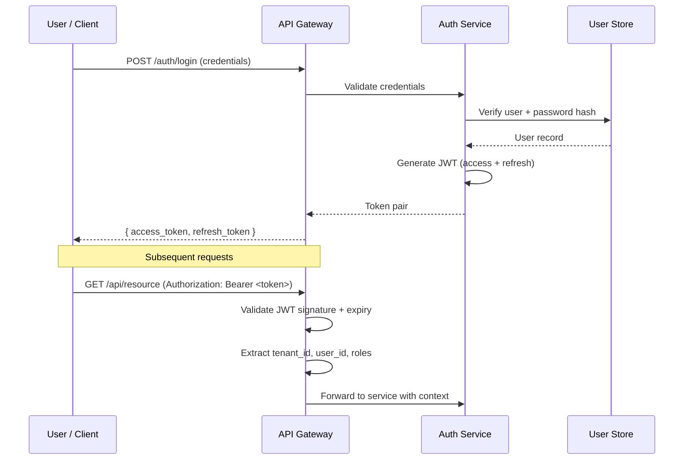
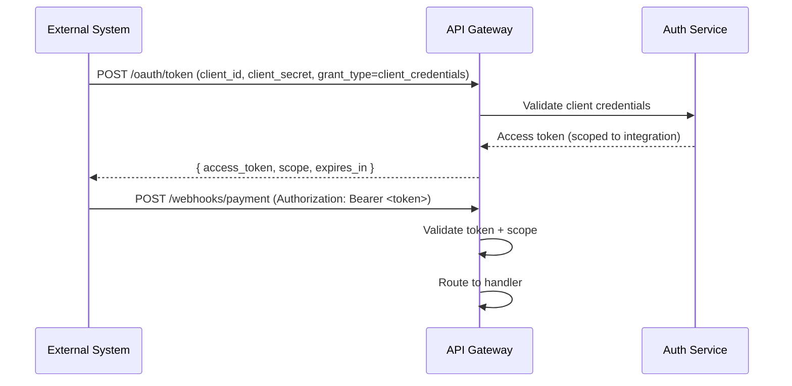
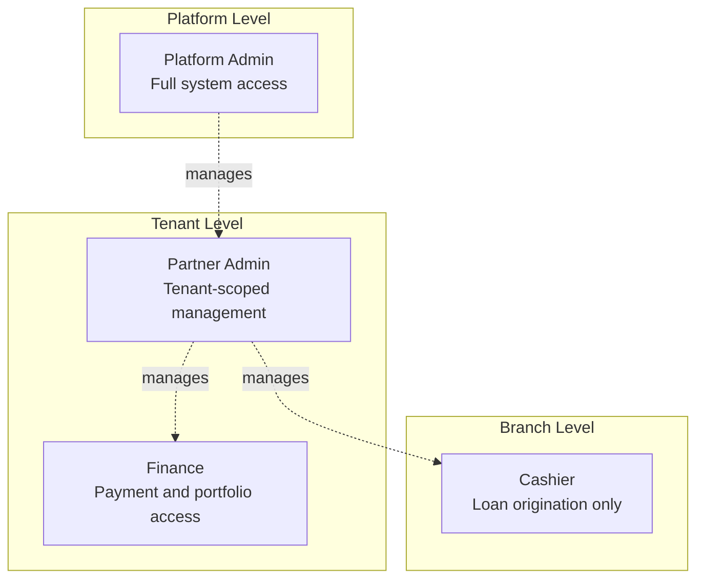
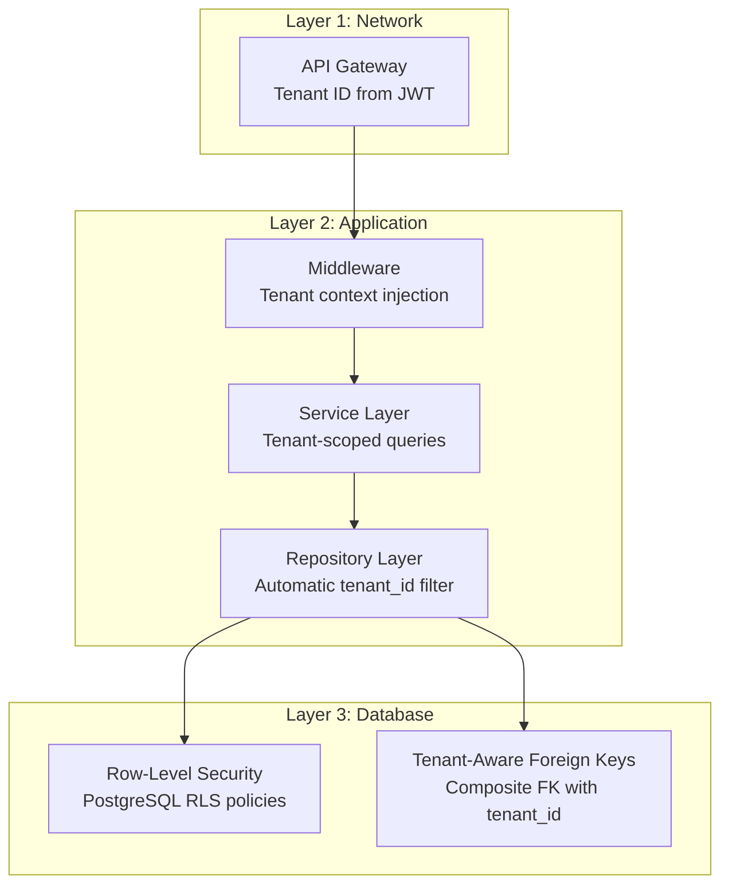
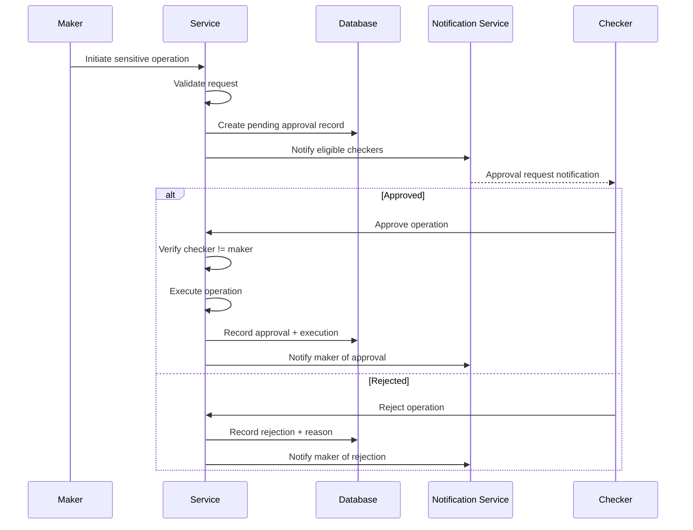

# Security Architecture

## 1. Overview

Security in the IInovi platform is implemented as a series of layered defenses spanning network, application, and data tiers. The platform handles sensitive financial data (loan records, payment transactions), personally identifiable information (national IDs, phone numbers, addresses), and controls physical assets (device lock/unlock). The security architecture reflects the high stakes of these responsibilities.

### Security Principles

| Principle | Application |
|---|---|
| **Defense in Depth** | Multiple overlapping controls at every layer; no single point of failure |
| **Least Privilege** | Users, services, and database connections receive the minimum permissions required |
| **Zero Trust** | Every request is authenticated and authorized, regardless of network origin |
| **Secure by Default** | Restrictive defaults; features must be explicitly enabled, not disabled |
| **Auditability** | Every security-relevant action is logged immutably for forensic analysis |
| **Data Minimization** | Collect and retain only the data necessary for the business function |

---

## 2. Authentication

### 2.1 JWT-Based Authentication

All API requests are authenticated using JSON Web Tokens (JWT). The platform issues short-lived access tokens and longer-lived refresh tokens upon successful login.



#### Token Structure

```json
{
    "header": {
        "alg": "HS256",
        "typ": "JWT"
    },
    "payload": {
        "sub": "user-uuid",
        "tenant_id": "tenant-uuid",
        "roles": ["cashier"],
        "partner_id": "partner-uuid",
        "branch_id": "branch-uuid",
        "iat": 1709827200,
        "exp": 1709830800,
        "jti": "unique-token-id"
    }
}
```

#### Token Lifecycle

| Token Type | Lifetime | Storage | Renewal |
|---|---|---|---|
| Access Token | 15 minutes | Memory only (never localStorage) | Via refresh token |
| Refresh Token | 7 days | HttpOnly secure cookie | Via re-authentication |

#### Token Revocation

- Refresh tokens are stored in the database and can be revoked immediately
- Access tokens are short-lived; revocation is handled by maintaining a Redis-backed deny list for the remaining validity window
- All tokens for a user are revoked on password change, account suspension, or explicit logout

### 2.2 OAuth2 for External Integrations

External system integrations (partner ERP callbacks, payment provider webhooks) use OAuth2 client credentials flow with pre-shared client IDs and secrets.



### 2.3 USSD Authentication

The USSD channel uses a session-based authentication model since USSD does not support bearer tokens. Authentication is handled via:

1. MSISDN identification from the telco gateway (trusted source)
2. PIN verification for sensitive operations (payment initiation, loan acceptance)
3. Session binding to prevent session hijacking

---

## 3. Authorization (RBAC)

### 3.1 Role Hierarchy

The platform implements Role-Based Access Control with a four-tier role hierarchy. Each role inherits no permissions from other roles; permissions are explicitly assigned.



### 3.2 Role Definitions and Permissions

#### Platform Admin

| Permission Area | Access |
|---|---|
| Tenant management | Full CRUD |
| Platform configuration | Full CRUD |
| Cross-tenant reporting | Read |
| User management (all tenants) | Full CRUD |
| System health and monitoring | Read |
| Audit logs (all tenants) | Read |
| Feature flags | Full CRUD |

#### Partner Admin

| Permission Area | Access |
|---|---|
| Tenant configuration | Read / Update (own tenant only) |
| Partner and branch management | Full CRUD (own tenant) |
| Staff management | Full CRUD (own tenant) |
| Loan products | Full CRUD (own tenant) |
| Credit scoring strategies | Full CRUD (own tenant) |
| Portfolio reports | Read (own tenant) |
| Device inventory | Full CRUD (own tenant) |
| Payment configuration | Read / Update (own tenant) |
| Audit logs | Read (own tenant) |

#### Finance

| Permission Area | Access |
|---|---|
| Payment transactions | Read (own tenant) |
| Reconciliation | Read / Execute (own tenant) |
| Portfolio reports | Read (own tenant) |
| Disbursements | Initiate / Approve (own tenant) |
| Write-offs | Initiate (requires maker-checker) |
| Refunds | Initiate (requires maker-checker) |

#### Cashier

| Permission Area | Access |
|---|---|
| Loan applications | Create / Read (own branch) |
| Customer registration | Create / Read (own branch) |
| Device lookup | Read (own branch inventory) |
| Payment receipt | Read (own branch) |
| Own profile | Read / Update |

### 3.3 Permission Enforcement

Permissions are checked at two levels:

1. **API Gateway** -- coarse-grained role check against the endpoint's required role
2. **Service Layer** -- fine-grained permission check including tenant scope, partner scope, and branch scope

```python
# Middleware-level role check
@router.post("/loans", dependencies=[Depends(require_role("cashier"))])
async def create_loan(request: LoanCreateRequest, ctx: TenantContext = Depends(get_tenant_context)):
    ...

# Service-level scope check
class LoanService:
    async def create_loan(self, ctx: TenantContext, data: LoanCreateRequest) -> Loan:
        # Verify cashier belongs to the branch and partner
        await self._verify_branch_access(ctx.user_id, ctx.branch_id)
        # Verify device is in the branch's inventory
        await self._verify_device_availability(ctx.tenant_id, ctx.branch_id, data.device_id)
        ...
```

---

## 4. API Security

### 4.1 Rate Limiting

Rate limits are enforced at the API Gateway level using Redis-backed sliding window counters. Limits are applied per user, per tenant, and globally.

| Scope | Default Limit | Window | Notes |
|---|---|---|---|
| Per user | 100 requests | 1 minute | Prevents individual abuse |
| Per tenant | 5,000 requests | 1 minute | Prevents tenant resource monopolization |
| Per endpoint (sensitive) | 10 requests | 1 minute | Login, password reset, OTP verification |
| Global | 50,000 requests | 1 minute | Infrastructure protection |

Rate limit headers are included in all API responses:

```
X-RateLimit-Limit: 100
X-RateLimit-Remaining: 87
X-RateLimit-Reset: 1709827260
```

### 4.2 Input Validation

All API inputs are validated using Pydantic v2 schemas with strict type checking. Validation occurs before any business logic executes.

**Validation rules include:**
- Type enforcement (string, integer, UUID, enum)
- Length constraints (min/max for strings)
- Pattern matching (regex for phone numbers, IMEI, national IDs)
- Range validation (loan amounts, term lengths)
- Enum value restriction (status fields, country codes)
- Nested object validation (recursive schema validation)

```python
class LoanApplicationSchema(BaseModel):
    model_config = ConfigDict(strict=True)

    customer_id: UUID
    device_id: UUID
    product_id: UUID
    down_payment_amount: Decimal = Field(ge=0, decimal_places=2)
    loan_term_months: int = Field(ge=1, le=36)
    msisdn: str = Field(pattern=r"^\+254[0-9]{9}$")
```

### 4.3 Additional API Protections

| Protection | Implementation |
|---|---|
| **CORS** | Whitelist of allowed origins per environment; no wildcards in production |
| **CSRF** | Double-submit cookie pattern for browser-based clients |
| **Request Size Limits** | Maximum request body size enforced at the gateway (1 MB default) |
| **Content-Type Enforcement** | Only `application/json` accepted; others rejected with 415 |
| **SQL Injection** | Parameterized queries via SQLAlchemy ORM; no raw SQL string interpolation |
| **XSS** | Content-Security-Policy headers; React's default JSX escaping on the frontend |
| **HTTPS Only** | TLS termination at the ingress; HSTS headers enforced |
| **Request ID Tracing** | Every request receives a unique `X-Request-ID` for correlation across services |

---

## 5. Data Encryption

### 5.1 Encryption at Rest

| Data Store | Encryption Method | Key Management |
|---|---|---|
| PostgreSQL | Transparent Data Encryption (TDE) or volume-level encryption | Cloud KMS or self-managed key vault |
| Redis | At-rest encryption where supported; sensitive data TTL-limited | Managed by infrastructure layer |
| File storage (documents, ID scans) | AES-256 encryption before storage | Application-managed keys per tenant |
| Backups | Encrypted with separate backup encryption key | Rotated quarterly |

#### Field-Level Encryption

Highly sensitive PII fields are encrypted at the application level before database storage, providing an additional layer of protection beyond TDE:

| Field | Encryption | Searchable |
|---|---|---|
| National ID number | AES-256-GCM | Via HMAC-indexed lookup column |
| Phone number (primary) | AES-256-GCM | Via HMAC-indexed lookup column |
| Date of birth | AES-256-GCM | No |
| Bank account numbers | AES-256-GCM | No |
| KYC document images | AES-256-GCM | No |

HMAC-indexed lookup columns allow equality searches on encrypted fields without decrypting the stored value. A deterministic HMAC of the plaintext is stored alongside the ciphertext, enabling `WHERE hmac_national_id = HMAC(search_value)` queries.

### 5.2 Encryption in Transit

| Channel | Protocol | Minimum Version |
|---|---|---|
| Client to API | TLS | 1.2 (1.3 preferred) |
| Service to service (internal) | mTLS or TLS | 1.2 |
| Service to database | TLS | 1.2 |
| Service to RabbitMQ | TLS | 1.2 |
| Service to Redis | TLS | 1.2 |
| Service to external APIs | TLS | 1.2 (enforced by providers) |

Cipher suites are restricted to AEAD ciphers (AES-GCM, ChaCha20-Poly1305). Legacy ciphers (RC4, 3DES, CBC mode without HMAC) are explicitly disabled.

---

## 6. Multi-Tenant Data Isolation

Security-critical aspects of the multi-tenancy model (detailed in [Multi-Tenancy Architecture](multi-tenancy.md)):

### 6.1 Isolation Enforcement Layers



### 6.2 Threat Mitigations

| Threat | Mitigation |
|---|---|
| **Tenant ID spoofing** | `tenant_id` is extracted from the signed JWT, not from request parameters |
| **Query parameter injection** | RLS policies filter regardless of query construction; parameterized queries prevent injection |
| **Horizontal privilege escalation** | Composite foreign keys prevent cross-tenant record references |
| **Bulk data exfiltration** | Rate limiting + result set size limits + audit logging of large queries |
| **Insider threat (support staff)** | Platform admin actions are audit-logged with maker-checker on sensitive operations |

---

## 7. Audit Trail

### 7.1 Audit Event Structure

Every security-relevant action produces an immutable audit record:

```json
{
    "event_id": "uuid",
    "timestamp": "2024-03-07T10:30:00Z",
    "tenant_id": "uuid",
    "actor": {
        "user_id": "uuid",
        "role": "cashier",
        "ip_address": "192.168.1.100",
        "user_agent": "Mozilla/5.0..."
    },
    "action": "loan.create",
    "resource": {
        "type": "loan",
        "id": "uuid"
    },
    "details": {
        "customer_id": "uuid",
        "device_id": "uuid",
        "amount": 45000.00,
        "currency": "KES"
    },
    "result": "success",
    "request_id": "uuid"
}
```

### 7.2 Audited Operations

| Category | Events |
|---|---|
| **Authentication** | Login success, login failure, token refresh, logout, password change, account lockout |
| **User Management** | User create, update, deactivate, role assignment, role revocation |
| **Loan Lifecycle** | Application create, approval, rejection, disbursement, status change, write-off |
| **Payments** | Payment initiation, confirmation, reversal, reconciliation adjustment |
| **Device Operations** | Knox Guard lock, unlock, wipe, policy change |
| **Configuration Changes** | Credit strategy update, payment config change, tenant settings update |
| **Data Access** | Customer PII view, bulk data export, report generation |
| **Administrative** | Tenant provisioning, feature flag changes, system configuration |

### 7.3 Audit Log Storage

- Audit logs are stored in append-only tables with no UPDATE or DELETE permissions granted to application roles
- Logs are retained for a minimum of 7 years to meet financial regulatory requirements
- Logs are periodically archived to cost-effective cold storage
- Log integrity is verifiable through hash chaining (each record includes a hash of the previous record)

---

## 8. Maker-Checker for Sensitive Operations

High-risk operations require dual authorization: one user initiates (maker) and a different user approves (checker). This control prevents unilateral execution of operations that could cause financial loss or compliance violations.

### 8.1 Operations Requiring Maker-Checker

| Operation | Maker Role | Checker Role |
|---|---|---|
| Loan write-off | Finance | Partner Admin |
| Manual payment adjustment | Finance | Partner Admin |
| Refund processing | Finance | Partner Admin |
| Bulk device unlock | Partner Admin | Platform Admin |
| Credit strategy change | Partner Admin | Platform Admin |
| Tenant configuration change | Partner Admin | Platform Admin |
| User role elevation | Partner Admin | Platform Admin |
| Payment provider config change | Partner Admin | Platform Admin |

### 8.2 Maker-Checker Flow



### 8.3 Approval Constraints

- The checker MUST be a different user than the maker
- The checker MUST have equal or higher role authority than the maker
- Pending approvals expire after a configurable timeout (default: 24 hours)
- Expired approvals are automatically rejected and logged
- The maker can cancel a pending approval before it is actioned

---

## 9. PII Handling and Compliance

### 9.1 Data Classification

| Classification | Description | Examples | Controls |
|---|---|---|---|
| **Restricted** | Highly sensitive PII and financial data | National ID, bank account, biometrics | Field-level encryption, access logging, masking in logs |
| **Confidential** | Sensitive business and customer data | Loan details, credit scores, payment history | Tenant isolation, role-based access, audit trail |
| **Internal** | Operational data not publicly available | Device inventory, partner config, staff records | Tenant isolation, role-based access |
| **Public** | Non-sensitive reference data | Device catalog (make/model), product descriptions | No special controls |

### 9.2 PII Protection Controls

| Control | Implementation |
|---|---|
| **Collection minimization** | Only fields required for the business process are collected; optional fields are clearly marked |
| **Purpose limitation** | PII is used only for the purpose it was collected (lending operations); secondary use requires explicit consent |
| **Storage limitation** | PII retention periods are defined per data category; automated purge jobs enforce retention |
| **Access control** | PII access is restricted by role; Cashiers see masked values for fields they don't need |
| **Encryption** | Restricted-class PII is encrypted at the field level in the database |
| **Masking in logs** | PII fields are automatically redacted in application logs using structured logging filters |
| **Masking in UI** | National IDs and phone numbers are partially masked in the UI unless explicitly unmasked (audit-logged) |
| **Consent tracking** | Customer consent for data processing is recorded with timestamp and scope |
| **Right to erasure** | Soft-delete with anonymization for closed, non-litigated accounts after the retention period |

### 9.3 Log Sanitization

Application logs are processed through a sanitization layer that detects and redacts PII patterns:

```python
REDACTION_PATTERNS = {
    "national_id": r"\b\d{7,8}\b",
    "phone_number": r"\+?\d{10,15}",
    "card_number": r"\b\d{4}[\s-]?\d{4}[\s-]?\d{4}[\s-]?\d{4}\b",
}

# Output example
# Before: "Customer +254712345678 applied with ID 12345678"
# After:  "Customer [REDACTED:phone] applied with ID [REDACTED:national_id]"
```

### 9.4 Regulatory Alignment

The platform's security and data handling practices are designed to align with:

| Regulation / Standard | Relevance | Key Requirements Addressed |
|---|---|---|
| **Kenya Data Protection Act (2019)** | Primary jurisdiction | Data minimization, consent, breach notification, cross-border transfer controls |
| **PCI DSS** | If card payments are ever introduced | Network segmentation, encryption, access control, monitoring |
| **CBK Prudential Guidelines** | Lending operations | Portfolio reporting, provisioning, risk management |
| **GDPR** | If processing EU resident data | Right to erasure, data portability, processing records |

---

## 10. Security Monitoring and Incident Response

### 10.1 Monitoring

| Monitor | Tool | Alert Threshold |
|---|---|---|
| Failed login attempts | Audit Service + Prometheus | 5 failures in 5 minutes per user |
| Rate limit breaches | API Gateway metrics | Any 429 response |
| RLS policy violations | PostgreSQL logs | Any occurrence (should be zero) |
| Token revocation spikes | Auth Service metrics | 10x normal rate |
| Unusual data access patterns | Fraud Detection Service | Anomaly score above threshold |
| Certificate expiry | Infrastructure monitoring | 30 days before expiry |

### 10.2 Incident Response

Security incidents follow a structured response process:

1. **Detection** -- automated alert or manual report
2. **Triage** -- severity classification (Critical, High, Medium, Low)
3. **Containment** -- isolate affected tenant/user/service; revoke compromised credentials
4. **Investigation** -- audit log analysis; root cause identification
5. **Remediation** -- patch vulnerability; rotate secrets; update security controls
6. **Communication** -- notify affected tenants per regulatory requirements
7. **Post-mortem** -- document findings; update runbooks; implement preventive measures

---

## Related Documents

- [System Architecture Overview](overview.md) -- high-level architecture and service descriptions
- [Multi-Tenancy Architecture](multi-tenancy.md) -- tenant isolation strategy and data architecture
- [Documentation Index](../README.md) -- full documentation map
