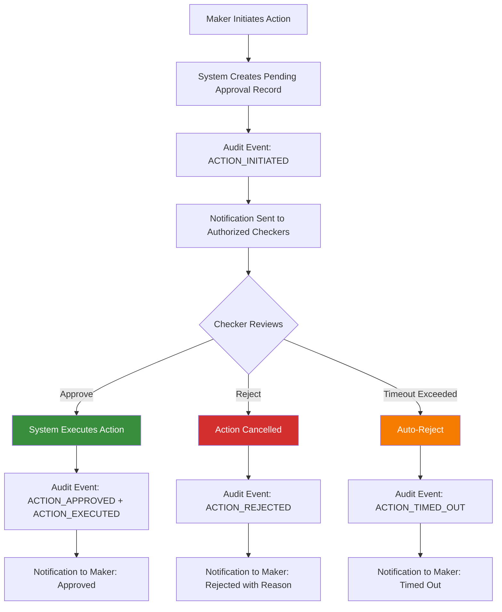
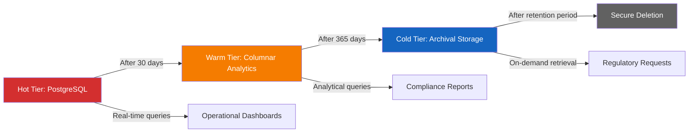
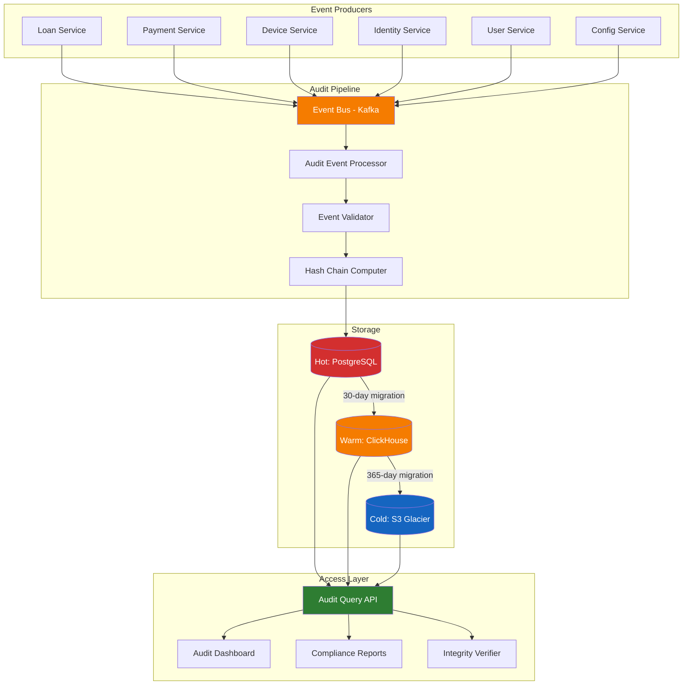

# Immutable Audit Trail and Event Log

## Overview

The Audit Trail service provides a tamper-evident, append-only record of every significant action performed within the Mobile Device Lending Solution. It captures who performed each action, what was changed, when it occurred, and whether it succeeded or failed. The audit trail is designed to satisfy financial regulatory requirements, enable forensic investigation, support the maker-checker authorization model, and provide a foundation for compliance reporting.

---

## Audited Events

### Loan Lifecycle Events

| Event | Description | Captured Data |
|---|---|---|
| `LOAN_APPLICATION_CREATED` | New loan application submitted | Applicant ID, device IMEI, product, agent, location |
| `LOAN_APPLICATION_APPROVED` | Application passes all checks and is approved | Approver, risk score, conditions |
| `LOAN_APPLICATION_DECLINED` | Application declined | Decline reason(s), score, reviewing user |
| `LOAN_DISBURSED` | Loan funds disbursed and device released | Disbursement amount, channel, device handover confirmation |
| `PAYMENT_RECEIVED` | Installment payment received | Amount, payment method, transaction reference, balance after |
| `PAYMENT_REVERSED` | Payment reversed (e.g., chargeback) | Reversal reason, original transaction ref, authorized by |
| `LOAN_RESTRUCTURED` | Loan terms modified (reschedule, extension) | Old terms, new terms, reason, authorized by (maker-checker) |
| `LOAN_WRITE_OFF` | Loan written off as uncollectible | Write-off amount, reason, authorized by (maker-checker) |
| `LOAN_SETTLED` | Loan fully repaid and closed | Final payment details, total paid, settlement date |
| `LOAN_DEFAULTED` | Loan status changed to default | Days overdue, outstanding balance, trigger policy |

### Device Management Events

| Event | Description | Captured Data |
|---|---|---|
| `DEVICE_REGISTERED` | Device enrolled in management platform | IMEI(s), Knox ID, make/model, registration agent |
| `DEVICE_LOCKED` | Device lock command issued | Lock reason, trigger (auto/manual), authorized by |
| `DEVICE_UNLOCKED` | Device unlock command issued | Unlock reason, trigger (auto/manual), authorized by |
| `DEVICE_LOCK_CONFIRMED` | Device confirms lock applied | Device acknowledgment timestamp, lock type |
| `DEVICE_UNLOCK_CONFIRMED` | Device confirms unlock applied | Device acknowledgment timestamp |
| `DEVICE_BLACKLISTED` | IMEI submitted to GSMA for blacklisting | GSMA reference, reason, authorized by (maker-checker) |
| `DEVICE_BLACKLIST_REVERSED` | IMEI blacklist removed after settlement | GSMA reference, settlement reference |
| `SIM_CHANGE_DETECTED` | SIM swap or removal detected | Old SIM ICCID, new SIM ICCID, detection method |
| `FACTORY_RESET_DETECTED` | Factory reset detected on financed device | Detection method, device status after reset |

### KYC and Verification Events

| Event | Description | Captured Data |
|---|---|---|
| `KYC_VERIFICATION_INITIATED` | Identity verification started | Customer ID, verification method, agent |
| `KYC_VERIFICATION_COMPLETED` | Identity verification completed | Result (pass/fail), confidence score, provider |
| `BIOMETRIC_CAPTURED` | Biometric data collected | Capture type (face), quality score, liveness result |
| `BIOMETRIC_MATCHED` | Biometric compared to reference | Match score, reference source, result |
| `DOCUMENT_SCANNED` | ID document captured | Document type, MRZ extracted, authenticity check result |

### Credit Bureau Events

| Event | Description | Captured Data |
|---|---|---|
| `CRB_CHECK_INITIATED` | Credit reference check started | Customer ID, bureau name |
| `CRB_CHECK_COMPLETED` | Credit reference check completed | Score, negative listings, active facilities count |
| `CRB_LISTING_SUBMITTED` | Negative listing submitted to CRB | Listing type, amount, reason, authorized by |
| `CRB_LISTING_REMOVED` | Negative listing removed from CRB | Removal reason, settlement reference |

### User and Access Events

| Event | Description | Captured Data |
|---|---|---|
| `USER_LOGIN` | User authenticated | User ID, role, method (password/SSO/MFA), IP address, device |
| `USER_LOGIN_FAILED` | Authentication attempt failed | User ID (if known), failure reason, IP address |
| `USER_LOGOUT` | User session ended | User ID, session duration |
| `USER_CREATED` | New user account created | User ID, role, created by, tenant |
| `USER_ROLE_CHANGED` | User role or permissions modified | User ID, old role, new role, changed by (maker-checker) |
| `USER_DEACTIVATED` | User account disabled | User ID, reason, deactivated by |
| `MFA_ENROLLED` | Multi-factor authentication configured | User ID, MFA method |
| `PASSWORD_CHANGED` | Password updated | User ID, changed by (self or admin) |

### Configuration Events

| Event | Description | Captured Data |
|---|---|---|
| `CONFIG_CHANGED` | System or tenant configuration modified | Config key, old value, new value, changed by |
| `LOAN_PRODUCT_CREATED` | New loan product defined | Product ID, terms, tenant, created by |
| `LOAN_PRODUCT_MODIFIED` | Loan product terms changed | Product ID, old terms, new terms, changed by |
| `DUNNING_CONFIG_CHANGED` | Dunning escalation schedule modified | Old schedule, new schedule, changed by |
| `TENANT_CREATED` | New tenant (financer) onboarded | Tenant ID, configuration, onboarded by |
| `TENANT_CONFIG_CHANGED` | Tenant configuration modified | Config key, old value, new value, changed by |

---

## Event Structure

Every audit event conforms to a standardized structure that captures the four essential dimensions: Who, What, When, and Outcome.

### Schema

```json
{
  "eventId": "EVT-2025-00001234",
  "eventType": "LOAN_DISBURSED",
  "timestamp": "2025-11-15T10:30:00.123Z",
  "sequenceNumber": 1234567890,
  "who": {
    "userId": "USR-001",
    "username": "jane.operator@mobifinance.co.ke",
    "role": "LOAN_OFFICER",
    "tenantId": "TNT-MOBIFINANCE",
    "ipAddress": "192.168.1.100",
    "userAgent": "IInovi-Portal/2.1.0",
    "sessionId": "SES-2025-ABCDEF"
  },
  "what": {
    "action": "DISBURSE_LOAN",
    "entityType": "LOAN",
    "entityId": "LOAN-2025-001234",
    "description": "Loan disbursed to customer CUS-2025-001234",
    "previousState": {
      "status": "APPROVED",
      "balance": 0
    },
    "newState": {
      "status": "ACTIVE",
      "balance": 25000,
      "currency": "KES"
    },
    "relatedEntities": [
      { "type": "CUSTOMER", "id": "CUS-2025-001234" },
      { "type": "DEVICE", "id": "DEV-IMEI-353456789012345" },
      { "type": "LOAN_PRODUCT", "id": "LP-SMARTPHONE-30DAY" }
    ],
    "metadata": {
      "disbursementChannel": "MPESA",
      "agentLocation": "Nairobi CBD Branch"
    }
  },
  "when": {
    "timestamp": "2025-11-15T10:30:00.123Z",
    "timezone": "Africa/Nairobi",
    "serverTimestamp": "2025-11-15T07:30:00.123Z"
  },
  "outcome": {
    "status": "SUCCESS",
    "errorCode": null,
    "errorMessage": null,
    "duration_ms": 1234
  },
  "integrity": {
    "previousEventHash": "sha256:abc123...",
    "eventHash": "sha256:def456...",
    "signedBy": "audit-service-v2.1.0"
  }
}
```

### Field Definitions

| Field | Description | Required |
|---|---|---|
| `eventId` | Globally unique event identifier | Yes |
| `eventType` | Categorized event type from the enumerated list | Yes |
| `timestamp` | ISO 8601 timestamp of when the action occurred | Yes |
| `sequenceNumber` | Monotonically increasing sequence for ordering | Yes |
| `who.userId` | Identifier of the user or system account | Yes |
| `who.role` | Role of the actor at the time of the action | Yes |
| `who.tenantId` | Tenant context of the action | Yes |
| `what.action` | Specific action performed | Yes |
| `what.entityType` | Type of the primary entity affected | Yes |
| `what.entityId` | Identifier of the primary entity affected | Yes |
| `what.previousState` | State before the action (for state changes) | When applicable |
| `what.newState` | State after the action (for state changes) | When applicable |
| `outcome.status` | `SUCCESS` or `FAILURE` | Yes |
| `integrity.previousEventHash` | Hash of the preceding event (chain integrity) | Yes |
| `integrity.eventHash` | Hash of the current event | Yes |

---

## Immutability Guarantees

### Append-Only Storage

- The audit trail is implemented as an append-only log.
- No `UPDATE` or `DELETE` operations are permitted on audit records.
- Database user permissions enforce write-only access (INSERT) for the audit service.
- Database triggers reject any modification or deletion attempt.

### Hash Chaining

Each event includes a cryptographic hash that chains it to the previous event, creating a tamper-evident sequence:

```
Event N:   hash = SHA-256(eventId + timestamp + who + what + outcome + previousEventHash)
Event N+1: previousEventHash = Event N's hash
```

**Verification Process**

1. Start from the genesis event (first event in the chain).
2. Recompute each event's hash from its constituent fields.
3. Verify that each event's `previousEventHash` matches the preceding event's computed hash.
4. Any break in the chain indicates tampering or data corruption.

### Integrity Verification Schedule

| Check | Frequency | Scope | Alert On Failure |
|---|---|---|---|
| Chain continuity (sequential hash verification) | Hourly | Last 1,000 events | Critical -- immediate investigation |
| Full chain verification | Daily | Complete chain for past 30 days | Critical -- immediate investigation |
| Cross-reference check (event counts vs. source system) | Daily | All event types | High -- reconciliation review |
| Cold storage integrity | Monthly | Archived data checksums | High -- archive integrity review |

---

## Maker-Checker Workflow

### Overview

The maker-checker (four-eyes) principle requires that certain high-risk or irreversible actions be initiated by one user (maker) and approved by a different, authorized user (checker). This prevents unilateral execution of sensitive operations.

### Actions Requiring Maker-Checker

| Action | Maker Role | Checker Role | Timeout |
|---|---|---|---|
| Loan write-off | Collections Agent | Collections Manager | 48 hours |
| Loan restructuring | Loan Officer | Credit Manager | 24 hours |
| Manual payment adjustment | Finance Officer | Finance Manager | 24 hours |
| Device blacklist submission | Collections Agent | Collections Manager | 48 hours |
| User role change | Admin | Super Admin | 24 hours |
| Financer configuration change | Tenant Admin | Platform Admin | 24 hours |
| Bulk operation (e.g., mass lock/unlock) | Operations | Operations Manager | 4 hours |
| CRB negative listing | Collections Agent | Collections Manager | 48 hours |
| Refund processing | Finance Officer | Finance Manager | 24 hours |

### Workflow



### Audit Events for Maker-Checker

Each maker-checker interaction generates multiple audit events:

1. `ACTION_INITIATED` -- Maker submits the request.
2. `ACTION_APPROVED` or `ACTION_REJECTED` -- Checker's decision.
3. `ACTION_EXECUTED` -- System carries out the approved action.
4. `ACTION_TIMED_OUT` -- No decision within the allowed window.

All events are linked by a `workflowId` to maintain traceability.

### Constraints

- The checker must be a different user than the maker.
- The checker must have the required authorization role.
- The checker must have access to the relevant tenant context.
- If the checker is unavailable, the action times out and must be re-initiated.
- Maker-checker requirements cannot be bypassed, even by super admins.

---

## Data Retention Tiers

### Tier Overview

Audit data follows a tiered storage strategy that balances query performance, cost, and regulatory compliance:

| Tier | Age | Storage | Access Pattern | Performance |
|---|---|---|---|---|
| **Hot** | 0--30 days | PostgreSQL (primary) | Real-time query, full-text search | Sub-second response |
| **Warm** | 31--365 days | Columnar store (e.g., ClickHouse or Parquet on S3) | Analytical queries, batch reporting | Seconds to minutes |
| **Cold** | 1--7 years | Archival storage (e.g., S3 Glacier, compressed) | Regulatory retrieval, forensic investigation | Minutes to hours |

### Tier Migration



See [Data Retention Policy](data-retention.md) for comprehensive retention rules, migration procedures, and deletion policies.

---

## Query and Search Capabilities

### Query Dimensions

The audit trail supports queries across the following dimensions:

| Dimension | Examples | Hot Tier | Warm Tier | Cold Tier |
|---|---|---|---|---|
| Time range | Events between two timestamps | Yes | Yes | Yes (with retrieval delay) |
| User | All actions by a specific user | Yes | Yes | Yes |
| Entity | All events for a specific loan, device, or customer | Yes | Yes | Yes |
| Event type | All loan write-offs in a period | Yes | Yes | Yes |
| Tenant | All events within a tenant scope | Yes | Yes | Yes |
| Outcome | All failed actions | Yes | Yes | Limited |
| Full-text | Search event descriptions and metadata | Yes | Limited | No |
| Workflow | All events in a maker-checker workflow | Yes | Yes | Yes |

### Query API

| Method | Endpoint | Description |
|---|---|---|
| `GET` | `/api/v1/audit/events` | Query events with filters |
| `GET` | `/api/v1/audit/events/{eventId}` | Get a specific event |
| `GET` | `/api/v1/audit/entities/{entityType}/{entityId}/timeline` | Get full event timeline for an entity |
| `GET` | `/api/v1/audit/users/{userId}/activity` | Get all activity for a user |
| `GET` | `/api/v1/audit/workflows/{workflowId}` | Get all events in a maker-checker workflow |
| `POST` | `/api/v1/audit/verify` | Verify hash chain integrity for a range |
| `GET` | `/api/v1/audit/reports/summary` | Aggregated event counts and statistics |

### Access Control

- Audit trail access is restricted by role and tenant scope.
- Users can only view audit events within their authorized tenant(s).
- Cross-tenant audit queries are restricted to platform administrators.
- All audit trail queries are themselves audited (meta-audit).
- Export and download of audit data requires elevated authorization.

---

## Compliance Alignment

### Financial Regulations

| Requirement | Implementation |
|---|---|
| Transaction recording | Every financial transaction (disbursement, payment, reversal, write-off) is audited |
| Dual authorization | Maker-checker workflow for high-value or irreversible transactions |
| Audit trail retention | Minimum 7-year retention for financial records |
| Regulatory reporting | Pre-built report templates aligned with central bank requirements |
| Examination readiness | Query API supports ad-hoc regulatory examination requests |

### Data Protection

| Requirement | Implementation |
|---|---|
| Lawful basis for processing | Audit trail processing justified under legal obligation and legitimate interest |
| Data minimization | Audit records capture action metadata, not full PII payloads |
| Access logging | All access to audit data is itself logged |
| Right to access | Customers can request audit trail of actions on their data |
| Right to erasure | Financial audit records are exempt from erasure during retention period; non-financial PII can be anonymized |
| Data breach notification | Audit trail integrity breach triggers data protection notification procedures |

### Internal Controls

| Control | Mechanism |
|---|---|
| Segregation of duties | Maker-checker enforcement; role-based access control |
| Completeness | All auditable actions produce events; missing events detected via reconciliation |
| Accuracy | Hash chaining ensures no modifications; periodic integrity verification |
| Availability | Hot tier with real-time access; warm/cold tiers with defined retrieval SLAs |
| Confidentiality | Encryption at rest and in transit; access restricted by role and tenant |

---

## Audit Trail Architecture



### Pipeline Processing

1. **Event Production**: Services emit audit events to the Event Bus (Kafka topic: `audit.events`).
2. **Event Processing**: The Audit Event Processor consumes events, validates structure, enriches with context.
3. **Validation**: The Event Validator checks required fields, enumerated values, and referential integrity.
4. **Hash Chaining**: The Hash Chain Computer appends the previous event hash and computes the current hash.
5. **Storage**: The validated, hashed event is written to the Hot tier (PostgreSQL).
6. **Migration**: Scheduled jobs migrate aging events from Hot to Warm to Cold.
7. **Access**: The Audit Query API provides a unified interface across all tiers.

---

## Related Documentation

- [Data Retention Policy](data-retention.md)
- [Fraud Risk Framework](../fraud-prevention/fraud-framework.md)
- [Notification Service](../notifications/notification-service.md)
- [Central Customer Registry](../customer-registry/deduplication.md)
