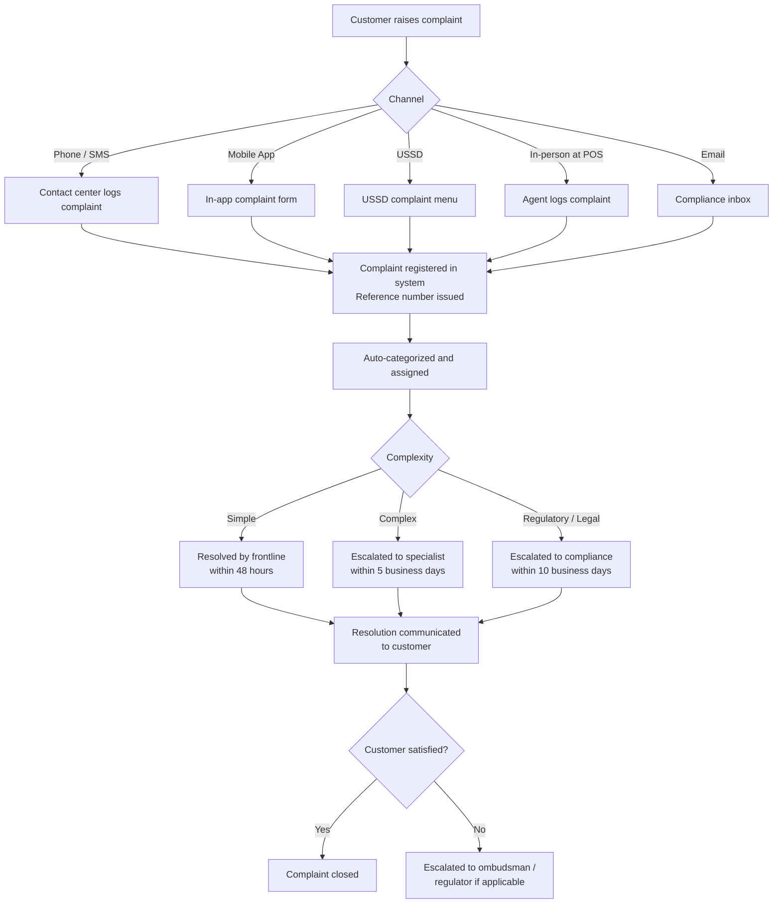

# Consumer Protection Compliance

## 1. Overview

The IInovi platform is designed to ensure fair, transparent, and responsible lending practices across all markets. Consumer protection compliance is not only a regulatory obligation but a core business principle -- building trust with customers is essential for sustainable device financing operations in African markets.

This document defines the platform's consumer protection obligations, transparent disclosure requirements, fair collection practices, complaints handling, and per-market regulatory alignment.

### Guiding Principles

| Principle | Application |
|---|---|
| **Transparency** | All costs, fees, and terms are disclosed clearly before the customer commits |
| **Fairness** | Lending terms are equitable; no predatory practices, hidden fees, or unfair contract clauses |
| **Responsible Lending** | Credit is extended only where the customer has a reasonable ability to repay |
| **Dignity in Collections** | Debt recovery respects the customer's dignity and complies with all applicable regulations |
| **Accessible Redress** | Customers have clear, accessible channels to raise complaints and seek resolution |
| **Data Rights** | Customers can access, correct, and request deletion of their personal data |

---

## 2. Transparent Disclosure

### 2.1 Pre-Contractual Disclosure

Before a customer signs a loan contract, the platform must present the following information in a clear, understandable format. The disclosure is rendered in the customer-facing interface (POS screen, mobile app, or read aloud via USSD) and is available in the local language where required.

| Disclosure Item | Description | Format |
|---|---|---|
| **Cash price of device** | The retail price the customer would pay if purchasing outright without financing | Currency amount |
| **Deposit amount** | The upfront payment required before the loan is disbursed | Currency amount + percentage of cash price |
| **Total loan principal** | Cash price minus deposit | Currency amount |
| **Interest rate** | The rate applied to the loan, stated as a flat rate and/or reducing balance rate | Percentage per period (daily, monthly, annually) |
| **Annual Percentage Rate (APR)** | The annualized cost of credit including all fees, calculated per regulatory methodology | Percentage |
| **Total interest payable** | The total interest amount over the full loan tenor | Currency amount |
| **Fees and charges** | All applicable fees: origination fee, insurance levy, late payment fee schedule, early settlement fee (if any) | Itemized list with currency amounts |
| **Total amount payable** | The sum of all payments the customer will make (deposit + all instalments + all fees) | Currency amount |
| **Cost of credit** | Total amount payable minus cash price (i.e., the total financing cost) | Currency amount |
| **Repayment schedule** | Each instalment date, amount, and breakdown (principal, interest, fees) | Table or list |
| **Loan tenor** | Duration of the loan in days, weeks, or months | Numeric with unit |
| **Payment method** | How payments are collected (mobile money, bank transfer) | Text |
| **Consequences of default** | What happens if the customer misses payments: late fees, device locking, CRB listing, legal action | Plain-language explanation |
| **Early settlement terms** | Whether early settlement is permitted, any fees or rebates applicable | Plain-language explanation |
| **Cooling-off period** | Whether a cooling-off period applies and how to exercise it | Duration + process |

### 2.2 Total Cost of Credit Calculation

The total cost of credit is calculated and displayed using the following formula:

```
Total Cost of Credit = Total Amount Payable - Cash Price of Device
                     = (Deposit + Sum of All Instalments + All Fees) - Cash Price

APR Calculation:
  The APR is calculated using the Internal Rate of Return (IRR) method,
  where the present value of all future payments equals the net loan
  amount disbursed. This follows the methodology prescribed by each
  market's regulatory authority.
```

### 2.3 Contract Summary Document

In addition to the on-screen disclosure, a Contract Summary Document is generated and provided to the customer (printed at POS or delivered digitally). This one-page summary contains all key terms in a standardized format mandated by local regulations (e.g., the Pre-Agreement Statement required under South Africa's National Credit Act).

---

## 3. Contract Requirements

### 3.1 Mandatory Contract Clauses

All loan contracts generated by the platform must include the following clauses, regardless of market:

| Clause | Content |
|---|---|
| **Parties** | Full legal names of the lender (financing partner / tenant) and the borrower |
| **Device details** | Make, model, IMEI, serial number, and agreed cash price |
| **Financial terms** | Principal, interest rate, APR, fees, total cost of credit, total amount payable |
| **Repayment schedule** | Due dates, amounts, and allocation (principal vs. interest vs. fees) |
| **Default and remedies** | Definition of default; cure period; consequences including device locking, CRB listing, and legal remedies |
| **Knox Guard disclosure** | Explicit disclosure that the device may be remotely locked or restricted if payments are not made on time |
| **Early settlement** | Right to early settlement; calculation method for settlement amount; any applicable rebate |
| **Cooling-off period** | Where applicable: duration, how to exercise, and consequences (return of device, refund of payments less any usage charge) |
| **Data processing consent** | Reference to the consent obtained for personal data processing, CRB checks, and telco data usage |
| **Complaints procedure** | How to raise a complaint; expected response time; escalation path |
| **Governing law** | Jurisdiction and applicable law |
| **Language** | Contracts must be available in a language the customer understands |

### 3.2 Prohibited Contract Terms

The following terms are prohibited in any loan contract on the platform:

| Prohibited Term | Reason |
|---|---|
| Unilateral amendment of interest rate or fees without notice | Unfair to the consumer; violates transparency principles |
| Waiver of customer's statutory rights | Statutory rights cannot be contracted away |
| Blanket authorization for data sharing beyond stated purposes | Violates data protection regulations |
| Acceleration clauses without cure period | Customers must be given reasonable opportunity to remedy a default |
| Penalty interest exceeding regulatory caps | Per-market maximum interest rate regulations apply |
| Confession of judgment clauses | Prohibited in most African jurisdictions |

### 3.3 Contract Template Management

Loan contract templates are managed centrally on the platform and versioned. Each tenant uses a base template that is customized with their legal entity details, branding, and any market-specific clauses required by local law. Template changes require legal review and compliance approval before deployment.

| Template Component | Managed By | Approval Required |
|---|---|---|
| Base contract template | Platform compliance team | Legal review + compliance sign-off |
| Tenant-specific details | Tenant / Partner Admin | Platform compliance verification |
| Market-specific addenda | Platform compliance team | Legal review per jurisdiction |
| Fee schedule | Tenant (within platform limits) | Auto-validated against regulatory caps |

---

## 4. Cooling-Off Period

### 4.1 Applicability

A cooling-off (or withdrawal) period gives the customer the right to cancel the loan agreement within a specified window after signing, without penalty. Applicability varies by market:

| Market | Cooling-Off Period | Regulatory Basis | Applicability |
|---|---|---|---|
| **Kenya** | No statutory cooling-off for digital credit | -- | Platform may offer voluntarily |
| **Nigeria** | No statutory cooling-off for credit agreements | -- | Platform may offer voluntarily |
| **South Africa** | 5 business days from date of agreement | National Credit Act, Section 121 | Mandatory for all credit agreements |
| **Ghana** | No statutory cooling-off for credit agreements | -- | Platform may offer voluntarily |

### 4.2 Cooling-Off Process (Where Applicable)

1. The customer notifies the lender within the cooling-off window that they wish to cancel.
2. The customer returns the device in its original condition (unused or minimally used).
3. The lender refunds all payments made (deposit and any instalments), less a reasonable daily usage charge if the device was used.
4. The loan is cancelled and the customer's credit record is updated to reflect cancellation (not default).
5. Knox Guard lock policy is removed from the device.
6. The cancellation is recorded in the audit trail.

### 4.3 Platform-Initiated Voluntary Cooling-Off

Even in markets where no statutory cooling-off exists, the platform supports a configurable voluntary cooling-off period. Tenants may choose to offer a 24-72 hour window (configurable) as a customer trust and satisfaction measure. This is configured at the product level and disclosed in the contract.

---

## 5. Maximum Interest Rate Regulations

### 5.1 Per-Market Interest Rate Caps

| Market | Interest Rate Cap | Regulatory Basis | Notes |
|---|---|---|---|
| **Kenya** | Cap repealed in 2019; no statutory cap as of 2024 | Interest Rate Cap repeal (Finance Act 2019) | CBK monitors pricing through the Digital Credit Providers Regulations |
| **Nigeria** | No statutory cap for microfinance / digital lending | CBN Revised Microfinance Policy | FCCPC monitors for exploitative pricing; lenders must disclose APR |
| **South Africa** | Prescribed maximum rates per credit type under NCA | National Credit Act, Section 105; Regulations Table A | Rates vary by agreement type (e.g., unsecured credit: repo rate + 21% per annum) |
| **Ghana** | No statutory cap; BoG publishes reference rates | Bank of Ghana Monetary Policy | BoG monitors for exploitative practices |

### 5.2 Platform Interest Rate Controls

The platform enforces the following controls regardless of regulatory caps:

| Control | Implementation |
|---|---|
| **Per-market maximum rate** | Platform-level configuration sets the maximum allowable interest rate per market; loan products exceeding this rate cannot be created |
| **APR disclosure validation** | The system validates that the disclosed APR accurately reflects all costs, including fees that are economically equivalent to interest |
| **Rate change audit** | All interest rate changes to loan products are audit-logged and require maker-checker approval |
| **Comparative display** | Where feasible, the APR is displayed alongside the flat rate to help customers understand the true cost |

---

## 6. Fair Collections Practices

### 6.1 Collections Principles

The platform's dunning and collections processes are designed to be firm but fair, complying with consumer protection regulations and industry best practice:

| Principle | Implementation |
|---|---|
| **Proportionality** | Collections intensity escalates gradually and proportionally to the arrears amount and duration |
| **Reasonable contact hours** | Automated SMS and calls are restricted to reasonable hours (e.g., 7:00 AM to 8:00 PM local time) |
| **Contact frequency limits** | Maximum number of collection contacts per day and per week (configurable per tenant, within platform limits) |
| **Respectful communication** | All collection messages use neutral, professional language; no threatening or abusive content |
| **Privacy** | Collections communications are directed only to the customer; no disclosure of debt to third parties without authorization |
| **Escalation transparency** | The customer is informed of each escalation step before it is taken (e.g., "Your device will be locked if payment is not received by [date]") |

### 6.2 Prohibited Collection Practices

The following practices are strictly prohibited on the platform:

- Contacting the customer outside of permitted hours
- Using threatening, abusive, or obscene language
- Disclosing the customer's debt status to family members, employers, or social contacts
- Contacting the customer's workplace unless the customer has provided explicit permission
- Misrepresenting the amount owed or the consequences of non-payment
- Charging collection fees not disclosed in the original contract
- Harassing the customer through excessive contact frequency
- Using device lock as a punitive measure without following the disclosed escalation process

### 6.3 Device Lock as a Collection Tool

The use of Knox Guard device locking as a collection tool is subject to specific consumer protection requirements:

| Requirement | Implementation |
|---|---|
| **Disclosure** | The customer must be informed at contract signing that the device may be remotely locked for non-payment |
| **Warning before lock** | The customer must receive at least one advance warning (SMS/notification) before the device is locked, specifying the payment amount and deadline |
| **Grace period** | A minimum grace period (configurable, typically 3-7 days past due) must elapse before the device is locked |
| **Partial access** | When locked, the device must still allow emergency calls (112/911) as mandated by device manufacturers and regulators |
| **Unlock on payment** | The device must be unlocked promptly (within hours, not days) once the overdue payment is received |
| **No data loss** | Device locking does not erase customer data; the customer retains access to their data upon unlock or loan completion |

---

## 7. Complaints Handling

### 7.1 Complaints Process

The platform provides a structured complaints handling process that is accessible, transparent, and timely:



### 7.2 Complaints SLA

| Category | Resolution Target | Escalation Path |
|---|---|---|
| **Billing / payment query** | 48 hours | Frontline -> Finance team -> Partner Admin |
| **Device lock dispute** | 24 hours | Frontline -> Technical team -> Partner Admin |
| **Data access / correction request** | 30 days (per regulation) | Frontline -> Data Protection Officer |
| **Contractual dispute** | 5 business days | Frontline -> Compliance team -> Legal |
| **Regulatory complaint** | 10 business days | Compliance team -> External legal counsel |

### 7.3 Complaints Reporting

| Report | Frequency | Audience |
|---|---|---|
| **Complaints volume and trends** | Weekly | Operations management |
| **SLA compliance** | Weekly | Operations management, compliance |
| **Complaints by category** | Monthly | Management, compliance, product team |
| **Regulatory complaints** | As they occur + monthly summary | Compliance officer, legal, board |
| **Systemic issue identification** | Quarterly | Product team, compliance, management |

### 7.4 External Dispute Resolution

If a customer is not satisfied with the internal resolution, they may escalate to the relevant external body:

| Market | External Body | Escalation Path |
|---|---|---|
| **Kenya** | CBK Consumer Protection Department; Financial Sector Ombudsman (proposed) | Written complaint to CBK |
| **Nigeria** | FCCPC (Federal Competition and Consumer Protection Commission); CBN Consumer Protection Department | Written complaint to FCCPC or CBN |
| **South Africa** | National Credit Regulator (NCR); Credit Ombud; National Consumer Commission | Formal complaint via NCR or Credit Ombud |
| **Ghana** | Bank of Ghana; National Consumer Protection Agency | Written complaint to BoG |

---

## 8. Data Access and Customer Rights

### 8.1 Customer Data Rights

Customers have the following rights regarding their personal data held on the platform. These rights are derived from applicable data protection legislation and are enforced regardless of market:

| Right | Description | Response Time |
|---|---|---|
| **Right of access** | Customer may request a copy of all personal data held about them | 30 days |
| **Right to rectification** | Customer may request correction of inaccurate personal data | 14 days |
| **Right to erasure** | Customer may request deletion of personal data (subject to regulatory retention obligations) | 30 days |
| **Right to data portability** | Customer may request their data in a structured, machine-readable format | 30 days |
| **Right to object** | Customer may object to processing of their data for marketing purposes | Immediate |
| **Right to withdraw consent** | Customer may withdraw previously granted consent for optional data processing | Immediate effect on future processing |

For detailed data privacy and consent management, see [Data Privacy and Consent Management](data-privacy-consent.md).

### 8.2 Data Access Request Process

1. Customer submits a data access request via any channel (app, USSD, POS, email, phone).
2. The system verifies the customer's identity (OTP to registered MSISDN).
3. The request is logged and assigned a reference number.
4. The Data Protection Officer (or designated team) compiles the requested data.
5. Data is provided in a structured format (PDF summary + machine-readable JSON/CSV where portability is requested).
6. Sensitive third-party data (e.g., credit scores from external bureaus) is excluded unless the customer requests it from the bureau directly.
7. The response is delivered securely (encrypted email, secure app download, or encrypted physical media).

---

## 9. Per-Market Consumer Protection Regulations

### 9.1 Kenya

| Regulation | Key Consumer Protection Requirements |
|---|---|
| **CBK Digital Credit Providers Regulations, 2022** | Mandatory disclosure of APR, total cost of credit, and all fees before disbursement; prohibition on unsolicited digital credit; mandatory cooling-off for digital loans (under discussion); fair pricing guidelines |
| **Consumer Protection Act, 2012** | Right to disclosure of information in plain language; prohibition on unconscionable conduct; right to fair and honest dealing |
| **Data Protection Act, 2019** | Customer consent for data processing; right of access, rectification, erasure; data breach notification within 72 hours |

### 9.2 Nigeria

| Regulation | Key Consumer Protection Requirements |
|---|---|
| **FCCPC Act, 2018** | Prohibition on unfair, deceptive, or abusive practices; mandatory disclosure of all terms and conditions; right to refund and compensation for defective services |
| **CBN Consumer Protection Framework, 2016** | Transparency in product pricing; complaints resolution within stipulated timelines; prohibition on excessive charges; data privacy obligations |
| **NDPR / Nigeria Data Protection Act, 2023** | Consent-based data processing; data subject rights (access, correction, deletion); mandatory Data Protection Impact Assessment for high-risk processing |

### 9.3 South Africa

| Regulation | Key Consumer Protection Requirements |
|---|---|
| **National Credit Act (NCA), 2005** | Mandatory affordability assessment; prescribed maximum interest rates; mandatory pre-agreement statement and quotation; 5-day cooling-off period; right to early settlement with rebate; debt counselling provisions; prohibition on reckless lending |
| **Consumer Protection Act (CPA), 2008** | Right to disclosure in plain language; right to fair, reasonable terms and conditions; right to privacy; right to choose and examine goods; cooling-off for direct marketing |
| **POPIA, 2013** | Consent for processing; data subject rights; conditions for lawful processing; mandatory breach notification |

### 9.4 Ghana

| Regulation | Key Consumer Protection Requirements |
|---|---|
| **Borrowers and Lenders Act, 2020 (Act 1052)** | Mandatory disclosure of loan terms; prohibition on unfair credit practices; borrower's right to information; regulation of credit agreements |
| **Bank of Ghana Directives** | Fair pricing guidelines; complaints handling requirements; mandatory KYC (Ghana Card); consumer awareness obligations |
| **Data Protection Act, 2012 (Act 843)** | Consent-based data processing; data subject rights; registration requirement for data controllers |

---

## 10. Responsible Lending Obligations

### 10.1 Affordability Assessment

Before extending credit, the platform must assess the customer's ability to repay without undue hardship. The affordability assessment considers:

| Factor | Data Source | Assessment Method |
|---|---|---|
| **Income** | Customer-declared; mobile money transaction analysis; employer verification (for EDD) | Minimum income threshold per product |
| **Existing debt obligations** | CRB report; customer declaration | Debt-to-income ratio check |
| **Living expenses** | Statutory minimum or estimated based on household size | Deducted from disposable income |
| **Loan instalment** | System-calculated based on product terms | Must not exceed configurable percentage of estimated disposable income |

### 10.2 Reckless Lending Prevention

The platform implements controls to prevent reckless or irresponsible lending:

| Control | Description |
|---|---|
| **CRB check** | Mandatory credit bureau check before every loan approval (see [Credit Bureau Integration](credit-bureau-integration.md)) |
| **Affordability gate** | Loan application is declined if the debt-to-income ratio exceeds the configured threshold |
| **Over-indebtedness check** | System checks for existing active loans on the platform and (where available) across the credit bureau |
| **Product suitability** | Loan products are configured with minimum income requirements and maximum debt-to-income ratios |
| **Repeat borrowing controls** | Limits on concurrent active loans per customer; minimum gap between successive loans (configurable) |

---

## Related Documents

- [KYC/AML Compliance](kyc-aml.md) -- identity verification and anti-money laundering controls
- [Data Privacy and Consent Management](data-privacy-consent.md) -- consent frameworks and data subject rights
- [Credit Bureau Integration](credit-bureau-integration.md) -- CRB check and reporting requirements
- [Licensing Requirements](licensing.md) -- per-market licensing obligations
- [Loan Lifecycle Events](../financial-lending/loan-lifecycle-events.md) -- early settlement, write-off, and restructuring rules
- [Documentation Index](../README.md) -- full documentation map
