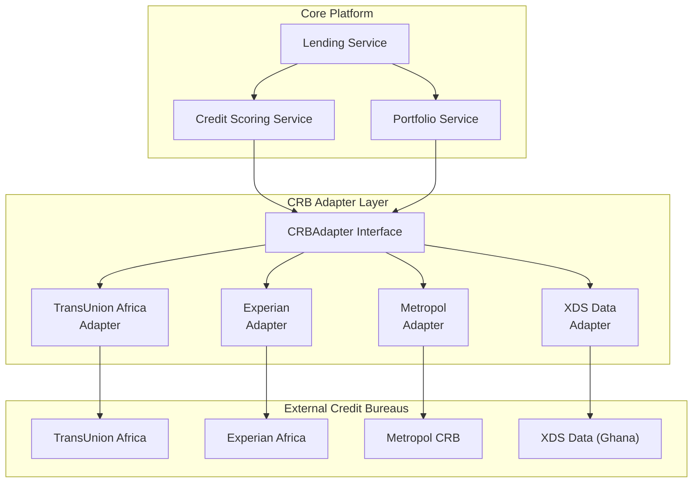
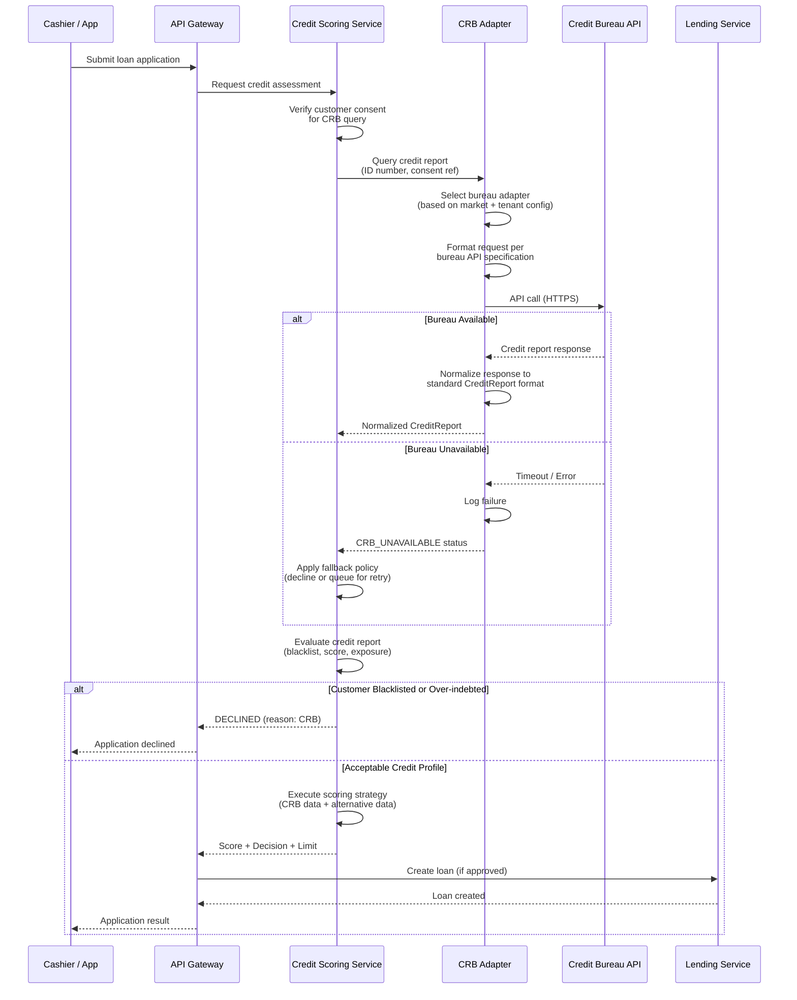
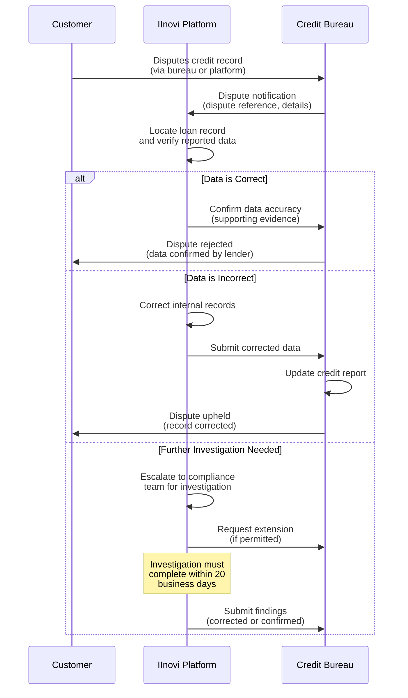

# Credit Bureau Integration

## 1. Overview

Credit bureau (CRB) integration is a fundamental component of the IInovi platform's lending operations. The platform queries credit reference bureaus before approving loans and reports portfolio performance data to these bureaus on a regular basis. This bidirectional integration serves dual purposes: enabling informed credit decisions and contributing to the broader credit information ecosystem in each market.

This document covers the pre-lending credit check process, post-lending reporting obligations, CRB adapter architecture, data formats, dispute resolution, and per-market regulatory requirements.

### Integration Principles

| Principle | Application |
|---|---|
| **Mandatory Pre-Lending Check** | No loan is approved without a credit bureau query; there are no exceptions or overrides |
| **Timely Reporting** | Portfolio performance is reported within regulatory timelines |
| **Data Accuracy** | All data submitted to credit bureaus is validated for accuracy before submission |
| **Adapter Isolation** | Bureau-specific logic is encapsulated in adapters; the core platform is bureau-agnostic |
| **Consent-Based** | CRB queries require documented customer consent (see [Data Privacy and Consent](data-privacy-consent.md)) |
| **Dispute Support** | The platform supports the dispute resolution process when customers challenge CRB records |

---

## 2. Integration Architecture

### 2.1 CRB Adapter Pattern

The platform uses an adapter pattern to integrate with multiple credit bureaus across different markets. Each bureau's API specifics, data formats, and authentication mechanisms are encapsulated in a dedicated adapter, while the Credit Scoring Service interacts with a unified interface.



### 2.2 Adapter Interface

All CRB adapters implement the following interface:

```python
class CRBAdapter(Protocol):
    async def query_credit_report(
        self,
        customer: CustomerIdentity,
        consent_reference: str,
        inquiry_reason: InquiryReason,
    ) -> CreditReport:
        """Query the bureau for a customer's credit report."""
        ...

    async def submit_portfolio_data(
        self,
        records: list[CRBSubmissionRecord],
        reporting_period: ReportingPeriod,
    ) -> SubmissionResult:
        """Submit portfolio performance data to the bureau."""
        ...

    async def submit_dispute(
        self,
        dispute: CRBDispute,
    ) -> DisputeReference:
        """Submit a customer dispute to the bureau."""
        ...

    async def check_submission_status(
        self,
        submission_reference: str,
    ) -> SubmissionStatus:
        """Check the status of a previous data submission."""
        ...
```

### 2.3 Bureau Selection by Market

| Market | Primary Bureau | Secondary Bureau | Selection Logic |
|---|---|---|---|
| **Kenya** | TransUnion Africa (formerly CRB Africa) | Metropol CRB | Configurable per tenant; both may be queried for comprehensive view |
| **Nigeria** | CRC Credit Bureau | FirstCentral Credit Bureau | Configurable per tenant |
| **South Africa** | TransUnion South Africa | Experian South Africa | At least one bureau must be queried; both recommended per NCA best practice |
| **Ghana** | XDS Data Ghana | Hudson Price Ghana | Configurable per tenant |

---

## 3. Pre-Lending Credit Check

### 3.1 Credit Check Flow

The credit bureau check is an integral step in the loan origination process. It occurs after customer identity verification and before credit scoring and loan approval.



### 3.2 Credit Report Evaluation

When a credit report is received, the following data points are evaluated:

| Data Point | Evaluation | Decision Impact |
|---|---|---|
| **Default listings** | Any active default or write-off on record | Auto-decline if active default exists (configurable severity threshold) |
| **Number of active accounts** | Count of open credit facilities | Over-indebtedness check; decline if count exceeds threshold |
| **Total outstanding exposure** | Sum of all outstanding balances | Debt-to-income assessment |
| **Payment history** | Pattern of on-time vs. late payments | Score input; poor history reduces credit score |
| **Inquiry count** | Number of recent credit inquiries | High inquiry count may indicate credit-seeking behavior |
| **Judgment or legal action** | Court judgments, administration orders | Auto-decline if active judgment exists |
| **Bureau credit score** | Proprietary credit score from the bureau | Used as input to the platform's scoring strategy |

### 3.3 Blacklist and Rejection Criteria

The following conditions result in automatic loan decline:

| Condition | Description | Override Permitted |
|---|---|---|
| **Active default listing** | Customer has an unresolved default on their credit record | No (regulatory requirement) |
| **Active write-off** | Customer has an unresolved write-off on their credit record | No |
| **Court judgment** | Customer has an active court judgment for debt | No |
| **Debt review / counselling** | Customer is under debt review or administration order (South Africa specific) | No (NCA requirement) |
| **Sanctions match** | Customer appears on a sanctions list | No (see [KYC/AML](kyc-aml.md)) |

### 3.4 CRB Unavailability Handling

If the credit bureau is unreachable (network timeout, service outage, maintenance window), the platform applies a configurable fallback policy:

| Policy | Behavior | Risk Level |
|---|---|---|
| **Strict (default)** | Decline the application; advise the customer to try again later | Lowest risk; may inconvenience customers |
| **Queue and Retry** | Hold the application in a pending state; retry the CRB query at intervals (e.g., every 15 minutes for up to 2 hours) | Moderate; customer waits |
| **Manual Override** | Escalate to a credit manager who may approve based on alternative data (with documented justification) | Higher risk; audit-logged; requires senior authorization |

The platform never approves a loan without a CRB check unless the Manual Override policy is in effect and a senior authorized user explicitly approves with documented rationale.

---

## 4. Post-Lending CRB Reporting

### 4.1 Reporting Obligations

After a loan is originated, the platform is obligated to report the loan account and its ongoing performance to the relevant credit bureau(s). This contributes to the customer's credit profile and is required by regulation.

| Reporting Event | Timing | Data Submitted |
|---|---|---|
| **New account opened** | Within 24 hours of loan activation | Loan details, customer identity, principal amount, term |
| **Monthly performance update** | Monthly (within 5 business days of month-end) | Account status, outstanding balance, instalment amount, payment history for the month |
| **Default notification** | Within 5 business days of default classification (typically 90+ DPD) | Default amount, date of default, last payment date |
| **Write-off notification** | Within 5 business days of write-off approval | Write-off amount, date, outstanding balance |
| **Account closure** | Within 5 business days of loan closure | Closure type (paid off, early settled), final balance (zero), closure date |
| **Dispute update** | As resolved | Dispute outcome, corrected data |

### 4.2 Account Status Codes

The platform maps its internal loan statuses to standardized CRB account status codes:

| Platform Status | CRB Status Code | Description |
|---|---|---|
| `CURRENT` | `PERFORMING` | Account is up to date; no arrears |
| `OVERDUE` (1-30 DPD) | `ARREARS_30` | Payment is 1-30 days past due |
| `OVERDUE` (31-60 DPD) | `ARREARS_60` | Payment is 31-60 days past due |
| `OVERDUE` (61-90 DPD) | `ARREARS_90` | Payment is 61-90 days past due |
| `DEFAULT` (90+ DPD) | `DEFAULT` | Account has been classified as in default |
| `RESTRUCTURED` | `RESTRUCTURED` | Loan terms have been modified |
| `WRITTEN_OFF` | `WRITE_OFF` | Account has been written off as a loss |
| `PAID_OFF` | `CLOSED_NORMAL` | Loan repaid in full per schedule |
| `EARLY_SETTLED` | `CLOSED_EARLY` | Loan settled early by the customer |
| `CANCELLED` | `CLOSED_CANCELLED` | Application cancelled before disbursement |

### 4.3 Data Submission Format

CRB data submissions follow the format prescribed by each bureau. The platform generates submissions in the required format through the adapter layer:

| Bureau | Submission Format | Transport | Authentication |
|---|---|---|---|
| **TransUnion Africa** | XML (Metro2 variant) or CSV per TransUnion specification | SFTP or REST API | API key + mutual TLS |
| **Experian** | CSV per Experian Africa specification | SFTP | SSH key + client certificate |
| **Metropol CRB** | JSON via REST API | HTTPS REST API | OAuth2 client credentials |
| **XDS Data Ghana** | CSV per XDS specification | SFTP | SSH key |
| **CRC Credit Bureau** | XML per CRC specification | SFTP or REST API | API key |

### 4.4 Submission Validation

Before submitting data to a credit bureau, the platform performs the following validation checks:

| Validation | Description | Action on Failure |
|---|---|---|
| **Completeness** | All mandatory fields are populated | Record excluded from submission; flagged for correction |
| **Format conformity** | Data values match expected formats (dates, amounts, ID numbers) | Record excluded; error logged |
| **Logical consistency** | Outstanding balance is consistent with repayment history; status matches DPD | Record flagged for manual review |
| **Duplicate detection** | No duplicate records for the same account in the same reporting period | Duplicate removed |
| **Reconciliation** | Total records match expected portfolio count | Submission held if variance exceeds threshold (e.g., 5%) |

---

## 5. Dispute Resolution

### 5.1 Customer-Initiated Disputes

When a customer disputes information on their credit report that was submitted by the platform, the following process applies:



### 5.2 Dispute Resolution Timeline

| Market | Investigation Period | Regulatory Basis |
|---|---|---|
| **Kenya** | 20 business days | Credit Reference Bureau Regulations, 2013 |
| **Nigeria** | 30 calendar days | CBN Guidelines on Credit Bureau Operations |
| **South Africa** | 20 business days | National Credit Act, Section 72 |
| **Ghana** | 30 calendar days | Credit Reporting Act, 2007 (Act 726) |

### 5.3 Internal Dispute Handling

| Step | Responsible | Timeline |
|---|---|---|
| Dispute received from bureau | Automated ingestion | Immediate |
| Dispute assigned to compliance analyst | System auto-assignment | Within 1 business day |
| Loan record and reporting data reviewed | Compliance analyst | Within 3 business days |
| Internal records corrected (if error found) | Compliance analyst + maker-checker | Within 5 business days |
| Response submitted to bureau | Compliance analyst via adapter | Within regulatory deadline |
| Customer notified of outcome | Notification Service | Within 2 business days of resolution |

---

## 6. Per-Market Regulatory Requirements

### 6.1 Kenya

| Requirement | Details |
|---|---|
| **Governing Regulation** | CBK Prudential Guidelines; Credit Reference Bureau Regulations, 2013 |
| **Licensed Bureaus** | TransUnion Africa, Metropol CRB, Creditinfo Kenya |
| **Pre-Lending Check** | Mandatory for all regulated lenders; must query at least one licensed bureau |
| **Reporting Frequency** | Monthly; within 5 business days of month-end |
| **Negative Listing** | Must be reported within 5 business days of classification |
| **Positive Reporting** | Mandatory; all performing accounts must be reported |
| **Customer Consent** | Written or digital consent required before querying the bureau |
| **Dispute Resolution** | Bureau must investigate within 20 business days |
| **Data Retention at Bureau** | Negative data retained for 5 years; positive data retained for life of account + 5 years |

### 6.2 Nigeria

| Requirement | Details |
|---|---|
| **Governing Regulation** | CBN Guidelines on Credit Bureau Operations; Credit Reporting Act (proposed) |
| **Licensed Bureaus** | CRC Credit Bureau, FirstCentral Credit Bureau, CreditRegistry |
| **Pre-Lending Check** | Recommended but not universally mandatory for all credit types; mandatory for banks and OFIs |
| **Reporting Frequency** | Monthly |
| **Negative Listing** | Must be reported promptly after classification |
| **Positive Reporting** | Encouraged; increasingly expected by CBN |
| **Customer Consent** | Required before accessing credit report |
| **Dispute Resolution** | Bureau must investigate within 30 calendar days |
| **Data Retention at Bureau** | Per bureau policy; typically 7 years for negative data |

### 6.3 South Africa

| Requirement | Details |
|---|---|
| **Governing Regulation** | National Credit Act (NCA), 2005; NCA Regulations; NCR Guidelines |
| **Licensed Bureaus** | TransUnion, Experian, Compuscan (now part of Experian), XDS Data |
| **Pre-Lending Check** | Mandatory under NCA Section 81(2); must conduct affordability assessment |
| **Reporting Frequency** | Monthly; prescribed data submission format |
| **Negative Listing** | Must be reported within prescribed timeline; customer must be notified before adverse listing |
| **Positive Reporting** | Mandatory; all credit agreements must be reported |
| **Customer Consent** | Required; must be specific and informed |
| **Dispute Resolution** | 20 business days; NCA Section 72 |
| **Customer Notification** | Customer must be notified before an adverse listing is submitted (SA-specific requirement) |
| **Data Retention at Bureau** | Negative data: varies by type (judgment: 5 years; default: 1 year after settlement; rehabilitation: 5 years from date of debt counselling order) |

### 6.4 Ghana

| Requirement | Details |
|---|---|
| **Governing Regulation** | Credit Reporting Act, 2007 (Act 726); Bank of Ghana Guidelines |
| **Licensed Bureaus** | XDS Data Ghana, Hudson Price Ghana, Dun & Bradstreet Ghana |
| **Pre-Lending Check** | Required per Bank of Ghana directive for licensed lenders |
| **Reporting Frequency** | Monthly |
| **Negative Listing** | Must be reported promptly |
| **Positive Reporting** | Required; all performing credit facilities must be reported |
| **Customer Consent** | Required before accessing credit report |
| **Dispute Resolution** | 30 calendar days per Credit Reporting Act |
| **Data Retention at Bureau** | Negative data retained for 7 years |

---

## 7. Data Security for CRB Integration

### 7.1 Transmission Security

| Control | Implementation |
|---|---|
| **Transport encryption** | All API calls to credit bureaus use TLS 1.2 or higher |
| **SFTP submissions** | File submissions use SFTP with SSH key authentication; no FTP or unencrypted channels |
| **Request signing** | API requests are signed where the bureau supports it (HMAC or certificate-based) |
| **Response validation** | Responses are validated for integrity (schema validation, checksum where provided) |

### 7.2 Data Handling

| Control | Implementation |
|---|---|
| **No persistent caching** | Raw credit bureau responses are not cached beyond the active request session; only the normalized CreditReport summary is stored |
| **Credit report storage** | The normalized credit report summary is stored encrypted and scoped to the loan application |
| **Access restriction** | Credit report data is accessible only to the Credit Scoring Service and authorized compliance users |
| **Audit trail** | Every CRB query and submission is logged with timestamp, user, reason, and outcome |
| **PII in submissions** | Customer PII in CRB submissions is encrypted in transit and handled per the platform's data classification policy |

### 7.3 Credential Management

| Control | Implementation |
|---|---|
| **API keys and secrets** | Stored in a secrets vault (not in application configuration files or source code) |
| **Key rotation** | CRB API credentials are rotated quarterly or upon personnel change |
| **Per-tenant credentials** | Where the bureau issues per-lender credentials, each tenant's credentials are stored and used independently |
| **Access logging** | Access to CRB credentials in the vault is logged and restricted to authorized infrastructure roles |

---

## 8. Monitoring and Alerting

### 8.1 Operational Monitoring

| Metric | Threshold | Alert |
|---|---|---|
| **CRB query success rate** | Below 95% over 15-minute window | Alert to operations team |
| **CRB query latency** | p95 above 10 seconds | Alert to operations team |
| **CRB submission success** | Any submission rejection | Alert to compliance team |
| **Submission reconciliation variance** | Above 2% record count variance | Alert to compliance team |
| **Dispute response overdue** | Within 5 days of regulatory deadline | Alert to compliance officer |

### 8.2 Compliance Reporting

| Report | Frequency | Audience |
|---|---|---|
| **CRB query volume and outcomes** | Weekly | Credit team, compliance |
| **Submission completeness** | Monthly | Compliance, operations |
| **Dispute resolution status** | Weekly | Compliance officer |
| **Rejected submissions (data quality)** | Monthly | Data quality team, compliance |
| **Bureau uptime and performance** | Monthly | Operations, vendor management |

---

## Related Documents

- [KYC/AML Compliance](kyc-aml.md) -- identity verification and sanctions screening
- [Data Privacy and Consent Management](data-privacy-consent.md) -- customer consent for CRB queries
- [Consumer Protection Compliance](consumer-protection.md) -- responsible lending and disclosure obligations
- [Licensing Requirements](licensing.md) -- per-market licensing obligations for CRB access
- [Loan Lifecycle Events](../financial-lending/loan-lifecycle-events.md) -- write-off and CRB reporting triggers
- [System Architecture Overview](../architecture/overview.md) -- CRB Adapter in the integration layer
- [Documentation Index](../README.md) -- full documentation map
