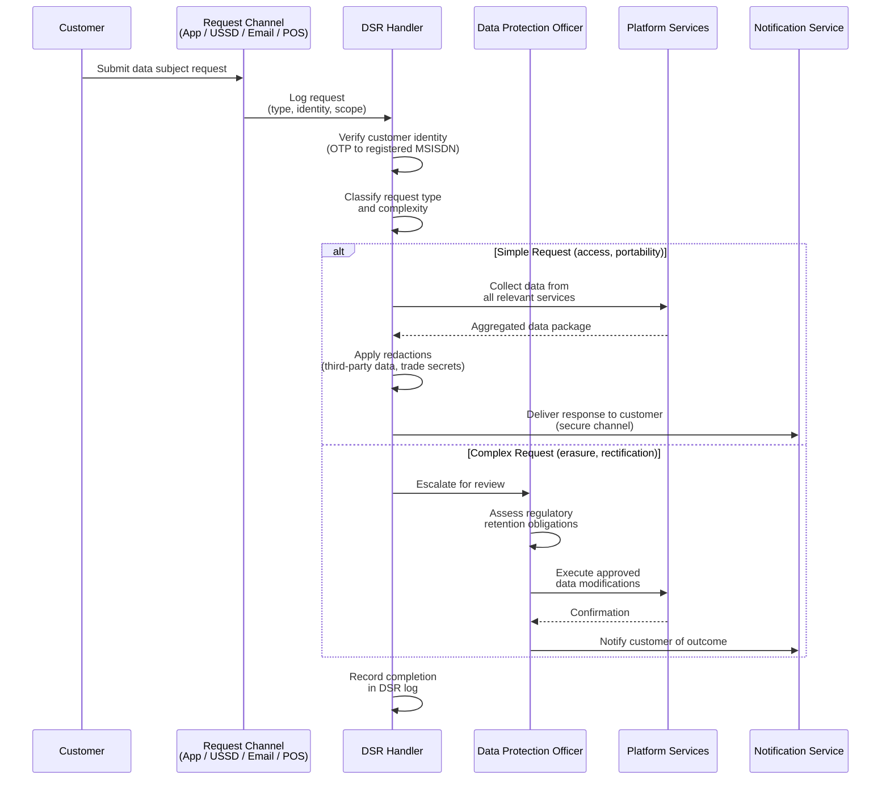

# Data Privacy and Consent Management

## 1. Overview

The IInovi platform collects and processes personal data from customers across multiple African jurisdictions, each with its own data protection legislation. The platform handles identity documents, biometric data, financial transaction records, mobile money account information, telco usage data, and credit bureau records -- all of which are subject to strict data protection requirements.

This document defines the platform's data privacy compliance framework, consent management architecture, data subject rights implementation, and cross-border data transfer controls.

### Privacy Principles

| Principle | Application |
|---|---|
| **Lawfulness** | All data processing has a documented legal basis (consent, contractual necessity, legal obligation, or legitimate interest) |
| **Purpose Limitation** | Personal data is collected for specified, explicit, and legitimate purposes and is not processed beyond those purposes |
| **Data Minimization** | Only the minimum personal data necessary for each processing activity is collected |
| **Accuracy** | Personal data is kept accurate and up to date; inaccurate data is corrected or erased without delay |
| **Storage Limitation** | Personal data is retained only for as long as necessary for the stated purpose or regulatory retention requirement |
| **Integrity and Confidentiality** | Personal data is protected against unauthorized access, loss, or destruction through technical and organizational measures |
| **Accountability** | The platform maintains records of processing activities and can demonstrate compliance at any time |

---

## 2. Applicable Data Protection Frameworks

### 2.1 Framework Summary

| Framework | Jurisdiction | Applicability to IInovi |
|---|---|---|
| **Protection of Personal Information Act (POPIA)** | South Africa | Applies to all processing of personal information of South African data subjects |
| **Data Protection Act (DPA), 2019** | Kenya | Applies to all processing of personal data of Kenyan data subjects |
| **Nigeria Data Protection Act (NDPA), 2023** | Nigeria | Applies to all processing of personal data of Nigerian data subjects; supersedes NDPR 2019 |
| **Data Protection Act, 2012 (Act 843)** | Ghana | Applies to all processing of personal data of Ghanaian data subjects |
| **General Data Protection Regulation (GDPR)** | European Union | Applies if the platform processes data of EU residents (e.g., diaspora customers) or if a data processor is EU-based |

### 2.2 Key Requirements Comparison

| Requirement | POPIA (SA) | DPA (Kenya) | NDPA (Nigeria) | DPA (Ghana) | GDPR |
|---|---|---|---|---|---|
| **Consent required** | Yes (or other lawful basis) | Yes (or other lawful basis) | Yes (or other lawful basis) | Yes (or other lawful basis) | Yes (or other lawful basis) |
| **Data Protection Officer** | Information Officer (mandatory) | DPO (mandatory for certain controllers) | DPO (mandatory for certain controllers) | Not explicitly required | DPO (mandatory for certain controllers) |
| **Breach notification** | To regulator "as soon as reasonably possible" | Within 72 hours to DPC | Within 72 hours to NDPC | To DPC "as soon as practicable" | Within 72 hours to supervisory authority |
| **Cross-border transfers** | Adequate protection required | Adequate protection required | Adequate protection required | Approval of DPC required | Adequacy decision or safeguards required |
| **Data subject access** | Yes | Yes | Yes | Yes | Yes |
| **Right to erasure** | Yes (with exceptions) | Yes (with exceptions) | Yes (with exceptions) | Yes (with exceptions) | Yes (with exceptions) |
| **Data portability** | Not explicitly | Yes | Yes | Not explicitly | Yes |
| **DPIA required** | Not explicitly mandatory; recommended | Required for high-risk processing | Required for high-risk processing | Not explicitly required | Required for high-risk processing |

---

## 3. Consent Management

### 3.1 Consent Requirements

The platform collects explicit, informed, and specific consent for each category of data processing. Consent is not bundled; customers grant or withhold consent for each processing purpose independently.

| Consent Purpose | Required For | Legal Basis | Withdrawable |
|---|---|---|---|
| **Personal data processing for loan application** | All customers | Contractual necessity + consent | No (required for service; customer may decline to apply) |
| **Credit bureau query** | All loan applicants | Consent (regulatory requirement in most markets) | No (required for loan approval; customer may decline to apply) |
| **Credit bureau reporting** | All loan customers | Legal obligation (per market regulations) | No (regulatory obligation) |
| **Telco data access (MSISDN lookup)** | Customers where MSISDN verification is used | Consent | Yes (but may affect loan eligibility) |
| **Mobile money transaction data access** | Customers scored using mobile money data | Consent | Yes (but may affect loan eligibility) |
| **Biometric data processing** | Customers in markets requiring biometric KYC | Consent + legal obligation (market-dependent) | No (where legally mandated) |
| **Marketing communications** | Optional | Consent | Yes (immediate effect) |
| **Data sharing with financing partner (tenant)** | All customers | Contractual necessity + consent | No (required for service) |
| **Device management (Knox Guard)** | All device finance customers | Contractual necessity + consent | No (required for service) |

### 3.2 Consent Collection

Consent is collected through the following mechanisms depending on the origination channel:

| Channel | Consent Method | Evidence Captured |
|---|---|---|
| **POS (in-person)** | Digital consent form on POS screen; customer acknowledges by tapping "I Agree" after reviewing each consent item; optional physical signature on printed summary | Timestamp, device ID, POS location, consent version, customer ID |
| **Mobile App** | In-app consent screens with checkbox per consent purpose; cannot proceed without required consents | Timestamp, device fingerprint, app version, consent version, customer ID |
| **USSD** | Consent read aloud via USSD text; customer confirms by entering a PIN or confirmation code | Timestamp, MSISDN, session ID, consent version |
| **Web** | Web form with individual consent checkboxes and links to full policy text | Timestamp, IP address, browser fingerprint, consent version, customer ID |

### 3.3 Consent Record Structure

Every consent grant or withdrawal is recorded as an immutable record:

```json
{
    "consent_id": "uuid",
    "customer_id": "uuid",
    "tenant_id": "uuid",
    "consent_purpose": "crb_query",
    "consent_version": "2.1",
    "policy_document_url": "https://iinovi.com/privacy/v2.1",
    "status": "granted",
    "granted_at": "2024-03-07T10:30:00Z",
    "granted_via": "mobile_app",
    "expires_at": null,
    "withdrawn_at": null,
    "withdrawal_reason": null,
    "metadata": {
        "app_version": "1.4.2",
        "device_fingerprint": "abc123...",
        "ip_address": "197.232.x.x"
    }
}
```

### 3.4 Consent Versioning

When the consent text or scope changes, a new consent version is created. Customers who granted consent under an earlier version are prompted to re-consent at their next interaction if the changes are material.

| Change Type | Action Required |
|---|---|
| **Editorial / clarification** | No re-consent required; version incremented (minor) |
| **Scope expansion** (new data type collected) | Re-consent required; version incremented (major) |
| **New processing purpose** | New consent purpose created; existing consent unaffected |
| **Third-party change** (new data processor) | Re-consent required if the new processor was not covered by existing consent |
| **Regulatory change** | Consent text updated to reflect new requirements; re-consent if scope changes |

### 3.5 Consent Audit Trail

The consent management system maintains a complete audit trail that supports:

- Demonstrating that valid consent existed at the time of each data processing activity
- Tracking consent versions and when customers were migrated between versions
- Recording all consent withdrawals with effective timestamps
- Providing regulators with evidence of consent practices upon request

---

## 4. Data Subject Rights

### 4.1 Rights Implementation

The platform supports all data subject rights required by the applicable frameworks. Rights requests are processed through a centralized Data Subject Rights (DSR) handler.

| Right | Description | Implementation | Response Time |
|---|---|---|---|
| **Right of Access** | Customer may request a copy of all personal data held | System generates a data export package (JSON + PDF summary) containing all personal data across services | 30 days |
| **Right to Rectification** | Customer may request correction of inaccurate data | Customer or agent submits correction request; verified against source documents; data updated across all services | 14 days |
| **Right to Erasure** | Customer may request deletion of personal data | Soft delete with anonymization; subject to regulatory retention obligations (KYC data retained per market minimums) | 30 days |
| **Right to Restriction** | Customer may request limitation of processing | Processing restricted to storage only; data flagged as restricted; downstream systems honor the flag | 14 days |
| **Right to Data Portability** | Customer may request data in a structured, machine-readable format | Export in JSON or CSV format; covers all customer-provided data and transaction history | 30 days |
| **Right to Object** | Customer may object to processing based on legitimate interest | Objection recorded; processing paused pending review; marketing processing stopped immediately | 14 days |
| **Right Not to be Subject to Automated Decisions** | Customer may request human review of automated credit decisions | Credit scoring decision can be manually reviewed by a credit officer upon request | 14 days |

### 4.2 Data Subject Request Process



### 4.3 Erasure and Anonymization

When a customer exercises the right to erasure, the following process applies:

| Data Category | Erasure Treatment | Retention Exception |
|---|---|---|
| **Customer identity data** | Anonymized (name, address replaced with placeholder values; ID numbers deleted) | KYC data retained per regulatory minimum (5-7 years per market) |
| **Contact details** | Deleted (phone number, email) | Retained if active loan exists |
| **Transaction history** | Retained in anonymized form (customer reference replaced with pseudonymous ID) | Financial records retained per regulatory minimum (7 years) |
| **Credit bureau data** | Platform ceases reporting; requests bureau to note erasure | Bureau retains per their own policy |
| **Consent records** | Retained (proof of consent at time of processing) | Retained for the duration of the retention period |
| **Loan documents** | Anonymized after regulatory retention period | Original retained during retention period |
| **Biometric data** | Deleted | Not retained beyond KYC verification |
| **Marketing preferences** | Deleted immediately | None |
| **Audit logs** | Anonymized (customer identifiers replaced) | Log structure retained for regulatory compliance |

---

## 5. Data Processing Agreements

### 5.1 Third-Party Data Processors

The platform shares personal data with the following categories of third-party processors. Each relationship is governed by a Data Processing Agreement (DPA) that specifies the processing purpose, data categories, security requirements, and sub-processor controls.

| Processor Category | Examples | Data Shared | DPA Required |
|---|---|---|---|
| **Telco operators** | Safaricom, MTN, Airtel, Vodacom | MSISDN, mobile money transaction data (with consent) | Yes |
| **Mobile money providers** | M-Pesa, Airtel Money, MTN MoMo | Payment transaction data, MSISDN, customer name | Yes |
| **Credit bureaus** | TransUnion, Experian, Metropol, XDS | Customer identity, loan details, payment history | Yes (regulated by CRB agreements) |
| **Identity verification providers** | Smile Identity, Onfido, VerifyMe | ID document images, biometric data, personal details | Yes |
| **Device management (Samsung)** | Samsung Knox Guard | IMEI, device identifiers, lock/unlock status | Yes |
| **Cloud infrastructure** | Cloud provider (hosting) | All data at rest and in transit within the platform | Yes |
| **SMS/notification providers** | Africa's Talking, Twilio | MSISDN, message content (may contain customer name, payment amounts) | Yes |

### 5.2 DPA Requirements

All Data Processing Agreements must include:

| Clause | Requirement |
|---|---|
| **Processing purpose** | Explicitly defined; no processing beyond stated purpose |
| **Data categories** | Enumerated list of personal data categories shared |
| **Security measures** | Minimum security standards (encryption, access control, incident response) |
| **Sub-processor controls** | Prior written approval for any sub-processor engagement; flow-down of obligations |
| **Data breach notification** | Processor must notify the platform within 24 hours of discovering a breach |
| **Data return/deletion** | Upon termination, processor must return or securely delete all personal data |
| **Audit rights** | Platform has the right to audit the processor's data handling practices |
| **Cross-border transfer** | Restrictions on transferring data outside the originating jurisdiction without adequate safeguards |
| **Liability and indemnity** | Processor liability for breaches caused by their non-compliance |

---

## 6. Cross-Border Data Transfer

### 6.1 Transfer Scenarios

The platform may transfer personal data across borders in the following scenarios:

| Scenario | From | To | Safeguard Required |
|---|---|---|---|
| **Centralized platform infrastructure** | All markets | Cloud hosting region | Standard contractual clauses; adequacy assessment of hosting jurisdiction |
| **Credit bureau queries** | Market-specific | Bureau's processing location (may be offshore) | CRB-specific data sharing agreement; regulatory approval where required |
| **Identity verification** | All markets | Provider's processing location | DPA with cross-border provisions; encryption in transit |
| **Samsung Knox Guard** | All markets | Samsung servers (Korea/US) | DPA with Samsung; contractual safeguards |
| **Platform support and development** | All markets | Development team locations | Access controls; VPN; no PII in development environments |

### 6.2 Per-Market Transfer Rules

| Market | Transfer Requirement | Regulatory Authority |
|---|---|---|
| **South Africa (POPIA)** | Transfer permitted only to jurisdictions with adequate protection, or with binding agreements providing comparable safeguards | Information Regulator |
| **Kenya (DPA 2019)** | Transfer permitted to jurisdictions with adequate protection or with appropriate safeguards (binding corporate rules, standard contractual clauses) | Office of the Data Protection Commissioner |
| **Nigeria (NDPA 2023)** | Transfer permitted with consent, adequacy determination, or appropriate safeguards; NDPC may whitelist jurisdictions | Nigeria Data Protection Commission (NDPC) |
| **Ghana (DPA 2012)** | Transfer requires approval of the Data Protection Commission unless the recipient country provides adequate protection | Data Protection Commission (Ghana) |

### 6.3 Transfer Safeguards

When cross-border transfer is necessary and the receiving jurisdiction does not have an adequacy determination, the platform implements the following safeguards:

| Safeguard | Implementation |
|---|---|
| **Standard Contractual Clauses (SCCs)** | Pre-approved contractual terms with each processor that impose GDPR-equivalent data protection obligations |
| **Binding Corporate Rules** | Internal rules governing data handling across all IInovi entities and jurisdictions |
| **Encryption** | Data is encrypted end-to-end during transfer and at rest in the receiving jurisdiction |
| **Access controls** | Only authorized personnel in the receiving jurisdiction can access the data; access is logged |
| **Data minimization** | Only the minimum data necessary for the processing purpose is transferred |
| **Transfer impact assessment** | A documented assessment of the legal framework in the receiving jurisdiction and the effectiveness of the safeguards |

---

## 7. Privacy Impact Assessment

### 7.1 When a DPIA is Required

A Data Protection Impact Assessment (DPIA) is conducted before implementing any new processing activity that is likely to result in a high risk to data subjects. The following activities require a DPIA:

| Processing Activity | Risk Factor |
|---|---|
| **New market launch** | Processing personal data under a new regulatory framework |
| **New data type collection** (e.g., adding biometric data in a new market) | Sensitive personal data processing |
| **New third-party data sharing** | Expanded disclosure of personal data |
| **Automated credit decisioning changes** | Automated decisions with significant effects on data subjects |
| **New telco data integration** | Large-scale processing of behavioral data |
| **New identity verification provider** | Change in data processor for sensitive data |
| **Cross-border data transfer to new jurisdiction** | Transfer to a jurisdiction without adequacy determination |
| **Significant platform architecture changes** | Changes affecting data security or access patterns |

### 7.2 DPIA Process

| Step | Description | Responsible |
|---|---|---|
| **1. Screening** | Determine whether a DPIA is required based on processing activity and risk factors | Data Protection Officer |
| **2. Description** | Document the processing activity: data categories, purposes, recipients, retention, and legal basis | Project team + DPO |
| **3. Necessity and proportionality** | Assess whether the processing is necessary and proportionate to the purpose | DPO |
| **4. Risk identification** | Identify risks to data subjects (unauthorized access, data loss, discrimination, financial harm) | DPO + security team |
| **5. Risk mitigation** | Define measures to mitigate identified risks (technical controls, organizational measures, contractual safeguards) | Project team + security team |
| **6. Consultation** | Consult with the relevant data protection authority if residual risks remain high | DPO |
| **7. Approval** | DPIA reviewed and approved by the DPO and executive management | DPO + executive sponsor |
| **8. Review** | DPIA is reviewed periodically (at least annually) and updated when processing changes materially | DPO |

### 7.3 DPIA Register

All completed DPIAs are maintained in a central register accessible to the DPO and compliance team:

| Register Field | Description |
|---|---|
| DPIA reference number | Unique identifier |
| Processing activity | Description of the processing |
| Data categories | Personal data types involved |
| Risk assessment outcome | High / Medium / Low residual risk |
| Mitigation measures | Controls implemented |
| Approval date | Date of DPO approval |
| Next review date | Scheduled review date |
| Status | Active / Superseded / Retired |

---

## 8. Consent UI/UX Requirements

### 8.1 Design Principles

Consent interfaces must adhere to the following design principles to ensure informed, voluntary, and unambiguous consent:

| Principle | Implementation |
|---|---|
| **Clarity** | Consent text uses plain language appropriate to the target audience; no legal jargon without explanation |
| **Specificity** | Each consent purpose has its own checkbox or toggle; no blanket "agree to all" without individual options |
| **Prominence** | Consent requests are clearly visible, not buried in terms and conditions |
| **Unbundled** | Required consents (necessary for service delivery) are clearly distinguished from optional consents (marketing, optional data sharing) |
| **Reversibility** | The UI provides a clear, accessible mechanism for withdrawing consent |
| **Accessibility** | Consent interfaces are accessible on low-end devices, slow connections, and across literacy levels |
| **Language** | Consent text is available in the customer's preferred language (English, Swahili, local languages where supported) |

### 8.2 POS Consent Screen Requirements

For the point-of-sale interface:

| Requirement | Details |
|---|---|
| **Layout** | Each consent purpose displayed as a separate line item with a brief description and a toggle |
| **Mandatory vs. optional** | Mandatory consents are pre-checked but with clear explanation; optional consents default to unchecked |
| **Detailed view** | Each consent item has a "Learn more" link that expands to show the full consent text |
| **Confirmation** | A summary screen shows all granted consents before the customer confirms |
| **Agent guidance** | The POS interface provides talking points for the cashier to explain each consent to the customer |
| **Print option** | The customer can request a printed copy of their consent summary |

### 8.3 Mobile App Consent Screen Requirements

For the mobile application:

| Requirement | Details |
|---|---|
| **Onboarding flow** | Consent screens are integrated into the registration flow; each screen covers one consent category |
| **Toggle controls** | Each consent purpose has a clearly labeled toggle with on/off state |
| **Policy links** | Direct links to the full privacy policy and terms of service |
| **Settings access** | Consent preferences are accessible from the app settings at any time |
| **Withdrawal** | Consent can be withdrawn from settings; the app explains the implications before confirming withdrawal |
| **Push notification** | When consent text is updated, the customer receives a notification prompting re-consent |

### 8.4 USSD Consent Requirements

For the USSD channel, which has severe interface constraints:

| Requirement | Details |
|---|---|
| **Sequential presentation** | Each consent purpose is presented one at a time in a USSD menu |
| **Brief text** | Consent descriptions are kept under 160 characters; full text available via SMS on request |
| **Explicit confirmation** | Customer must enter a specific code (e.g., "1" for Yes, "2" for No) for each consent purpose |
| **SMS follow-up** | After consent is granted, the customer receives an SMS with the full consent text and a reference number |
| **Consent record** | The USSD session ID, MSISDN, and menu selections are recorded as the consent evidence |

---

## 9. Data Breach Response

### 9.1 Breach Notification Obligations

In the event of a personal data breach, the platform must notify the relevant authorities and affected data subjects:

| Market | Authority Notification | Data Subject Notification | Timeline |
|---|---|---|---|
| **South Africa** | Information Regulator | Affected data subjects (as soon as reasonably possible) | As soon as reasonably possible after discovery |
| **Kenya** | Office of the Data Protection Commissioner | Affected data subjects | Within 72 hours of becoming aware |
| **Nigeria** | Nigeria Data Protection Commission | Affected data subjects (if high risk to rights and freedoms) | Within 72 hours of becoming aware |
| **Ghana** | Data Protection Commission | Affected data subjects | As soon as practicable |

### 9.2 Breach Response Process

| Step | Action | Timeline |
|---|---|---|
| **1. Detection** | Breach identified through monitoring, audit, or report | Immediate |
| **2. Containment** | Isolate affected systems; prevent further data loss; preserve evidence | Within 1 hour of detection |
| **3. Assessment** | Determine scope (data subjects affected, data categories, likely impact) | Within 24 hours |
| **4. Classification** | Classify severity (Critical, High, Medium, Low) based on data sensitivity and number of affected individuals | Within 24 hours |
| **5. Notification (regulator)** | Notify the relevant data protection authority with prescribed details | Within 72 hours (per most restrictive deadline) |
| **6. Notification (data subjects)** | Notify affected individuals with clear description of the breach, likely consequences, and recommended actions | As soon as reasonably possible after regulator notification |
| **7. Remediation** | Implement corrective measures to prevent recurrence | Ongoing |
| **8. Documentation** | Document the breach, response actions, and lessons learned | Within 30 days |
| **9. Regulatory follow-up** | Provide additional information to regulators as requested; implement any directives | As required |

---

## 10. Organizational Measures

### 10.1 Data Protection Officer

Each market operation designates a Data Protection Officer (DPO) or Information Officer (as required by local law). The DPO is responsible for:

- Monitoring compliance with data protection legislation
- Advising the business on data protection obligations
- Serving as the contact point for data protection authorities
- Overseeing DPIA processes
- Managing data subject rights requests
- Training staff on data protection practices

### 10.2 Staff Training

| Training | Audience | Frequency |
|---|---|---|
| **Data protection fundamentals** | All staff | Annual (with onboarding for new hires) |
| **PII handling procedures** | Developers, support staff, data analysts | Annual + upon role change |
| **Consent collection practices** | Cashiers, customer service agents | At onboarding + refresher every 6 months |
| **Breach response procedures** | IT, security, compliance, management | Annual + after every significant incident |
| **Market-specific regulations** | Staff operating in specific markets | Annual + upon regulatory change |

### 10.3 Records of Processing Activities

The platform maintains a register of all processing activities (ROPA) as required by applicable legislation:

| ROPA Field | Content |
|---|---|
| Processing purpose | Why the data is processed |
| Data categories | What personal data is involved |
| Data subjects | Whose data is processed (customers, staff, partners) |
| Recipients | Who receives the data (internal services, processors, bureaus) |
| Cross-border transfers | Whether data is transferred outside the jurisdiction and to where |
| Retention period | How long the data is retained |
| Security measures | Technical and organizational controls in place |
| Legal basis | Consent, contract, legal obligation, or legitimate interest |

---

## Related Documents

- [KYC/AML Compliance](kyc-aml.md) -- identity verification and data handling for KYC
- [Consumer Protection Compliance](consumer-protection.md) -- customer data rights and complaints handling
- [Credit Bureau Integration](credit-bureau-integration.md) -- CRB data sharing and consent requirements
- [Licensing Requirements](licensing.md) -- regulatory obligations related to data handling
- [Security Architecture](../architecture/security.md) -- encryption, access control, and PII handling
- [Documentation Index](../README.md) -- full documentation map
