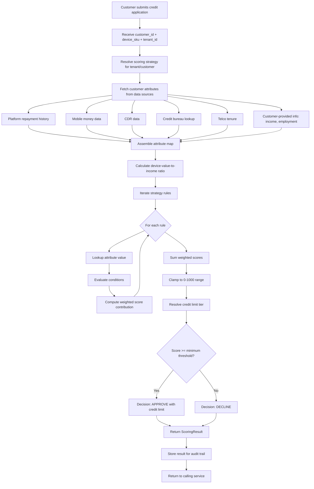

# Credit Scoring Rules Engine

## 1. Architecture Overview

The IInovi credit scoring engine evaluates a customer's creditworthiness for mobile device financing using a **strategy-based rules engine**. Rather than a single, monolithic scoring algorithm, the engine supports multiple named scoring strategies -- each a self-contained set of rules -- that can be assigned to different partners, markets, or customer segments.

This design reflects the operational reality of device lending in emerging markets: a telco in Kenya scoring a first-time buyer needs fundamentally different rules than a retailer in Nigeria evaluating a repeat customer with twelve months of repayment history.

### Core Design Principles

| Principle | Rationale |
|---|---|
| **Strategy isolation** | Each partner or market can have its own scoring logic without affecting others |
| **Business-readable rules** | Non-engineers (credit analysts, partner managers) can understand and propose rule changes |
| **Deterministic scoring** | Given the same inputs and strategy, the engine always produces the same score |
| **Auditability** | Every score is traceable to the exact rules, weights, and input values that produced it |
| **Extensibility** | ML model outputs can be incorporated as additional scoring factors without engine changes |

---

## 2. Strategy Concept

A **strategy** is a named, versioned collection of scoring rules that together produce a credit score and credit limit for a given customer. Strategies are the unit of configuration for credit policy.

### 2.1 Example Strategies

| Strategy Name | Target Use Case | Key Characteristics |
|---|---|---|
| **Telco Standard** | First-time customers at a telco partner | Heavy reliance on CDR data, mobile money history, and telco tenure. Conservative limits. |
| **High-Risk Market** | Markets with limited credit infrastructure | Lower base scores, higher weight on down payment ability, shorter repayment terms. |
| **Repeat Customer** | Customers with prior successful repayments on the platform | Platform repayment history is the dominant factor. Higher limits, streamlined evaluation. |
| **Retail Premium** | Retail partners with in-store verification | In-person ID verification allows slightly relaxed data requirements. Moderate limits. |

### 2.2 Strategy Structure

```python
@dataclass
class ScoringStrategy:
    strategy_id: str
    name: str
    version: int
    description: str
    rules: List[ScoringRule]
    score_range: Tuple[int, int]       # (min=0, max=1000)
    credit_limit_tiers: List[CreditLimitTier]
    active: bool
    created_at: datetime
    updated_at: datetime
```

Strategies are versioned. When a strategy is updated, the previous version is retained for audit purposes. Active loan applications are evaluated against the strategy version that was current at the time of application.

---

## 3. Rule Definition

Each rule within a strategy evaluates a specific customer attribute against defined conditions and contributes a weighted score component.

### 3.1 Rule Structure

```python
@dataclass
class ScoringRule:
    rule_id: str
    attribute: str              # e.g., "monthly_income", "employment_status"
    conditions: List[Condition]
    weight: float               # 0.0 to 1.0, relative importance within strategy
    max_score_contribution: int
    description: str


@dataclass
class Condition:
    operator: str       # "eq", "gt", "gte", "lt", "lte", "in", "between", "exists"
    value: Any          # comparison value(s)
    score: int          # score awarded when condition is met
```

### 3.2 Scoring Attributes and Conditions

The following table lists the standard scoring attributes, the conditions that can be applied, and example score contributions.

| Attribute | Conditions | Score Contribution |
|---|---|---|
| **Income band** | `< 10K`, `10K-25K`, `25K-50K`, `50K-100K`, `> 100K` (local currency) | 0 to 150 points |
| **Employment status** | `formal_employed`, `self_employed`, `informal`, `unemployed`, `student` | -50 to 100 points |
| **Existing debt ratio** | Debt-to-income ratio: `< 0.2`, `0.2-0.4`, `0.4-0.6`, `> 0.6` | -100 to 80 points |
| **Device value** | As proportion of monthly income: `< 0.5x`, `0.5-1x`, `1-2x`, `> 2x` | -50 to 100 points |
| **Repayment history** | Platform history: `no_history`, `< 3_months`, `3-6_months_good`, `6-12_months_good`, `> 12_months_good`, `any_default` | -200 to 200 points |
| **Telco tenure** | Time on network: `< 3_months`, `3-12_months`, `1-3_years`, `> 3_years` | 0 to 80 points |
| **Mobile money activity** | Monthly transaction volume: `none`, `low`, `medium`, `high` | 0 to 100 points |
| **CDR consistency** | Call/data usage consistency over 3 months | 0 to 60 points |
| **Down payment** | Percentage of device value offered as down payment: `0%`, `< 10%`, `10-20%`, `> 20%` | 0 to 80 points |
| **Credit bureau score** | External bureau score bands | -100 to 150 points |

### 3.3 Example Rule Definition (Telco Standard Strategy)

```json
{
  "strategy_id": "str_telco_standard_v3",
  "name": "Telco Standard",
  "version": 3,
  "rules": [
    {
      "rule_id": "r_income_band",
      "attribute": "monthly_income",
      "weight": 0.15,
      "max_score_contribution": 150,
      "conditions": [
        { "operator": "lt", "value": 10000, "score": 20 },
        { "operator": "between", "value": [10000, 25000], "score": 60 },
        { "operator": "between", "value": [25000, 50000], "score": 100 },
        { "operator": "between", "value": [50000, 100000], "score": 130 },
        { "operator": "gte", "value": 100000, "score": 150 }
      ]
    },
    {
      "rule_id": "r_employment",
      "attribute": "employment_status",
      "weight": 0.10,
      "max_score_contribution": 100,
      "conditions": [
        { "operator": "eq", "value": "formal_employed", "score": 100 },
        { "operator": "eq", "value": "self_employed", "score": 70 },
        { "operator": "eq", "value": "informal", "score": 30 },
        { "operator": "eq", "value": "student", "score": 10 },
        { "operator": "eq", "value": "unemployed", "score": -50 }
      ]
    },
    {
      "rule_id": "r_repayment_history",
      "attribute": "platform_repayment_months",
      "weight": 0.25,
      "max_score_contribution": 200,
      "conditions": [
        { "operator": "eq", "value": "no_history", "score": 0 },
        { "operator": "eq", "value": "any_default", "score": -200 },
        { "operator": "between", "value": [1, 3], "score": 50 },
        { "operator": "between", "value": [3, 6], "score": 120 },
        { "operator": "between", "value": [6, 12], "score": 170 },
        { "operator": "gt", "value": 12, "score": 200 }
      ]
    },
    {
      "rule_id": "r_mobile_money",
      "attribute": "mobile_money_volume",
      "weight": 0.15,
      "max_score_contribution": 100,
      "conditions": [
        { "operator": "eq", "value": "none", "score": 0 },
        { "operator": "eq", "value": "low", "score": 30 },
        { "operator": "eq", "value": "medium", "score": 70 },
        { "operator": "eq", "value": "high", "score": 100 }
      ]
    }
  ],
  "credit_limit_tiers": [
    { "min_score": 0, "max_score": 200, "max_device_value": 0, "decision": "decline" },
    { "min_score": 201, "max_score": 400, "max_device_value": 15000, "decision": "approve" },
    { "min_score": 401, "max_score": 600, "max_device_value": 30000, "decision": "approve" },
    { "min_score": 601, "max_score": 800, "max_device_value": 50000, "decision": "approve" },
    { "min_score": 801, "max_score": 1000, "max_device_value": 80000, "decision": "approve" }
  ]
}
```

---

## 4. Score Output

The engine produces a structured scoring result for every evaluation.

### 4.1 Score Scale

- **Range**: 0 to 1000
- **0**: Highest risk / least creditworthy
- **1000**: Lowest risk / most creditworthy

### 4.2 Credit Limit

The credit limit is the maximum device retail value (in local currency) that the platform will finance for the customer. It is derived from the final score via the strategy's `credit_limit_tiers` mapping.

### 4.3 Scoring Result Structure

```python
@dataclass
class ScoringResult:
    request_id: str
    customer_id: str
    strategy_id: str
    strategy_version: int
    score: int                          # 0-1000
    credit_limit: Decimal               # max device value in local currency
    decision: str                       # "approve", "decline", "refer"
    rule_results: List[RuleResult]      # per-rule breakdown
    data_sources_used: List[str]        # which data sources contributed
    evaluated_at: datetime
    expires_at: datetime                # score validity window


@dataclass
class RuleResult:
    rule_id: str
    attribute: str
    input_value: Any
    matched_condition: str
    raw_score: int
    weighted_score: float
```

The `rule_results` breakdown enables full auditability: for any score, an analyst can see exactly which rules fired, what input values were used, and how each rule contributed to the final number.

---

## 5. Engine Implementation

### 5.1 Technology Choice

The rules engine is implemented in Python with a custom DSL (Domain-Specific Language) for rule evaluation. The architecture supports two execution modes:

1. **Rule evaluation mode**: Pure rule-based scoring using the strategy's condition trees. Suitable for deterministic, auditable scoring.
2. **Hybrid mode**: Rule-based scoring augmented with ML model predictions as additional scoring factors.

### 5.2 Engine Core

```python
class CreditScoringEngine:
    def __init__(self, strategy_repository, data_source_registry):
        self._strategy_repo = strategy_repository
        self._data_sources = data_source_registry

    def evaluate(self, customer_id: str, tenant_id: str, device_sku: str) -> ScoringResult:
        strategy = self._strategy_repo.get_active_strategy(tenant_id)
        attributes = self._fetch_customer_attributes(customer_id, strategy)
        device = self._get_device_context(tenant_id, device_sku)

        attributes["device_value_ratio"] = device.price / attributes.get("monthly_income", 1)

        rule_results = []
        total_score = 0

        for rule in strategy.rules:
            input_value = attributes.get(rule.attribute)
            if input_value is None:
                continue

            matched = self._evaluate_conditions(rule.conditions, input_value)
            if matched:
                weighted = matched.score * rule.weight
                rule_results.append(RuleResult(
                    rule_id=rule.rule_id,
                    attribute=rule.attribute,
                    input_value=input_value,
                    matched_condition=str(matched),
                    raw_score=matched.score,
                    weighted_score=weighted,
                ))
                total_score += weighted

        final_score = max(0, min(1000, int(total_score)))
        limit_tier = self._resolve_credit_limit(strategy.credit_limit_tiers, final_score)

        return ScoringResult(
            request_id=generate_uuid(),
            customer_id=customer_id,
            strategy_id=strategy.strategy_id,
            strategy_version=strategy.version,
            score=final_score,
            credit_limit=limit_tier.max_device_value,
            decision=limit_tier.decision,
            rule_results=rule_results,
            data_sources_used=list(self._data_sources.sources_used),
            evaluated_at=utc_now(),
            expires_at=utc_now() + timedelta(hours=24),
        )

    def _evaluate_conditions(self, conditions: List[Condition], value) -> Optional[Condition]:
        for condition in conditions:
            if self._matches(condition, value):
                return condition
        return None

    def _matches(self, condition: Condition, value) -> bool:
        op = condition.operator
        if op == "eq":
            return value == condition.value
        elif op == "gt":
            return value > condition.value
        elif op == "gte":
            return value >= condition.value
        elif op == "lt":
            return value < condition.value
        elif op == "lte":
            return value <= condition.value
        elif op == "between":
            return condition.value[0] <= value <= condition.value[1]
        elif op == "in":
            return value in condition.value
        elif op == "exists":
            return value is not None
        return False

    def _resolve_credit_limit(self, tiers, score):
        for tier in tiers:
            if tier.min_score <= score <= tier.max_score:
                return tier
        return tiers[0]
```

---

## 6. Strategy Assignment

Strategies are assigned at the partner/tenant level and optionally overridden at the customer segment level.

### 6.1 Assignment Hierarchy

```
Platform Default Strategy
    |
    +-- Partner/Tenant Override
            |
            +-- Customer Segment Override (optional)
```

- **Platform default**: A baseline strategy used when no partner-specific strategy is configured.
- **Partner/tenant override**: Each partner can have a custom strategy tailored to their market, risk appetite, and available data sources.
- **Customer segment override**: Within a partner, specific segments (e.g., repeat customers, enterprise employees) can be routed to specialized strategies.

### 6.2 Strategy Resolution

```python
def resolve_strategy(tenant_id: str, customer_id: str) -> ScoringStrategy:
    segment = get_customer_segment(tenant_id, customer_id)
    if segment and segment.strategy_id:
        return strategy_repo.get(segment.strategy_id)

    tenant_config = get_tenant_config(tenant_id)
    if tenant_config.scoring_strategy_id:
        return strategy_repo.get(tenant_config.scoring_strategy_id)

    return strategy_repo.get_platform_default()
```

---

## 7. Scoring Flow

### 7.1 End-to-End Flow



### 7.2 Execution Summary

1. **Input**: `customer_id`, `device_sku`, `tenant_id`
2. **Strategy resolution**: Determine which scoring strategy applies.
3. **Data collection**: Fetch customer attributes from all configured data sources (in parallel where possible).
4. **Context enrichment**: Compute derived attributes (e.g., device-value-to-income ratio).
5. **Rule evaluation**: Iterate through the strategy's rules, matching conditions and accumulating weighted scores.
6. **Score normalization**: Clamp the raw total to the 0--1000 range.
7. **Limit resolution**: Map the final score to a credit limit tier.
8. **Decision**: Approve, decline, or refer based on the tier's decision field.
9. **Output**: Return the full `ScoringResult` including per-rule breakdown.
10. **Persistence**: Store the result for audit, analytics, and dispute resolution.

---

## 8. Extensibility for ML Models

The architecture is designed to accommodate machine learning models alongside or in place of deterministic rules.

### 8.1 ML Integration Points

| Integration Mode | Description |
|---|---|
| **ML as a scoring factor** | An ML model's prediction (e.g., probability of default) is treated as another attribute. A rule maps prediction bands to score contributions, maintaining auditability. |
| **ML as a parallel scorer** | The ML model produces its own 0--1000 score. A blending function combines the rules-based score and the ML score (e.g., 60% rules + 40% ML). |
| **ML as primary scorer** | The ML model replaces the rules engine entirely. Rules are retained only as guardrails (hard declines for specific conditions like active defaults). |

### 8.2 Model Integration Interface

```python
class MLScoringModel(ABC):
    @abstractmethod
    def predict(self, features: dict) -> MLPrediction:
        """Return a prediction with probability and confidence."""
        ...

@dataclass
class MLPrediction:
    probability_of_default: float   # 0.0 to 1.0
    confidence: float               # model's confidence in the prediction
    model_id: str
    model_version: str
    features_used: List[str]
```

### 8.3 Guardrails

Regardless of whether ML models are used, the following hard rules are always enforced:

- **Active default**: Any customer with an active default on the platform is automatically declined.
- **Maximum exposure**: No customer can have total outstanding financing exceeding a configurable cap.
- **Device value floor/ceiling**: Devices below a minimum or above a maximum value are excluded from financing.
- **Regulatory limits**: Interest rate and repayment term limits as required by local regulation.

---

## 9. Audit and Compliance

Every scoring event is persisted with full traceability:

- The exact strategy version and rule definitions used.
- All input attribute values at the time of evaluation.
- Per-rule scoring breakdown.
- The final score, credit limit, and decision.
- Which data sources were consulted and which returned data.
- Timestamp and expiry of the score.

This audit trail supports regulatory compliance (consumer credit regulations in markets like Kenya, Nigeria, and South Africa), dispute resolution, and ongoing model performance monitoring.
