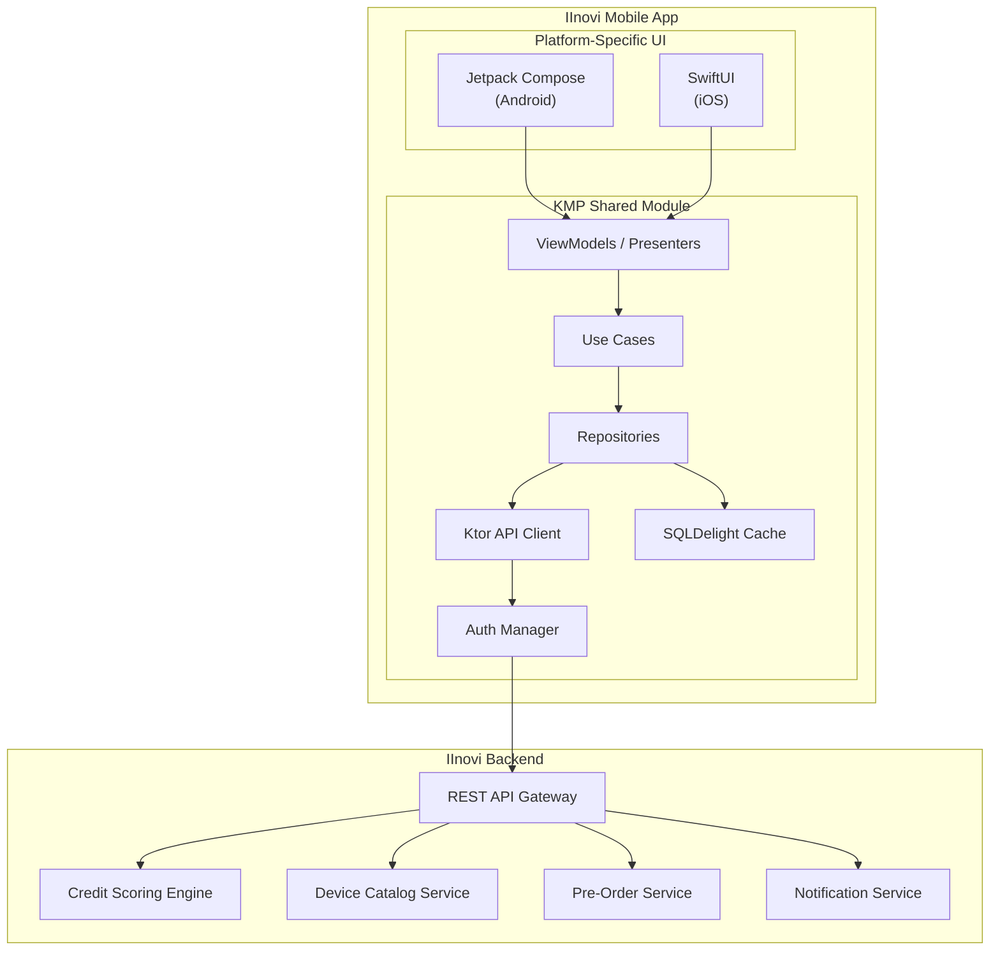
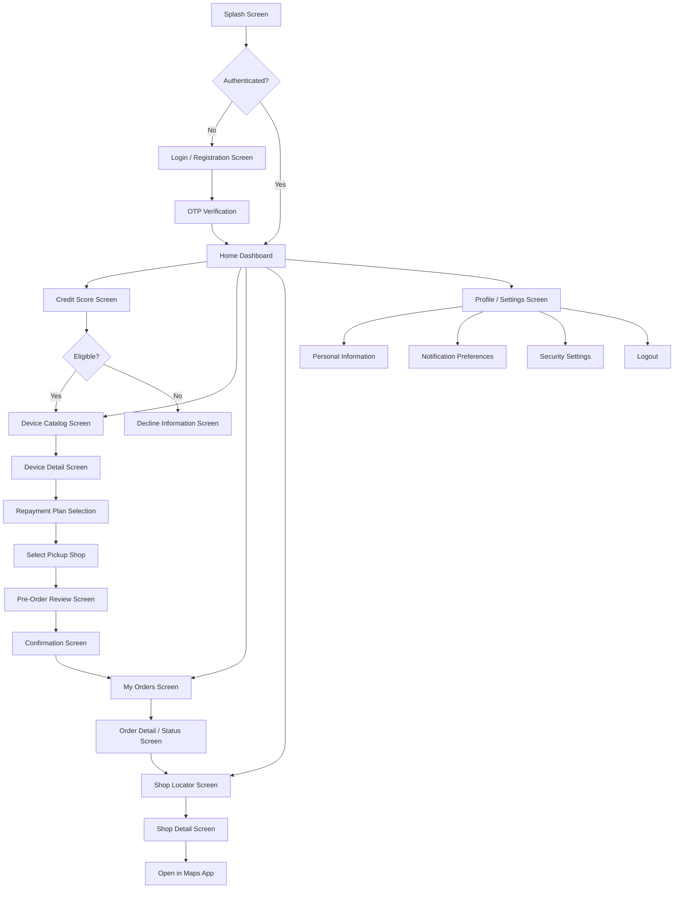
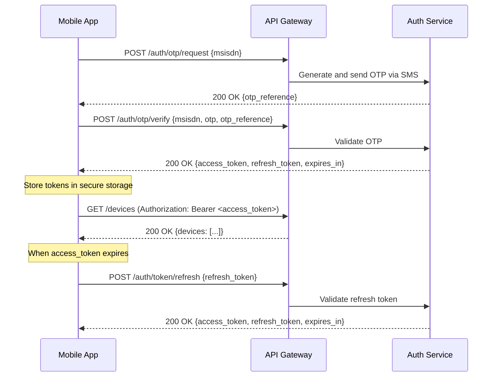

# Customer Mobile App -- Kotlin Multiplatform (KMP)

## 1. Overview

The IInovi customer mobile app is a **Kotlin Multiplatform (KMP)** application that provides a single codebase targeting both Android and iOS. It enables customers to check their creditworthiness, browse eligible devices, create pre-orders, locate partner shops, and track order progress -- all from their smartphone.

The app serves as the primary self-service channel for customers who own a smartphone and have data connectivity. Customers who complete device selection and pre-ordering through the app still collect their device in person at a partner shop, where KYC verification and final issuance take place.

### 1.1 Design Goals

| Goal | Description |
|------|-------------|
| **Single codebase** | Kotlin Multiplatform eliminates the need to maintain separate Android and iOS codebases for shared business logic |
| **Platform-native UX** | UI layers use platform-specific frameworks (Jetpack Compose on Android, SwiftUI on iOS) for a native look and feel |
| **Offline resilience** | Core browsing and cached data remain accessible without connectivity; actions queue for sync |
| **Security first** | Certificate pinning, encrypted local storage, and biometric authentication protect customer data |
| **Lightweight** | Minimal APK/IPA size to accommodate users on low-storage devices or metered connections |

---

## 2. Platform Architecture

### 2.1 KMP Module Structure

```
mobile/
  shared/                    # KMP shared module
    commonMain/
      data/                  # Repositories, data sources
      domain/                # Use cases, domain models
      network/               # API client (Ktor), DTOs
      cache/                 # Local caching (SQLDelight)
      di/                    # Dependency injection (Koin)
    androidMain/             # Android-specific implementations
    iosMain/                 # iOS-specific implementations
  androidApp/                # Android application shell
    ui/                      # Jetpack Compose screens
    AndroidManifest.xml
  iosApp/                    # iOS application shell
    ui/                      # SwiftUI views
    Info.plist
```

### 2.2 Technology Stack

| Layer | Technology | Purpose |
|-------|-----------|---------|
| **Shared business logic** | Kotlin Multiplatform | Use cases, repositories, domain models, networking |
| **Networking** | Ktor Client | HTTP client with platform-specific engines (OkHttp on Android, Darwin on iOS) |
| **Local storage** | SQLDelight | Cross-platform SQLite database for offline caching |
| **Serialization** | kotlinx.serialization | JSON parsing for API responses |
| **Dependency injection** | Koin | Multiplatform DI container |
| **Android UI** | Jetpack Compose | Declarative UI toolkit for Android |
| **iOS UI** | SwiftUI | Declarative UI framework for iOS |
| **Image loading** | Coil (Android) / Kingfisher (iOS) | Async image loading and caching |
| **Push notifications** | Firebase Cloud Messaging (Android) / APNs (iOS) | Real-time order status and payment reminders |

### 2.3 Architecture Diagram



---

## 3. Customer Capabilities

### 3.1 Credit Score and Credit Limit

The app allows customers to view their current credit assessment by entering or confirming their phone number (MSISDN). The platform's rules engine evaluates the customer's profile and returns a credit score and credit limit.

| Feature | Detail |
|---------|--------|
| **Input** | Customer's MSISDN (auto-populated from SIM or manually entered) |
| **Process** | MSISDN lookup enriches customer profile; rules engine evaluates and returns score |
| **Display** | Credit score band (A through E), credit limit (maximum device value), and eligibility status |
| **Refresh** | Score is cached for 24 hours; customer can request a re-evaluation |

The credit score screen shows the customer's eligibility without exposing the raw numeric score. Instead, the app presents the credit limit as a monetary value and lists the device price tiers the customer qualifies for.

### 3.2 Device Browsing

Eligible customers can browse devices that fall within their approved credit limit. Each device listing includes financing details.

| Display Element | Source |
|-----------------|--------|
| Device name, brand, and image | Device catalog service |
| Retail price | Catalog |
| BNPL price (total cost of credit) | Calculated from loan product configuration |
| Required deposit (amount and percentage) | Rules engine output + loan product |
| Monthly/weekly/daily instalment amount | Calculated per available repayment plan |
| Available repayment tenors | Loan product configuration |
| Availability indicator | Inventory service (in-stock, low-stock, out-of-stock) |

The device list is filtered server-side to only include devices within the customer's credit limit. Customers can further filter by brand, price range, and category.

### 3.3 Pre-Order Creation

When a customer selects a device, the app guides them through the pre-order flow:

1. **Select device** -- choose model and color variant.
2. **Choose repayment plan** -- select tenor and frequency; review deposit, instalment, and total cost.
3. **Select pickup shop** -- choose from a list of nearby partner shops (see Section 3.4).
4. **Confirm pre-order** -- review summary and submit.

The pre-order is stored with status `PreOrderCreated` and is routed to the selected shop's pre-order queue for human validation. The customer receives a confirmation with a reference number.

### 3.4 Shop Locator

The app includes a shop locator to help customers find the nearest partner shop for device pickup and KYC verification.

| Feature | Detail |
|---------|--------|
| **Location source** | Device GPS (with permission) or manual city/area selection |
| **Map display** | Embedded map with shop pins (Google Maps SDK on Android, MapKit on iOS) |
| **Shop details** | Name, address, operating hours, phone number, distance |
| **Navigation** | Deep link to native maps app for turn-by-turn directions |
| **Filtering** | Filter by partner, device availability, or currently open |

### 3.5 Order Status Tracking

Customers can track the lifecycle of their pre-orders and active orders:

| Status | Customer-Facing Label | Description |
|--------|----------------------|-------------|
| `PreOrderCreated` | Order Placed | Pre-order submitted, awaiting shop validation |
| `PendingValidation` | Being Reviewed | Cashier at the selected shop is reviewing the pre-order |
| `HumanValidated` | Approved | Cashier confirmed identity and eligibility |
| `ReadyForPickup` | Ready for Collection | Device reserved; customer can visit the shop |
| `Issued` | Completed | Device collected, BNPL loan active |
| `Rejected` | Not Approved | Validation failed; reason displayed |
| `Expired` | Expired | Pre-order was not collected within the allowed window |

Each status transition triggers a push notification and an in-app status update.

---

## 4. Screen Flow

### 4.1 Screen Flow Diagram



### 4.2 Key Screens

| Screen | Purpose | Key Actions |
|--------|---------|-------------|
| **Home Dashboard** | Entry point after login; shows credit status summary, active orders, and quick actions | Navigate to any section |
| **Credit Score** | Display credit eligibility, credit limit, and eligible device tiers | Request re-evaluation, browse devices |
| **Device Catalog** | Scrollable grid of eligible devices with filtering | Filter, sort, select device |
| **Device Detail** | Full device specifications, images, and BNPL pricing breakdown | Select repayment plan, proceed to pre-order |
| **Plan Selection** | Compare repayment plans (tenor, frequency, instalment amount, total cost) | Choose plan |
| **Shop Selector** | Map and list view of nearby partner shops | Select pickup location |
| **Pre-Order Review** | Summary of device, plan, shop, and cost before submission | Confirm or edit |
| **Confirmation** | Order reference number, next steps, and expected timeline | View order, go to home |
| **My Orders** | List of all orders with current status | Tap to view detail |
| **Order Detail** | Timeline view of order status transitions with timestamps | Navigate to shop, contact support |
| **Shop Locator** | Map with partner shop pins | Tap pin for details, get directions |
| **Profile** | Personal info, notification preferences, security settings | Edit profile, toggle biometric auth |

---

## 5. Data Source and MSISDN Integration

The app operates on a **telco-agnostic** model. Customer data is enriched through MSISDN-based lookup rather than being tied to a specific telco's subscriber system.

### 5.1 Data Flow

1. Customer enters or confirms their MSISDN in the app.
2. The backend's MSISDN Adapter identifies the customer's network operator by prefix and fetches enrichment data (tenure, usage, payment behaviour) via the appropriate telco connector or aggregator API.
3. Enriched attributes are fed into the rules engine, which produces a credit score and credit limit.
4. The app receives the eligibility response and displays results.

For full details on the MSISDN data enrichment pipeline, see [MSISDN Data Model](msisdn-data-model.md).

### 5.2 Customer Identification

| Method | Description |
|--------|-------------|
| **SIM-based auto-detect** | On Android, the app can read the MSISDN from the active SIM (requires `READ_PHONE_STATE` permission). On iOS, this is not available due to platform restrictions. |
| **Manual entry** | Customer types their phone number. An OTP is sent via SMS for verification. |
| **Returning customer** | If the customer has previously registered, their MSISDN is stored locally (encrypted) and pre-filled on login. |

---

## 6. Backend API Integration

### 6.1 API Communication

All app-to-backend communication uses **RESTful HTTPS APIs** through the platform's API gateway.

| Aspect | Implementation |
|--------|---------------|
| **Protocol** | HTTPS with TLS 1.2+ |
| **Data format** | JSON (request and response bodies) |
| **Authentication** | JWT bearer tokens (access token + refresh token) |
| **API versioning** | URL path versioning (`/api/v1/...`) |
| **Error format** | Standardized error response with error code, message, and trace ID |

### 6.2 Key API Endpoints

| Endpoint | Method | Description |
|----------|--------|-------------|
| `/api/v1/auth/otp/request` | POST | Request OTP for phone number verification |
| `/api/v1/auth/otp/verify` | POST | Verify OTP and receive JWT tokens |
| `/api/v1/auth/token/refresh` | POST | Refresh expired access token |
| `/api/v1/credit/eligibility` | POST | Submit MSISDN for credit evaluation |
| `/api/v1/devices` | GET | List eligible devices (filtered by credit limit) |
| `/api/v1/devices/{id}` | GET | Device detail with BNPL pricing |
| `/api/v1/devices/{id}/plans` | GET | Available repayment plans for a device |
| `/api/v1/pre-orders` | POST | Create a new pre-order |
| `/api/v1/pre-orders` | GET | List customer's pre-orders |
| `/api/v1/pre-orders/{id}` | GET | Pre-order detail and status |
| `/api/v1/shops` | GET | List partner shops (with geo-query support) |
| `/api/v1/shops/{id}` | GET | Shop detail |
| `/api/v1/notifications/register` | POST | Register push notification token |

### 6.3 Authentication Flow



---

## 7. Offline Capabilities

The app is designed to remain functional in areas with intermittent connectivity, which is common in emerging markets.

### 7.1 Offline Strategy

| Feature | Offline Behaviour |
|---------|-------------------|
| **Device catalog** | Cached locally via SQLDelight; browsable without connectivity. Stale indicator shown if cache exceeds configured TTL. |
| **Credit score** | Last fetched score and limit are cached and displayed with a "last updated" timestamp. New evaluations require connectivity. |
| **Shop locator** | Shop list cached locally. Map tiles require connectivity, but list view with addresses is available offline. |
| **Order status** | Last known status displayed. Real-time updates resume when connectivity is restored. |
| **Pre-order creation** | Queued locally and submitted when connectivity is restored. User is informed that the order is pending submission. |

### 7.2 Sync Mechanism

- The app uses a **queue-based offline sync** pattern. Write operations (pre-order creation, notification token registration) are persisted to a local queue and dispatched when the network becomes available.
- Read operations fall back to cached data with a staleness indicator.
- On reconnection, the app performs a background sync: fetching updated order statuses, refreshing the device catalog, and flushing the outbound queue.

---

## 8. Push Notification Integration

### 8.1 Notification Channels

| Platform | Service | Implementation |
|----------|---------|---------------|
| **Android** | Firebase Cloud Messaging (FCM) | FCM SDK integrated in the Android app module |
| **iOS** | Apple Push Notification Service (APNs) | APNs configured in the iOS app module |

### 8.2 Notification Events

| Event | Trigger | Content |
|-------|---------|---------|
| **Pre-order confirmed** | Pre-order created successfully | "Your pre-order #REF has been placed. We'll notify you when it's ready." |
| **Validation complete** | Cashier validates or rejects pre-order | "Your pre-order #REF has been approved." or "Your pre-order #REF could not be approved." |
| **Ready for pickup** | Device reserved at shop | "Your device is ready for collection at [Shop Name]. Visit within [N] days." |
| **Device issued** | Device handed over, loan active | "Your [Device Name] has been issued. Your first payment of [Amount] is due on [Date]." |
| **Payment reminder** | Upcoming instalment due date | "Your payment of [Amount] is due on [Date]. Dial [USSD code] or open the app to pay." |
| **Payment received** | Instalment payment confirmed | "Payment of [Amount] received. [Remaining] instalments left." |
| **Pre-order expired** | TTL exceeded without pickup | "Your pre-order #REF has expired. You can create a new order anytime." |

### 8.3 Token Management

1. On first launch (or after login), the app requests push notification permission.
2. The platform-specific push token (FCM registration token or APNs device token) is sent to the backend via `/api/v1/notifications/register`.
3. Token refresh events (e.g., FCM token rotation) trigger a re-registration call.
4. On logout, the token is deregistered to stop notifications.

---

## 9. Security

### 9.1 Transport Security

| Measure | Detail |
|---------|--------|
| **TLS enforcement** | All API communication uses HTTPS with TLS 1.2 or higher. Plaintext HTTP is never used. |
| **Certificate pinning** | The app pins the server's TLS certificate (or public key) to prevent man-in-the-middle attacks. Pin rotation is managed via a pinning configuration that includes backup pins. |
| **Certificate transparency** | On Android, the app enforces Certificate Transparency (CT) log verification where supported. |

### 9.2 Local Data Protection

| Measure | Detail |
|---------|--------|
| **Secure token storage** | JWT tokens are stored in Android Keystore (Android) or iOS Keychain (iOS), not in SharedPreferences or UserDefaults. |
| **Database encryption** | The SQLDelight local database is encrypted using SQLCipher with a key derived from the platform's secure storage. |
| **No PII in logs** | The app's logging framework redacts personally identifiable information (MSISDN, names, ID numbers) from all log output. |
| **Screen capture protection** | On Android, `FLAG_SECURE` is set on sensitive screens (credit score, order details) to prevent screenshots in recent apps. |

### 9.3 Authentication Security

| Measure | Detail |
|---------|--------|
| **Biometric authentication** | Customers can enable fingerprint or face recognition as a secondary authentication factor for app access and sensitive actions (pre-order confirmation). |
| **Session timeout** | Access tokens have a short TTL (15 minutes). Refresh tokens expire after 30 days of inactivity. |
| **OTP rate limiting** | OTP requests are rate-limited per MSISDN to prevent abuse (maximum 5 requests per hour). |
| **Device binding** | The app generates a device fingerprint on first launch. If the customer logs in from a new device, OTP re-verification is required. |

### 9.4 Code Security

| Measure | Detail |
|---------|--------|
| **Code obfuscation** | ProGuard/R8 (Android) and Swift compiler optimizations (iOS) obfuscate release builds. |
| **Root/jailbreak detection** | The app detects rooted (Android) or jailbroken (iOS) devices and displays a security warning. Depending on partner policy, the app may restrict functionality on compromised devices. |
| **Integrity checks** | On Android, the app uses Play Integrity API to verify it has not been tampered with. On iOS, App Attest provides equivalent assurance. |

---

## 10. Build and Distribution

### 10.1 Build Pipeline

| Step | Tool |
|------|------|
| **Shared module compilation** | Kotlin/JVM and Kotlin/Native (via KMP Gradle plugin) |
| **Android build** | Gradle + Android Gradle Plugin; outputs signed APK/AAB |
| **iOS build** | Xcode + Swift Package Manager (SPM) consuming the KMP framework; outputs signed IPA |
| **CI/CD** | GitHub Actions (or equivalent) with separate lanes for Android and iOS |
| **Testing** | commonTest (shared unit tests), androidTest (instrumented tests), iosTest (XCTest) |

### 10.2 Distribution

| Platform | Channel |
|----------|---------|
| **Android** | Google Play Store (primary), direct APK download (for markets with limited Play Store access) |
| **iOS** | Apple App Store |

### 10.3 Minimum Requirements

| Platform | Minimum Version |
|----------|----------------|
| **Android** | API 26 (Android 8.0) |
| **iOS** | iOS 15.0 |

---

## 11. Accessibility and Localization

### 11.1 Accessibility

- Screens follow WCAG 2.1 AA guidelines where applicable.
- All interactive elements have content descriptions (Android) or accessibility labels (iOS).
- Dynamic type and font scaling are supported.
- Color contrast ratios meet minimum thresholds for readability.

### 11.2 Localization

The app supports multiple languages, managed via platform-standard localization mechanisms:

- Android: `strings.xml` resource files per locale.
- iOS: `.strings` / `.stringsdict` files per locale.
- Shared module: string keys are defined in the shared layer and resolved to localized values at the UI layer.

Initial supported languages are determined per partner deployment (typically English, French, Swahili, and Portuguese for African markets).

---

## 12. Analytics and Monitoring

| Aspect | Tool | Purpose |
|--------|------|---------|
| **Crash reporting** | Firebase Crashlytics (Android), Sentry (iOS) | Real-time crash detection and stack trace analysis |
| **Usage analytics** | Firebase Analytics / Mixpanel | Screen views, funnel completion rates, feature adoption |
| **Performance monitoring** | Firebase Performance (Android), MetricKit (iOS) | App startup time, network latency, frame rendering |
| **Remote configuration** | Firebase Remote Config | Feature flags, A/B testing, dynamic UI configuration |
