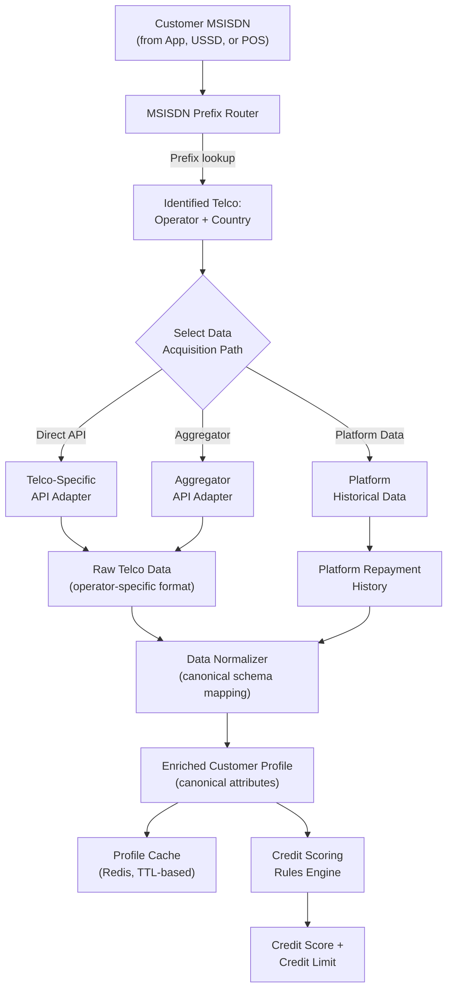
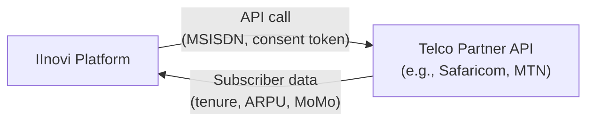
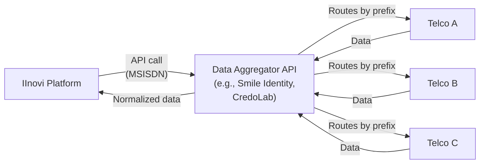

# MSISDN-Based Telco-Agnostic Customer Data Model

## 1. Overview

The IInovi platform uses the customer's **MSISDN (Mobile Station International Subscriber Directory Number)** -- their phone number -- as the primary identifier for credit scoring and device eligibility assessment. Rather than integrating directly with a single telecommunications provider, the platform employs a **telco-agnostic data enrichment pipeline** that can source customer attributes from any telco, aggregator, or proprietary data source through a pluggable adapter architecture.

This design enables IInovi to operate across multiple markets and network operators without rebuilding the credit scoring pipeline for each deployment. A customer on Safaricom in Kenya, MTN in Nigeria, and Airtel in Uganda can all be evaluated through the same rules engine -- the only difference is the adapter that fetches their telco data.

### 1.1 Design Objectives

| Objective | Description |
|-----------|-------------|
| **Telco independence** | The credit scoring engine does not depend on any single telco's data format, API, or availability |
| **Pluggable adapters** | Adding support for a new telco or data source requires implementing a single adapter interface |
| **Data normalization** | All telco-sourced data is mapped to a canonical attribute schema before reaching the rules engine |
| **Graceful degradation** | If a telco data source is unavailable, the engine can still score using available data (with reduced confidence) |
| **Freshness control** | Configurable caching and refresh policies ensure data is current without excessive API calls |

---

## 2. Data Flow Architecture

### 2.1 End-to-End Data Flow



### 2.2 Flow Summary

1. **MSISDN input** -- the customer's phone number is received from the mobile app, USSD channel, or POS.
2. **Prefix routing** -- the MSISDN prefix is used to identify the customer's country and network operator.
3. **Data acquisition** -- the appropriate adapter fetches raw customer data from the telco (directly or via an aggregator), combined with any platform-owned historical data.
4. **Normalization** -- raw data is mapped to the platform's canonical attribute schema, producing a uniform enriched profile regardless of the data source.
5. **Caching** -- the enriched profile is cached with a configurable TTL to avoid redundant API calls.
6. **Scoring** -- the enriched profile is passed to the rules engine, which evaluates it against the active scoring strategy and returns a credit score and credit limit.

---

## 3. MSISDN Prefix Routing

### 3.1 How It Works

Every MSISDN begins with a **country code** and a **network prefix** that identifies the mobile network operator. The platform maintains a prefix routing table that maps MSISDN prefixes to operators and their corresponding data adapters.

### 3.2 Prefix Table Structure

| Field | Description | Example |
|-------|-------------|---------|
| `country_code` | ITU-T E.164 country code | `254` (Kenya) |
| `prefix` | Network prefix (digits after country code) | `7xx` |
| `operator` | Network operator name | Safaricom |
| `operator_code` | Internal operator identifier | `KE_SAFARICOM` |
| `adapter_id` | ID of the adapter to use for this operator | `safaricom_direct_v2` |
| `fallback_adapter_id` | Fallback adapter if primary is unavailable | `ke_aggregator_v1` |

### 3.3 Example Prefix Routing Table

| Country | Country Code | Prefix Range | Operator | Adapter |
|---------|-------------|-------------|----------|---------|
| Kenya | +254 | 70x, 71x, 72x | Safaricom | `safaricom_direct_v2` |
| Kenya | +254 | 73x, 78x | Airtel Kenya | `ke_aggregator_v1` |
| Kenya | +254 | 77x | Telkom Kenya | `ke_aggregator_v1` |
| Nigeria | +234 | 803, 806, 810, 813, 814, 816, 903, 906 | MTN Nigeria | `mtn_ng_direct_v1` |
| Nigeria | +234 | 802, 808, 812, 902 | Airtel Nigeria | `ng_aggregator_v1` |
| Uganda | +256 | 77x, 78x | MTN Uganda | `ug_aggregator_v1` |
| Uganda | +256 | 70x, 75x | Airtel Uganda | `ug_aggregator_v1` |

### 3.4 Number Portability

In markets with **mobile number portability (MNP)**, the MSISDN prefix may not reliably indicate the current operator. To handle this:

- If MNP is active in the market, the prefix router first queries an MNP lookup service (or the aggregator's number portability API) to determine the current operator.
- If the MNP lookup fails, the prefix-based routing is used as a fallback.
- The resolved operator is cached for the MSISDN with a longer TTL (typically 30 days), since porting events are infrequent.

---

## 4. MSISDN Adapter Interface

### 4.1 Adapter Contract

Every data source -- whether a direct telco API, an aggregator, or the platform's own database -- implements the same adapter interface:

```python
class MsisdnDataAdapter(ABC):
    """
    Abstract interface for MSISDN-based data enrichment.
    Each adapter connects to a specific data source (telco API,
    aggregator, or internal database) and returns customer
    attributes in the canonical schema.
    """

    @abstractmethod
    def get_adapter_id(self) -> str:
        """Unique identifier for this adapter."""
        ...

    @abstractmethod
    def get_supported_operators(self) -> List[str]:
        """List of operator codes this adapter can serve."""
        ...

    @abstractmethod
    def fetch_customer_data(
        self,
        msisdn: str,
        operator_code: str,
        requested_attributes: List[str],
    ) -> MsisdnEnrichmentResult:
        """
        Fetch customer data for the given MSISDN.

        Args:
            msisdn: E.164 formatted phone number.
            operator_code: Resolved operator identifier.
            requested_attributes: List of canonical attribute
                names the scoring strategy requires.

        Returns:
            MsisdnEnrichmentResult with available attributes.
        """
        ...

    @abstractmethod
    def health_check(self) -> bool:
        """Check if the upstream data source is reachable."""
        ...
```

### 4.2 Enrichment Result

```python
@dataclass
class MsisdnEnrichmentResult:
    msisdn: str
    operator_code: str
    adapter_id: str
    attributes: Dict[str, Any]
    attributes_available: List[str]
    attributes_missing: List[str]
    data_timestamp: datetime        # when the upstream data was generated
    fetched_at: datetime            # when this fetch occurred
    confidence: float               # 0.0 to 1.0, based on data completeness
    raw_response_hash: str          # hash of raw response for audit
```

### 4.3 Adapter Registry

Adapters are registered at startup and selected at runtime based on the prefix routing table:

```python
class AdapterRegistry:
    def __init__(self):
        self._adapters: Dict[str, MsisdnDataAdapter] = {}

    def register(self, adapter: MsisdnDataAdapter) -> None:
        self._adapters[adapter.get_adapter_id()] = adapter

    def get_adapter(self, adapter_id: str) -> MsisdnDataAdapter:
        adapter = self._adapters.get(adapter_id)
        if not adapter:
            raise AdapterNotFoundError(adapter_id)
        return adapter

    def get_adapter_with_fallback(
        self, primary_id: str, fallback_id: str
    ) -> MsisdnDataAdapter:
        primary = self._adapters.get(primary_id)
        if primary and primary.health_check():
            return primary
        fallback = self._adapters.get(fallback_id)
        if fallback:
            return fallback
        raise NoAvailableAdapterError(primary_id, fallback_id)
```

---

## 5. Enriched Customer Attributes

### 5.1 Canonical Attribute Schema

All adapters normalize their output to the following canonical schema. Not all attributes are available from every data source -- the rules engine handles missing attributes gracefully (see Section 5.3).

| Attribute | Type | Description | Typical Source |
|-----------|------|-------------|----------------|
| `telco_tenure_months` | int | Number of months the customer has been active on the network | Telco API |
| `account_status` | enum | `active`, `suspended`, `deactivated` | Telco API |
| `average_monthly_recharge` | Decimal | Average prepaid recharge amount over the last 3 months | Telco API |
| `monthly_arpu` | Decimal | Average Revenue Per User (ARPU) over the last 3 months | Telco API |
| `data_usage_mb` | int | Average monthly data consumption in MB | Telco API |
| `voice_usage_minutes` | int | Average monthly voice call duration in minutes | Telco API |
| `sms_count` | int | Average monthly SMS count | Telco API |
| `mobile_money_active` | bool | Whether the customer has an active mobile money account | Telco / MoMo API |
| `mobile_money_volume` | enum | `none`, `low`, `medium`, `high` (transaction volume band) | Telco / MoMo API |
| `mobile_money_balance_avg` | Decimal | Average mobile money wallet balance over 3 months | MoMo API |
| `payment_behaviour_score` | int | Internal score (0--100) for bill/MoMo payment consistency | Derived |
| `kyc_status` | enum | `none`, `basic`, `full` -- level of KYC completed with the telco | Telco API |
| `kyc_name` | str | Customer's registered name with the telco (for identity matching) | Telco API |
| `sim_swap_recent` | bool | Whether a SIM swap occurred in the last 30 days (fraud signal) | Telco API |
| `device_type` | enum | `feature_phone`, `smartphone`, `tablet` | Telco API (IMEI/TAC) |
| `platform_repayment_months` | int | Months of repayment history on the IInovi platform | Platform DB |
| `platform_default_history` | bool | Whether the customer has any prior defaults on the platform | Platform DB |
| `platform_loans_completed` | int | Number of successfully completed loans | Platform DB |
| `credit_bureau_score` | int | External credit bureau score (if available and consented) | CRB API |

### 5.2 Attribute Availability by Data Source

| Attribute | Direct Telco API | Aggregator | Platform DB | CRB |
|-----------|:---:|:---:|:---:|:---:|
| `telco_tenure_months` | Y | Y | - | - |
| `account_status` | Y | Y | - | - |
| `average_monthly_recharge` | Y | P | - | - |
| `monthly_arpu` | Y | P | - | - |
| `data_usage_mb` | Y | P | - | - |
| `mobile_money_active` | Y | Y | - | - |
| `mobile_money_volume` | Y | P | - | - |
| `payment_behaviour_score` | - | P | Y | - |
| `kyc_status` | Y | P | - | - |
| `sim_swap_recent` | Y | Y | - | - |
| `platform_repayment_months` | - | - | Y | - |
| `platform_default_history` | - | - | Y | - |
| `credit_bureau_score` | - | - | - | Y |

**Y** = typically available, **P** = partially available (depends on the aggregator's telco integration depth), **-** = not available from this source.

### 5.3 Handling Missing Attributes

When an attribute is unavailable:

1. The attribute is included in `attributes_missing` in the enrichment result.
2. The rules engine skips any rule that depends on a missing attribute.
3. The overall score confidence is reduced proportionally.
4. If the number of missing attributes exceeds a configurable threshold (`max_missing_attributes`, default: 3), the scoring decision is downgraded to `refer` (manual review) rather than `approve`.

---

## 6. Data Acquisition Models

### 6.1 Direct Telco API Integration



| Aspect | Detail |
|--------|--------|
| **Integration type** | Bilateral API agreement with the telco |
| **Authentication** | OAuth 2.0 client credentials or API key |
| **Data depth** | Full subscriber profile: CDR summaries, mobile money data, KYC status |
| **Consent** | Customer consent is obtained at the app or USSD level; consent token is passed in the API request |
| **Latency** | Typically 1--3 seconds per request |
| **Use case** | Markets where IInovi has a direct partnership with the telco (e.g., the telco is also the financing partner) |

**Per-telco adapters:**

| Adapter | Telco | Market |
|---------|-------|--------|
| `safaricom_direct_v2` | Safaricom | Kenya |
| `mtn_ng_direct_v1` | MTN | Nigeria |
| `airtel_ug_direct_v1` | Airtel | Uganda |

### 6.2 Aggregator Integration



| Aspect | Detail |
|--------|--------|
| **Integration type** | Single API endpoint; aggregator handles routing to the correct telco |
| **Authentication** | API key or OAuth 2.0 |
| **Data depth** | Varies: some aggregators provide full subscriber data, others only basic attributes |
| **Latency** | Typically 2--5 seconds (aggregator adds routing overhead) |
| **Use case** | Markets where direct telco integration is not available or not cost-effective; rapid market entry |

### 6.3 Platform-Owned Data

| Aspect | Detail |
|--------|--------|
| **Source** | IInovi's own database of historical lending activity |
| **Data** | Prior loan applications, repayment history, default records, device return history |
| **Availability** | Available for returning customers; first-time customers have no platform history |
| **Significance** | Platform repayment history is the strongest predictor of future repayment behaviour and is heavily weighted in repeat-customer scoring strategies |

### 6.4 Data Source Priority

When multiple sources are available for the same attribute, the following priority order applies:

1. **Platform-owned data** -- most reliable because it is first-party.
2. **Direct telco API** -- highest data depth and freshness from telco sources.
3. **Aggregator** -- used as a fallback or for rapid market entry where direct integration is not available.

If conflicting values are received from different sources (e.g., `telco_tenure` from direct API vs. aggregator), the higher-priority source takes precedence.

---

## 7. Data Normalization

### 7.1 Normalization Pipeline

Each adapter returns raw data in the telco's or aggregator's native format. The normalizer maps this raw data to the canonical attribute schema.

```python
class DataNormalizer:
    def __init__(self, mapping_config: Dict[str, FieldMapping]):
        self._mappings = mapping_config

    def normalize(
        self, raw_data: dict, adapter_id: str
    ) -> Dict[str, Any]:
        mapping = self._mappings.get(adapter_id)
        if not mapping:
            raise MappingNotFoundError(adapter_id)

        normalized = {}
        for canonical_name, field_config in mapping.items():
            raw_value = self._extract(raw_data, field_config.source_path)
            if raw_value is not None:
                normalized[canonical_name] = field_config.transform(raw_value)

        return normalized
```

### 7.2 Normalization Examples

| Canonical Attribute | Safaricom Raw Field | MTN Raw Field | Normalization |
|---------------------|---------------------|---------------|---------------|
| `telco_tenure_months` | `subscriber.activationDate` | `customer.registration_date` | Calculate months from activation date to today |
| `monthly_arpu` | `billing.average_revenue_3m` | `usage.arpu_90d` | Direct mapping (both in local currency) |
| `mobile_money_volume` | `mpesa.transaction_band` | `momo.txn_volume_class` | Map to canonical enum: `none`, `low`, `medium`, `high` |
| `kyc_status` | `kyc.level` (1, 2, 3) | `identity.verification_tier` ("basic", "enhanced") | Map to canonical enum: `none`, `basic`, `full` |
| `sim_swap_recent` | `security.last_sim_swap_date` | `sim.swap_timestamp` | Boolean: true if within last 30 days |

### 7.3 Handling Format Differences

| Difference | Handling |
|------------|----------|
| **Currency** | All monetary values are converted to the market's local currency using a reference rate |
| **Date formats** | ISO 8601 is the canonical format; adapters parse source-specific formats |
| **Enum values** | Each adapter has a mapping table from source-specific enum values to canonical enums |
| **Null vs. absent** | Both are treated as "attribute not available" and added to `attributes_missing` |
| **Units** | Data usage normalized to MB; voice usage normalized to minutes |

---

## 8. Caching and Freshness

### 8.1 Caching Strategy

Enriched customer profiles are cached in Redis to reduce load on upstream APIs and improve response times for repeat queries within a short window.

| Cache Parameter | Default Value | Rationale |
|----------------|---------------|-----------|
| **Cache key** | `msisdn:{e164_number}:enriched` | One cache entry per MSISDN |
| **TTL (Time to Live)** | 24 hours | Telco attributes change slowly; daily refresh is sufficient for most scoring |
| **Force refresh** | Supported via API flag | Used when the customer requests a re-evaluation or a cashier initiates a fresh credit check |
| **Invalidation** | On SIM swap detection or significant platform event (loan default, loan completion) | Ensures stale data does not persist after a material change |

### 8.2 Freshness by Attribute Type

Not all attributes change at the same rate. The caching layer supports per-attribute freshness rules:

| Attribute Category | Refresh Frequency | Rationale |
|-------------------|-------------------|-----------|
| **Identity/KYC** | Weekly or on-demand | Rarely changes; only relevant if KYC status is upgraded |
| **Telco tenure** | Daily | Increments slowly; daily refresh is sufficient |
| **Usage data (ARPU, data, voice)** | Daily | Reflects recent behaviour; daily aggregation is standard |
| **Mobile money data** | Daily | Transaction volumes are aggregated daily by most telcos |
| **SIM swap status** | On every credit check | Critical fraud signal; must be fresh at the time of evaluation |
| **Platform repayment history** | Real-time | Sourced from the platform's own database; always current |
| **Credit bureau score** | On every credit check | External score may change due to other credit activity |

### 8.3 Cache Miss Behaviour

When a cache miss occurs (no cached profile, or cache has expired):

1. The prefix router identifies the telco and selects the adapter.
2. The adapter fetches fresh data from the upstream source.
3. The normalizer produces the canonical profile.
4. The profile is stored in the cache with the configured TTL.
5. The profile is returned to the rules engine.

If the upstream fetch fails and a stale cached entry exists, the engine can optionally use the stale data with a reduced confidence score (configurable via `allow_stale_on_failure`, default: `true`).

---

## 9. Privacy and Consent

### 9.1 Consent Requirements

Fetching telco subscriber data requires explicit customer consent. Consent is obtained through:

| Channel | Consent Mechanism |
|---------|-------------------|
| **Mobile app** | In-app consent screen before eligibility check; consent recorded with timestamp and version |
| **USSD** | Consent prompt in the USSD flow (e.g., "We will check your network data to assess eligibility. 1. I Agree 2. Cancel") |
| **POS** | Cashier reads consent statement; customer acknowledges verbally; cashier records consent in POS |

### 9.2 Data Minimization

- The adapter only requests the attributes that the active scoring strategy requires (`requested_attributes` parameter).
- Raw telco responses are not stored beyond the hashed audit trail (`raw_response_hash`).
- Normalized profiles are cached with TTL-based expiry and are not persisted to long-term storage.

### 9.3 Data Subject Rights

Customers can request:

- **Access** -- view what telco data was used in their credit assessment (presented as the enriched profile attributes).
- **Deletion** -- request deletion of cached enrichment data (the cache entry is immediately invalidated).
- **Withdrawal of consent** -- revoke consent for telco data access (future evaluations will proceed without telco data, using only platform-owned data if available).

For full details on data privacy and consent management, see [Data Privacy and Consent Management](../compliance/data-privacy-consent.md).

---

## 10. Adapter Development Guide

### 10.1 Adding a New Telco Adapter

To support a new telco or data source:

1. **Implement `MsisdnDataAdapter`** -- create a new class that implements the adapter interface (Section 4.1).
2. **Define field mappings** -- create a normalization mapping from the telco's raw data format to the canonical schema (Section 7.2).
3. **Register the adapter** -- add the adapter to the `AdapterRegistry` at startup.
4. **Update the prefix routing table** -- add entries for the telco's MSISDN prefixes pointing to the new adapter ID.
5. **Configure credentials** -- add the telco API credentials to the platform's secret management system.
6. **Test** -- validate with sample MSISDNs that the adapter returns correctly normalized data.

### 10.2 Adapter Testing Checklist

| Test | Description |
|------|-------------|
| **Happy path** | Valid MSISDN returns a complete enrichment result |
| **Missing attributes** | Partial data from the telco is correctly reflected in `attributes_missing` |
| **Invalid MSISDN** | Non-existent or deactivated MSISDN returns an appropriate error |
| **Timeout** | Adapter handles upstream timeout gracefully (returns error, does not hang) |
| **Rate limiting** | Adapter respects upstream rate limits and backs off appropriately |
| **Normalization** | All raw fields are correctly mapped to canonical attributes |
| **Health check** | `health_check()` returns `true` when upstream is reachable, `false` otherwise |
