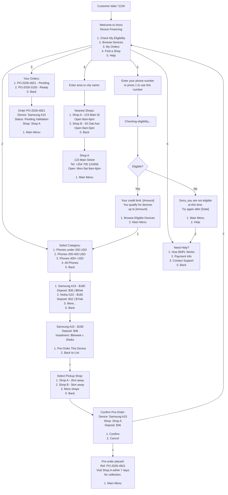
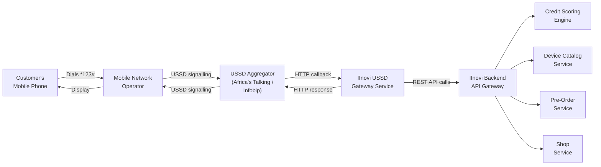
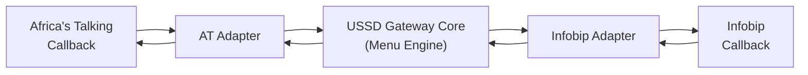

# USSD Channel

## 1. Overview

The USSD (Unstructured Supplementary Service Data) channel provides access to the IInovi device lending platform for **feature-phone users** who do not have a smartphone or reliable data connectivity. USSD operates over the GSM signalling layer, requiring no internet connection and no app installation -- the customer simply dials a shortcode from any mobile phone.

This channel exposes a subset of the platform's capabilities through a text-based, menu-driven interface: credit eligibility checks, device browsing, pre-order creation, shop location lookup, and order status tracking. The USSD channel communicates with the **same backend APIs** as the mobile app, ensuring consistent business logic, credit scoring, and order management across all channels.

### 1.1 Why USSD

| Factor | Rationale |
|--------|-----------|
| **Feature phone reach** | A significant portion of the target market uses feature phones without app capability |
| **No data required** | USSD works over GSM signalling; no mobile data plan or Wi-Fi needed |
| **No installation** | Zero friction -- customer dials a number and interacts immediately |
| **Familiar UX** | USSD menus are widely used across Africa for mobile money, airtime, and banking |
| **Real-time interaction** | Session-based, synchronous communication (unlike SMS which is asynchronous) |

---

## 2. USSD Menu Flow

### 2.1 Menu Tree Diagram



### 2.2 Menu Tree Structure

```
*123# (Shortcode Entry)
|
+-- 1. Check My Eligibility
|   +-- Enter MSISDN (or auto-detect)
|   +-- [Processing: credit evaluation]
|   +-- Result: Credit limit and eligible tiers
|       +-- 1. Browse Eligible Devices --> (Device Browsing flow)
|       +-- 2. Main Menu
|
+-- 2. Browse Devices
|   +-- 1. Phones under 200 USD
|   +-- 2. Phones 200-400 USD
|   +-- 3. Phones 400+ USD
|   +-- 4. All Phones
|   +-- 0. Back
|   |
|   +-- [Paginated device list, 3 per page]
|       +-- Select device number for detail
|           +-- 1. Pre-Order This Device
|           |   +-- Select Pickup Shop
|           |   +-- Confirm Pre-Order
|           |   +-- [Order placed, reference displayed]
|           +-- 2. Back to List
|           +-- 0. Main Menu
|
+-- 3. My Orders
|   +-- [List of active orders with status]
|       +-- Select order number for detail
|           +-- Status, device, shop, next steps
|           +-- 1. Main Menu
|
+-- 4. Find a Shop
|   +-- Enter area or city
|   +-- [List of nearby shops with address and hours]
|       +-- Select shop for detail
|           +-- Address, phone, hours
|           +-- 1. Main Menu
|
+-- 5. Help
    +-- 1. How BNPL Works
    +-- 2. Payment Information
    +-- 3. Contact Support (displays phone number)
    +-- 0. Back
```

---

## 3. Detailed Menu Interactions

### 3.1 Eligibility Check

**Step 1 -- MSISDN Input**

The USSD gateway can auto-detect the calling MSISDN from the signalling layer. If auto-detection is available, the customer is prompted to confirm:

```
Your number: 0712345678
1. Yes, check my eligibility
2. Use a different number
```

If the customer selects option 2 (or auto-detection is not available), they are prompted to enter the MSISDN manually.

**Step 2 -- Credit Evaluation**

The system calls the same `/api/v1/credit/eligibility` endpoint used by the mobile app. During processing, a "Please wait..." message is displayed.

**Step 3 -- Result Display**

For approved customers:
```
You qualify for device financing!
Credit Limit: KES 25,000
Deposit from: 20%

1. Browse Eligible Devices
2. Main Menu
```

For declined customers:
```
We're unable to offer financing
at this time.
You can try again after 2026-06-07.

1. Main Menu
2. Help
```

### 3.2 Device Browsing

Devices are displayed in a **paginated list** (3 devices per page) to fit within USSD screen size constraints (~182 characters per message on most networks).

```
Phones under 200 USD (Page 1/3):
1. Samsung A15 - $180
   Dep: $36 | $8/wk x 20
2. Nokia G22 - $160
   Dep: $32 | $7/wk x 20
3. Tecno Spark 20 - $140
   Dep: $28 | $6/wk x 20

7. Next Page
0. Back
```

Selecting a device shows its detail screen with financing information and the option to pre-order.

### 3.3 Pre-Order Creation

The pre-order flow collects the minimum information needed:

1. **Device selection** -- customer selects from the eligible device list.
2. **Shop selection** -- the system presents the nearest shops based on the customer's network cell location (if available) or prompts the customer to enter an area name.
3. **Confirmation** -- a summary is displayed; customer confirms with option 1.
4. **Result** -- the pre-order reference number and collection instructions are displayed.

The pre-order is created with the same `PreOrderCreated` status as mobile app pre-orders and enters the same validation workflow.

### 3.4 Order Status Check

Customers can check the status of their active orders:

```
Your Orders:
1. PO-2026-4821
   Samsung A15 - Pending
2. PO-2026-3150
   Nokia G22 - Ready for Pickup

Select order number for details
0. Back
```

Selecting an order displays its current status and next steps:

```
Order: PO-2026-4821
Device: Samsung A15
Status: Ready for Pickup
Shop: Mombasa Road Branch
       123 Mombasa Road

Visit the shop with your ID
before 2026-03-14 to collect.

1. Main Menu
```

### 3.5 Shop Finder

```
Enter your city or area name:
> Westlands

Nearest Shops:
1. Westlands Mall Shop
   Westlands Mall, 2nd Floor
   Open 9am-7pm
2. Sarit Centre Shop
   Sarit Centre, Ground Floor
   Open 8am-6pm

Select shop for details
0. Back
```

---

## 4. Technical Architecture

### 4.1 System Integration



### 4.2 Component Responsibilities

| Component | Responsibility |
|-----------|---------------|
| **Customer's phone** | Initiates USSD session by dialling shortcode; displays menu text; sends user input |
| **Mobile Network Operator (MNO)** | Routes USSD traffic between the customer's phone and the USSD aggregator |
| **USSD Aggregator** | Terminates USSD sessions, translates between USSD signalling and HTTP callbacks |
| **IInovi USSD Gateway** | Manages session state, renders menu trees, translates user actions into backend API calls |
| **IInovi Backend APIs** | Executes business logic (credit scoring, device lookup, pre-order creation, shop queries) |

### 4.3 USSD Gateway Service

The USSD gateway is a lightweight, stateful service that:

1. Receives HTTP callbacks from the aggregator containing `sessionId`, `phoneNumber`, `serviceCode`, and `text` (the user's cumulative input).
2. Parses the input to determine the user's position in the menu tree.
3. Calls the appropriate backend API to fetch data or execute an action.
4. Renders the response as plain text (within character limits) and returns it to the aggregator.
5. Indicates whether the session should continue (`CON` prefix) or end (`END` prefix).

### 4.4 Request/Response Format (Africa's Talking)

**Incoming request from aggregator:**

```json
{
  "sessionId": "ATUid_a]d42c123-4567-890a-bcde-f12345678901",
  "phoneNumber": "+254712345678",
  "networkCode": "63902",
  "serviceCode": "*123#",
  "text": "1*1"
}
```

The `text` field contains the customer's cumulative input, with each selection separated by `*`. In this example, `1*1` means the customer selected option 1 (Check Eligibility) and then option 1 (confirm MSISDN).

**Response to aggregator:**

```
CON Your credit limit: KES 25,000
You qualify for devices up to KES 25,000

1. Browse Eligible Devices
2. Main Menu
```

The `CON` prefix indicates the session continues (expecting more input). `END` prefix terminates the session.

---

## 5. Session Management

### 5.1 USSD Session Constraints

| Constraint | Value | Impact |
|------------|-------|--------|
| **Session timeout** | ~180 seconds (network-dependent, typically 120--180s) | Long operations (credit checks) must complete within this window |
| **Message length** | ~182 characters per message (varies by network) | Menu text must be concise; device lists are paginated |
| **Input length** | Typically 1--3 characters per response | Menu options use single digits; MSISDN entry is the longest input |
| **Concurrent sessions** | One active session per MSISDN | New session replaces any existing active session |

### 5.2 Session State Management

The USSD gateway maintains session state using an in-memory store (Redis) with the session ID as the key:

```python
class UssdSession:
    session_id: str
    msisdn: str
    current_menu: str
    navigation_stack: List[str]
    context: dict           # credit score, selected device, selected shop, etc.
    created_at: datetime
    last_activity: datetime
    ttl: int                # seconds, default 180
```

Session state includes:

- **Current menu position** -- which screen the customer is on.
- **Navigation stack** -- breadcrumb of visited menus for "Back" navigation.
- **Context data** -- cached results from API calls (credit score, device list, selected device) to avoid redundant requests within the same session.

### 5.3 Timeout Handling

When a session times out:

1. The MNO terminates the USSD session.
2. The gateway receives no explicit notification -- it relies on TTL-based expiry in Redis.
3. If the customer dials the shortcode again, a new session is created.
4. **Partial pre-orders are not persisted.** Only confirmed pre-orders (where the customer selected "Confirm") are saved. If a session times out during the pre-order flow, the customer must restart.

### 5.4 Optimizing for Session Time

To maximize the chance of completing an action within the session window:

- Backend API calls are kept under 3 seconds per round-trip.
- Credit evaluation results are cached in the session context after the first check, avoiding re-evaluation if the customer navigates back and forth.
- Device catalog results are pre-fetched and paginated from the cached list.
- The confirmation step is a single menu selection, minimizing the steps to complete a pre-order.

---

## 6. Error Handling and Input Validation

### 6.1 Input Validation

| Input | Validation Rule | Error Response |
|-------|----------------|----------------|
| **Menu selection** | Must be a valid option number for the current menu | "Invalid selection. Please enter a number from the menu." |
| **MSISDN** | Must be a valid phone number format (10--15 digits, with or without country code) | "Invalid phone number. Please enter a valid number." |
| **Area/city name** | Non-empty alphanumeric string | "Please enter a valid area or city name." |
| **Numeric input** | Must be a digit within the expected range | "Invalid input. Please try again." |

Invalid input does not consume a menu step. The current menu is re-displayed with an error prefix.

### 6.2 API Error Handling

| Error Scenario | Customer-Facing Response |
|---------------|------------------------|
| **Backend timeout** | "Service temporarily unavailable. Please try again shortly." Session ends. |
| **Credit evaluation failure** | "We could not complete your eligibility check. Please try again later." |
| **No eligible devices** | "No devices are currently available in your price range. Check back soon." |
| **Pre-order creation failure** | "We could not place your order. Please try again." |
| **Shop service unavailable** | "Shop information is temporarily unavailable. Please try again." |

### 6.3 Retry Behaviour

- If a backend API call fails, the gateway retries once with a 2-second delay.
- If the retry also fails, an error message is shown and the session returns to the main menu (or ends, if the session timeout is close).
- Network-level USSD errors (session drops, signalling failures) are not retryable from the gateway side -- the customer must redial.

---

## 7. Multi-Language Support

### 7.1 Language Selection

The USSD channel supports multiple languages. Language selection can occur in two ways:

1. **Initial prompt** -- on first interaction from a new MSISDN, the welcome screen offers a language selection:

```
Welcome to IInovi
1. English
2. Francais
3. Kiswahili
```

2. **Stored preference** -- the selected language is stored against the customer's MSISDN. Subsequent sessions use the stored preference without re-prompting. The customer can change language from the Help menu.

### 7.2 Translation Management

| Aspect | Implementation |
|--------|---------------|
| **String storage** | All menu text is stored as translation keys mapped to locale-specific strings |
| **Character constraints** | Translations must fit within the ~182-character USSD message limit; translators are given character budgets |
| **Fallback** | If a translation is missing for a locale, the English string is used |
| **RTL languages** | Not currently supported (USSD rendering is controlled by the handset) |

### 7.3 Supported Languages

Initial language support is configured per partner deployment:

| Market | Languages |
|--------|-----------|
| **East Africa** | English, Kiswahili |
| **West Africa** | English, Francais |
| **Southern Africa** | English, Portuguese |

---

## 8. USSD Aggregator Integration

### 8.1 Supported Aggregators

| Aggregator | Coverage | Integration Method |
|------------|----------|-------------------|
| **Africa's Talking** | Kenya, Uganda, Tanzania, Nigeria, Rwanda, and others | REST API callbacks (HTTP POST to IInovi gateway) |
| **Infobip** | Pan-African and global | REST API callbacks |

### 8.2 Aggregator Abstraction

The USSD gateway uses an **adapter pattern** to abstract aggregator-specific callback formats:



Each adapter normalizes the incoming callback into a standard internal format:

```python
@dataclass
class UssdRequest:
    session_id: str
    msisdn: str
    service_code: str
    user_input: str
    network_code: Optional[str]
    aggregator: str

@dataclass
class UssdResponse:
    message: str
    end_session: bool
```

### 8.3 Shortcode Provisioning

| Item | Detail |
|------|--------|
| **Shortcode type** | Shared or dedicated shortcode, depending on market and partner |
| **Provisioning** | Shortcode is registered with the MNO via the aggregator; typically takes 2--4 weeks per market |
| **Cross-network** | The shortcode must be provisioned across all MNOs in the target market (e.g., Safaricom, Airtel, Telkom in Kenya) |
| **Cost** | Shortcode rental fees and per-session charges vary by market and aggregator |

---

## 9. Monitoring and Observability

### 9.1 Metrics

| Metric | Description |
|--------|-------------|
| **Session volume** | Number of USSD sessions initiated per hour/day |
| **Completion rate** | Percentage of sessions that complete a meaningful action (eligibility check, pre-order) |
| **Drop-off rate** | Percentage of sessions that end at each menu level (funnel analysis) |
| **Average session duration** | Time from session start to end |
| **Timeout rate** | Percentage of sessions that expire due to the 180-second timeout |
| **API latency** | Response time of backend API calls made during USSD sessions |
| **Error rate** | Percentage of sessions encountering errors (API failures, validation errors) |

### 9.2 Logging

Every USSD interaction is logged with:

- Session ID, MSISDN (hashed for privacy), timestamp.
- Menu navigation path (e.g., `Main > Eligibility > Result > Browse > Device Detail`).
- Backend API calls made and their response times.
- Final outcome (pre-order created, status checked, session timeout, error).

Logs are structured (JSON) and shipped to the platform's centralized logging infrastructure for analysis and debugging.

---

## 10. Limitations and Considerations

| Limitation | Mitigation |
|------------|------------|
| **No rich media** | Device images cannot be shown; descriptions must be text-only and concise |
| **Character limits** | Menu text is carefully crafted to fit within ~182 characters per message |
| **Session timeout** | Critical flows (eligibility + pre-order) are designed to complete within 3--4 menu interactions |
| **No push capability** | USSD is pull-only; the platform uses SMS for proactive notifications to USSD customers |
| **Single session per MSISDN** | Only one active USSD session per phone number at a time |
| **Network dependency** | USSD availability depends on MNO infrastructure; outages are outside platform control |
