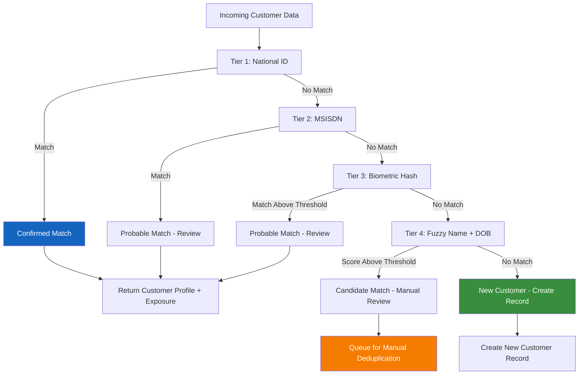
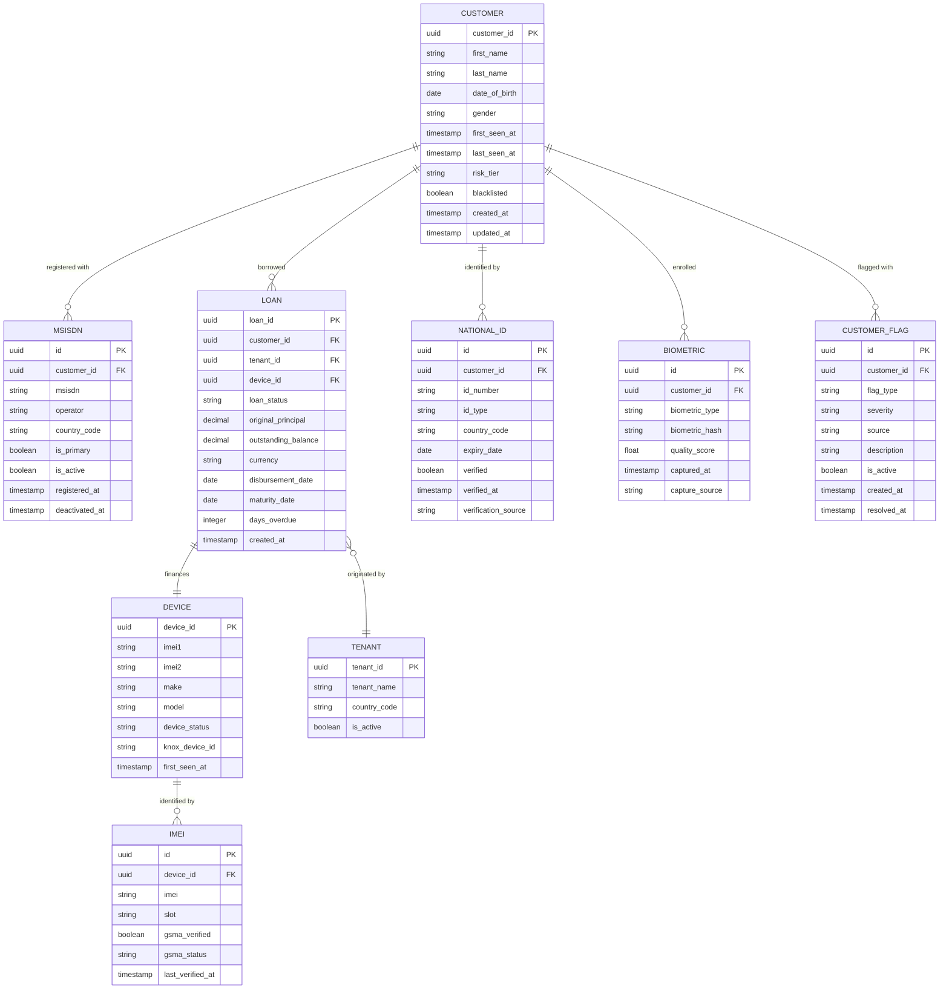
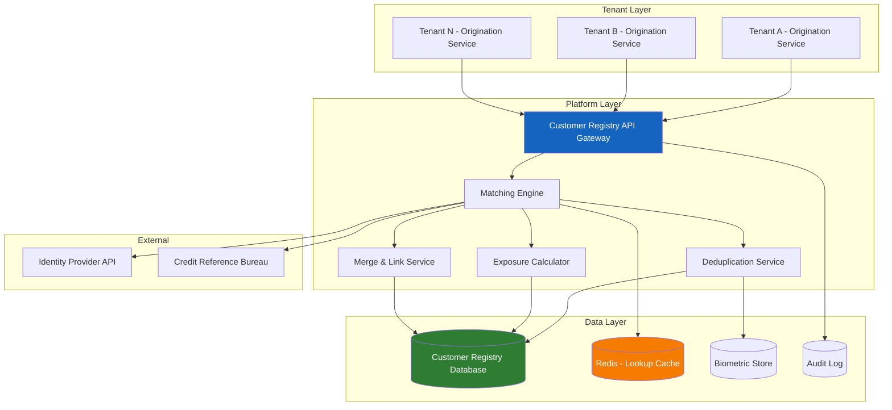

# Central Customer Registry and Cross-Tenant Deduplication

## Overview

The Central Customer Registry is a platform-wide service that maintains a unified view of every customer across all tenants (financers) operating on the Mobile Device Lending Solution. Unlike tenant-scoped data stores, the registry operates at the platform level to enable cross-tenant deduplication, multi-loan prevention, exposure management, and repeat customer identification. It is a foundational component of the platform's fraud prevention and credit risk infrastructure.

---

## Registry Purpose

### Core Functions

| Function | Description |
|---|---|
| **Deduplication** | Identify when the same individual appears across multiple loan applications, whether within a single tenant or across tenants |
| **Multi-Loan Prevention** | Enforce platform-wide limits on concurrent loans and total exposure per customer |
| **Exposure Management** | Provide an aggregated view of a customer's total outstanding obligations across all tenants |
| **Repeat Customer Identification** | Recognize returning customers with good payment history for expedited processing and better terms |
| **Fraud Ring Detection** | Enable graph-based analysis of relationships between customers, devices, and identifiers |
| **Blacklist Management** | Maintain a platform-wide blacklist of individuals associated with confirmed fraud or terminal default |

### Platform-Wide Scope

The registry is deliberately not tenant-scoped. A customer who borrows from Tenant A and then applies through Tenant B must be recognized as the same individual. This design ensures:

- No customer can circumvent multi-loan policies by applying through different tenants.
- Total financial exposure is visible regardless of which tenant originated each loan.
- Fraud patterns spanning multiple tenants are detectable.
- Repeat customers receive consistent treatment across the platform.

---

## Deduplication Keys

### Key Hierarchy

The registry uses a tiered matching strategy, applying keys in order of confidence:



### Key Specifications

| Tier | Key | Type | Normalization | Confidence |
|---|---|---|---|---|
| 1 | National ID Number | Exact match | Uppercase, strip whitespace, remove hyphens | Very High (99%+) |
| 2 | MSISDN | Exact match | E.164 format normalization (+country code) | High (95%+) |
| 3 | Biometric Hash | Similarity threshold | Vendor-specific encoding | Very High (98%+) |
| 4 | Full Name + Date of Birth | Fuzzy match | Lowercase, transliterate, Levenshtein distance | Medium (70-90%) |

### National ID Normalization

To ensure consistent matching across tenants that may capture IDs differently:

| Rule | Example Input | Normalized |
|---|---|---|
| Strip whitespace | `12 345 678` | `12345678` |
| Remove hyphens/dashes | `12-345-678` | `12345678` |
| Uppercase letters | `ab123456` | `AB123456` |
| Remove leading zeros (configurable per country) | `0012345678` | `12345678` |
| Country prefix normalization | Varies by jurisdiction | Standardized format |

### MSISDN Normalization

| Rule | Example Input | Normalized |
|---|---|---|
| Add country code | `0712345678` | `+254712345678` |
| Remove spaces | `+254 712 345 678` | `+254712345678` |
| Remove dashes | `+254-712-345-678` | `+254712345678` |
| Remove leading double-zero | `00254712345678` | `+254712345678` |

---

## Cross-Tenant Exposure View

### Exposure Query

When a tenant queries the registry for a customer, the response includes an aggregated exposure summary. The summary is designed to provide actionable risk data while protecting the privacy and competitive interests of other tenants.

### Exposure Response Structure

```json
{
  "customerId": "CUS-2025-001234",
  "matchType": "NATIONAL_ID",
  "matchConfidence": 0.99,
  "exposure": {
    "totalActiveLoanCount": 1,
    "totalOutstandingBalance": {
      "amount": 15000,
      "currency": "KES"
    },
    "totalOriginalPrincipal": {
      "amount": 25000,
      "currency": "KES"
    },
    "oldestActiveLoanDate": "2025-06-15",
    "worstCurrentStatus": "ACTIVE",
    "hasDefaultHistory": false,
    "hasWriteOffHistory": false,
    "hasFraudFlag": false
  },
  "loanSummary": [
    {
      "loanId": "REDACTED",
      "tenantId": "REDACTED",
      "status": "ACTIVE",
      "outstandingBalance": 15000,
      "currency": "KES",
      "originalPrincipal": 25000,
      "disbursementDate": "2025-06-15",
      "daysOverdue": 0
    }
  ],
  "customerProfile": {
    "firstSeenDate": "2025-01-10",
    "totalLoanCount": 2,
    "completedLoanCount": 1,
    "averageRepaymentPerformance": "GOOD",
    "repeatCustomer": true,
    "blacklisted": false
  }
}
```

### Data Sharing Rules

| Data Element | Shared Cross-Tenant | Format |
|---|---|---|
| Total active loan count | Yes | Count |
| Total outstanding balance | Yes | Aggregated amount |
| Loan status categories | Yes | Enum (ACTIVE, OVERDUE, DEFAULT) |
| Default/write-off history | Yes | Boolean flags |
| Fraud flags | Yes | Boolean |
| Tenant identity | No | Redacted |
| Loan product details | No | Redacted |
| Specific payment history | No | Redacted |
| Customer contact details | No | Redacted |
| Individual loan IDs | No | Redacted |

---

## Repeat Customer Identification

### Benefits of Repeat Customer Detection

| Benefit | Description |
|---|---|
| **Scoring Boost** | Customers with prior successful loan repayment receive a positive adjustment to their risk score |
| **Top-Up Eligibility** | Repeat customers may qualify for a new loan before fully repaying an existing one (top-up or upgrade) |
| **Reduced Verification** | Known customers with biometric on file may skip certain verification steps |
| **Better Terms** | Tenants may offer lower interest rates or higher device values to proven customers |
| **Faster Processing** | Pre-verified identity data reduces origination time |

### Repeat Customer Scoring

| Customer History | Score Adjustment | Eligibility |
|---|---|---|
| 1 loan, fully repaid on time | +10 points | Standard top-up eligible |
| 2+ loans, all repaid on time | +20 points | Premium top-up eligible, reduced deposit |
| 1 loan, repaid with minor delays (< 7 days overdue) | +5 points | Standard top-up eligible |
| 1 loan, significant delays (> 30 days overdue) | 0 points | No score boost; standard processing |
| Any loan defaulted or written off | -20 points | Top-up ineligible; elevated scrutiny |

### Top-Up Eligibility Rules

| Criterion | Requirement |
|---|---|
| Current loan status | Active, in good standing (no overdue payments) |
| Minimum repayment progress | At least 50% of principal repaid (configurable) |
| Payment performance | No more than 2 late payments in current loan |
| Time since last disbursement | At least 90 days (configurable) |
| Cross-tenant exposure | Total exposure within platform limits |

---

## Customer Entity Model

The registry maintains a rich entity model that links customers to their associated identifiers, loans, and devices.

### Entity Relationship Diagram



### Entity Lifecycle

| Entity | Created When | Updated When | Archived When |
|---|---|---|---|
| Customer | First loan application | Each subsequent interaction | Per data retention policy |
| National ID | First ID verification | ID renewal or correction | Never (historical record) |
| MSISDN | Loan application with new number | SIM swap, number change | Deactivated when number no longer in use |
| Biometric | First biometric capture | Re-enrollment (quality improvement) | Per data retention policy |
| Loan | Loan disbursement | Status changes, payments | Loan fully settled or written off |
| Device | First verification | Status changes, re-verification | Per data retention policy |

---

## Merge and Link Rules

### When to Merge

Customer records are merged when the system or an operator determines that two or more records represent the same individual.

| Merge Trigger | Confidence Required | Authorization |
|---|---|---|
| Same National ID, different MSISDN | Automatic (99%+) | System |
| Same biometric hash, different National ID | Manual review required | Fraud analyst |
| Fuzzy name + DOB match | Manual review required | Operations supervisor |
| Customer self-identifies as existing customer | Verification required | Agent + system |

### Merge Process

1. **Identify**: Matching engine flags potential duplicate records.
2. **Review**: For non-automatic merges, an authorized user reviews the match evidence.
3. **Select Primary**: The record with the most complete and verified data becomes the primary.
4. **Link**: All identifiers, loans, and devices from secondary records are linked to the primary.
5. **Deactivate**: Secondary records are marked as merged (not deleted, for audit purposes).
6. **Notify**: Affected tenants are notified of the merge (exposure data may change).

### Link Rules

| Rule | Description |
|---|---|
| One customer may have multiple MSISDNs | Common for dual-SIM users or number changes |
| One customer may have multiple National IDs | Rare; typically indicates data quality issue or fraud |
| One MSISDN may link to only one active customer | If conflict detected, resolve via verification |
| One device may link to only one active loan | Prevents double-financing |
| Merged records retain full history | No data loss on merge; secondary record preserved |

### Unlink / Split

In rare cases, records that were incorrectly merged must be split:

- Only authorized by a supervisor with fraud analyst confirmation.
- All link changes are logged in the audit trail.
- Affected tenants are notified.
- An investigation may be triggered if the incorrect merge was caused by data manipulation.

---

## Privacy Considerations

### Minimal Cross-Tenant Data Sharing

The registry is designed to balance fraud prevention with customer privacy and tenant competitive concerns:

| Principle | Implementation |
|---|---|
| **Data Minimization** | Cross-tenant queries return only the data necessary for risk decisions (counts, aggregated amounts, status flags) |
| **Tenant Anonymity** | The identity of other tenants holding loans for a customer is never revealed |
| **Loan Detail Redaction** | Specific loan terms, payment schedules, and product details are not shared |
| **Contact Information** | Customer phone numbers, addresses, and email are not shared cross-tenant |
| **Consent** | Customers consent to platform-wide identity verification and exposure checks as part of the loan application |
| **Right to Access** | Customers can request a copy of their registry data through any tenant |
| **Right to Rectification** | Customers can request correction of inaccurate data |
| **Right to Erasure** | Subject to legal retention requirements (financial records) |
| **Audit Trail** | Every registry query is logged with the requesting tenant, user, and purpose |

### Data Protection Compliance

| Regulation | Compliance Measure |
|---|---|
| Local Data Protection Acts | Data processed and stored per jurisdictional requirements |
| GDPR (where applicable) | Lawful basis established (legitimate interest for fraud prevention, contractual necessity for lending) |
| Financial Sector Regulations | Minimum retention periods observed for financial records |
| Biometric Data Laws | Biometric data stored as irreversible hashes; raw data not retained |

---

## Customer Registry Architecture



### Component Responsibilities

| Component | Responsibility |
|---|---|
| **API Gateway** | Authentication, authorization, rate limiting, request routing |
| **Matching Engine** | Executes tiered matching strategy against all deduplication keys |
| **Deduplication Service** | Manages duplicate detection, candidate match queuing, resolution |
| **Exposure Calculator** | Aggregates cross-tenant loan data into privacy-compliant exposure summaries |
| **Merge & Link Service** | Handles record merging, linking, and splitting |
| **Customer Registry Database** | Primary data store for customer records, links, and history |
| **Redis Cache** | High-performance lookup cache for frequently queried identifiers |
| **Biometric Store** | Secure storage for biometric hashes with specialized matching indexes |
| **Audit Log** | Immutable record of all registry queries and modifications |

---

## API Specification Summary

### Key Endpoints

| Method | Path | Description |
|---|---|---|
| `POST` | `/api/v1/registry/lookup` | Look up a customer by any deduplication key |
| `POST` | `/api/v1/registry/customers` | Create a new customer record |
| `PUT` | `/api/v1/registry/customers/{id}` | Update customer data |
| `GET` | `/api/v1/registry/customers/{id}/exposure` | Get cross-tenant exposure summary |
| `POST` | `/api/v1/registry/customers/merge` | Merge duplicate records |
| `POST` | `/api/v1/registry/customers/{id}/flags` | Add a flag to a customer record |
| `GET` | `/api/v1/registry/customers/{id}/history` | Get customer interaction history |

---

## Related Documentation

- [Fraud Risk Framework](../fraud-prevention/fraud-framework.md)
- [Identity Fraud Prevention](../fraud-prevention/identity-fraud.md)
- [Audit Trail](../audit/audit-trail.md)
- [Data Retention Policy](../audit/data-retention.md)
