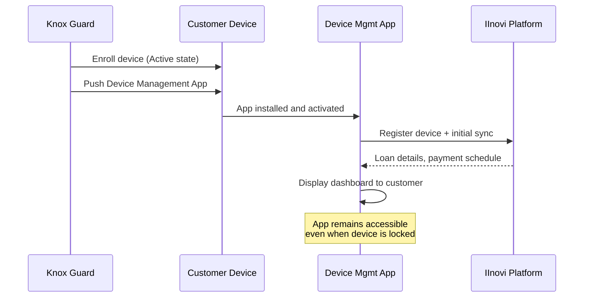
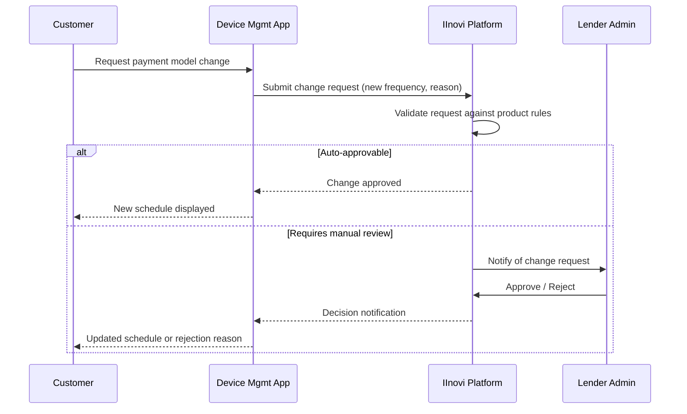
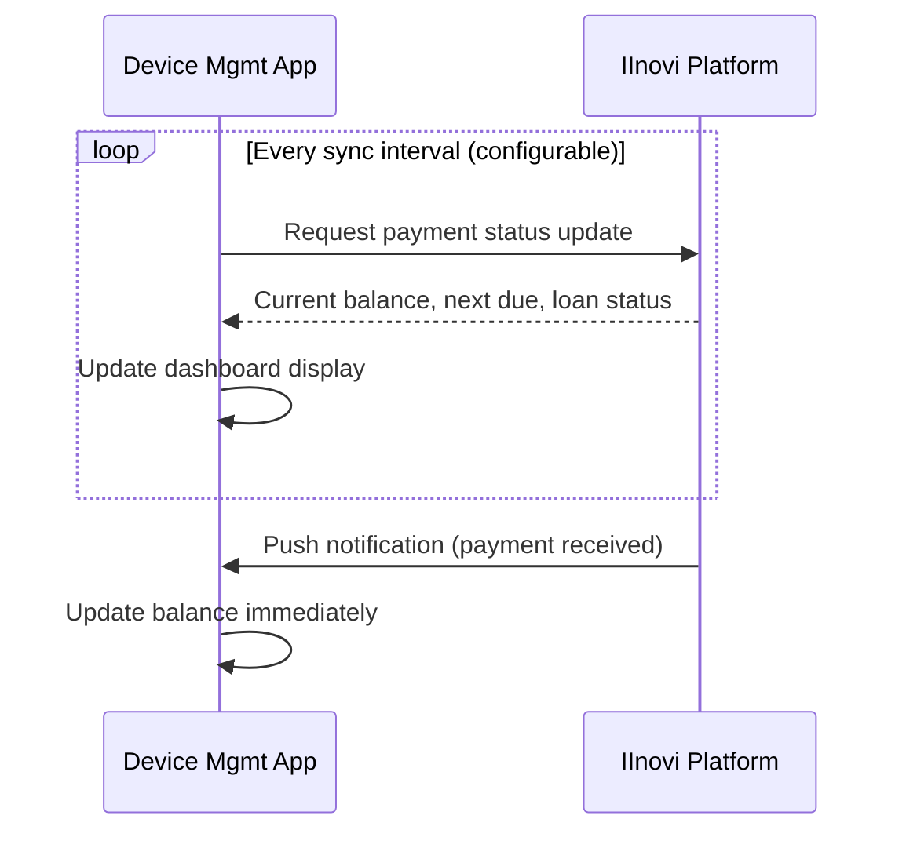
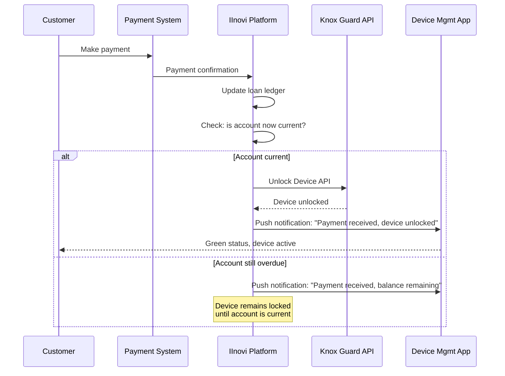
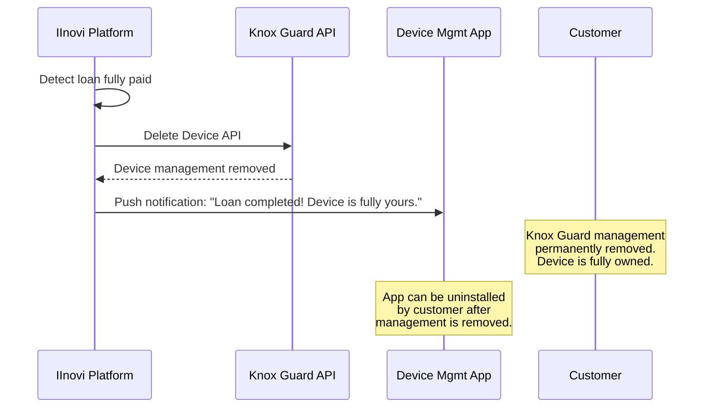
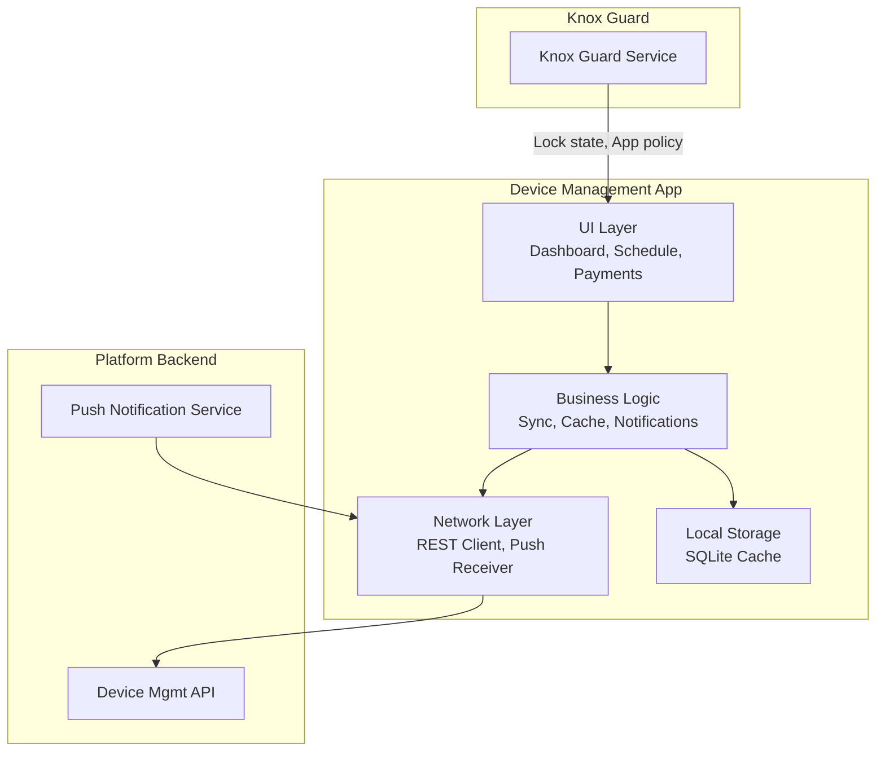

# Device Management Mobile App

## Overview

The Device Management App is a lightweight mobile application deployed to financed Samsung devices via Knox Guard. It serves as the primary self-service channel for customers to manage their loan, view payment information, and receive communications from the lender. Critically, the app remains accessible on the device lock screen, ensuring the customer can take action to resolve a locked device without needing a separate device or channel.

---

## App Deployment

### Deployment via Knox Guard

The Device Management App is deployed and managed through Knox Guard's app management capabilities.

| Aspect | Detail |
|---|---|
| **Deployment method** | Knox Guard pushes the app to enrolled devices during enrollment |
| **Lock screen access** | The app is whitelisted to remain accessible when the device is locked |
| **Uninstallation** | Prevented by Knox Guard device policy; the app cannot be removed by the customer |
| **Updates** | Pushed via Knox Guard or standard app update channels |
| **Activation** | Automatic on device enrollment; no customer action required |

### Deployment Flow

---

## Customer Capabilities

The app provides customers with self-service capabilities to manage their financed device and loan.

### Feature Summary

| Feature | Description | Available When Locked |
|---|---|---|
| **Check balance** | View outstanding loan balance, next payment amount, and total remaining | Yes |
| **View payment schedule** | See all past, current, and future installments with dates and amounts | Yes |
| **Request payment** | Initiate a payment via integrated payment methods (mobile money, USSD, bank transfer) | Yes |
| **View payment history** | See a record of all payments made | Yes |
| **Change payment model** | Request a change to the payment frequency or structure (subject to lender approval) | Yes |
| **View lock status** | See current device lock/unlock status and reason | Yes |
| **Contact support** | Access lender contact details (phone, email, chat) | Yes |

### Payment Model Change Request

Customers may request changes to their payment model (e.g., switching from monthly to weekly installments, or restructuring after hardship). This is handled as a request that requires lender approval.

---

## Platform Capabilities

The platform uses the app as a communication and status channel to the customer's device.

### Push Reminders

The platform sends push notifications through the app for payment-related events.

| Reminder Type | Trigger | Content |
|---|---|---|
| **Upcoming payment** | N days before due date (configurable) | Payment amount, due date, payment methods |
| **Overdue payment** | Payment not received by due date | Amount overdue, consequence warning |
| **Grace period ending** | Approaching end of grace period | Urgency message, lock warning |
| **Payment received** | Payment processed | Confirmation, updated balance |
| **Loan milestone** | Percentage of loan paid off (e.g., 50%) | Encouragement, remaining balance |

### Dunning Messages

For overdue accounts, the platform escalates messages through the app.

| Escalation Level | Message Tone | Delivery |
|---|---|---|
| **Soft reminder** | Friendly, informational | Push notification |
| **Firm reminder** | Clear urgency, consequences stated | Push notification + in-app banner |
| **Final warning** | Lock imminent, action required | In-app full-screen overlay |
| **Locked notice** | Device locked, resolution steps | Lock screen message + in-app |

### Payment Status Sync

The app synchronizes payment status with the platform in near-real-time.

### Lock Status Display

The app reflects the current device lock state, providing transparency to the customer.

| Device State | App Display |
|---|---|
| **Active** (unlocked) | Green status indicator, "Device active" |
| **Blinked** (reminder) | Yellow status indicator, "Payment reminder active" |
| **Locked** | Red status indicator, "Device locked -- make a payment to unlock" |
| **Completed** | "Loan paid off -- device is yours" |

---

## Communication Strategy

The app complements SMS-based communication rather than replacing it.

### Channel Matrix

| Event | SMS | In-App Push | In-App Display |
|---|---|---|---|
| Payment reminder (pre-due) | Yes | Yes | Yes |
| Payment overdue | Yes | Yes | Yes (banner) |
| Lock warning | Yes | Yes | Yes (full-screen) |
| Device locked | Yes | N/A (lock screen) | Lock screen message |
| Payment received | Yes | Yes | Yes |
| Loan completed | Yes | Yes | Yes |
| Payment model change approved | Yes | Yes | Yes |

**Rationale**: SMS is the fallback channel because it works on feature phones and does not require data connectivity. The in-app channel provides richer content and is the primary channel when the device has data connectivity.

---

## Unlock Logic

### Per-Period Unlock

When a customer makes a payment that brings their account current, the platform triggers an unlock.

### Full Permanent Unlock (Loan Completion)

When the loan is fully paid off, the platform permanently removes device management.

After the Delete Device API call:
- Knox Guard management is permanently removed from the device.
- The device cannot be re-enrolled without a new purchase from a Knox-registered reseller.
- The Device Management App can be uninstalled by the customer (Knox Guard no longer prevents uninstallation).

---

## Technical Considerations

### Performance and Footprint

| Requirement | Target |
|---|---|
| **APK size** | < 10 MB |
| **Memory usage** | < 50 MB RAM |
| **Battery impact** | Negligible (sync interval adjustable) |
| **Data usage** | < 1 MB per day (text-only sync) |
| **Startup time** | < 2 seconds on entry-level devices |

### Lock Screen Operation

The app must function correctly in a restricted environment when the device is locked by Knox Guard.

| Constraint | Handling |
|---|---|
| **No app switching** | The app operates as a standalone experience on the lock screen |
| **Limited system access** | Only whitelisted APIs are available; no access to contacts, gallery, etc. |
| **Payment initiation** | The app can launch USSD codes or display payment instructions without full device access |
| **Display** | Full-screen mode on the lock screen with lender branding |

### Permissions

The app requires minimal permissions to reduce customer friction and security risk.

| Permission | Reason | Required |
|---|---|---|
| **Internet** | Sync with platform | Yes |
| **Push notifications** | Receive reminders and status updates | Yes |
| **Phone state** | Read IMEI for device identification | Yes |
| **Storage** | Cache payment schedule offline | No (optional) |

### Offline Mode

The app supports a limited offline mode for situations where data connectivity is intermittent.

| Feature | Offline Behavior |
|---|---|
| **View balance** | Shows last synced balance with timestamp |
| **View schedule** | Shows cached schedule |
| **Request payment** | Queued for submission when connectivity is restored |
| **Push notifications** | Delivered when connectivity is restored |
| **Lock status** | Shows last known status |

### Data Synchronization

| Sync Type | Trigger | Data |
|---|---|---|
| **Periodic** | Every 4 hours (configurable) | Balance, schedule, loan status |
| **Event-driven** | Payment received, lock/unlock | Immediate push from platform |
| **On-open** | Customer opens app | Full refresh |
| **Background** | Knox Guard enrollment sync | Device state, policy version |

---

## App Architecture

---

## Related Documents

- [Device Locking Strategy](locking-strategy.md)
- [Knox Guard Integration Design](knox-guard-integration.md)
- [Knox Guard Policy Configuration](knox-guard-policies.md)
- [IMEI Registration and Verification](imei-registration.md)
- [Lock/Unlock and Dunning Integration](lock-unlock-dunning.md)
