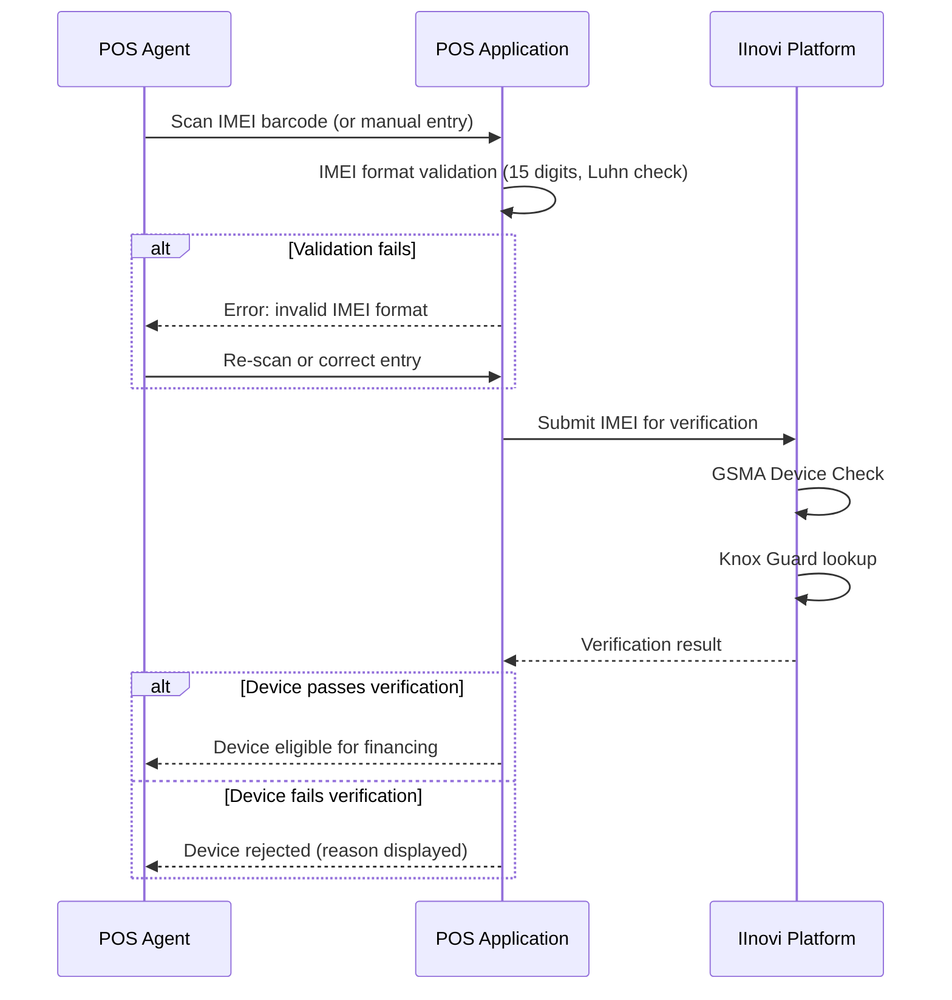
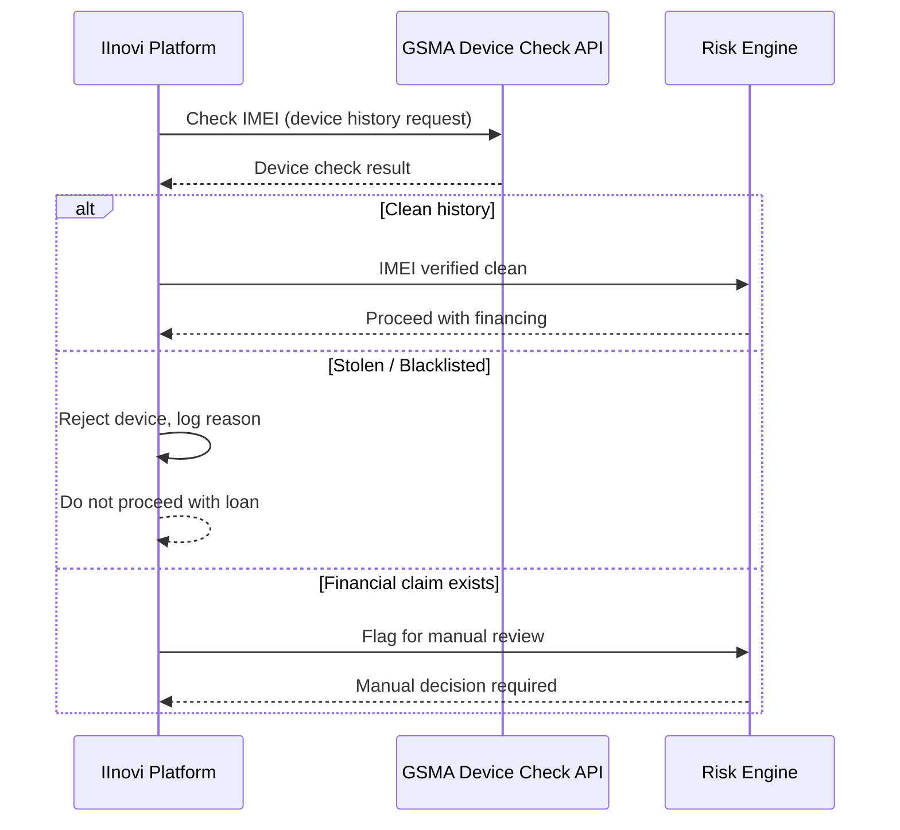
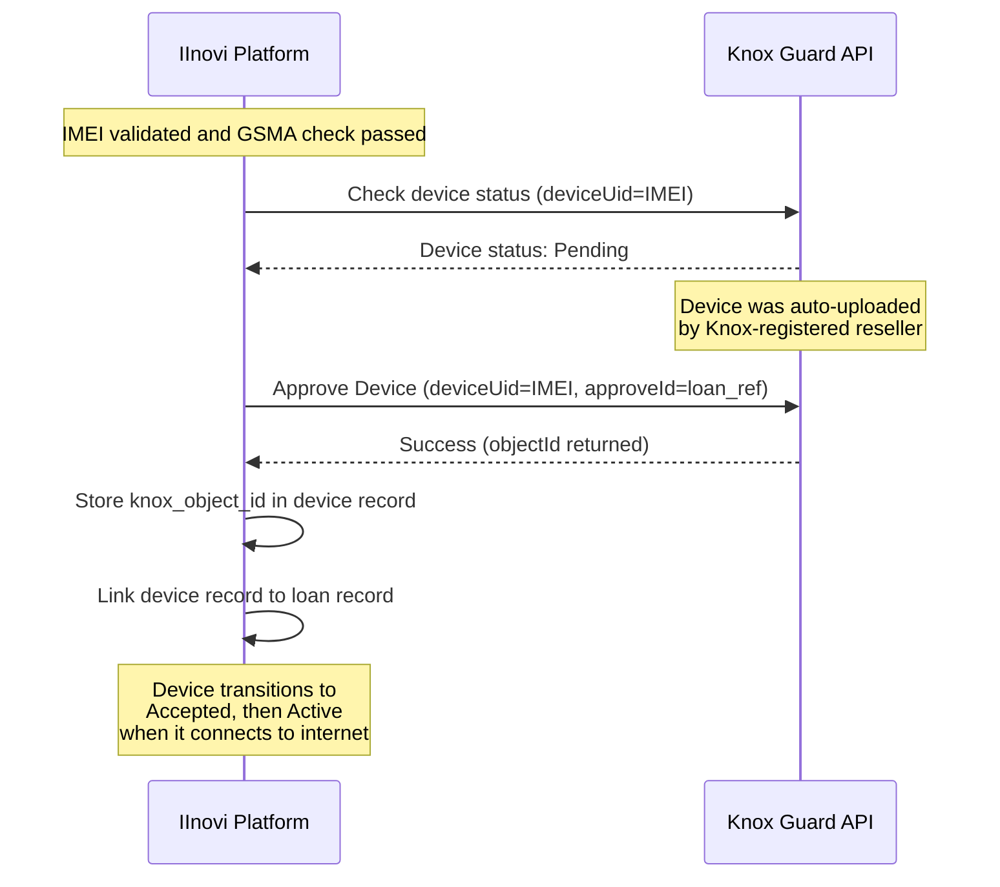
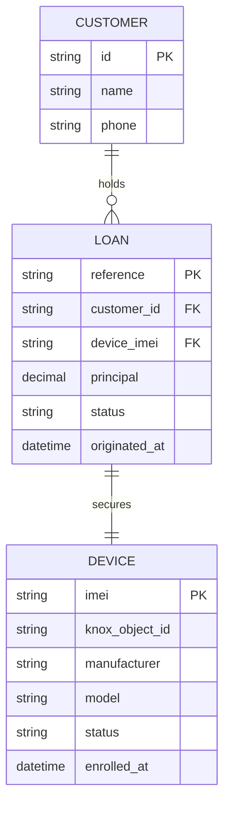
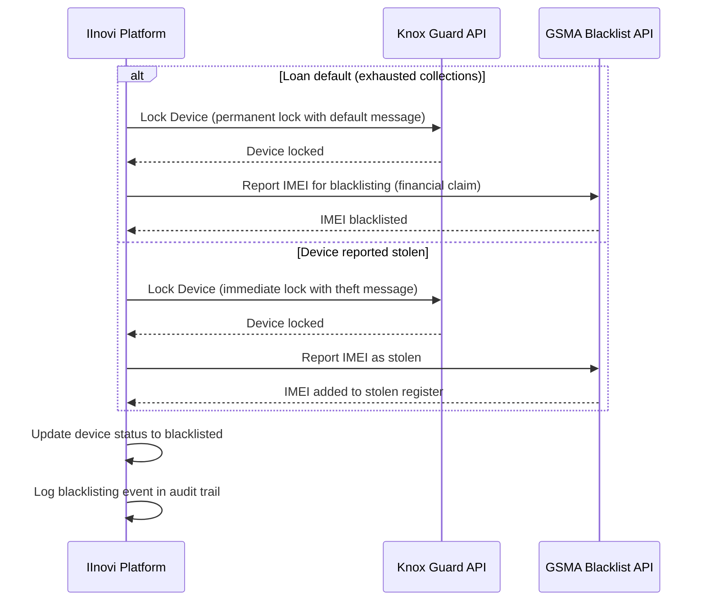
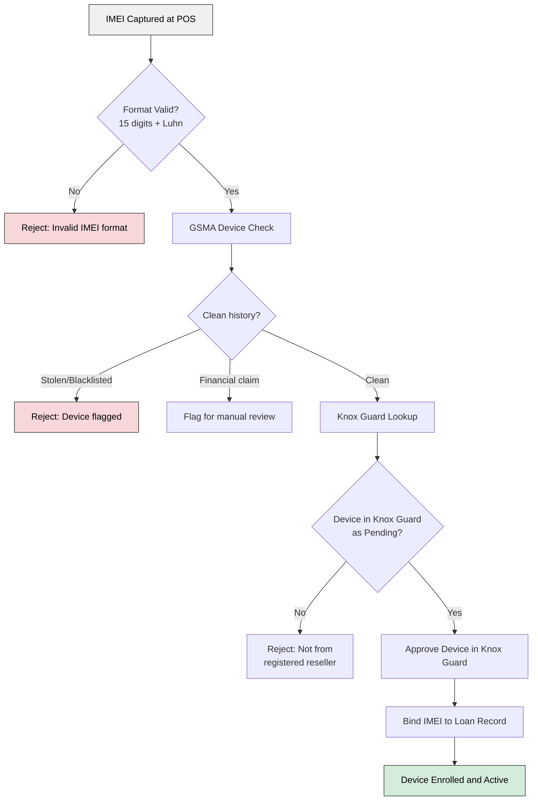

# IMEI Capture and Device Verification

## Overview

Every financed device must be uniquely identified, verified, and linked to a loan record before it enters the device management lifecycle. The International Mobile Equipment Identity (IMEI) serves as the canonical device identifier across the platform, Knox Guard, and external verification services.

This document describes the IMEI capture process at point of sale, format validation, GSMA Device Check integration for fraud and theft screening, Knox Guard registration, and the binding of an IMEI to a loan record.

---

## IMEI Capture at Point of Sale

The IMEI is captured at the point of sale (POS) during the device financing origination process.

### Capture Methods

| Method | Description | Accuracy |
|---|---|---|
| **Barcode scan** | Scan the IMEI barcode on the device box or under the battery cover using the POS terminal camera or barcode scanner. | High (no transcription errors) |
| **Manual entry** | Customer or agent types the IMEI from the device settings screen (`*#06#` dial code) or the device label. | Medium (prone to transcription errors) |

**Recommendation**: Barcode scanning is the preferred method. Manual entry must pass format validation before submission.

### Capture Flow



---

## IMEI Format Validation

All captured IMEIs are validated before any downstream processing.

### Validation Rules

| Rule | Description | Example |
|---|---|---|
| **Length** | Exactly 15 digits | `356938035643809` |
| **Character set** | Numeric only (0--9) | No letters, spaces, or dashes |
| **Luhn check digit** | The 15th digit is a Luhn check digit computed from the first 14 digits | Detects single-digit transcription errors |
| **TAC prefix** | The first 8 digits (Type Allocation Code) should correspond to a known device model | Optional enrichment step |

### IMEI Structure

```
┌─────────────────────────────────────────────┐
│  3 5 6 9 3 8 0 3 | 5 6 4 3 8 0 | 9        │
│  ───────────────   ───────────   ─          │
│  TAC (8 digits)    Serial (6)    Check (1)  │
│  Type Allocation   Unique to     Luhn       │
│  Code (device      this unit     check      │
│  model + origin)                 digit      │
└─────────────────────────────────────────────┘
```

### Luhn Check Algorithm

1. Starting from the rightmost digit (check digit), double every second digit moving left.
2. If doubling produces a number greater than 9, subtract 9.
3. Sum all digits.
4. The total must be a multiple of 10.

The platform validates this on every IMEI submission and rejects any IMEI that fails the check.

---

## GSMA Device Check Integration

Before a device is approved for financing, the platform queries the GSMA Device Check service to verify the device's history over the preceding 10 years.

### What GSMA Device Check Screens For

| Check | Description | Action on Positive Result |
|---|---|---|
| **Stolen** | Device has been reported stolen in any participating network | Reject financing; do not proceed |
| **Blacklisted** | Device IMEI is on a national or international blacklist | Reject financing; do not proceed |
| **Financial claim** | An existing financing or insurance claim is active against this IMEI | Reject financing; flag for review |
| **Counterfeit** | TAC does not match a known manufacturer allocation | Reject financing; do not proceed |
| **History report** | 10-year activity history across participating networks | Informational; used for risk scoring |

### Integration Flow



### GSMA API Configuration

| Parameter | Value |
|---|---|
| **API** | GSMA Device Check REST API |
| **Authentication** | API key + OAuth 2.0 |
| **Response time** | Typically < 2 seconds |
| **Caching** | Results cached for 24 hours per IMEI to avoid redundant calls |

---

## Knox Guard Registration

After IMEI validation and GSMA verification, the device is registered with Knox Guard.

### IMEI-to-Knox Guard Mapping

| Platform Field | Knox Guard Field | Description |
|---|---|---|
| `device.imei` | `deviceUid` | The validated IMEI becomes the Knox Guard device identifier |
| `loan.reference` | `approveId` | The loan reference is set as the Knox Guard approve ID during device approval |
| (returned by Knox) | `objectId` | Knox Guard's internal device ID, stored in `device.knox_object_id` for subsequent API calls |

### Registration Sequence



### Prerequisites

- The device must have been sold by a **Knox-registered reseller**, which causes Samsung to automatically upload the device IMEI to Knox Guard in a Pending state.
- If the device is not found in Knox Guard (not from a registered reseller), the platform must follow a manual registration process or reject the device.

---

## IMEI-to-Loan Binding

The IMEI is the physical anchor that binds a specific device to a specific loan in the platform's portfolio.

### Binding Data Model



### Binding Rules

| Rule | Description |
|---|---|
| **One-to-one** | Each IMEI is bound to exactly one active loan at any time. |
| **Immutable during loan** | The IMEI cannot be changed on a loan once originated (device swap requires a new loan or formal amendment). |
| **Cascading status** | The device status reflects the loan status (active, overdue, locked, completed). |
| **Audit trail** | All binding events (creation, modification, completion) are logged with timestamps and actor IDs. |

---

## IMEI Blacklisting on Default or Theft

When a financed device is defaulted on or reported stolen, the platform initiates IMEI blacklisting through GSMA and locks the device via Knox Guard.

### Blacklisting Flow



### Blacklisting Triggers

| Trigger | Action | Reversible |
|---|---|---|
| **Loan default** (exhausted all collection efforts) | Lock via Knox Guard + report to GSMA as financial claim | Yes, if debt is settled |
| **Customer-reported theft** | Lock via Knox Guard + report to GSMA as stolen | Yes, if device is recovered and verified |
| **Platform-detected fraud** | Lock via Knox Guard + report to GSMA as stolen | Subject to investigation |

### Reversal

If a blacklisted IMEI needs to be restored (e.g., debt settled, device recovered), the platform must:

1. Remove the GSMA blacklist entry via the GSMA API.
2. Unlock or delete the device in Knox Guard as appropriate.
3. Update the platform device record.

---

## Dual-IMEI Device Handling

Many modern Samsung devices support two SIM slots and therefore have two IMEIs.

### Slot Mapping

| Slot | IMEI | Usage |
|---|---|---|
| **Slot 1 (Primary)** | IMEI 1 | Primary identifier for Knox Guard registration and loan binding |
| **Slot 2 (Secondary)** | IMEI 2 | Captured and stored for reference; used in SIM control policy |

### Handling Rules

| Rule | Description |
|---|---|
| **Primary IMEI for binding** | The Slot 1 IMEI is used as the `deviceUid` for Knox Guard and as the loan binding identifier. |
| **Both IMEIs captured** | The POS captures both IMEIs (if dual-SIM). Both are stored in the device record. |
| **Both IMEIs validated** | Format validation and GSMA Device Check are run on both IMEIs. |
| **Both IMEIs blacklisted** | On default or theft, both IMEIs are reported to GSMA to prevent partial circumvention. |
| **SIM control on both slots** | Knox Guard SIM control policies apply to both SIM slots. |

### Dual-IMEI Data Model Extension

```python
@dataclass
class Device:
    imei_primary: str       # Slot 1 -- used for Knox Guard deviceUid
    imei_secondary: str | None  # Slot 2 -- stored for reference and GSMA reporting
    knox_object_id: str | None
    manufacturer: str
    model: str
    status: str
    loan_reference: str | None
```

---

## Validation Summary

The complete IMEI validation and registration pipeline:



---

## Related Documents

- [Device Locking Strategy](locking-strategy.md)
- [Knox Guard Integration Design](knox-guard-integration.md)
- [Knox Guard Policy Configuration](knox-guard-policies.md)
- [Device Management App](device-management-app.md)
- [Lock/Unlock and Dunning Integration](lock-unlock-dunning.md)
