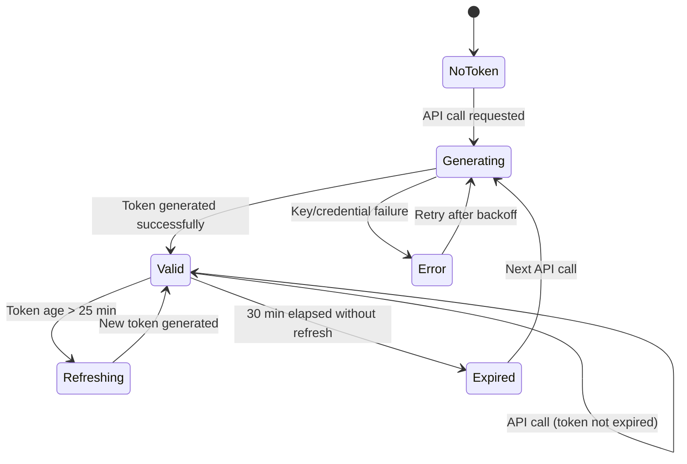
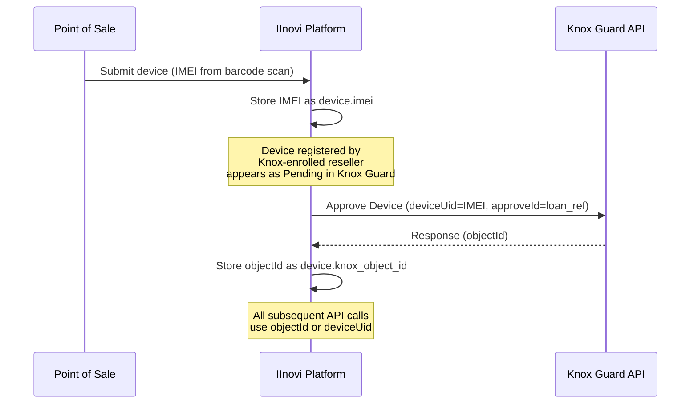
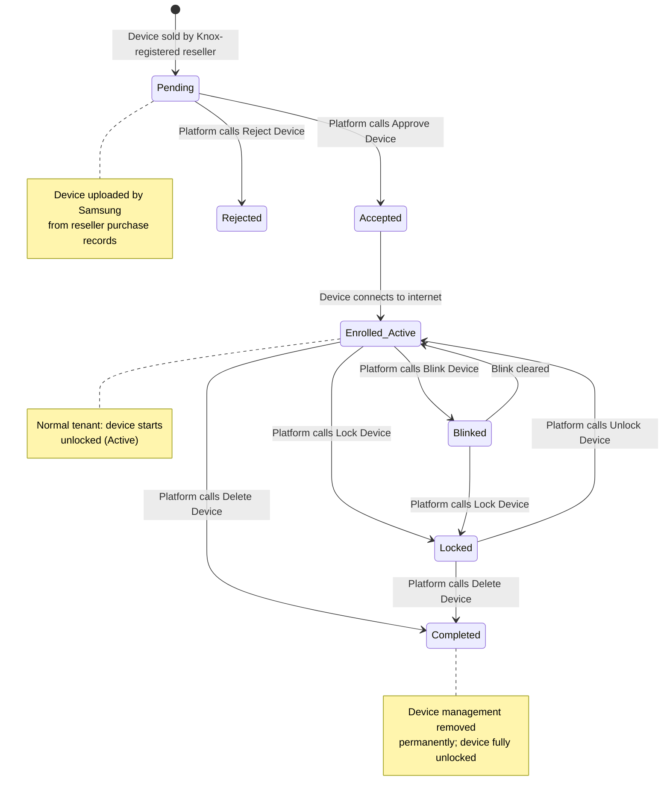
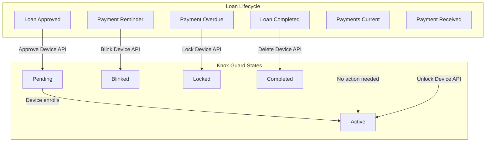
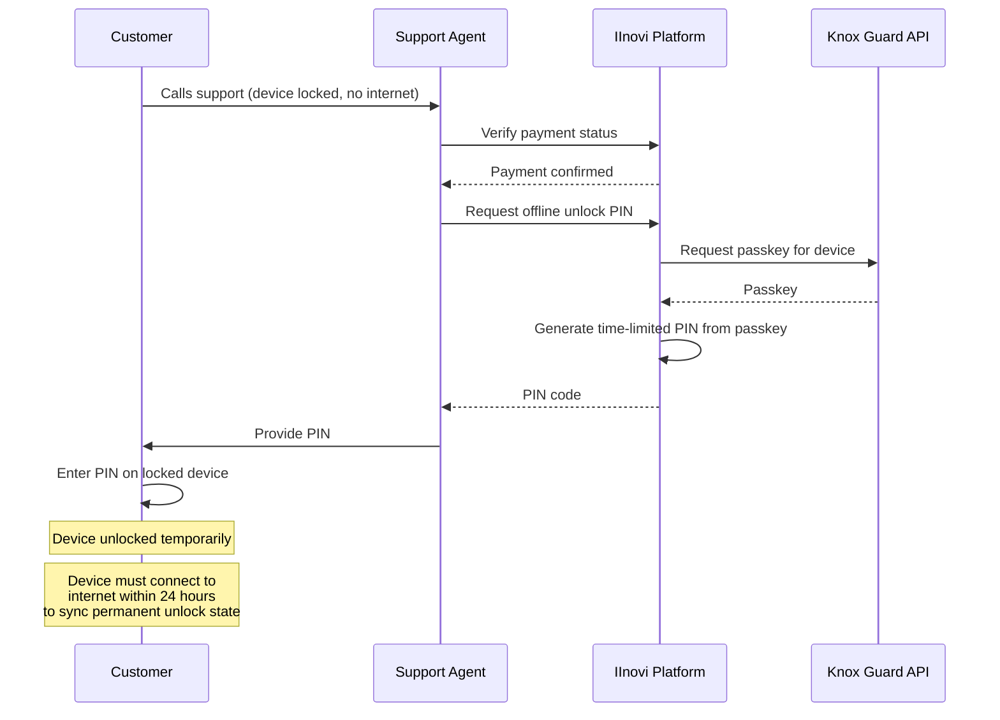

# Samsung Knox Guard API Integration Design

## Overview

This document specifies the integration design for the Samsung Knox Guard API (v1.1.3) within the IInovi device financing platform. Knox Guard provides firmware-level device locking for Samsung devices, enabling the platform to lock, unlock, and manage financed devices throughout the loan lifecycle.

---

## API Specification

| Property | Value |
|---|---|
| **API Version** | v1.1.3 |
| **Protocol** | REST over HTTPS |
| **Data Format** | JSON |
| **Tenant Type** | Normal |
| **Authentication** | x-knox-apitoken (JWT-like, signed with private key) |
| **Token Validity** | 30 minutes |
| **Rate Limits** | Per-endpoint; bulk operations up to 10,000 devices |

---

## Authentication

Knox Guard uses a two-step authentication model based on the Knox Cloud API framework.

### Prerequisites

1. **Knox Cloud API Access Registration** -- Register the platform as a Knox Cloud API consumer via the Samsung Knox Partner Portal.
2. **Client Identifier** -- A unique identifier assigned to the registered application.
3. **Public/Private Key Pair** -- An RSA key pair generated during registration. The public key is uploaded to Samsung; the private key is stored securely by the platform.

### Token Generation

The `x-knox-apitoken` is generated client-side by signing a JSON payload with the private key:

```
Token Payload:
{
  "clientIdentifier": "<client_id>",
  "signedAccessTokenJWT": "<signed_jwt>",
  "validityForNewToken": 1800
}
```

The token is included in the `x-knox-apitoken` header on every API request.

### Token Lifecycle in the Adapter



The adapter implements automatic token refresh:

- Tokens are generated on first use and cached.
- A background refresh is triggered when the token age exceeds 25 minutes (5-minute buffer before expiry).
- If a request receives a 401 response, the adapter invalidates the cached token and generates a new one before retrying.

---

## API Regions

Knox Guard provides region-specific API endpoints. The platform must route requests to the correct region based on tenant configuration.

| Region | Base URL | Usage |
|---|---|---|
| **EU** | `https://eu-kcs-api.samsungknox.com` | European tenants, development |
| **US** | `https://us-kcs-api.samsungknox.com` | US/Americas tenants |

### Environment Strategy

| Environment | Region | Purpose |
|---|---|---|
| Development | EU | Integration testing, sandbox |
| Staging | EU | Pre-production validation |
| Production (EU) | EU | Live EU operations |
| Production (US) | US | Live US/Americas operations |

The region is configured per environment via environment variables and injected into the adapter at startup.

---

## Device Identification Mapping

Knox Guard uses three identifiers for each device. The platform maps these to its own domain model.

| Knox Guard ID | Source | Platform Mapping | Description |
|---|---|---|---|
| `deviceUid` | IMEI scanned at POS | `device.imei` | The device IMEI; used as the primary Knox Guard device identifier. |
| `objectId` | Returned by Knox Guard API | `device.knox_object_id` | Knox Guard's internal system identifier for the device. Stored in the platform device record for subsequent API calls. |
| `approveId` | Set by platform | `loan.reference` | The loan or billing reference. Links the Knox Guard device to the platform's loan record. Set during device approval. |

### Identifier Flow



---

## Device Registration Flow

Samsung devices purchased from Knox-registered resellers are automatically uploaded to Knox Guard in a **Pending** state. The platform does not need to manually register devices.



### Registration Steps

1. **Reseller sells device** -- Samsung's systems automatically upload the device IMEI to Knox Guard under the platform's tenant. The device enters the **Pending** state.
2. **POS captures IMEI** -- The point-of-sale system scans the device IMEI barcode and submits it to the platform.
3. **Platform approves device** -- The platform calls the Knox Guard Approve Device API with `deviceUid` (IMEI) and `approveId` (loan reference). The device transitions to **Accepted**.
4. **Device enrolls** -- When the device connects to the internet, it communicates with Knox Guard servers and transitions to **Enrolled (Active)**. Under the Normal tenant type, the device is unlocked.
5. **Lifecycle management** -- The platform manages the device state (Blink, Lock, Unlock, Delete) through the loan lifecycle.

---

## Core API Operations

| Operation | HTTP Method | Endpoint | Trigger (Platform Event) | Effect |
|---|---|---|---|---|
| **Approve Device** | `POST` | `/kcs/v1/kgc/devices/approve` | Loan approved, IMEI captured | Transitions device from Pending to Accepted; sets `approveId` |
| **Blink Device** | `POST` | `/kcs/v1/kgc/devices/blink` | Pre-overdue reminder | Displays non-dismissible blinking message on device screen |
| **Lock Device** | `POST` | `/kcs/v1/kgc/devices/lock` | Payment overdue (post-grace) | Locks the device; displays custom message with contact details |
| **Unlock Device** | `POST` | `/kcs/v1/kgc/devices/unlock` | Payment received while locked | Unlocks the device; restores full functionality |
| **Delete Device** | `POST` | `/kcs/v1/kgc/devices/delete` | Loan fully paid off | Permanently removes device management; device is fully unlocked |
| **Get Device Info** | `GET` | `/kcs/v1/kgc/devices/{objectId}` | Status check / sync | Returns current device state, enrollment details |

---

## Knox Guard Device States Mapped to Loan Lifecycle

| Knox Guard State | Loan Lifecycle Stage | Description |
|---|---|---|
| **Pending** | Loan application / Pre-approval | Device is in Knox Guard but not yet linked to a loan. |
| **Active** (Enrolled) | Loan active, payments current | Device is enrolled and unlocked. Customer has full use. |
| **Blinked** | Pre-overdue / Payment reminder | Device displays a non-dismissible reminder. Still usable. |
| **Locked** | Overdue / Collections | Device is locked. Only emergency calls and the Device Management App are accessible. |
| **Completed** | Loan paid off | Device management is permanently removed. Device is fully owned by the customer. |
| **Rejected** | Loan declined / Device not eligible | Device is removed from Knox Guard management without enrollment. |

### State Diagram: Loan Lifecycle to Knox Guard Mapping



---

## Bulk Operations

Knox Guard supports bulk operations for portfolio-level device management.

| Operation | Max Devices | Method | Use Case |
|---|---|---|---|
| Bulk Lock | 10,000 | CSV upload via API | Mass lock on portfolio-level delinquency |
| Bulk Unlock | 10,000 | CSV upload via API | Mass unlock after batch payment processing |
| Bulk Approve | 10,000 | CSV upload via API | Batch onboarding of devices |
| Bulk Delete | 10,000 | CSV upload via API | Portfolio wind-down or loan book transfer |

Bulk operations are asynchronous. The API returns a job ID, and the platform polls for completion status.

---

## PIN Unlock (Offline Scenario)

When a device is locked and has no internet connectivity, the customer cannot receive an over-the-air unlock. Knox Guard provides a passkey/PIN exchange mechanism for this scenario.

### Flow



### Constraints

- The PIN provides a **temporary** unlock. The device must connect to the internet within **24 hours** to synchronize the permanent unlock state with Knox Guard servers.
- If the device does not reconnect within 24 hours, it reverts to the locked state.
- PINs are single-use and time-limited.

---

## Device Requirements

| Requirement | Detail |
|---|---|
| **Manufacturer** | Samsung |
| **Knox Version** | 2.7.1 or higher |
| **Connectivity** | Internet required for enrollment and state sync |
| **SIM** | Required for SIM control policies |
| **Play Services** | Not required (Knox Guard operates at firmware level) |

---

## Error Handling and Retry Strategy

### Error Categories

| Error Type | HTTP Code | Handling |
|---|---|---|
| **Authentication failure** | 401 | Invalidate token cache, regenerate token, retry once |
| **Device not found** | 404 | Log error, flag device record for review |
| **Rate limit exceeded** | 429 | Exponential backoff with jitter (base 2s, max 60s) |
| **Server error** | 500, 502, 503 | Retry up to 3 times with exponential backoff |
| **Validation error** | 400 | Do not retry; log error details, raise alert |
| **Network timeout** | N/A | Retry up to 3 times with exponential backoff |

### Retry Policy

```
Max retries: 3
Base delay: 2 seconds
Backoff multiplier: 2
Max delay: 60 seconds
Jitter: +/- 25%
```

### Circuit Breaker

The adapter implements a circuit breaker to prevent cascading failures:

- **Closed** (normal): Requests flow through.
- **Open** (tripped): After 5 consecutive failures, all requests are short-circuited for 60 seconds.
- **Half-Open**: After the cooldown, a single request is allowed through. If it succeeds, the circuit closes. If it fails, the circuit reopens.

---

## Python Adapter Class Design

```python
from abc import ABC, abstractmethod
from dataclasses import dataclass
from enum import Enum
from typing import Optional


class DeviceState(Enum):
    PENDING = "pending"
    ACTIVE = "active"
    BLINKED = "blinked"
    LOCKED = "locked"
    COMPLETED = "completed"
    REJECTED = "rejected"


@dataclass
class DeviceResult:
    success: bool
    device_id: str
    state: DeviceState
    knox_object_id: Optional[str] = None
    error_code: Optional[str] = None
    error_message: Optional[str] = None


class DeviceLockingPort(ABC):
    """Port interface for device locking operations."""

    @abstractmethod
    async def approve_device(
        self, device_uid: str, approve_id: str
    ) -> DeviceResult:
        ...

    @abstractmethod
    async def lock_device(
        self, device_id: str, message: str, contact: str
    ) -> DeviceResult:
        ...

    @abstractmethod
    async def unlock_device(self, device_id: str) -> DeviceResult:
        ...

    @abstractmethod
    async def blink_device(
        self, device_id: str, message: str
    ) -> DeviceResult:
        ...

    @abstractmethod
    async def delete_device(self, device_id: str) -> DeviceResult:
        ...

    @abstractmethod
    async def get_device_state(self, device_id: str) -> DeviceState:
        ...


class KnoxGuardAdapter(DeviceLockingPort):
    """Knox Guard API v1.1.3 adapter for Samsung device locking."""

    def __init__(
        self,
        client_id: str,
        private_key_path: str,
        region: str = "eu",
    ):
        self._client_id = client_id
        self._private_key_path = private_key_path
        self._base_url = self._resolve_base_url(region)
        self._token_manager = KnoxTokenManager(client_id, private_key_path)
        self._http_client = HttpClient(
            retry_policy=RetryPolicy(max_retries=3, base_delay=2.0),
            circuit_breaker=CircuitBreaker(
                failure_threshold=5, recovery_timeout=60
            ),
        )

    def _resolve_base_url(self, region: str) -> str:
        urls = {
            "eu": "https://eu-kcs-api.samsungknox.com",
            "us": "https://us-kcs-api.samsungknox.com",
        }
        return urls[region]

    async def _get_headers(self) -> dict:
        token = await self._token_manager.get_valid_token()
        return {
            "x-knox-apitoken": token,
            "Content-Type": "application/json",
        }

    async def approve_device(
        self, device_uid: str, approve_id: str
    ) -> DeviceResult:
        headers = await self._get_headers()
        payload = {"deviceUid": device_uid, "approveId": approve_id}
        response = await self._http_client.post(
            f"{self._base_url}/kcs/v1/kgc/devices/approve",
            headers=headers,
            json=payload,
        )
        return self._parse_response(response, device_uid)

    async def lock_device(
        self, device_id: str, message: str, contact: str
    ) -> DeviceResult:
        headers = await self._get_headers()
        payload = {
            "objectId": device_id,
            "lockMessage": message,
            "contactNumber": contact,
        }
        response = await self._http_client.post(
            f"{self._base_url}/kcs/v1/kgc/devices/lock",
            headers=headers,
            json=payload,
        )
        return self._parse_response(response, device_id)

    async def unlock_device(self, device_id: str) -> DeviceResult:
        headers = await self._get_headers()
        payload = {"objectId": device_id}
        response = await self._http_client.post(
            f"{self._base_url}/kcs/v1/kgc/devices/unlock",
            headers=headers,
            json=payload,
        )
        return self._parse_response(response, device_id)

    async def blink_device(
        self, device_id: str, message: str
    ) -> DeviceResult:
        headers = await self._get_headers()
        payload = {"objectId": device_id, "blinkMessage": message}
        response = await self._http_client.post(
            f"{self._base_url}/kcs/v1/kgc/devices/blink",
            headers=headers,
            json=payload,
        )
        return self._parse_response(response, device_id)

    async def delete_device(self, device_id: str) -> DeviceResult:
        headers = await self._get_headers()
        payload = {"objectId": device_id}
        response = await self._http_client.post(
            f"{self._base_url}/kcs/v1/kgc/devices/delete",
            headers=headers,
            json=payload,
        )
        return self._parse_response(response, device_id)

    async def get_device_state(self, device_id: str) -> DeviceState:
        headers = await self._get_headers()
        response = await self._http_client.get(
            f"{self._base_url}/kcs/v1/kgc/devices/{device_id}",
            headers=headers,
        )
        return self._map_knox_state(response.json().get("state"))

    def _map_knox_state(self, knox_state: str) -> DeviceState:
        mapping = {
            "PENDING": DeviceState.PENDING,
            "ACTIVE": DeviceState.ACTIVE,
            "BLINKED": DeviceState.BLINKED,
            "LOCKED": DeviceState.LOCKED,
            "COMPLETED": DeviceState.COMPLETED,
            "REJECTED": DeviceState.REJECTED,
        }
        return mapping.get(knox_state, DeviceState.PENDING)

    def _parse_response(
        self, response, device_id: str
    ) -> DeviceResult:
        if response.ok:
            data = response.json()
            return DeviceResult(
                success=True,
                device_id=device_id,
                state=self._map_knox_state(data.get("state", "")),
                knox_object_id=data.get("objectId"),
            )
        return DeviceResult(
            success=False,
            device_id=device_id,
            state=DeviceState.PENDING,
            error_code=str(response.status_code),
            error_message=response.text,
        )
```

This is a reference design. The actual implementation will include full error handling, logging, metrics emission, and integration with the platform's dependency injection framework.

---

## Related Documents

- [Device Locking Strategy](locking-strategy.md)
- [Knox Guard Policy Configuration](knox-guard-policies.md)
- [IMEI Registration and Verification](imei-registration.md)
- [Device Management App](device-management-app.md)
- [Lock/Unlock and Dunning Integration](lock-unlock-dunning.md)
