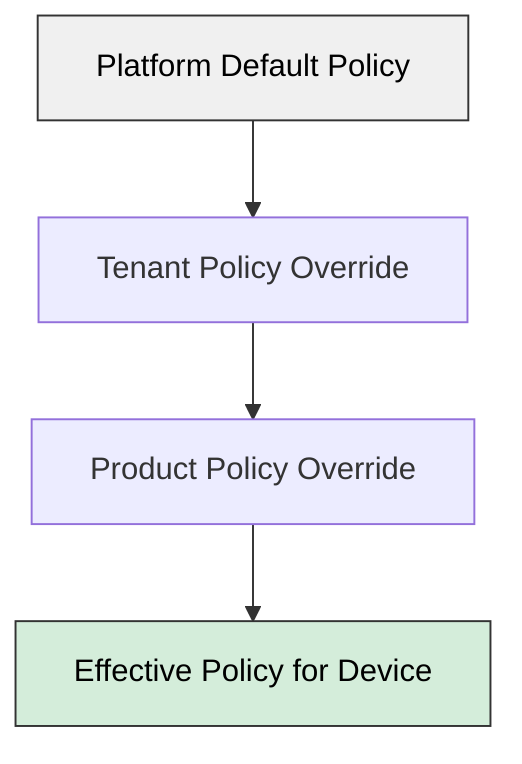
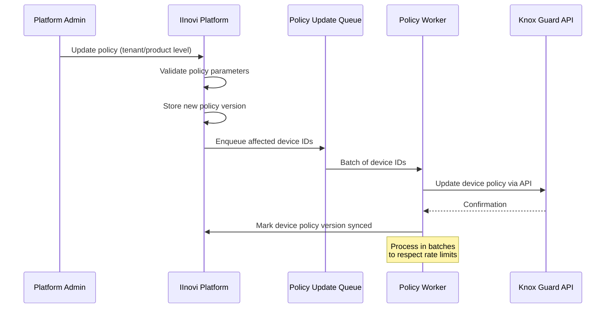

# Knox Guard Policy Configuration

## Overview

Knox Guard policies define the behavioral rules applied to enrolled Samsung devices. Policies control what happens on the device lock screen, how the device behaves when offline or when SIM cards are changed, and how reminders are displayed to customers. These policies are configured per tenant and can be customized per loan product.

This document covers the available Knox Guard policy types, their configuration parameters, and how they map to the platform's business rules for device financing.

---

## Policy Types

### 1. Lock Screen Policy

The lock screen policy controls what the customer sees when a device is locked via the Knox Guard Lock Device API.

| Parameter | Description | Example Value |
|---|---|---|
| `lockMessage` | Custom text explaining why the device is locked | "Your device has been locked due to an overdue payment. Please contact us to restore access." |
| `contactNumber` | Phone number displayed on the lock screen | "+27 800 123 456" |
| `contactEmail` | Email address displayed on the lock screen | "support@lender.co.za" |
| `showDeviceManagementApp` | Whether the Device Management App is accessible on the lock screen | `true` |

**Business context**: The lock screen message should clearly communicate the reason for the lock and provide a direct path to resolution. The Device Management App should always be accessible so customers can view their balance and initiate payment.

### 2. Offline Device Lock Policy

The offline device lock policy automatically locks a device that has not connected to Knox Guard servers for a configurable number of days. This prevents customers from circumventing locks by disabling connectivity.

| Parameter | Description | Constraints |
|---|---|---|
| `offlineLockEnabled` | Enable or disable offline auto-lock | `true` / `false` |
| `offlineLockDays` | Number of days offline before auto-lock triggers | 3--200 days |
| `warningNotificationDays` | Days before lock to show a warning notification | Must be less than `offlineLockDays` |
| `warningMessage` | Text of the warning notification | Free text |

**Behavior**:
1. The device periodically checks in with Knox Guard servers.
2. If the device does not check in for `offlineLockDays` consecutive days, Knox Guard records it as overdue for lock.
3. When the device next connects, it is immediately locked.
4. A warning notification is displayed `warningNotificationDays` before the lock threshold is reached (if the device briefly reconnects).

**Business context**: Offline lock prevents the scenario where a customer removes the SIM, disables Wi-Fi, and continues using the device in airplane mode to avoid remote locking. A typical configuration for device financing is 7--14 days.

### 3. SIM Control Policy

The SIM control policy restricts which SIM cards can be used in the device. It detects unauthorized SIM swaps and can automatically lock the device.

| Parameter | Description | Example |
|---|---|---|
| `simControlEnabled` | Enable or disable SIM control | `true` / `false` |
| `allowedMccMnc` | List of allowed MCC/MNC pairs (mobile country code / mobile network code) | `[{"mcc": "655", "mnc": "10"}, {"mcc": "655", "mnc": "02"}]` |
| `lockOnUnauthorizedSim` | Automatically lock if an unlisted SIM is inserted | `true` / `false` |
| `restrictCallsOnUnlistedSim` | Block outgoing calls on unauthorized SIM | `true` / `false` |
| `restrictSmsOnUnlistedSim` | Block outgoing SMS on unauthorized SIM | `true` / `false` |
| `restrictDataOnUnlistedSim` | Block mobile data on unauthorized SIM | `true` / `false` |

**MCC/MNC Allowlist**:
The allowlist specifies which mobile networks are permitted. This is typically set to the networks in the country where the device was financed.

| Country | MCC | MNC | Operator |
|---|---|---|---|
| South Africa | 655 | 10 | MTN |
| South Africa | 655 | 01 | Vodacom |
| South Africa | 655 | 02 | Telkom |
| South Africa | 655 | 07 | Cell C |
| Kenya | 639 | 02 | Safaricom |
| Kenya | 639 | 03 | Airtel |
| Nigeria | 621 | 20 | Airtel |
| Nigeria | 621 | 30 | MTN |

**SIM swap fraud prevention**: A common fraud pattern involves purchasing a device on financing, then swapping the SIM and reselling the device. SIM control detects this and either locks the device immediately or restricts its functionality, making the device unusable for the buyer and deterring resale.

### 4. Blink Reminder Policy

The blink reminder displays a non-dismissible flashing message on the device screen. It does not lock the device but creates a persistent visual reminder.

| Parameter | Description | Example |
|---|---|---|
| `blinkMessage` | Message displayed in the blinking overlay | "Payment reminder: Your installment of R299 is due on 15 March. Please pay to avoid service interruption." |
| `blinkFrequency` | How often the blink appears | Configurable per Knox Guard settings |

**Business context**: The blink reminder is used as a pre-lock escalation step. It is triggered when a payment is approaching its due date or is within the grace period but before the lock threshold. The non-dismissible nature ensures the customer sees the message.

---

## Policy Configuration per Tenant and Product

Policies are configured hierarchically:



| Level | Scope | Example |
|---|---|---|
| **Platform Default** | All tenants, all products | Offline lock: 14 days, SIM control: enabled |
| **Tenant Override** | Specific lender | Offline lock: 7 days (stricter for high-risk market) |
| **Product Override** | Specific loan product within a tenant | Offline lock: 21 days (for premium devices with longer terms) |

The effective policy for a device is resolved by merging these layers, with the most specific level taking precedence.

### Policy Resolution Example

```
Platform Default:
  offlineLockDays: 14
  simControlEnabled: true
  lockOnUnauthorizedSim: true

Tenant Override (Lender A):
  offlineLockDays: 7

Product Override (Lender A, Basic Smartphone Plan):
  offlineLockDays: 10

Effective Policy for a device under Lender A's Basic Smartphone Plan:
  offlineLockDays: 10        (from Product)
  simControlEnabled: true     (from Platform Default)
  lockOnUnauthorizedSim: true (from Platform Default)
```

---

## Policy Update Propagation

When a policy is updated, the changes must propagate to all enrolled devices under that policy scope.

### Propagation Flow



### Propagation Rules

- Policy updates are **asynchronous**. The admin receives immediate confirmation that the policy was saved, but device-level propagation happens in the background.
- Devices are updated in **batches** (up to 10,000 per bulk operation) to respect Knox Guard API rate limits.
- Each device record tracks its current policy version. A background reconciliation job identifies devices with stale policy versions and re-queues them.
- Policy updates are **idempotent**. Re-applying the same policy version to a device has no adverse effect.

---

## Policy-to-Business-Rule Mapping

| Business Rule | Knox Guard Policy | Configuration |
|---|---|---|
| Lock device when payment is overdue (post-grace period) | Lock Screen | `lockMessage`: overdue notice with amount; `contactNumber`: collections line; `showDeviceManagementApp`: true |
| Auto-lock device if offline for extended period | Offline Device Lock | `offlineLockDays`: 7--14 days (configurable per product); `warningNotificationDays`: 2 days before lock |
| Prevent SIM swap fraud | SIM Control | `allowedMccMnc`: country-specific network list; `lockOnUnauthorizedSim`: true |
| Restrict device functionality on unauthorized SIM | SIM Control | `restrictCallsOnUnlistedSim`: true; `restrictSmsOnUnlistedSim`: true; `restrictDataOnUnlistedSim`: true |
| Remind customer of upcoming payment | Blink Reminder | `blinkMessage`: payment amount and due date |
| Remind customer of overdue payment (pre-lock) | Blink Reminder | `blinkMessage`: overdue notice with payment instructions |
| Allow customer self-service on locked device | Lock Screen | `showDeviceManagementApp`: true |
| Permanently unlock device on loan completion | Delete Device (API) | Not a policy; triggered by Delete Device API call |
| Display lender contact on locked device | Lock Screen | `contactNumber`, `contactEmail` |
| Warn customer before offline lock triggers | Offline Device Lock | `warningNotificationDays`: configurable; `warningMessage`: connectivity reminder |

---

## Policy Configuration Data Model

```python
@dataclass
class LockScreenPolicy:
    lock_message_template: str
    contact_number: str
    contact_email: str
    show_device_management_app: bool = True


@dataclass
class OfflineLockPolicy:
    enabled: bool = True
    offline_lock_days: int = 14
    warning_notification_days: int = 2
    warning_message: str = ""


@dataclass
class SimControlPolicy:
    enabled: bool = True
    allowed_mcc_mnc: list[dict[str, str]] = field(default_factory=list)
    lock_on_unauthorized_sim: bool = True
    restrict_calls: bool = True
    restrict_sms: bool = True
    restrict_data: bool = True


@dataclass
class BlinkPolicy:
    message_template: str = ""


@dataclass
class DevicePolicy:
    lock_screen: LockScreenPolicy
    offline_lock: OfflineLockPolicy
    sim_control: SimControlPolicy
    blink: BlinkPolicy
    policy_version: int = 1
    tenant_id: str = ""
    product_id: str | None = None
```

---

## Related Documents

- [Device Locking Strategy](locking-strategy.md)
- [Knox Guard Integration Design](knox-guard-integration.md)
- [IMEI Registration and Verification](imei-registration.md)
- [Device Management App](device-management-app.md)
- [Lock/Unlock and Dunning Integration](lock-unlock-dunning.md)
