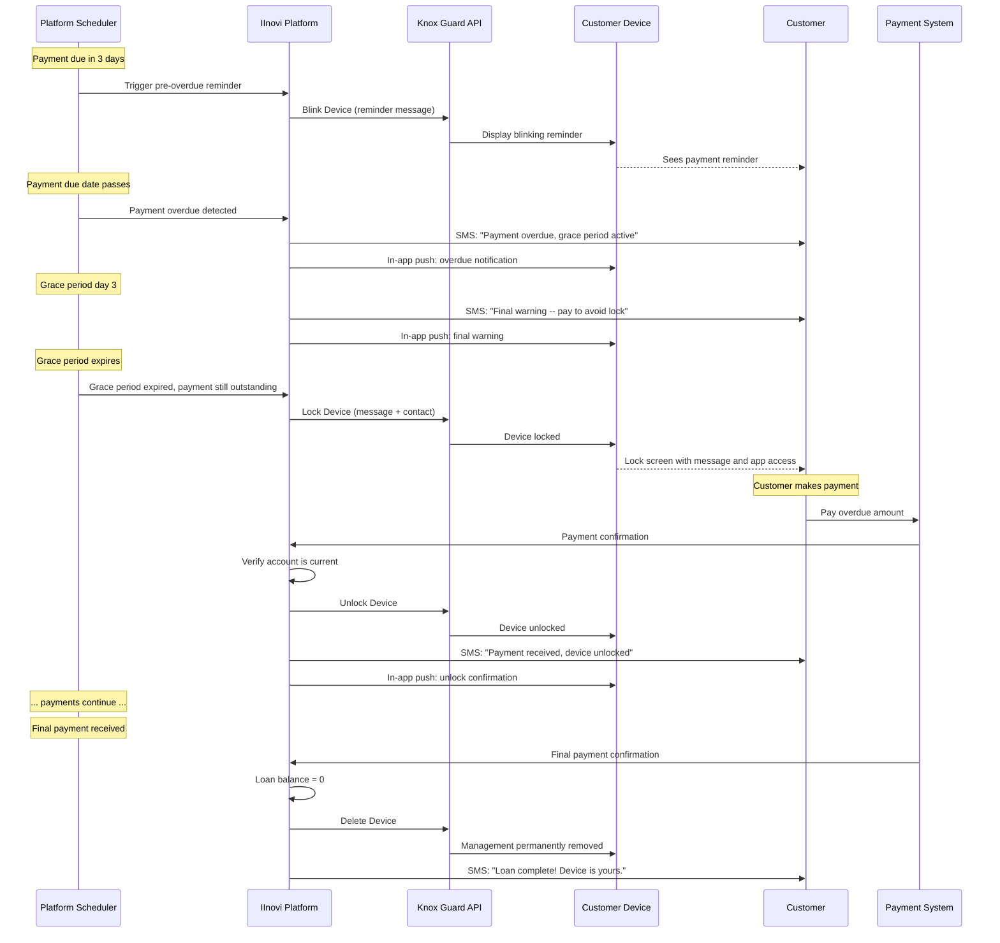
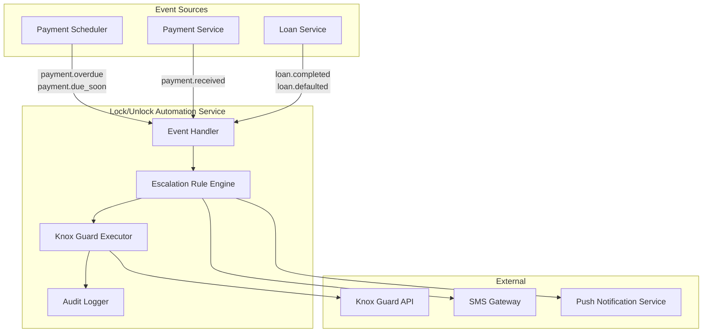
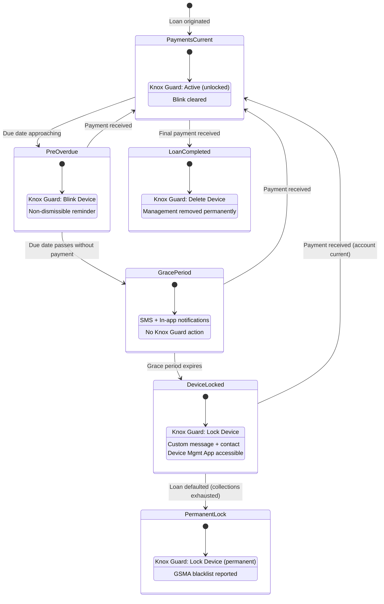

# Lock/Unlock Rules and Dunning Integration

## Overview

This document defines how the platform's dunning (collections escalation) process integrates with Samsung Knox Guard device locking operations. Each stage of the dunning timeline is mapped to a specific Knox Guard action, creating an automated escalation path from gentle payment reminders through device lock, and ultimately to permanent unlock on loan completion.

---

## Dunning Timeline Mapped to Knox Guard Operations

The dunning process follows a configurable escalation sequence. Each step is triggered by platform rules and executed through the Knox Guard API.

### Escalation Stages

| Stage | Timing | Knox Guard Operation | API Call | Device Effect |
|---|---|---|---|---|
| **1. Pre-overdue reminder** | N days before due date | Blink Device | `POST /kcs/v1/kgc/devices/blink` | Non-dismissible blinking message on screen |
| **2. Grace period** | Due date to due date + G days | None (platform-only) | N/A | SMS and in-app reminders; no device action |
| **3. Device lock** | Grace period expires | Lock Device | `POST /kcs/v1/kgc/devices/lock` | Device locked with custom message and contact |
| **4. Payment while locked** | Customer pays while locked | Unlock Device | `POST /kcs/v1/kgc/devices/unlock` | Device unlocked; full functionality restored |
| **5. Offline enforcement** | Device offline > N days | Offline Device Lock (policy) | Configured via policy | Auto-lock when device reconnects |
| **6. SIM swap detection** | Unauthorized SIM inserted | SIM Control (policy) | Configured via policy | Auto-lock on unauthorized SIM |
| **7. Loan completion** | Final payment received | Delete Device | `POST /kcs/v1/kgc/devices/delete` | Device management permanently removed |

---

## Detailed Escalation Flow

### Stage 1: Pre-Overdue Blink Reminder

**Trigger**: The platform's scheduler detects that a payment due date is within the configured reminder window (e.g., 3 days before due date).

**Action**: The platform calls the Knox Guard Blink Device API to display a non-dismissible blinking message on the device screen.

| Parameter | Value |
|---|---|
| `blinkMessage` | "Payment of {amount} is due on {date}. Please pay to avoid service interruption." |
| **Duration** | Until cleared by platform or superseded by lock |
| **Device usability** | Fully usable; the blink is an overlay reminder |

**Purpose**: Create awareness without impacting device functionality. The blink message cannot be dismissed by the customer, ensuring it is seen.

### Stage 2: Grace Period

**Trigger**: The payment due date passes without payment.

**Action**: No Knox Guard action. The platform sends SMS and in-app notifications with increasing urgency.

| Parameter | Configuration |
|---|---|
| `gracePeriodDays` | Configurable per loan product (typical: 3--7 days) |
| **Notifications** | SMS + in-app push at day 1, day 3, and day G-1 of grace period |
| **Tone** | Escalating: friendly reminder, firm reminder, final warning |

**Purpose**: Give the customer a reasonable window to make payment before device lock. The grace period length is a business decision balancing customer experience against portfolio risk.

### Stage 3: Device Lock

**Trigger**: The grace period expires and the payment is still outstanding.

**Action**: The platform calls the Knox Guard Lock Device API.

| Parameter | Value |
|---|---|
| `lockMessage` | "Your device has been locked due to an overdue payment of {amount}. Please contact {lender} at {phone} or pay via the app below." |
| `contactNumber` | Lender's collections phone number |
| `contactEmail` | Lender's collections email |
| `showDeviceManagementApp` | `true` |

**Device behavior when locked**:
- All apps are inaccessible except the Device Management App and emergency calls.
- The lock screen displays the custom message with contact details.
- The Device Management App allows the customer to view their balance and initiate payment.

### Stage 4: Payment While Locked

**Trigger**: The payment system confirms receipt of payment sufficient to bring the account current.

**Action**: The platform calls the Knox Guard Unlock Device API.

| Step | Detail |
|---|---|
| 1. Payment received | Payment gateway or mobile money provider confirms payment |
| 2. Ledger updated | Platform updates the loan ledger |
| 3. Account status check | Platform verifies the account is now current (not just partially paid) |
| 4. Unlock command | Platform calls Unlock Device API |
| 5. Confirmation | Customer receives SMS and in-app notification confirming unlock |

**Partial payment handling**: If the payment does not bring the account fully current, the device remains locked. The app displays the updated balance and the remaining amount needed for unlock.

### Stage 5: Offline Device Enforcement

**Trigger**: The device has not communicated with Knox Guard servers for more than the configured offline lock threshold.

**Action**: This is a Knox Guard policy-level enforcement, not an API call. The policy is configured during device enrollment.

| Parameter | Value |
|---|---|
| `offlineLockDays` | Configurable per product (typical: 7--14 days) |
| `warningNotificationDays` | 2 days before lock threshold |

**Behavior**: When the device reconnects after exceeding the offline threshold, Knox Guard automatically locks it. This prevents customers from avoiding locks by disabling connectivity.

### Stage 6: SIM Swap Detection

**Trigger**: An unauthorized SIM card is inserted into the device (SIM not in the MCC/MNC allowlist).

**Action**: Knox Guard SIM Control policy automatically locks the device.

| Parameter | Value |
|---|---|
| `lockOnUnauthorizedSim` | `true` |
| `restrictCallsOnUnlistedSim` | `true` |

**Purpose**: Prevents the common fraud pattern of removing the original SIM, inserting a new one, and reselling the device. The device becomes unusable with any SIM not on the allowlist.

### Stage 7: Loan Completion

**Trigger**: The final payment is received and the loan balance reaches zero.

**Action**: The platform calls the Knox Guard Delete Device API.

| Effect | Detail |
|---|---|
| **Device management removed** | Knox Guard management is permanently removed from the device |
| **No re-enrollment** | The device cannot be re-enrolled without a new purchase from a Knox-registered reseller |
| **App uninstallable** | The customer can now uninstall the Device Management App |
| **Full ownership** | The device is fully owned by the customer with no restrictions |

---

## Dunning Escalation Sequence Diagram



---

## Configurable Escalation Rules per Loan Product

Each loan product can define its own escalation parameters. This allows the platform to support different risk profiles and market requirements.

### Configuration Parameters

| Parameter | Description | Default | Range |
|---|---|---|---|
| `preOverdueReminderDays` | Days before due date to trigger blink | 3 | 1--14 |
| `gracePeriodDays` | Days after due date before lock | 5 | 1--30 |
| `smsReminderSchedule` | Days within grace period to send SMS | [1, 3, 5] | Configurable list |
| `offlineLockDays` | Days offline before auto-lock | 14 | 3--200 |
| `offlineWarningDays` | Days before offline lock to warn | 2 | 1--10 |
| `simControlEnabled` | Enable SIM swap detection | true | true/false |
| `lockOnUnauthorizedSim` | Auto-lock on unauthorized SIM | true | true/false |
| `partialPaymentUnlock` | Whether partial payment unlocks the device | false | true/false |
| `blinkMessageTemplate` | Template for blink reminder text | (default template) | Free text with variables |
| `lockMessageTemplate` | Template for lock screen text | (default template) | Free text with variables |

### Example Product Configurations

**Basic Smartphone (12-month, high risk)**:
```
preOverdueReminderDays: 3
gracePeriodDays: 3
offlineLockDays: 7
simControlEnabled: true
lockOnUnauthorizedSim: true
partialPaymentUnlock: false
```

**Premium Device (24-month, low risk)**:
```
preOverdueReminderDays: 5
gracePeriodDays: 7
offlineLockDays: 21
simControlEnabled: true
lockOnUnauthorizedSim: true
partialPaymentUnlock: false
```

---

## Lock/Unlock Automation Service

The lock/unlock automation service is the platform component responsible for executing Knox Guard actions based on dunning rules.

### Architecture



### Event-Driven Processing

The service listens to domain events and maps them to Knox Guard actions.

| Domain Event | Source | Resulting Action |
|---|---|---|
| `payment.due_soon` | Payment Scheduler | Evaluate blink reminder rule |
| `payment.overdue` | Payment Scheduler | Evaluate grace period / lock rule |
| `payment.received` | Payment Service | Evaluate unlock rule |
| `loan.completed` | Loan Service | Execute Delete Device |
| `loan.defaulted` | Loan Service | Execute permanent lock + GSMA blacklist |
| `device.sim_changed` | Knox Guard webhook | Evaluate SIM control rule |
| `device.offline_threshold` | Knox Guard | Policy-managed (no platform action needed) |

### Processing Flow

```python
class LockUnlockAutomationService:
    """Orchestrates dunning escalation with Knox Guard operations."""

    def __init__(
        self,
        device_locking: DeviceLockingPort,
        rule_engine: EscalationRuleEngine,
        audit_logger: AuditLogger,
        notification_service: NotificationService,
    ):
        self._device_locking = device_locking
        self._rule_engine = rule_engine
        self._audit = audit_logger
        self._notifications = notification_service

    async def handle_payment_due_soon(self, event: PaymentDueSoonEvent):
        rule = self._rule_engine.evaluate(event.loan_id, "pre_overdue")
        if rule.action == Action.BLINK:
            message = rule.render_message(event)
            result = await self._device_locking.blink_device(
                event.device_id, message
            )
            await self._audit.log(event, "blink", result)

    async def handle_payment_overdue(self, event: PaymentOverdueEvent):
        rule = self._rule_engine.evaluate(event.loan_id, "overdue")
        if rule.action == Action.LOCK:
            message = rule.render_lock_message(event)
            contact = rule.contact_number
            result = await self._device_locking.lock_device(
                event.device_id, message, contact
            )
            await self._audit.log(event, "lock", result)
            await self._notifications.send_lock_notification(event)

    async def handle_payment_received(self, event: PaymentReceivedEvent):
        if not event.account_is_current:
            return
        device_state = await self._device_locking.get_device_state(
            event.device_id
        )
        if device_state == DeviceState.LOCKED:
            result = await self._device_locking.unlock_device(
                event.device_id
            )
            await self._audit.log(event, "unlock", result)
            await self._notifications.send_unlock_notification(event)

    async def handle_loan_completed(self, event: LoanCompletedEvent):
        result = await self._device_locking.delete_device(
            event.device_id
        )
        await self._audit.log(event, "delete", result)
        await self._notifications.send_completion_notification(event)
```

---

## Audit Trail

Every lock, unlock, blink, and delete operation is recorded in an immutable audit trail.

### Audit Record Schema

| Field | Type | Description |
|---|---|---|
| `audit_id` | UUID | Unique identifier for the audit record |
| `timestamp` | ISO 8601 datetime | When the operation was executed |
| `device_id` | String | Knox Guard objectId or device IMEI |
| `loan_reference` | String | Associated loan reference |
| `operation` | Enum | `BLINK`, `LOCK`, `UNLOCK`, `DELETE`, `APPROVE` |
| `trigger` | String | What triggered the operation (e.g., "payment.overdue", "payment.received") |
| `result` | Enum | `SUCCESS`, `FAILURE`, `RETRY` |
| `error_code` | String (nullable) | Error code if the operation failed |
| `error_message` | String (nullable) | Error details if the operation failed |
| `actor` | String | System identifier or user ID that initiated the action |
| `correlation_id` | UUID | Links related operations across services |
| `knox_response` | JSON (nullable) | Raw Knox Guard API response (for diagnostics) |

### Audit Requirements

| Requirement | Detail |
|---|---|
| **Immutability** | Audit records cannot be modified or deleted |
| **Retention** | Minimum 7 years (regulatory compliance) |
| **Queryable** | Searchable by device ID, loan reference, operation type, date range |
| **Alertable** | Failed operations trigger alerts to the operations team |
| **Reportable** | Aggregate reports on lock/unlock frequency, average lock duration, resolution time |

### Audit Query Examples

- "Show all lock/unlock events for loan reference X in the last 30 days."
- "How many devices were locked yesterday across all tenants?"
- "What is the average time between lock and unlock (customer resolution time)?"
- "List all failed Knox Guard API calls in the last 24 hours."

---

## End-to-End Dunning Lifecycle



---

## Edge Cases and Business Rules

| Scenario | Rule |
|---|---|
| **Payment received during blink (pre-overdue)** | Clear blink reminder, return to Active state |
| **Partial payment while locked** | Device remains locked unless `partialPaymentUnlock` is enabled for the product |
| **Multiple overdue installments** | Lock persists until all overdue installments are paid (account must be current) |
| **Device already locked when new lock triggered** | Idempotent; Knox Guard accepts the call, updates the lock message |
| **Unlock command when device is not locked** | Idempotent; no error, no state change |
| **Customer dispute** | Manual unlock by operations team (logged in audit trail with "dispute" trigger) |
| **Device offline when lock command sent** | Lock is queued; Knox Guard applies it when device reconnects |
| **Device offline when unlock command sent** | Unlock is queued; Knox Guard applies it when device reconnects. PIN unlock available for immediate relief. |
| **SIM swap while device is active (not overdue)** | SIM Control policy locks the device immediately, regardless of payment status |
| **Loan restructured** | Escalation rules reset; any active blink or lock is cleared based on new schedule |

---

## Related Documents

- [Device Locking Strategy](locking-strategy.md)
- [Knox Guard Integration Design](knox-guard-integration.md)
- [Knox Guard Policy Configuration](knox-guard-policies.md)
- [IMEI Registration and Verification](imei-registration.md)
- [Device Management App](device-management-app.md)
