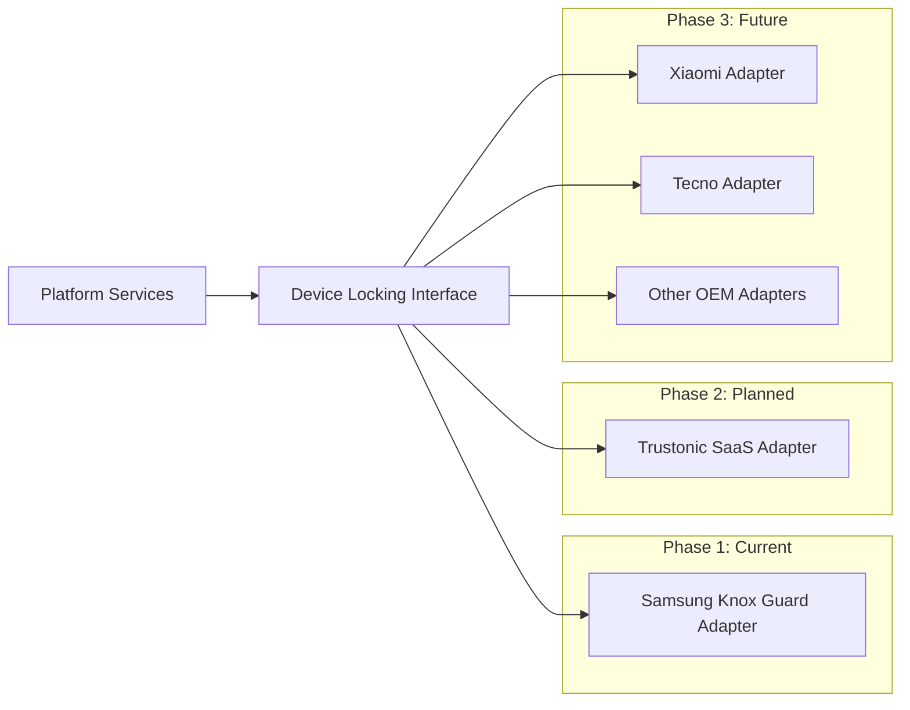
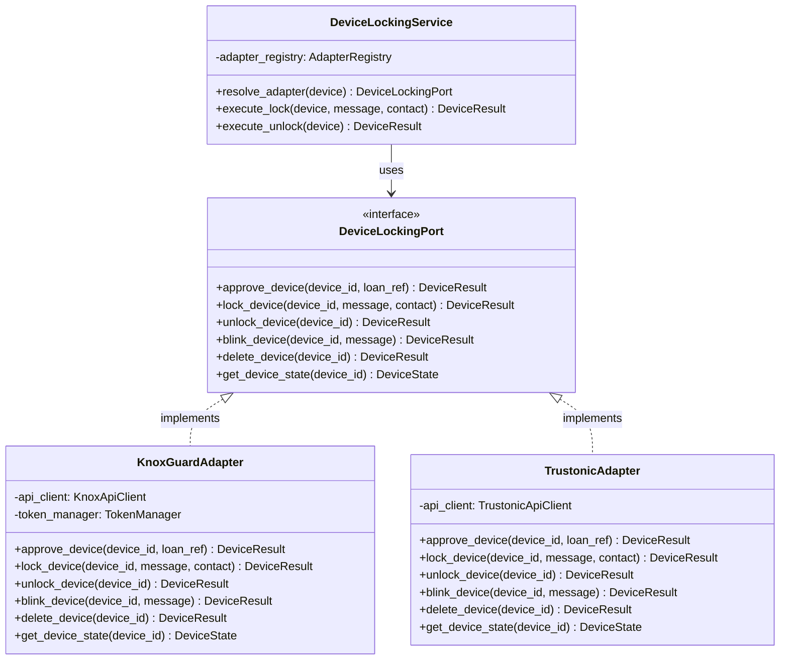

# Device Locking Strategy

## Overview

This document describes the device locking strategy for the IInovi device financing platform. Device locking is the primary mechanism that secures financed devices against non-payment, providing both a deterrent and an enforcement tool throughout the loan lifecycle.

The platform adopts a phased approach: Samsung Knox Guard as the initial implementation, with an extensible adapter architecture that supports future expansion to additional OEM-direct and third-party locking solutions.

---

## Decision Rationale

### Why Samsung Knox Guard First

Samsung Knox Guard was selected as the first device locking integration based on the following criteria:

1. **Market alignment** -- Samsung holds a dominant share in the target markets for device financing (sub-Saharan Africa, Southeast Asia, Latin America). Covering Samsung devices first maximizes portfolio reach with a single integration.
2. **OEM-direct integration** -- Knox Guard is built into Samsung device firmware. It cannot be bypassed by factory reset, ROM flashing, or app uninstallation, providing the strongest possible lock enforcement.
3. **Mature REST API** -- The Knox Guard API (v1.1.3) is well-documented, supports bulk operations, and provides granular device state management aligned with lending use cases.
4. **Policy richness** -- Knox Guard supports SIM control, offline auto-lock, blink reminders, custom lock screen messaging, and a device management app slot -- all critical for a financing workflow.
5. **Financing-specific design** -- The Normal tenant type in Knox Guard was purpose-built for device financing programs, with states that map directly to a loan lifecycle.

### Why Not Start With a Third-Party Solution

Third-party platforms such as Trustonic SaaS offer OEM-agnostic locking, but:

- They require an agent app installation, which users may uninstall or circumvent on non-Samsung devices.
- They add a dependency on a third-party vendor between the platform and the OEM.
- Samsung Knox Guard provides stronger enforcement guarantees for Samsung devices than any third-party overlay.

Trustonic remains the planned solution for non-Samsung OEMs that lack a direct locking API.

---

## Solution Comparison

| Criterion | Samsung Knox Guard | Trustonic SaaS | Other OEM-Direct |
|---|---|---|---|
| **Implementation Phase** | Phase 1 (current) | Phase 2 (planned) | Phase 3 (planned) |
| **Integration Type** | OEM-direct, firmware-level | Third-party SaaS agent | OEM-direct (varies) |
| **API** | REST API v1.1.3 | REST API | Varies by OEM |
| **Device Coverage** | Samsung only | OEM-agnostic (Android) | Xiaomi, Tecno, others |
| **Lock Strength** | Firmware-level; survives factory reset | App-level; varies by device | Firmware-level (where supported) |
| **SIM Control** | Yes (MCC/MNC allowlist) | Limited | Varies |
| **Offline Lock** | Yes (configurable 3--200 days) | Yes | Varies |
| **Lock Screen App** | Yes (Device Management App) | Yes | Varies |
| **Bulk Operations** | Up to 10,000 devices via CSV | Yes | Varies |
| **Maturity** | Production-proven | Production-proven | Emerging |

---

## Knox Guard Tenant Types

Knox Guard supports three tenant types. The IInovi platform uses the **Normal** tenant type.

| Tenant Type | Starting State | Lock Trigger | Use Case |
|---|---|---|---|
| **Normal** | Active (unlocked) | Platform locks on overdue | Device financing, lease-to-own |
| **MSaaS** | Locked | Platform unlocks on payment | Mobile-as-a-Service subscription |
| **BYOD** | Active | N/A | Enterprise device management |

### Normal Tenant Type Behavior

Under the Normal tenant type:

- Devices start in the **Active** (unlocked) state after enrollment.
- The platform explicitly calls the Lock Device API when payment becomes overdue and escalation rules are met.
- The platform calls the Unlock Device API when payment is received while the device is locked.
- The platform calls the Delete Device API when the loan is fully paid, permanently removing device management.

This model aligns with the standard device financing flow where the customer has full use of the device while current on payments, and the device is locked only as a collection enforcement action.

---

## Knox Guard Advantages for Device Financing

| Advantage | Description |
|---|---|
| **Factory-reset resistant** | Lock state persists through device resets, preventing circumvention. |
| **SIM swap detection** | Unauthorized SIM changes trigger automatic lock, countering resale fraud. |
| **Offline enforcement** | Devices that go offline for a configurable period are automatically locked when they reconnect. |
| **Blink reminders** | Non-dismissible on-screen messages serve as pre-lock payment reminders. |
| **Custom lock screen** | Lock screen displays lender contact information and reason for lock. |
| **Device Management App** | A lender-branded app remains accessible on the lock screen for customer self-service. |
| **Granular state model** | Device states (Pending, Active, Blinked, Locked, Completed) map directly to loan lifecycle stages. |
| **Bulk operations** | Lock or unlock up to 10,000 devices in a single API call for portfolio-level actions. |

---

## Migration Path to Multi-OEM Support

### Phase 1 -- Samsung Knox Guard (Current)

- Implement the Knox Guard adapter against the `DeviceLockingPort` interface.
- Cover all Samsung devices in the portfolio.
- Validate the full lock/unlock/dunning workflow in production.

### Phase 2 -- Trustonic SaaS

- Implement a Trustonic adapter for non-Samsung Android devices.
- Route locking commands through the adapter based on device manufacturer.
- Maintain unified lock/unlock semantics across adapters.

### Phase 3 -- Additional OEM-Direct Integrations

- As volume in specific OEM brands grows, evaluate whether a direct OEM integration (e.g., Xiaomi, Tecno) provides stronger enforcement than the Trustonic agent.
- Implement additional adapters without modifying platform business logic.

---

## Adapter Pattern for Device Locking

The platform uses a port-and-adapter (hexagonal) architecture for device locking. All locking operations are defined in a `DeviceLockingPort` interface. Each OEM or third-party integration implements this interface as an adapter.

### Adapter Resolution

The `DeviceLockingService` resolves the correct adapter at runtime based on the device manufacturer stored in the device record:

| Manufacturer | Adapter |
|---|---|
| Samsung | `KnoxGuardAdapter` |
| Other (Phase 2) | `TrustonicAdapter` |
| Xiaomi (Phase 3) | `XiaomiAdapter` or `TrustonicAdapter` |

### Interface Contract

Every adapter must fulfill the following contract:

- **Idempotency** -- Repeated calls with the same parameters produce the same result without side effects.
- **State mapping** -- The adapter translates OEM-specific device states into the platform's canonical device states.
- **Error normalization** -- OEM-specific errors are translated into platform-standard error codes.
- **Audit logging** -- Every operation is logged with timestamp, device ID, operation, result, and correlation ID.

---

## Related Documents

- [Knox Guard Integration Design](knox-guard-integration.md)
- [Knox Guard Policy Configuration](knox-guard-policies.md)
- [IMEI Registration and Verification](imei-registration.md)
- [Device Management App](device-management-app.md)
- [Lock/Unlock and Dunning Integration](lock-unlock-dunning.md)
