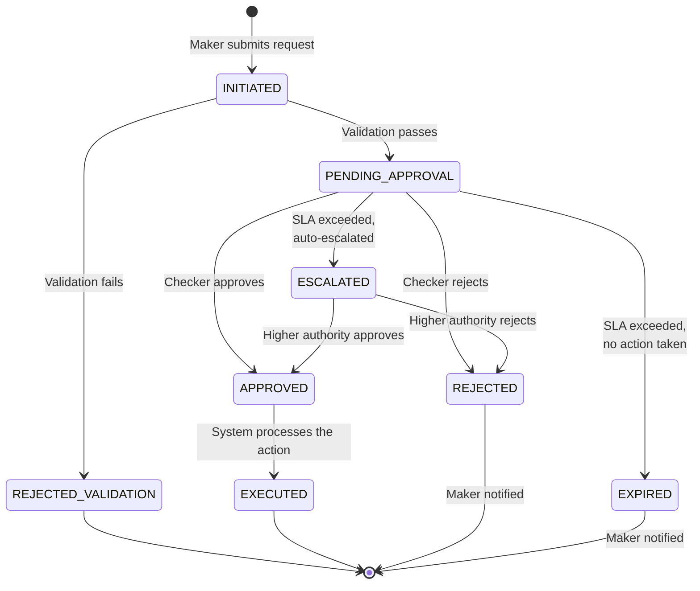

# Business Rules

## Overview

This document defines the business rules governing the Mobile Device Lending Solution. Business rules are the configurable policies and constraints that control loan origination, servicing, collections, and lifecycle management. These rules are enforced by the platform's rule engine and are configurable per product, partner, and financer.

Rules are organized by functional domain and include the rule identifier, description, parameters, and default values.

---

## 1. Eligibility Rules

Eligibility rules determine whether a customer qualifies for a device financing loan.

### 1.1 Customer Eligibility

| Rule ID | Rule Name | Description | Parameters | Default |
|---|---|---|---|---|
| `ELIG-001` | **Minimum Age** | Customer must meet minimum age requirement. | `min_age` (years) | 18 |
| `ELIG-002` | **Identity Verification** | Customer must have a verified national ID or passport. | `id_types_accepted` | National ID, Passport |
| `ELIG-003` | **Mobile Money Account** | Customer must have an active mobile money account with the required provider. | `required_providers` | Safaricom M-Pesa, Airtel Money, MTN MoMo |
| `ELIG-004` | **CRB Check** | Customer must pass a Credit Reference Bureau check. | `crb_check_required` (bool), `max_negative_listings` | Required, 0 |
| `ELIG-005` | **Credit Score Threshold** | Customer's credit score must meet or exceed the minimum threshold. | `min_credit_score`, `scoring_model` | 400, Internal Model v2 |
| `ELIG-006` | **Maximum Active Loans** | Customer cannot have more than the allowed number of active loans on the platform. | `max_active_loans` | 1 |
| `ELIG-007` | **Maximum Exposure** | Total outstanding exposure for a single customer cannot exceed the defined limit. | `max_exposure_amount`, `currency` | KES 100,000 |
| `ELIG-008` | **Existing Default** | Customer with an active default on the platform is ineligible. | `block_if_default` (bool) | true |
| `ELIG-009` | **Blacklist Check** | Customer must not appear on the platform's internal blacklist. | `check_blacklist` (bool) | true |
| `ELIG-010` | **KYC Completeness** | All required KYC fields must be populated and verified. | `required_kyc_fields` | Name, ID, DOB, Phone, Address |
| `ELIG-011` | **Cooling Period** | Customer who defaulted on a previous loan must wait a minimum period before reapplying. | `cooling_period_days` | 180 |
| `ELIG-012` | **Minimum Mobile Money History** | Customer's mobile money account must have a minimum transaction history. | `min_history_months` | 3 |

### 1.2 Eligibility Evaluation Flow

```
FUNCTION evaluate_eligibility(customer, product):

  FOR EACH rule IN eligibility_rules:
    result = evaluate(rule, customer, product)
    IF result == FAIL:
      RETURN {
        eligible: false,
        failed_rule: rule.id,
        reason: rule.failure_message
      }

  RETURN {
    eligible: true,
    credit_score: customer.credit_score,
    max_approved_amount: calculate_max_amount(customer)
  }
```

### 1.3 Eligibility Override

In exceptional circumstances, certain eligibility rules can be overridden with appropriate approval:

| Rule | Overridable | Approval Level |
|---|---|---|
| `ELIG-001` (Age) | No | -- |
| `ELIG-002` (ID Verification) | No | -- |
| `ELIG-004` (CRB Check) | Yes | Head of Credit |
| `ELIG-005` (Credit Score) | Yes | Head of Credit |
| `ELIG-006` (Max Active Loans) | No | -- |
| `ELIG-007` (Max Exposure) | Yes | CFO |
| `ELIG-008` (Existing Default) | No | -- |
| `ELIG-009` (Blacklist) | Yes | Head of Credit + Compliance |

---

## 2. Product Selection Rules

Product selection rules govern which loan products are available for a given combination of customer, partner, and device.

| Rule ID | Rule Name | Description | Parameters |
|---|---|---|---|
| `PROD-001` | **Product Status** | Only products with status `ACTIVE` can be used for new originations. | `required_status` = ACTIVE |
| `PROD-002` | **Product Effective Date** | Loan origination date must fall within the product's effective date range. | `effective_date`, `end_date` |
| `PROD-003` | **Partner Assignment** | Product must be assigned to the originating partner with status `ACTIVE`. | `partner_product_mapping` |
| `PROD-004` | **Device Assignment** | The selected device model must be assigned to the product-partner combination with status `ACTIVE`. | `device_product_partner_mapping` |
| `PROD-005` | **Financer Active** | The product's linked financer must have status `ACTIVE`. | `financer_status` = ACTIVE |
| `PROD-006` | **Credit Line Available** | The financer must have sufficient available credit line for the loan amount. | `available_credit >= loan_amount` |
| `PROD-007` | **Principal Range** | The calculated principal must fall within the product's min/max principal range. | `min_principal`, `max_principal` |
| `PROD-008` | **Customer Tier Match** | If the product has customer tier restrictions (e.g., repeat customers only), the customer must meet the tier requirement. | `required_customer_tier` |

### Product Selection Flow

```
FUNCTION select_available_products(customer, partner, device):

  products = get_all_products()

  available = products
    .filter(p => p.status == ACTIVE)                          // PROD-001
    .filter(p => today BETWEEN p.effective_date AND p.end_date)  // PROD-002
    .filter(p => p.partners.includes(partner) AND mapping.active)  // PROD-003
    .filter(p => p.devices.includes(device) AND mapping.active)    // PROD-004
    .filter(p => p.financer.status == ACTIVE)                      // PROD-005
    .filter(p => p.financer.available_credit >= device.price - deposit)  // PROD-006
    .filter(p => principal BETWEEN p.min_principal AND p.max_principal)   // PROD-007
    .filter(p => customer.tier >= p.required_customer_tier)        // PROD-008

  RETURN available.sort_by(priority)
```

---

## 3. Deposit Rules

Deposit rules define how the customer's upfront payment is calculated and validated.

| Rule ID | Rule Name | Description | Parameters | Default |
|---|---|---|---|---|
| `DEP-001` | **Deposit Required** | Whether a deposit must be collected before device issuance. | `deposit_required` (bool) | true |
| `DEP-002` | **Deposit Type** | How the deposit amount is determined. | `deposit_type`: `FIXED_AMOUNT` or `PERCENTAGE` | PERCENTAGE |
| `DEP-003` | **Deposit Value** | The deposit amount (fixed) or percentage (of device price). | `deposit_value` | 20% |
| `DEP-004` | **Minimum Deposit** | Floor for deposit amount (applies when type is PERCENTAGE). | `min_deposit_amount` | KES 2,000 |
| `DEP-005` | **Maximum Deposit** | Ceiling for deposit amount. | `max_deposit_amount` | 80% of device price |
| `DEP-006` | **Deposit Rounding** | Deposit is rounded to the nearest whole currency unit. | `rounding_method` | Round up to nearest 100 |
| `DEP-007` | **Deposit Payment Method** | Accepted payment methods for deposit. | `accepted_methods` | Mobile Money only |
| `DEP-008` | **Deposit Timeout** | Time allowed for customer to complete deposit payment. | `timeout_minutes` | 15 |
| `DEP-009` | **Deposit Refund** | Deposit is non-refundable once device is issued. Refundable only if loan is cancelled before device issuance. | `refundable_before_issuance` (bool) | true |

### Deposit Calculation

```
FUNCTION calculate_deposit(product, device_price):

  IF product.deposit_type == FIXED_AMOUNT:
    deposit = product.deposit_value
  ELSE IF product.deposit_type == PERCENTAGE:
    deposit = device_price * product.deposit_value / 100

  deposit = MAX(deposit, product.min_deposit_amount)    // Apply floor
  deposit = MIN(deposit, device_price * product.max_deposit_pct / 100)  // Apply ceiling

  deposit = ROUND_UP(deposit, product.rounding_unit)    // Round

  RETURN deposit
```

### Deposit Percentage Tiers

Some products use tiered deposit percentages based on device price or customer tier:

| Device Price Range | Standard Deposit | Silver Tier | Gold Tier |
|---|---|---|---|
| KES 0 - 15,000 | 30% | 25% | 20% |
| KES 15,001 - 30,000 | 20% | 18% | 15% |
| KES 30,001 - 50,000 | 25% | 22% | 18% |
| KES 50,001+ | 30% | 28% | 25% |

---

## 4. Interest Rules

Interest rules define how interest is calculated and applied per product configuration.

| Rule ID | Rule Name | Description | Parameters |
|---|---|---|---|
| `INT-001` | **Interest Applicability** | Whether the product charges interest. | `has_interest` (bool) |
| `INT-002` | **Interest Type** | Calculation method. | `interest_type`: `FLAT` or `REDUCING_BALANCE` |
| `INT-003` | **Interest Rate** | The rate value and the period it applies to. | `interest_rate`, `interest_rate_frequency` |
| `INT-004` | **Grace Period Interest** | Whether interest accrues during the grace period. | `grace_period_interest_accrual` (bool) |
| `INT-005` | **Interest Cap** | Maximum total interest as a percentage of principal. | `max_interest_pct_of_principal` |
| `INT-006` | **Interest Rebate on Early Settlement** | Whether an interest rebate is granted for early settlement. | `early_settlement_rebate` (bool), `rebate_method` |
| `INT-007` | **Interest Display** | APR equivalent must be disclosed to the customer. | `display_apr` (bool) |
| `INT-008` | **Interest Rounding** | Interest amounts are rounded to the nearest whole currency unit. | `rounding_method` |

### Interest Rate Constraints

| Constraint | Description | Value |
|---|---|---|
| **Regulatory Maximum** | Maximum allowable interest rate per applicable regulation. | Per jurisdiction |
| **Product Maximum** | Maximum rate configurable per product. | Defined at product level |
| **Minimum Rate** | Minimum non-zero rate (to prevent configuration errors). | 0.01% per period |

---

## 5. Grace Period Rules

Grace period rules define the buffer period between loan activation and the first instalment due date, and the buffer after each due date before a payment is considered late.

| Rule ID | Rule Name | Description | Parameters | Default |
|---|---|---|---|---|
| `GRACE-001` | **Initial Grace Period** | Number of days/weeks after loan activation before the first instalment is due. | `initial_grace_value`, `initial_grace_unit` | 1 day |
| `GRACE-002` | **Payment Grace Period** | Number of days after an instalment due date before it is classified as overdue. | `payment_grace_days` | 0 (due date is strict) |
| `GRACE-003` | **Grace Period Interest** | Whether interest accrues during the initial grace period. | `grace_interest_accrual` (bool) | false |
| `GRACE-004` | **Grace Period Extension** | Whether the grace period can be extended (e.g., for restructuring). | `max_extension_days` | 7 |
| `GRACE-005` | **Weekend/Holiday Adjustment** | Whether due dates falling on weekends or holidays are shifted to the next business day. | `adjust_for_non_business_days` (bool) | false (daily products), true (weekly/monthly) |

---

## 6. Dunning Rules

Dunning rules control the escalation of collection efforts for overdue loans.

| Rule ID | Rule Name | Description | Parameters | Default |
|---|---|---|---|---|
| `DUN-001` | **Dunning Enabled** | Whether automated dunning is active for this product. | `dunning_enabled` (bool) | true |
| `DUN-002` | **SMS Reminder Threshold** | DPD threshold for sending SMS reminders. | `sms_start_dpd` | 1 |
| `DUN-003` | **Phone Call Threshold** | DPD threshold for initiating phone calls. | `call_start_dpd` | 7 |
| `DUN-004` | **Knox Guard Warning** | DPD threshold for displaying a warning message on the device. | `warning_dpd` | 7 |
| `DUN-005` | **Knox Guard Lock** | DPD threshold for locking the device. | `lock_dpd` | 14 |
| `DUN-006` | **Knox Guard Unlock** | Unlock is triggered when overdue amount is fully paid. | `unlock_on_payment` (bool) | true |
| `DUN-007` | **Field Visit Threshold** | DPD threshold for scheduling a field visit. | `field_visit_dpd` | 30 |
| `DUN-008` | **Default Classification** | DPD threshold for classifying the loan as in default. | `default_dpd` | 90 |
| `DUN-009` | **CRB Negative Listing** | DPD threshold for submitting a negative listing to CRB. | `crb_listing_dpd` | 90 |
| `DUN-010` | **Maximum SMS Per Day** | Maximum reminder SMS messages per customer per day. | `max_sms_daily` | 2 |
| `DUN-011` | **Quiet Hours** | Time window during which no calls or SMS are sent. | `quiet_start`, `quiet_end` | 21:00 - 07:00 |
| `DUN-012` | **PTP Deferral** | Active promise-to-pay defers escalation. | `ptp_defers_escalation` (bool), `max_deferral_days` | true, 7 |
| `DUN-013` | **Escalation Reset** | Full payment of overdue amount resets dunning to Tier 0. | `reset_on_full_payment` (bool) | true |
| `DUN-014` | **Partial Payment Effect** | Partial payment resets the frequency timer but does not change the dunning tier. | `partial_resets_frequency` (bool) | true |

### Dunning Escalation Matrix

```
Day 0:  Instalment due. Automated collection attempt.
Day 1:  DUN-002 triggers. SMS reminder sent.
Day 2:  SMS reminder sent.
Day 3:  SMS reminder sent.
Day 4:  SMS reminder sent.
Day 5:  SMS reminder sent.
Day 6:  SMS reminder sent.
Day 7:  DUN-003 triggers. Phone call by collections agent.
        DUN-004 triggers. Knox Guard warning displayed on device.
Day 8-13: Calls every 2 days + SMS.
Day 14: DUN-005 triggers. Device LOCKED via Knox Guard.
        Intense phone outreach.
Day 15-29: Calls every 3 days. Device remains locked.
Day 30: DUN-007 triggers. Field visit scheduled.
Day 31-59: Weekly follow-up (calls + field).
Day 60: Formal demand notice issued.
Day 61-89: Weekly follow-up. Write-off assessment begins.
Day 90: DUN-008 triggers. Loan classified as DEFAULT.
        DUN-009 triggers. CRB negative listing submitted.
        Write-off recommendation initiated.
```

---

## 7. Write-off Rules

Write-off rules define when and how a loan can be removed from the active portfolio as a credit loss.

| Rule ID | Rule Name | Description | Parameters | Default |
|---|---|---|---|---|
| `WO-001` | **Minimum DPD for Write-off** | Loan must be at least this many days past due before write-off is permitted. | `min_dpd` | 90 |
| `WO-002` | **Dunning Completion** | All applicable dunning tiers must have been executed before write-off. | `require_dunning_complete` (bool) | true |
| `WO-003` | **Approval Threshold - Tier 1** | Write-off amounts up to this threshold require Collections Manager approval. | `tier1_max_amount` | KES 10,000 |
| `WO-004` | **Approval Threshold - Tier 2** | Write-off amounts up to this threshold require Head of Credit approval. | `tier2_max_amount` | KES 50,000 |
| `WO-005` | **Approval Threshold - Tier 3** | Write-off amounts up to this threshold require CFO approval. | `tier3_max_amount` | KES 200,000 |
| `WO-006` | **Approval Threshold - Tier 4** | Write-off amounts above Tier 3 require Board/Credit Committee approval. | -- | -- |
| `WO-007` | **CRB Reporting** | Write-off must be reported to CRB within the defined number of business days. | `crb_report_days` | 5 |
| `WO-008` | **Knox Guard Release** | Device lock policy is removed upon write-off. | `release_on_writeoff` (bool) | true |
| `WO-009` | **Recovery Tracking** | Written-off loans remain in the recovery register for potential future collection. | `recovery_tracking_months` | 24 |
| `WO-010` | **Bulk Write-off** | Bulk write-off of multiple loans requires Credit Committee approval regardless of individual amounts. | `bulk_writeoff_approval` | Credit Committee |

---

## 8. Top-up Eligibility Rules

Top-up rules determine whether a customer qualifies for a repeat loan after completing a previous one.

| Rule ID | Rule Name | Description | Parameters | Default |
|---|---|---|---|---|
| `TOP-001` | **Previous Loan Completion** | Customer must have at least one fully completed loan (`PAID_OFF` or `EARLY_SETTLED`). | `min_completed_loans` | 1 |
| `TOP-002` | **Repayment Performance** | Maximum DPD experienced during the previous loan must not exceed the threshold. | `max_historical_dpd` | 7 |
| `TOP-003` | **No Active Loans** | Customer must not have any other active loans on the platform. | `max_active_loans` | 0 |
| `TOP-004` | **CRB Re-check** | A fresh CRB check must be performed and passed. | `crb_recheck_required` (bool) | true |
| `TOP-005` | **Waiting Period** | Minimum time after previous loan completion before a new loan can be originated. | `waiting_period_days` | 0 (immediate) |
| `TOP-006` | **Progressive Limit** | Maximum loan amount increases progressively with each successfully completed loan. | `progression_factor` | 1.5x previous principal |
| `TOP-007` | **Blacklist Re-check** | Customer must not be on the internal blacklist at the time of top-up application. | `recheck_blacklist` (bool) | true |
| `TOP-008` | **Deposit Discount** | Repeat customers may qualify for reduced deposit based on their tier. | `tier_deposit_discount` | See Deposit Percentage Tiers |

### Top-up Evaluation

```
FUNCTION evaluate_topup_eligibility(customer):

  completed_loans = get_completed_loans(customer)

  IF completed_loans.count < TOP-001.min_completed_loans:
    RETURN INELIGIBLE("No completed loans")

  last_loan = completed_loans.most_recent()

  IF last_loan.max_dpd > TOP-002.max_historical_dpd:
    RETURN INELIGIBLE("Poor repayment history")

  active_loans = get_active_loans(customer)
  IF active_loans.count > TOP-003.max_active_loans:
    RETURN INELIGIBLE("Active loan exists")

  IF days_since(last_loan.closed_date) < TOP-005.waiting_period_days:
    RETURN INELIGIBLE("Waiting period not met")

  crb_result = check_crb(customer)
  IF crb_result.status != PASS:
    RETURN INELIGIBLE("CRB check failed")

  tier = determine_tier(completed_loans)
  max_amount = last_loan.principal * TOP-006.progression_factor

  RETURN ELIGIBLE({
    tier: tier,
    max_principal: max_amount,
    deposit_discount: tier.deposit_discount,
    rate_discount: tier.rate_discount
  })
```

---

## 9. Maker-Checker Rules

Maker-checker rules define which operations require dual authorization (one person initiates, another approves) to prevent unauthorized actions and reduce fraud risk.

### Operations Requiring Maker-Checker

| Operation | Maker Role | Checker Role | SLA for Approval |
|---|---|---|---|
| **Loan Restructuring** | Collections Agent | Collections Supervisor | 4 hours |
| **Write-off** | Collections Agent | Approval Authority (by amount) | 24 hours |
| **Payment Reversal** | Finance Officer | Finance Manager | 2 hours |
| **Disbursement Reversal** | Operations Officer | Operations Manager | 4 hours |
| **Fee Waiver** | Collections Agent | Collections Supervisor | 4 hours |
| **Grace Period Extension** | Collections Agent | Collections Supervisor | 4 hours |
| **Eligibility Override** | Loan Officer | Head of Credit | 8 hours |
| **Product Activation** | Product Manager | Head of Product + Head of Credit | 24 hours |
| **Product Suspension** | Product Manager | Head of Product | 8 hours |
| **Partner Onboarding** | Partner Manager | Head of Partnerships | 24 hours |
| **Financer Credit Line Change** | Finance Officer | CFO | 24 hours |
| **Blacklist Addition** | Collections Agent | Collections Manager | 4 hours |
| **Blacklist Removal** | Compliance Officer | Head of Compliance | 8 hours |
| **Bulk Operations** | Operations Manager | Credit Committee | 48 hours |

### Maker-Checker Rules

| Rule ID | Rule Name | Description | Parameters |
|---|---|---|---|
| `MC-001` | **Self-Approval Prohibited** | The maker and checker must be different users. | -- |
| `MC-002` | **Role Separation** | The checker must have a role at or above the required approval level. | `required_role` per operation |
| `MC-003` | **SLA Enforcement** | Pending approvals that exceed the SLA are escalated to the next level. | `sla_hours` per operation |
| `MC-004` | **Expiry** | Approval requests expire after 72 hours if not actioned. Maker must resubmit. | `expiry_hours` = 72 |
| `MC-005` | **Audit Trail** | All maker-checker actions are recorded with full audit details. | -- |
| `MC-006` | **Notification** | Checker is notified immediately when an approval request is submitted. | `notification_channels` = Email, Dashboard |
| `MC-007` | **Rejection Reason** | Checker must provide a reason when rejecting a request. | `reason_required` (bool) = true |
| `MC-008` | **Re-submission** | A rejected request can be resubmitted with modifications, up to 3 times. | `max_resubmissions` = 3 |

### Maker-Checker Workflow



---

## Rule Configuration Management

### Rule Storage

All business rules are stored in a centralized rule configuration store with the following structure:

| Field | Type | Description |
|---|---|---|
| `rule_id` | String | Unique rule identifier (e.g., `ELIG-001`). |
| `rule_name` | String | Human-readable name. |
| `rule_domain` | Enum | `ELIGIBILITY`, `PRODUCT`, `DEPOSIT`, `INTEREST`, `GRACE_PERIOD`, `DUNNING`, `WRITE_OFF`, `TOP_UP`, `MAKER_CHECKER`. |
| `scope` | Enum | `GLOBAL` (applies to all), `PRODUCT` (per product), `PARTNER` (per partner), `FINANCER` (per financer). |
| `parameters` | JSON | Rule parameters and their current values. |
| `effective_date` | Date | Date from which the rule is in effect. |
| `end_date` | Date | Date after which the rule is no longer in effect (null = no end). |
| `version` | Integer | Version number (increments on each change). |
| `last_modified_by` | UUID | User who last modified the rule. |
| `last_modified_date` | DateTime | Date of last modification. |

### Rule Precedence

When rules exist at multiple scopes, the following precedence applies (most specific wins):

1. **Partner + Product override** (most specific)
2. **Product-level rule**
3. **Partner-level rule**
4. **Financer-level rule**
5. **Global rule** (least specific, default)

### Rule Change Control

All rule changes follow the maker-checker workflow:

1. Operations user modifies a rule parameter (maker).
2. Change is submitted for approval with a justification.
3. Authorized reviewer approves or rejects (checker).
4. Approved changes are effective from the specified `effective_date`.
5. All changes are logged in the audit trail with before/after values.
