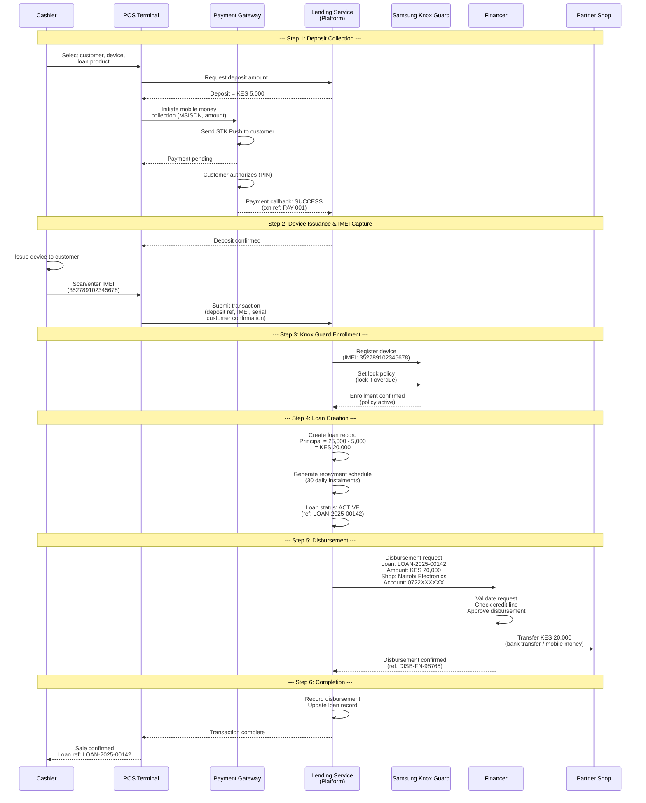
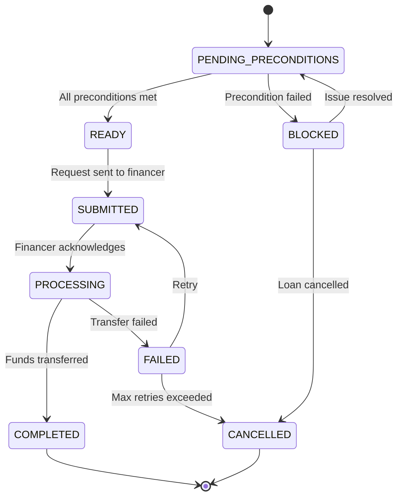

# Disbursement Flow

## Overview

Disbursement is the process by which the financer transfers funds to the partner shop to compensate for the device issued to a customer on credit. Disbursement occurs only after the point-of-sale (POS) terminal confirms that the device has been physically issued, the IMEI has been captured, and the customer deposit has been successfully collected.

This document covers the disbursement trigger conditions, the end-to-end disbursement sequence, error handling, and the financer entity model.

---

## Disbursement Trigger Conditions

Disbursement is initiated only when all of the following preconditions are satisfied:

| # | Precondition | Verification Source |
|---|---|---|
| 1 | Customer deposit has been collected and confirmed | Payment Gateway callback |
| 2 | Device IMEI has been captured at the POS | POS terminal submission |
| 3 | Knox Guard enrollment is confirmed for the IMEI | Knox Guard API response |
| 4 | Loan record has been created with a valid schedule | Lending Service |
| 5 | Partner shop is active and has a valid disbursement account | Partner management |
| 6 | Financer has sufficient approved credit line or funding | Financer configuration |
| 7 | Product-partner-device mapping is active | Product configuration |

If any precondition fails, the disbursement is blocked, and the specific failure reason is logged for operational review.

---

## Disbursement Sequence

The disbursement process follows a strict sequential flow to ensure that funds are only released after all validations pass.

### Step-by-Step Flow

1. **Cashier initiates sale**: Selects customer, device, and loan product at the POS terminal.
2. **Deposit collection**: POS triggers a mobile money deposit collection via the Payment Gateway. The customer authorizes the payment.
3. **Deposit confirmation**: Payment Gateway confirms the deposit. Platform records the payment.
4. **Device issuance**: Cashier physically hands the device to the customer and scans/enters the IMEI and serial number at the POS.
5. **POS submission**: POS submits the completed transaction to the platform (deposit reference, IMEI, serial number, customer signature confirmation).
6. **Knox Guard enrollment**: Platform registers the device IMEI with Samsung Knox Guard and sets the initial lock policy (device is unlocked; policy is "lock if overdue").
7. **Knox Guard confirmation**: Knox Guard confirms the device is enrolled and the policy is active.
8. **Loan creation**: Platform creates the loan record with the calculated principal, generated repayment schedule, and all associated metadata.
9. **Disbursement request**: Platform submits a disbursement request to the Financer system, including the loan reference, partner shop payment details, and the disbursement amount.
10. **Financer processing**: Financer validates the request, approves it, and initiates the fund transfer to the partner shop.
11. **Disbursement confirmation**: Financer confirms the transfer with a transaction reference and timestamp.
12. **Platform update**: Platform records the disbursement confirmation against the loan, updating the loan's disbursement status.

### Disbursement Amount Calculation

```
Disbursement Amount = Device Value - Customer Deposit

Where:
  Device Value = Agreed price between financer and partner
                 (may be retail price, wholesale price, or a contractual price)
  Customer Deposit = Confirmed deposit amount collected via mobile money
```

In some financer arrangements, the disbursement amount may differ:

| Model | Disbursement Amount | Description |
|---|---|---|
| **Full Retail** | Device retail price - deposit | Financer covers the full retail shortfall. |
| **Wholesale** | Device wholesale price - deposit | Financer covers wholesale cost; partner margin is in the retail-wholesale spread (collected via deposit). |
| **Fixed Contract** | Agreed contract price - deposit | Fixed price per device model regardless of retail price. |

---

## Disbursement Sequence Diagram



---

## Disbursement Status Tracking

Each disbursement request progresses through the following states:



| Status | Description |
|---|---|
| `PENDING_PRECONDITIONS` | Waiting for all trigger conditions to be met (deposit, IMEI, Knox Guard). |
| `READY` | All preconditions satisfied; disbursement request is queued for submission. |
| `SUBMITTED` | Disbursement request has been sent to the financer. |
| `PROCESSING` | Financer has acknowledged and is processing the transfer. |
| `COMPLETED` | Funds have been successfully transferred to the partner shop. |
| `FAILED` | Transfer failed. Eligible for retry based on failure reason. |
| `BLOCKED` | One or more preconditions failed. Requires manual intervention. |
| `CANCELLED` | Disbursement permanently cancelled (loan cancelled or max retries exceeded). |

---

## Failed Disbursement Handling

### Failure Reasons

| Failure Code | Description | Retryable | Action |
|---|---|---|---|
| `INSUFFICIENT_FUNDS` | Financer credit line exhausted | No | Notify financer; block until resolved. |
| `INVALID_ACCOUNT` | Partner shop account details invalid | No | Flag for partner data correction. |
| `NETWORK_ERROR` | Communication failure with financer | Yes | Auto-retry with exponential backoff. |
| `TIMEOUT` | Financer did not respond within SLA | Yes | Auto-retry; escalate after 3 attempts. |
| `REJECTED` | Financer rejected the request (policy) | No | Manual review required. |
| `DUPLICATE` | Duplicate disbursement detected | No | Verify original; no action if already completed. |

### Retry Policy

| Parameter | Value |
|---|---|
| Maximum retries | 3 |
| Retry interval | Exponential backoff: 5 min, 15 min, 60 min |
| Retry window | 24 hours from initial attempt |
| Escalation | After max retries, alert operations team and financer relationship manager |

### Impact of Failed Disbursement on Loan

- The loan record remains `ACTIVE` regardless of disbursement status. The customer's repayment obligation begins from loan creation.
- A failed disbursement does not affect the customer's repayment schedule.
- The platform carries the disbursement risk until the transfer is completed.
- If disbursement is permanently cancelled, the loan must be reviewed for potential reversal (device recall or manual settlement with the partner).

---

## Settlement Reconciliation

Settlement ensures that disbursements made by the financer are reconciled against repayments collected by the platform.

### Daily Reconciliation Flow

1. Platform generates a daily disbursement report listing all completed disbursements.
2. Financer receives the report and reconciles against their outgoing transfers.
3. Discrepancies are flagged and assigned to the reconciliation team.
4. Resolution SLA: 48 hours for financial discrepancies.

### Settlement Report Fields

| Field | Description |
|---|---|
| `loan_reference` | Platform loan ID |
| `financer_reference` | Financer's internal transaction ID |
| `disbursement_date` | Date funds were transferred |
| `disbursement_amount` | Amount transferred to partner shop |
| `partner_name` | Receiving partner shop |
| `partner_account` | Account that received the funds |
| `device_imei` | IMEI of the financed device |
| `customer_reference` | Customer identifier (anonymized) |
| `settlement_status` | `RECONCILED`, `PENDING`, `DISPUTED` |

---

## Financer Entity Model

The financer (lender) is the entity that provides capital for device financing. The platform supports multiple financers, each with their own configuration, products, and partner relationships.

### Financer Profile

| Field | Type | Description |
|---|---|---|
| `financer_id` | UUID | Unique identifier. |
| `financer_name` | String | Legal entity name. |
| `financer_code` | String | Short code for internal reference (e.g., `FIN-EQUITY`, `FIN-TALA`). |
| `registration_number` | String | Business registration / license number. |
| `tax_id` | String | Tax identification number. |
| `contact_name` | String | Primary contact person. |
| `contact_email` | String | Primary contact email. |
| `contact_phone` | String | Primary contact phone number. |
| `address` | Object | Registered business address. |
| `status` | Enum | `ACTIVE`, `SUSPENDED`, `TERMINATED`. |
| `onboarding_date` | Date | Date the financer was onboarded. |
| `agreement_reference` | String | Reference to the signed financing agreement. |

### Bank / Disbursement Details

| Field | Type | Description |
|---|---|---|
| `settlement_account_type` | Enum | `BANK_ACCOUNT`, `MOBILE_MONEY`, `PLATFORM_WALLET`. |
| `bank_name` | String | Bank name (if bank account). |
| `bank_branch` | String | Branch name or code. |
| `account_number` | String | Bank account number. |
| `account_name` | String | Name on the account. |
| `swift_code` | String | SWIFT/BIC code (for international transfers). |
| `mobile_money_provider` | String | Provider name (if mobile money). |
| `mobile_money_number` | String | Mobile money account number. |

### Linked Products

| Field | Type | Description |
|---|---|---|
| `product_id` | UUID | Reference to the loan product. |
| `product_code` | String | Product short code. |
| `effective_date` | Date | Date the product was linked. |
| `credit_line_limit` | Decimal | Maximum outstanding disbursement exposure. |
| `current_exposure` | Decimal | Current outstanding disbursements. |
| `available_credit` | Decimal | `credit_line_limit - current_exposure`. |

### Linked Partners

| Field | Type | Description |
|---|---|---|
| `partner_id` | UUID | Reference to the partner shop. |
| `partner_name` | String | Partner shop name. |
| `disbursement_account` | Object | Partner's account details for receiving disbursements. |
| `status` | Enum | `ACTIVE`, `SUSPENDED`. |

### Financer Entity Relationships

```
Financer
  |
  +-- Profile (legal details, contacts)
  |
  +-- Bank Details (settlement accounts)
  |
  +-- Products[] (linked loan products)
  |     |-- credit_line_limit
  |     |-- current_exposure
  |     +-- available_credit
  |
  +-- Partners[] (approved partner shops)
  |     |-- disbursement_account
  |     +-- status
  |
  +-- Disbursements[] (historical record)
  |     |-- loan_reference
  |     |-- amount
  |     |-- date
  |     +-- status
  |
  +-- Settlements[] (periodic settlements received)
        |-- period
        |-- amount
        |-- report_reference
        +-- status
```

---

## Disbursement SLAs

| Metric | Target | Measurement |
|---|---|---|
| Time from POS confirmation to disbursement request | Less than 5 minutes | Automated, near real-time. |
| Financer processing time | Less than 4 hours | Depends on financer's internal process. |
| End-to-end disbursement (POS to partner receipt) | Same business day | Target for bank transfers; instant for mobile money. |
| Failed disbursement retry resolution | Within 24 hours | Auto-retry + manual escalation. |
| Reconciliation discrepancy resolution | Within 48 hours | Manual review process. |
