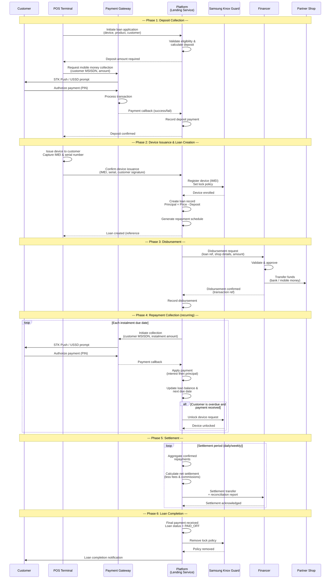

# Financial Flows

## Overview

This document describes the end-to-end financial flows within the Mobile Device Lending Solution. The platform facilitates device financing by coordinating money movement between customers, partner shops, financers, and the platform itself. All customer-facing monetary interactions (deposits and repayments) are conducted via mobile money, while financer disbursements and settlements flow through bank or mobile money channels.

---

## Flow Participants

| Participant | Role |
|---|---|
| **Customer** | End consumer acquiring a device on credit. Pays deposit and subsequent repayments via mobile money. |
| **Partner Shop** | Retail point of sale. Issues the device, captures IMEI, confirms transaction via POS terminal. Receives disbursement from financer. |
| **Platform** | Orchestrates the lending process. Manages loan creation, repayment collection, reconciliation, and settlement. |
| **Payment Gateway** | Processes mobile money transactions for deposits and repayments. Provides callback notifications. |
| **Financer / Lender** | Provides the capital for device financing. Disburses funds to the partner shop and receives periodic settlement from the platform. |
| **Samsung Knox Guard** | Device management service. Locks/unlocks devices based on repayment status. |

---

## End-to-End Financial Flow

### 1. Deposit Collection

The deposit is the customer's upfront contribution toward the device purchase. It is collected at the point of sale before the device is issued.

**Flow:**

1. Cashier selects the device, loan product, and customer at the POS terminal.
2. POS calculates the required deposit amount based on the loan product configuration.
3. POS initiates a mobile money collection request via the Payment Gateway.
4. Customer receives an STK push (or USSD prompt) on their mobile phone.
5. Customer authorizes the payment by entering their mobile money PIN.
6. Payment Gateway processes the transaction and sends a callback to the platform.
7. Platform records the deposit as a confirmed payment against the pending loan application.

**Key Rules:**

- Deposit must be confirmed before the device can be issued.
- Deposit amount is determined by the loan product (fixed amount or percentage of device value).
- Failed deposit payments can be retried; no device issuance occurs until confirmation.

### 2. Loan Creation

Once the deposit is confirmed and the device is physically issued (IMEI captured), the platform creates the loan record.

**Flow:**

1. POS confirms device issuance with captured IMEI and serial number.
2. Platform validates all preconditions: deposit confirmed, IMEI recorded, Knox Guard enrollment verified.
3. Platform creates the loan record:
   - **Principal** = Device retail price - Deposit amount
   - Repayment schedule is generated based on the loan product configuration (tenor, frequency, interest).
4. Platform registers the IMEI with Knox Guard and sets the initial lock policy.
5. Loan status is set to `ACTIVE`.

### 3. Disbursement

Disbursement is the transfer of funds from the financer to the partner shop. This compensates the shop for the device that has been issued to the customer on credit.

**Flow:**

1. Platform submits a disbursement request to the Financer, including loan reference, partner shop bank/mobile money details, and the disbursement amount.
2. Disbursement amount = Device wholesale/retail value - Deposit (as per financer agreement).
3. Financer processes the transfer to the partner shop's designated account.
4. Financer confirms disbursement with a transaction reference.
5. Platform records the disbursement against the loan and updates the loan status.

**Key Rules:**

- Disbursement is triggered only after POS confirmation (device issued, IMEI captured, deposit collected).
- No disbursement occurs for cancelled or rejected applications.
- Failed disbursements are retried according to the financer's retry policy.
- See [Disbursement Flow](./disbursement-flow.md) for the detailed process.

### 4. Repayment Collection

Repayments are periodic payments made by the customer to repay the loan principal (and interest, if applicable). These are collected via mobile money.

**Flow:**

1. Platform generates the repayment schedule at loan creation, with due dates and instalment amounts.
2. On each due date (or as configured), the platform initiates an automated mobile money collection via the Payment Gateway.
3. Customer receives an STK push or payment reminder notification.
4. Customer authorizes the payment.
5. Payment Gateway processes the transaction and sends a callback to the platform.
6. Platform applies the payment to the loan:
   - Interest portion (if applicable) is applied first.
   - Remaining amount is applied to principal.
7. Platform updates the loan balance, next due date, and payment status.
8. If the customer is overdue, a successful payment may trigger a Knox Guard unlock request.

**Collection Methods:**

| Method | Description |
|---|---|
| **Automated STK Push** | System-initiated collection on the due date. Primary method. |
| **Customer-Initiated** | Customer pays via USSD/app using a reference number. |
| **Manual Override** | Support agent initiates a collection for a specific amount. |

### 5. Settlement

Settlement is the periodic transfer of collected repayments from the platform to the financer. This is how the financer recovers the disbursed capital plus any agreed returns.

**Flow:**

1. Platform aggregates all confirmed repayments for a settlement period (daily, weekly, or as agreed).
2. Platform calculates the settlement amount:
   - Total repayments collected
   - Less: Platform fees / commission (if applicable)
   - Less: Insurance premiums (if applicable)
   - Net settlement amount to financer
3. Platform generates a settlement report with transaction-level detail.
4. Platform initiates the settlement transfer to the financer's bank account.
5. Financer confirms receipt and reconciles against their records.

**Settlement Reconciliation:**

- Each settlement includes a detailed breakdown per loan.
- Discrepancies are flagged and resolved within a defined SLA.
- Platform provides a self-service settlement dashboard for financers.

---

## Comprehensive Financial Flow Diagram

---

## Accounting Entries Overview

The platform maintains a double-entry accounting ledger for all financial transactions. Below are the key accounting entries for each stage of the financial flow.

### Chart of Accounts (Relevant Entries)

| Account Code | Account Name | Type |
|---|---|---|
| 1100 | Customer Deposits Receivable | Asset |
| 1200 | Loan Portfolio (Principal Outstanding) | Asset |
| 1300 | Financer Settlement Receivable | Asset |
| 1400 | Mobile Money Float | Asset |
| 2100 | Customer Deposit Liability | Liability |
| 2200 | Financer Payable | Liability |
| 2300 | Settlement Payable to Financer | Liability |
| 3100 | Platform Fee Income | Revenue |
| 3200 | Interest Income | Revenue |
| 3300 | Late Fee Income | Revenue |
| 4100 | Insurance Premium Expense | Expense |
| 4200 | Bad Debt Expense (Write-offs) | Expense |

### Deposit Collection

| Entry | Debit | Credit | Amount |
|---|---|---|---|
| Deposit received via mobile money | Mobile Money Float (1400) | Customer Deposit Liability (2100) | Deposit amount |
| Deposit applied to loan | Customer Deposit Liability (2100) | Customer Deposits Receivable (1100) | Deposit amount |

### Loan Creation

| Entry | Debit | Credit | Amount |
|---|---|---|---|
| Loan principal recognized | Loan Portfolio (1200) | Financer Payable (2200) | Principal (device price - deposit) |

### Disbursement

| Entry | Debit | Credit | Amount |
|---|---|---|---|
| Financer disburses to partner shop | Financer Payable (2200) | Financer Settlement Receivable (1300) | Disbursement amount |

### Repayment Collection

| Entry | Debit | Credit | Amount |
|---|---|---|---|
| Repayment received via mobile money | Mobile Money Float (1400) | Loan Portfolio (1200) | Principal portion |
| Interest portion (if applicable) | Mobile Money Float (1400) | Interest Income (3200) | Interest portion |
| Late fee (if applicable) | Mobile Money Float (1400) | Late Fee Income (3300) | Late fee amount |

### Settlement to Financer

| Entry | Debit | Credit | Amount |
|---|---|---|---|
| Settlement payable recognized | Settlement Payable to Financer (2300) | Mobile Money Float (1400) | Gross collection |
| Platform fee deducted | Settlement Payable to Financer (2300) | Platform Fee Income (3100) | Fee amount |
| Net settlement transferred | Financer Settlement Receivable (1300) | Settlement Payable to Financer (2300) | Net settlement |

### Write-off

| Entry | Debit | Credit | Amount |
|---|---|---|---|
| Loan written off | Bad Debt Expense (4200) | Loan Portfolio (1200) | Outstanding balance |

---

## Transaction Lifecycle States

Every financial transaction progresses through the following states:

| State | Description |
|---|---|
| `INITIATED` | Transaction request created, pending submission to the payment provider. |
| `PENDING` | Submitted to the payment provider, awaiting customer action or processing. |
| `PROCESSING` | Payment provider is actively processing the transaction. |
| `COMPLETED` | Transaction successfully processed and confirmed. |
| `FAILED` | Transaction failed (insufficient funds, timeout, provider error). |
| `REVERSED` | A completed transaction that has been reversed/refunded. |
| `CANCELLED` | Transaction was cancelled before completion. |

---

## Reconciliation

### Daily Reconciliation Process

1. **Payment Gateway Reconciliation**: Compare platform transaction records against Payment Gateway settlement files. Flag mismatches.
2. **Financer Reconciliation**: Compare disbursement and settlement records against financer statements.
3. **Mobile Money Reconciliation**: Compare mobile money float balances against expected balances based on transactions.
4. **Exception Handling**: Unmatched transactions are escalated for manual review within 24 hours.

### Reconciliation Report Contents

- Total transactions by type (deposit, repayment, disbursement, settlement)
- Matched vs. unmatched transaction counts and amounts
- Float balance vs. expected balance
- Exception list with aging

---

## Currency and Precision

- All monetary values are stored in the smallest currency unit (e.g., cents) to avoid floating-point precision issues.
- Currency code is stored with every monetary value (ISO 4217).
- Exchange rate considerations are not applicable in the initial scope (single-currency operation).
- Rounding rules: round half-up, applied at the instalment calculation level.
