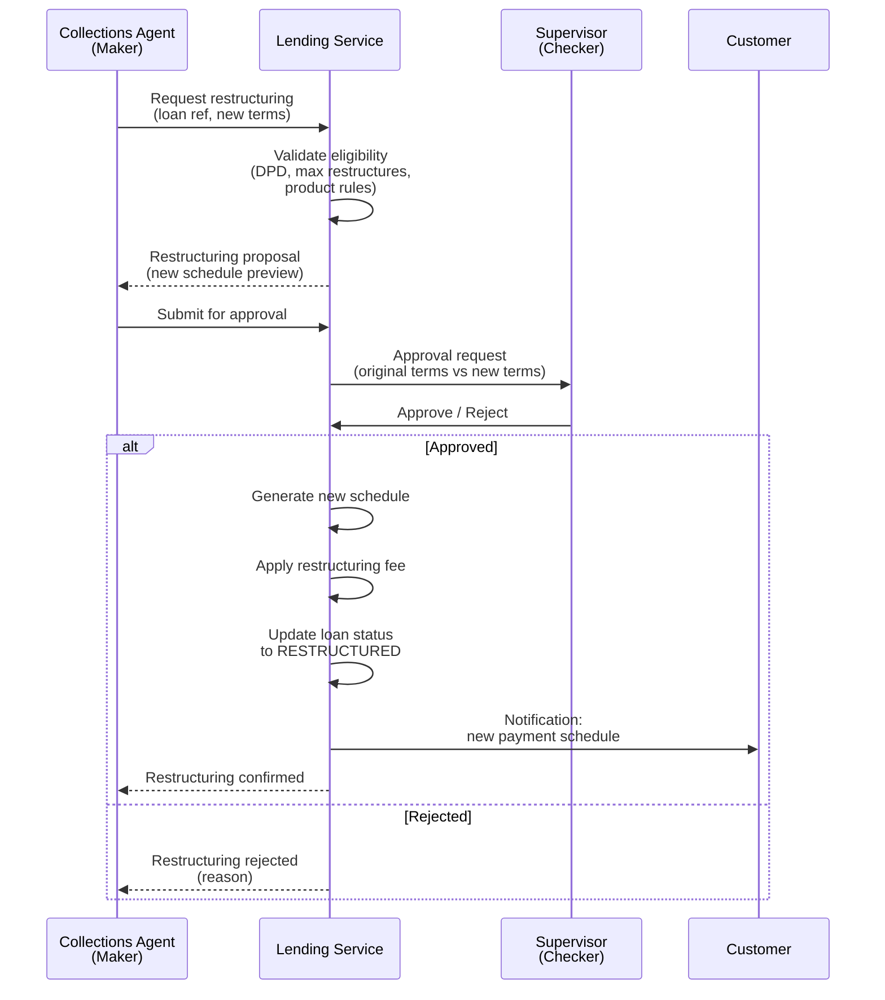

# Loan Lifecycle Events

## Overview

This document describes the lifecycle events that can occur after a loan has been originated and activated. These events modify the loan's state, schedule, or financial terms and require specific business logic, approval workflows, and audit controls.

Each event is defined with its trigger conditions, processing rules, financial impact, and required approvals.

---

## Loan Status State Machine

The following state machine diagram shows all valid loan status transitions, including the lifecycle events that trigger each transition.

```mermaid
stateDiagram-v2
    [*] --> PENDING_ACTIVATION : Loan created

    PENDING_ACTIVATION --> ACTIVE : Deposit confirmed +<br/>IMEI captured +<br/>Knox Guard enrolled
    PENDING_ACTIVATION --> CANCELLED : Application cancelled

    ACTIVE --> CURRENT : First schedule generated
    CURRENT --> OVERDUE : Instalment past due<br/>(+ grace period)
    OVERDUE --> CURRENT : Overdue amount paid

    CURRENT --> EARLY_SETTLED : Full balance paid<br/>before maturity
    CURRENT --> PAID_OFF : Final instalment paid

    OVERDUE --> DEFAULT : DPD exceeds<br/>default threshold
    OVERDUE --> EARLY_SETTLED : Full balance paid
    OVERDUE --> PAID_OFF : All amounts paid
    OVERDUE --> RESTRUCTURED : Terms modified<br/>(maker-checker approved)

    DEFAULT --> RESTRUCTURED : Terms modified<br/>(maker-checker approved)
    DEFAULT --> WRITTEN_OFF : Write-off approved
    DEFAULT --> PAID_OFF : Full balance paid<br/>(recovery)

    RESTRUCTURED --> CURRENT : Restructured payments<br/>on track
    RESTRUCTURED --> OVERDUE : Restructured payment<br/>missed
    RESTRUCTURED --> EARLY_SETTLED : Full balance paid
    RESTRUCTURED --> PAID_OFF : Final instalment paid
    RESTRUCTURED --> WRITTEN_OFF : Write-off approved

    EARLY_SETTLED --> [*] : Closed
    PAID_OFF --> [*] : Closed
    WRITTEN_OFF --> [*] : Closed
    CANCELLED --> [*] : Closed

    note right of CURRENT : Knox Guard: Unlocked
    note right of OVERDUE : Knox Guard: Warning/Lock<br/>based on DPD
    note right of DEFAULT : Knox Guard: Locked
    note right of WRITTEN_OFF : Knox Guard: Released
    note right of PAID_OFF : Knox Guard: Released
```

---

## 1. Early Settlement

Early settlement occurs when a customer pays the full outstanding balance before the loan's contractual maturity date.

### Rules

| Rule | Description |
|---|---|
| **Eligibility** | Available at any time after the first instalment due date. |
| **Minimum Tenure** | Some products may require a minimum number of paid instalments before early settlement is allowed (configurable). |
| **Settlement Amount** | Outstanding principal + accrued interest (to settlement date) + outstanding fees - interest rebate (if applicable). |
| **Interest Rebate** | Applicable for flat rate products only (reducing balance inherently benefits from early settlement). |

### Interest Rebate Calculation (Flat Rate)

For flat rate loans, the customer has been charged interest on the full original principal for the entire tenor. Early settlement warrants a rebate on the unearned interest.

**Rule of 78s Method:**

```
Total periods = n
Periods remaining = k (unpaid instalments)
Sum of digits (total) = n * (n + 1) / 2
Sum of digits (remaining) = k * (k + 1) / 2

Rebate = Total Interest * (Sum of digits remaining / Sum of digits total)
```

**Pro-rata Method (simpler alternative):**

```
Rebate = Total Interest * (Periods Remaining / Total Periods)
```

**Example (Rule of 78s):**

```
Loan: 30-day daily flat rate, Total Interest = KES 1,002
Customer settles after day 20 (10 days remaining)

Sum of digits (total) = 30 * 31 / 2 = 465
Sum of digits (remaining) = 10 * 11 / 2 = 55

Rebate = 1,002 * (55 / 465) = KES 118.52

Settlement Amount = Outstanding Principal + Accrued Interest - Rebate + Fees
                  = KES 6,667 + KES 334 - KES 119 + KES 0
                  = KES 6,882
```

### Interest Rebate Calculation (Reducing Balance)

For reducing balance loans, no explicit rebate is necessary. The settlement amount is simply:

```
Settlement Amount = Outstanding Principal + Accrued Interest (to date) + Outstanding Fees
```

Since interest is calculated on the declining balance, the customer naturally pays less interest by settling early.

### Early Settlement Process

1. Customer requests early settlement (via agent, app, or USSD).
2. System calculates the settlement amount as of the requested settlement date.
3. Settlement quote is presented to the customer (valid for a defined period, e.g., 48 hours).
4. Customer makes the settlement payment via mobile money.
5. Payment is applied: all remaining instalments marked as `PAID`.
6. Loan status changed to `EARLY_SETTLED`.
7. Knox Guard: device released (lock policy removed).
8. Notification sent to customer confirming loan completion.

---

## 2. Prepayment

Prepayment occurs when a customer pays more than the current instalment amount but less than the full outstanding balance.

### Application Methods

The prepayment can be applied in two ways (configurable per product):

| Method | Description | Effect |
|---|---|---|
| **Reduce Principal** | Excess applied to outstanding principal. | Reduces remaining balance; future interest recalculated (reducing balance) or unchanged (flat rate). Schedule shortened or final instalment reduced. |
| **Advance Instalments** | Excess applied to future instalments in sequence. | Upcoming instalments are marked as paid in advance. No change to interest or schedule timing. |

### Prepayment Rules

| Rule | Description |
|---|---|
| **Default Method** | Configurable per product. Default: Reduce Principal. |
| **Minimum Prepayment** | Must be at least one full instalment above the current amount due. |
| **Notification** | Customer is notified of the prepayment application and updated remaining balance. |
| **Schedule Recalculation** | If method is "Reduce Principal" and interest type is "Reducing Balance", the schedule is recalculated with the new outstanding balance. |

### Prepayment Processing

1. Payment received exceeds the current instalment amount.
2. Current instalment is fully paid and marked as `PAID`.
3. Remaining excess is applied based on the configured prepayment method.
4. If "Reduce Principal":
   a. Excess reduces the outstanding principal.
   b. For reducing balance: remaining schedule is recalculated (same instalment amount, fewer periods; or same periods, lower instalment -- configurable).
   c. For flat rate: remaining principal instalments are reduced; interest portions remain unchanged.
5. If "Advance Instalments":
   a. Excess is applied to the next instalment(s) in sequence.
   b. Each fully covered instalment is marked as `PAID`.
   c. Partial coverage of an instalment reduces its outstanding amount.
6. Loan record updated with new balances.
7. Customer notification sent with updated schedule summary.

---

## 3. Restructuring

Restructuring modifies the terms of an existing loan, typically to accommodate a customer who is struggling to maintain the original payment schedule.

### Restructuring Options

| Parameter | Modification | Example |
|---|---|---|
| **Tenor Extension** | Increase the number of remaining instalments. | Extend from 30 to 45 days. |
| **Instalment Reduction** | Lower the instalment amount (implies tenor extension). | Reduce from KES 700 to KES 500/day. |
| **Frequency Change** | Change payment frequency. | Switch from daily to weekly. |
| **Interest Rate Adjustment** | Modify the interest rate (exceptional cases). | Reduce from 5% to 3% monthly. |
| **Principal Forgiveness** | Write off a portion of the outstanding principal. | Forgive 10% of remaining balance. |
| **Fee Waiver** | Waive accumulated late fees. | Waive KES 500 in late fees. |

### Restructuring Rules

| Rule | Description |
|---|---|
| **Eligibility** | Customer must be at least 7 days past due (configurable). |
| **Maximum Restructures** | Maximum 2 restructures per loan (configurable). |
| **Approval** | Maker-checker approval is mandatory. |
| **Restructuring Fee** | Applied per product configuration (can be waived with approval). |
| **Previous Schedule** | Original schedule is preserved for audit; new schedule is generated. |
| **Status** | Loan status changes to `RESTRUCTURED`. |
| **PAR Impact** | Restructured loans are tracked separately in PAR reporting. |

### Restructuring Workflow



### Restructuring Record

| Field | Description |
|---|---|
| `restructure_id` | Unique identifier. |
| `loan_id` | Loan being restructured. |
| `restructure_number` | Sequential (1st, 2nd, etc.). |
| `requested_by` | Agent who initiated (maker). |
| `approved_by` | Supervisor who approved (checker). |
| `request_date` | Date of request. |
| `approval_date` | Date of approval. |
| `original_terms` | Snapshot of terms before restructuring. |
| `new_terms` | Modified terms. |
| `reason` | Reason for restructuring. |
| `restructuring_fee` | Fee applied (or waived). |

---

## 4. Promise-to-Pay (PTP)

A promise-to-pay is a commitment from an overdue customer to make a specific payment by a specific date. It is used during collections to defer escalation while giving the customer time to arrange funds.

### PTP Rules

| Rule | Description |
|---|---|
| **Eligibility** | Customer must be overdue (DPD >= 1). |
| **Maximum Active PTPs** | 1 active PTP per loan at any time. |
| **Maximum PTP Duration** | 7 days from the PTP creation date (configurable). |
| **Minimum PTP Amount** | At least the current overdue amount. |
| **Escalation Deferral** | Active PTP defers dunning escalation (no further lock escalation during PTP window). |
| **PTP Expiry** | If the PTP date passes without payment, escalation resumes from where it was deferred. |
| **Lock Deferral** | If a PTP is created before the lock trigger, the lock is deferred until PTP expiry. If the device is already locked, it remains locked. |

### PTP Record

| Field | Type | Description |
|---|---|---|
| `ptp_id` | UUID | Unique identifier. |
| `loan_id` | UUID | Associated loan. |
| `promised_amount` | Decimal | Amount the customer commits to pay. |
| `promised_date` | Date | Date by which payment is expected. |
| `created_by` | UUID | Collections agent who recorded the PTP. |
| `created_date` | DateTime | When the PTP was created. |
| `status` | Enum | `ACTIVE`, `HONOURED`, `BROKEN`, `EXPIRED`. |
| `notes` | String | Agent notes from the conversation. |

### PTP Outcomes

| Outcome | Trigger | Effect |
|---|---|---|
| **Honoured** | Payment >= promised amount received by promised date. | PTP marked `HONOURED`. Normal repayment processing applies. |
| **Broken** | Promised date passes without sufficient payment. | PTP marked `BROKEN`. Dunning resumes. Customer flagged as higher risk. |
| **Expired** | PTP window expires (same as broken if no payment). | PTP marked `EXPIRED`. Same effect as broken. |

---

## 5. Write-off

A write-off removes a loan from the active portfolio when it is deemed uncollectible. The outstanding balance is recognized as a credit loss.

### Write-off Rules

| Rule | Description |
|---|---|
| **Minimum DPD** | Loan must be at least 90 days past due (configurable). |
| **Exhausted Collections** | All dunning tiers must have been executed. |
| **Approval Authority** | Approval level depends on the write-off amount (see thresholds below). |
| **Accounting** | Outstanding balance is debited to Bad Debt Expense and credited from Loan Portfolio. |
| **Knox Guard** | Device is released (lock policy removed) upon write-off. |
| **CRB Reporting** | Write-off is reported to the Credit Reference Bureau. |
| **Recovery** | Written-off loans remain eligible for recovery efforts. Any subsequent payments are recorded as recoveries. |

### Approval Authority Thresholds

| Write-off Amount | Approval Level |
|---|---|
| Up to KES 10,000 | Collections Manager |
| KES 10,001 - KES 50,000 | Head of Credit |
| KES 50,001 - KES 200,000 | Chief Financial Officer |
| Above KES 200,000 | Board / Credit Committee |

### Write-off Workflow

1. Collections agent recommends write-off after exhausting all collection options.
2. System validates eligibility (minimum DPD, dunning completion).
3. Write-off request is submitted with supporting documentation (collection history, PTP history, agent notes).
4. Request is routed to the appropriate approval authority based on the outstanding amount.
5. Approver reviews and approves/rejects.
6. If approved:
   a. Loan status changed to `WRITTEN_OFF`.
   b. Accounting entries posted (Bad Debt Expense debit, Loan Portfolio credit).
   c. Knox Guard device released.
   d. CRB negative listing submitted.
   e. Loan moved to write-off register (still tracked for potential recovery).
7. If rejected: loan remains in current status; agent may escalate or continue collection efforts.

### CRB Reporting

| Event | CRB Action | Timing |
|---|---|---|
| Loan originated | Positive listing (new credit facility) | Within 24 hours of origination. |
| Regular repayment | Update payment history (positive) | Monthly. |
| Default (90+ DPD) | Negative listing (default) | Within 5 business days. |
| Write-off | Negative listing (write-off) | Within 5 business days. |
| Full recovery post write-off | Update listing (settled) | Within 5 business days. |

---

## 6. Loan Top-up (Repeat Lending)

A loan top-up allows a customer who has successfully completed (or nearly completed) a loan to receive a new, larger loan -- typically for a higher-value device.

### Eligibility Criteria

| Criterion | Requirement |
|---|---|
| **Previous Loan Status** | Must be `PAID_OFF` or `EARLY_SETTLED`. |
| **Repayment History** | Maximum DPD during previous loan must not exceed a threshold (e.g., 7 days). |
| **Number of Completed Loans** | At least 1 fully completed loan. |
| **Time Since Completion** | No mandatory waiting period (immediate eligibility). |
| **CRB Check** | Fresh CRB check must pass. |
| **Active Loans** | Customer must not have any other active loans on the platform. |

### Top-up Benefits

Repeat customers may qualify for improved terms:

| Benefit | Description |
|---|---|
| **Higher Device Value** | Eligible for more expensive devices. |
| **Lower Deposit** | Reduced deposit percentage (e.g., from 20% to 15%). |
| **Lower Interest Rate** | Preferential rate based on repayment history. |
| **Longer Tenor** | Access to longer repayment periods. |
| **Priority Processing** | Faster approval and disbursement. |

### Top-up Tiers

| Tier | Completed Loans | Max DPD History | Deposit Reduction | Rate Discount |
|---|---|---|---|---|
| **Bronze** | 1 | <= 7 days | 0% | 0% |
| **Silver** | 2 | <= 3 days | 5% off deposit | 0.5% off rate |
| **Gold** | 3+ | 0 days (perfect history) | 10% off deposit | 1.0% off rate |

---

## 7. Reversal

A reversal undoes an erroneous transaction that was incorrectly applied to a loan. Reversals require strict controls to prevent misuse.

### Reversible Transactions

| Transaction Type | Reversal Scenario | Effect |
|---|---|---|
| **Payment** | Duplicate payment recorded; payment applied to wrong loan. | Payment amount removed from loan; instalment status reverted. |
| **Fee** | Fee incorrectly charged (e.g., late fee when customer was not late). | Fee removed; outstanding balance reduced. |
| **Disbursement** | Disbursement sent to wrong account; device not actually issued. | Disbursement record reversed; loan may be cancelled. |

### Non-reversible Operations

| Operation | Reason |
|---|---|
| **Write-off** | Requires a separate recovery process. |
| **CRB Reporting** | Requires a CRB dispute/correction process. |
| **Knox Guard Release** | Device release is permanent; re-enrollment is a new action. |

### Reversal Rules

| Rule | Description |
|---|---|
| **Time Limit** | Reversals must be initiated within 72 hours of the original transaction (configurable). |
| **Approval** | All reversals require maker-checker approval. |
| **Audit Trail** | Full audit trail is mandatory: original transaction, reversal reason, approver, timestamp. |
| **Customer Notification** | Customer must be notified of the reversal and its impact on their balance. |
| **Idempotency** | A transaction can only be reversed once. |
| **Cascade** | If a payment reversal causes an instalment to become unpaid, the instalment status reverts to `PENDING` or `OVERDUE` (based on due date). |

### Reversal Workflow

1. Agent identifies an erroneous transaction and initiates a reversal request.
2. System validates the reversal (time limit, not already reversed, transaction exists).
3. Agent provides a reason and supporting evidence.
4. Request is submitted for approval (maker-checker).
5. Approver reviews the original transaction, reversal reason, and evidence.
6. If approved:
   a. Original transaction is marked as `REVERSED`.
   b. A reversal transaction is created with a reference to the original.
   c. Loan balances are recalculated.
   d. Instalment statuses are updated.
   e. Knox Guard status is re-evaluated (may need to re-lock if payment reversal causes overdue status).
   f. Customer is notified.
7. If rejected: reversal request is closed with a rejection reason.

### Reversal Audit Record

| Field | Description |
|---|---|
| `reversal_id` | Unique reversal identifier. |
| `original_transaction_id` | Reference to the reversed transaction. |
| `original_transaction_type` | `PAYMENT`, `FEE`, `DISBURSEMENT`. |
| `original_amount` | Amount of the original transaction. |
| `reversal_reason` | Free-text reason. |
| `reversal_category` | `DUPLICATE`, `WRONG_LOAN`, `WRONG_AMOUNT`, `FRAUD`, `SYSTEM_ERROR`, `OTHER`. |
| `requested_by` | Agent who initiated (maker). |
| `approved_by` | Supervisor who approved (checker). |
| `request_date` | DateTime of the request. |
| `approval_date` | DateTime of approval. |
| `supporting_evidence` | Attached documents or references. |

---

## Event Audit Log

All lifecycle events are recorded in an immutable audit log for compliance and dispute resolution.

### Audit Log Entry Structure

| Field | Type | Description |
|---|---|---|
| `event_id` | UUID | Unique event identifier. |
| `loan_id` | UUID | Associated loan. |
| `event_type` | Enum | `EARLY_SETTLEMENT`, `PREPAYMENT`, `RESTRUCTURING`, `PTP_CREATED`, `PTP_HONOURED`, `PTP_BROKEN`, `WRITE_OFF`, `TOP_UP`, `REVERSAL`, `STATUS_CHANGE`, `KNOX_ACTION`. |
| `event_date` | DateTime | When the event occurred. |
| `actor_id` | UUID | User or system process that triggered the event. |
| `actor_type` | Enum | `SYSTEM`, `AGENT`, `CUSTOMER`, `APPROVER`. |
| `details` | JSON | Event-specific details (before/after values, amounts, reasons). |
| `ip_address` | String | IP address of the actor (if applicable). |
| `channel` | String | Channel through which the event was triggered (POS, admin portal, API, automated). |

### Retention Policy

- Audit logs are retained for a minimum of 7 years in compliance with financial regulatory requirements.
- Logs are immutable: no updates or deletions are permitted.
- Logs are indexed by `loan_id`, `event_type`, and `event_date` for efficient querying.
