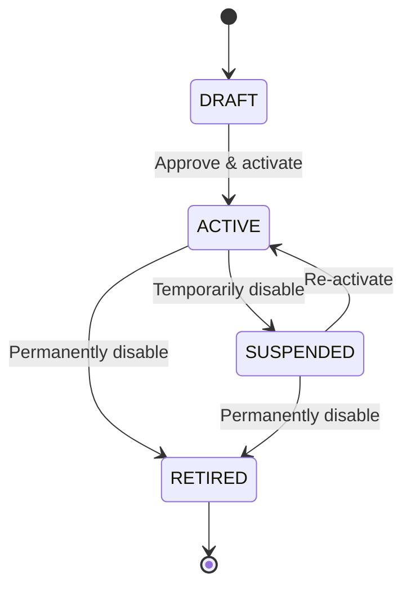

# Loan Product Definition

## Overview

A loan product defines the terms, conditions, and parameters under which a device financing loan is originated and managed. Products are configured by the platform operations team and linked to specific financers, partner shops, and device catalogues. Each loan originated on the platform is an instance of a defined loan product.

This document covers product configuration, interest calculation methods, payment schedule generation, versioning, and worked examples.

---

## Product Attributes

### Core Attributes Table

| Attribute | Type | Required | Description |
|---|---|---|---|
| `product_id` | UUID | Yes | Unique product identifier. |
| `product_code` | String | Yes | Human-readable code (e.g., `DAILY-30-FLAT`). |
| `product_name` | String | Yes | Display name (e.g., "30-Day Daily Flat Rate"). |
| `description` | String | No | Detailed product description. |
| `currency` | String (ISO 4217) | Yes | Operating currency (e.g., `KES`, `UGX`, `TZS`). |
| `status` | Enum | Yes | `DRAFT`, `ACTIVE`, `SUSPENDED`, `RETIRED`. |
| `effective_date` | Date | Yes | Date from which the product is available for origination. |
| `end_date` | Date | No | Date after which no new loans can be originated under this product. |

### Interest Configuration

| Attribute | Type | Required | Description |
|---|---|---|---|
| `has_interest` | Boolean | Yes | Whether this product charges interest. |
| `interest_type` | Enum | Conditional | `FLAT` or `REDUCING_BALANCE`. Required if `has_interest = true`. |
| `interest_rate` | Decimal | Conditional | Interest rate value. Required if `has_interest = true`. |
| `interest_rate_frequency` | Enum | Conditional | Period the rate applies to: `DAILY`, `WEEKLY`, `MONTHLY`, `ANNUAL`. |
| `interest_rate_display` | Decimal | No | Annualized rate for customer-facing display (APR equivalent). |

### Tenor and Payment Configuration

| Attribute | Type | Required | Description |
|---|---|---|---|
| `payment_frequency` | Enum | Yes | `DAILY`, `WEEKLY`, `BI_WEEKLY`, `MONTHLY`. |
| `tenor_value` | Integer | Yes | Number of payment periods (e.g., 30 for 30 days, 12 for 12 months). |
| `tenor_unit` | Enum | Yes | `DAYS`, `WEEKS`, `MONTHS`. Must align with `payment_frequency`. |
| `min_principal` | Decimal | Yes | Minimum allowable loan principal. |
| `max_principal` | Decimal | Yes | Maximum allowable loan principal. |

### Deposit Configuration

| Attribute | Type | Required | Description |
|---|---|---|---|
| `deposit_required` | Boolean | Yes | Whether a deposit is required. |
| `deposit_type` | Enum | Conditional | `FIXED_AMOUNT` or `PERCENTAGE`. Required if `deposit_required = true`. |
| `deposit_value` | Decimal | Conditional | Fixed amount or percentage value. Required if `deposit_required = true`. |
| `min_deposit` | Decimal | No | Minimum deposit amount (overrides percentage calculation if higher). |
| `max_deposit` | Decimal | No | Maximum deposit amount (caps percentage calculation). |

### Grace Period Configuration

| Attribute | Type | Required | Description |
|---|---|---|---|
| `grace_period_enabled` | Boolean | Yes | Whether a grace period applies before the first instalment. |
| `grace_period_value` | Integer | Conditional | Number of grace period units. Required if enabled. |
| `grace_period_unit` | Enum | Conditional | `DAYS`, `WEEKS`, `MONTHS`. |
| `grace_period_interest` | Boolean | No | Whether interest accrues during the grace period. Default: `false`. |

### Financer Configuration

| Attribute | Type | Required | Description |
|---|---|---|---|
| `financer_id` | UUID | Yes | Reference to the financing entity funding this product. |
| `financer_return_rate` | Decimal | No | Agreed return rate for the financer (used in settlement calculation). |
| `disbursement_method` | Enum | Yes | `BANK_TRANSFER`, `MOBILE_MONEY`, `PLATFORM_WALLET`. |

### Insurance Configuration

| Attribute | Type | Required | Description |
|---|---|---|---|
| `insurance_required` | Boolean | Yes | Whether insurance is bundled with the product. |
| `insurance_provider_id` | UUID | Conditional | Reference to the insurance provider. |
| `insurance_premium_type` | Enum | Conditional | `FIXED_AMOUNT`, `PERCENTAGE_OF_PRINCIPAL`, `PERCENTAGE_OF_DEVICE_VALUE`. |
| `insurance_premium_value` | Decimal | Conditional | Premium amount or percentage. |
| `insurance_coverage_type` | String | No | Description of coverage (e.g., "device damage", "credit life"). |

### Fees Configuration

| Fee Type | Attribute | Type | Description |
|---|---|---|---|
| **Origination Fee** | `origination_fee_type` | Enum | `NONE`, `FIXED_AMOUNT`, `PERCENTAGE_OF_PRINCIPAL`. |
| | `origination_fee_value` | Decimal | Fee amount or percentage. |
| | `origination_fee_collection` | Enum | `UPFRONT` (deducted from principal) or `CAPITALIZED` (added to principal). |
| **Late Payment Fee** | `late_fee_type` | Enum | `NONE`, `FIXED_AMOUNT`, `PERCENTAGE_OF_INSTALMENT`. |
| | `late_fee_value` | Decimal | Fee amount or percentage. |
| | `late_fee_grace_days` | Integer | Days after due date before late fee applies. |
| | `late_fee_cap` | Decimal | Maximum late fee per instalment. |
| | `late_fee_frequency` | Enum | `ONE_TIME` (per missed instalment) or `RECURRING` (per day/period overdue). |
| **Restructuring Fee** | `restructuring_fee_type` | Enum | `NONE`, `FIXED_AMOUNT`, `PERCENTAGE_OF_OUTSTANDING`. |
| | `restructuring_fee_value` | Decimal | Fee amount or percentage. |

---

## Product-Partner-Device Mapping

Loan products are not universally available. They are mapped to specific combinations of partners (shops) and devices to control distribution and risk.

### Mapping Structure

```
Product
  |
  +-- Partner Assignment
  |     |-- partner_id
  |     |-- effective_date
  |     |-- end_date
  |     |-- status (ACTIVE / SUSPENDED)
  |     |
  |     +-- Device Assignment
  |           |-- device_model_id
  |           |-- device_retail_price
  |           |-- device_wholesale_price
  |           |-- deposit_override (optional)
  |           |-- status (ACTIVE / SUSPENDED)
```

### Mapping Rules

1. A product must be assigned to at least one partner before loans can be originated.
2. A partner-product combination must have at least one active device assignment.
3. Device pricing can vary by partner (e.g., different retail prices per region).
4. Deposit overrides at the device level take precedence over product-level deposit configuration.
5. Suspending a partner assignment prevents new originations but does not affect existing loans.

### Example Mapping

| Product | Partner | Device | Retail Price | Deposit |
|---|---|---|---|---|
| DAILY-30-FLAT | Nairobi Electronics | Samsung A15 | KES 25,000 | KES 5,000 |
| DAILY-30-FLAT | Nairobi Electronics | Samsung A25 | KES 35,000 | KES 7,000 |
| DAILY-30-FLAT | Mombasa Mobile | Samsung A15 | KES 24,500 | KES 5,000 |
| WEEKLY-12-REDUCING | Kampala Tech Hub | Samsung A15 | UGX 850,000 | UGX 170,000 |
| MONTHLY-6-FLAT | Dar Phone Shop | Samsung A05 | TZS 350,000 | 20% |

---

## Interest Calculation Methods

### Flat Rate Interest

With flat rate interest, the interest is calculated on the original principal for the entire tenor. The total interest amount is fixed at origination and does not change regardless of early repayments.

**Formula:**

```
Total Interest = Principal x Interest Rate x Number of Periods
Instalment = (Principal + Total Interest) / Number of Periods
```

Where:
- `Principal` = Device price - Deposit
- `Interest Rate` = Rate per period (as defined by `interest_rate_frequency`)
- `Number of Periods` = Tenor value

**Characteristics:**
- Simple to calculate and explain to customers.
- Total cost is known upfront.
- Effective interest rate is higher than the stated rate (because the customer is paying interest on the full principal even as it reduces).
- Early settlement does not inherently reduce total interest (unless an interest rebate policy is applied).

### Reducing Balance Interest

With reducing balance interest, interest is calculated on the outstanding principal balance at each payment period. As the customer repays principal, the interest portion of each instalment decreases.

**Formula (Equal Instalment / Amortization):**

```
Instalment = Principal x [r(1+r)^n] / [(1+r)^n - 1]

Where:
  r = periodic interest rate
  n = number of payment periods
```

For each period `i`:

```
Interest_i = Outstanding Balance_(i-1) x r
Principal_i = Instalment - Interest_i
Outstanding Balance_i = Outstanding Balance_(i-1) - Principal_i
```

**Characteristics:**
- Customer pays less total interest compared to flat rate at the same stated rate.
- Monthly instalment is constant, but the interest/principal split changes over time.
- Early settlement benefits the customer (less outstanding principal = less interest).
- More complex to explain to customers.

---

## Payment Schedule Generation Algorithm

### Inputs

| Parameter | Source |
|---|---|
| `principal` | Calculated: device price - deposit |
| `interest_type` | Product configuration |
| `interest_rate` | Product configuration |
| `interest_rate_frequency` | Product configuration |
| `payment_frequency` | Product configuration |
| `tenor_value` | Product configuration |
| `grace_period_value` | Product configuration |
| `origination_fee` | Product configuration |
| `insurance_premium` | Product configuration |
| `loan_start_date` | Date of loan creation |

### Algorithm

```
FUNCTION generate_schedule(loan):

  1. Determine effective principal
     effective_principal = loan.principal
     IF origination_fee.collection == CAPITALIZED:
       effective_principal += origination_fee_amount
     IF insurance_premium.collection == CAPITALIZED:
       effective_principal += insurance_premium_amount

  2. Convert interest rate to per-period rate
     periodic_rate = convert_rate(
       loan.interest_rate,
       loan.interest_rate_frequency,
       loan.payment_frequency
     )

  3. Calculate instalment amount
     IF interest_type == FLAT:
       total_interest = effective_principal * periodic_rate * tenor_value
       instalment = (effective_principal + total_interest) / tenor_value
     ELSE IF interest_type == REDUCING_BALANCE:
       instalment = effective_principal
                    * (periodic_rate * (1 + periodic_rate)^tenor_value)
                    / ((1 + periodic_rate)^tenor_value - 1)

  4. Round instalment to nearest whole currency unit (round half-up)

  5. Calculate first due date
     first_due_date = loan_start_date
       + grace_period (if applicable)
       + one payment_frequency period

  6. Generate schedule entries
     outstanding = effective_principal
     FOR i = 1 TO tenor_value:
       due_date = first_due_date + (i - 1) * payment_frequency_period

       IF interest_type == FLAT:
         interest_portion = total_interest / tenor_value
         principal_portion = instalment - interest_portion
       ELSE IF interest_type == REDUCING_BALANCE:
         interest_portion = outstanding * periodic_rate
         principal_portion = instalment - interest_portion

       // Adjust final instalment for rounding
       IF i == tenor_value:
         principal_portion = outstanding
         instalment = principal_portion + interest_portion

       outstanding -= principal_portion

       schedule.add({
         instalment_number: i,
         due_date: due_date,
         instalment_amount: instalment,
         principal_portion: principal_portion,
         interest_portion: interest_portion,
         outstanding_after: outstanding,
         status: PENDING
       })

  7. Validate schedule
     ASSERT sum(principal_portions) == effective_principal
     ASSERT outstanding_after_final == 0

  RETURN schedule
```

### Rate Conversion

When the interest rate frequency does not match the payment frequency, rate conversion is required:

| From \ To | Daily | Weekly | Monthly | Annual |
|---|---|---|---|---|
| **Daily** | -- | x7 | x30 | x365 |
| **Weekly** | /7 | -- | x4.33 | x52 |
| **Monthly** | /30 | /4.33 | -- | x12 |
| **Annual** | /365 | /52 | /12 | -- |

Note: For flat rate, simple multiplication/division is used. For reducing balance, the mathematically correct conversion uses compound interest formulas:

```
periodic_rate = (1 + annual_rate)^(1/periods_per_year) - 1
```

---

## Product Versioning and Lifecycle

### Product States



| State | Can Originate Loans | Existing Loans Affected | Editable |
|---|---|---|---|
| `DRAFT` | No | N/A | Yes (all fields) |
| `ACTIVE` | Yes | No | Limited (non-financial fields only) |
| `SUSPENDED` | No | No | Limited (non-financial fields only) |
| `RETIRED` | No | No | No |

### Versioning Rules

1. **Immutable Financial Terms**: Once a product is `ACTIVE`, financial terms (interest rate, tenor, fees) cannot be modified. A new product version must be created instead.
2. **Version Numbering**: Products use semantic versioning (`major.minor`). Changes to financial terms increment the major version; non-financial changes increment the minor version.
3. **Backward Compatibility**: Existing loans always reference the product version under which they were originated. Product retirement does not affect active loans.
4. **Audit Trail**: All product changes are logged with the modifier's identity, timestamp, and before/after values.

### Version History Example

| Version | Change | Date | Status |
|---|---|---|---|
| 1.0 | Initial product creation | 2025-01-15 | RETIRED |
| 2.0 | Interest rate changed from 5% to 4.5% monthly | 2025-04-01 | RETIRED |
| 2.1 | Description updated | 2025-05-10 | ACTIVE |

---

## Example Products with Calculations

### Example 1: Daily Flat Rate Product

**Product Configuration:**

| Parameter | Value |
|---|---|
| Product Code | `DAILY-30-FLAT-5` |
| Interest Type | Flat |
| Interest Rate | 0.167% per day (~5% per month) |
| Payment Frequency | Daily |
| Tenor | 30 days |
| Deposit | 20% of device price |
| Grace Period | 1 day |
| Late Fee | KES 50 per day after 1 day grace |
| Origination Fee | None |

**Scenario**: Customer purchases Samsung A15 at KES 25,000.

| Item | Calculation | Amount |
|---|---|---|
| Device Price | -- | KES 25,000 |
| Deposit (20%) | 25,000 x 0.20 | KES 5,000 |
| Principal | 25,000 - 5,000 | KES 20,000 |
| Total Interest | 20,000 x 0.00167 x 30 | KES 1,002 |
| Total Repayable | 20,000 + 1,002 | KES 21,002 |
| Daily Instalment | 21,002 / 30 | KES 701 (rounded up) |
| Total Customer Cost | 5,000 + 21,002 | KES 26,002 |

**Schedule (first 5 days):**

| Day | Due Date | Instalment | Principal | Interest | Outstanding |
|---|---|---|---|---|---|
| 1 | 2025-02-02 | KES 701 | KES 667 | KES 34 | KES 19,333 |
| 2 | 2025-02-03 | KES 701 | KES 667 | KES 34 | KES 18,666 |
| 3 | 2025-02-04 | KES 701 | KES 667 | KES 34 | KES 17,999 |
| 4 | 2025-02-05 | KES 701 | KES 667 | KES 34 | KES 17,332 |
| 5 | 2025-02-06 | KES 701 | KES 667 | KES 34 | KES 16,665 |
| ... | ... | ... | ... | ... | ... |
| 30 | 2025-03-03 | KES 698 | KES 664 | KES 34 | KES 0 |

### Example 2: Monthly Reducing Balance Product

**Product Configuration:**

| Parameter | Value |
|---|---|
| Product Code | `MONTHLY-6-REDUCING-3` |
| Interest Type | Reducing Balance |
| Interest Rate | 3% per month |
| Payment Frequency | Monthly |
| Tenor | 6 months |
| Deposit | KES 7,000 (fixed) |
| Grace Period | 7 days |
| Late Fee | 2% of instalment, one-time |
| Origination Fee | 1% of principal, capitalized |

**Scenario**: Customer purchases Samsung A25 at KES 35,000.

| Item | Calculation | Amount |
|---|---|---|
| Device Price | -- | KES 35,000 |
| Deposit | Fixed | KES 7,000 |
| Base Principal | 35,000 - 7,000 | KES 28,000 |
| Origination Fee (1%) | 28,000 x 0.01 | KES 280 |
| Effective Principal | 28,000 + 280 | KES 28,280 |
| Monthly Instalment | 28,280 x [0.03(1.03)^6] / [(1.03)^6 - 1] | KES 5,222 |

**Full Amortization Schedule:**

| Month | Due Date | Instalment | Principal | Interest | Outstanding |
|---|---|---|---|---|---|
| 1 | 2025-03-07 | KES 5,222 | KES 4,374 | KES 848 | KES 23,906 |
| 2 | 2025-04-07 | KES 5,222 | KES 4,505 | KES 717 | KES 19,401 |
| 3 | 2025-05-07 | KES 5,222 | KES 4,640 | KES 582 | KES 14,761 |
| 4 | 2025-06-07 | KES 5,222 | KES 4,779 | KES 443 | KES 9,982 |
| 5 | 2025-07-07 | KES 5,222 | KES 4,923 | KES 299 | KES 5,059 |
| 6 | 2025-08-07 | KES 5,211 | KES 5,059 | KES 152 | KES 0 |
| **Total** | | **KES 31,321** | **KES 28,280** | **KES 3,041** | |

### Example 3: Weekly Product with No Interest

**Product Configuration:**

| Parameter | Value |
|---|---|
| Product Code | `WEEKLY-8-ZERO` |
| Interest Type | None (`has_interest = false`) |
| Payment Frequency | Weekly |
| Tenor | 8 weeks |
| Deposit | 30% of device price |
| Grace Period | None |
| Late Fee | KES 100 flat, one-time |
| Insurance | 2% of device value, capitalized |

**Scenario**: Customer purchases Samsung A05 at KES 15,000.

| Item | Calculation | Amount |
|---|---|---|
| Device Price | -- | KES 15,000 |
| Deposit (30%) | 15,000 x 0.30 | KES 4,500 |
| Base Principal | 15,000 - 4,500 | KES 10,500 |
| Insurance (2%) | 15,000 x 0.02 | KES 300 |
| Effective Principal | 10,500 + 300 | KES 10,800 |
| Weekly Instalment | 10,800 / 8 | KES 1,350 |
| Total Customer Cost | 4,500 + 10,800 | KES 15,300 |

---

## Product Configuration Checklist

Before activating a new loan product, verify:

- [ ] All required attributes are populated.
- [ ] Interest calculation has been validated with at least three test scenarios.
- [ ] Payment schedule generation produces a schedule that sums to the correct total.
- [ ] The final instalment correctly zeroes the outstanding balance.
- [ ] At least one partner and one device are mapped.
- [ ] Deposit rules are consistent with the financer's requirements.
- [ ] Fee configuration has been approved by the finance team.
- [ ] Settlement terms align with the financer agreement.
- [ ] Insurance provider integration is tested (if applicable).
- [ ] Product has been reviewed and approved via maker-checker workflow.
