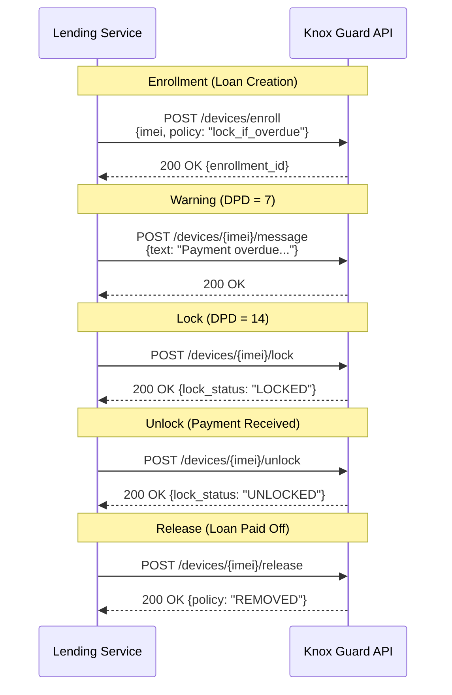

# Portfolio Management

## Overview

Portfolio management encompasses all post-disbursement activities for managing the lifecycle of active loans. This includes maintaining portfolio records, tracking repayment schedules, executing collections, managing loan statuses, aging analysis, dunning and escalation, device lock/unlock automation, and calculating portfolio quality metrics.

---

## Portfolio Record Structure

Each loan in the portfolio is represented by a comprehensive record that captures all financial, operational, and relationship data.

### Core Loan Record

| Field | Type | Description |
|---|---|---|
| `loan_id` | UUID | Unique loan identifier. |
| `loan_reference` | String | Human-readable reference (e.g., `LOAN-2025-00142`). |
| `customer_id` | UUID | Reference to the customer. |
| `product_id` | UUID | Reference to the loan product (version-specific). |
| `product_code` | String | Loan product short code. |
| `financer_id` | UUID | Reference to the financing entity. |
| `financer_reference` | String | Financer's internal loan reference (if assigned). |
| `partner_id` | UUID | Reference to the originating partner shop. |

### Financial Details

| Field | Type | Description |
|---|---|---|
| `device_price` | Decimal | Retail price of the device. |
| `deposit_amount` | Decimal | Customer deposit collected. |
| `principal` | Decimal | Loan principal (device price - deposit). |
| `effective_principal` | Decimal | Principal including capitalized fees/insurance. |
| `total_interest` | Decimal | Total interest over the life of the loan. |
| `total_fees` | Decimal | Total fees (origination, late, etc.). |
| `total_repayable` | Decimal | Total amount the customer must repay. |
| `outstanding_principal` | Decimal | Remaining principal balance. |
| `outstanding_interest` | Decimal | Remaining interest (for reducing balance). |
| `outstanding_fees` | Decimal | Unpaid fees. |
| `total_paid` | Decimal | Sum of all payments received. |
| `total_outstanding` | Decimal | Total remaining balance. |
| `currency` | String | ISO 4217 currency code. |

### Device Information

| Field | Type | Description |
|---|---|---|
| `device_model` | String | Device model name. |
| `device_imei` | String | IMEI number (15 digits). |
| `device_serial` | String | Device serial number. |
| `knox_guard_status` | Enum | `ENROLLED`, `LOCKED`, `UNLOCKED`, `RELEASED`. |
| `knox_guard_policy_id` | String | Knox Guard policy reference. |

### Dates

| Field | Type | Description |
|---|---|---|
| `application_date` | DateTime | Date the loan application was created. |
| `origination_date` | DateTime | Date the loan was activated. |
| `first_due_date` | Date | First instalment due date. |
| `last_due_date` | Date | Final instalment due date. |
| `maturity_date` | Date | Contractual end date. |
| `next_due_date` | Date | Next upcoming instalment due date. |
| `last_payment_date` | DateTime | Date of the most recent payment. |
| `closed_date` | DateTime | Date the loan was closed (paid off, written off, etc.). |

### Status

| Field | Type | Description |
|---|---|---|
| `status` | Enum | Current loan status (see Status Tracking below). |
| `days_past_due` | Integer | Number of days since the earliest unpaid instalment due date. |
| `aging_bucket` | String | Current aging bucket classification. |
| `disbursement_status` | Enum | Status of the financer disbursement. |

---

## Repayment Schedule Management

### Schedule Record Structure

Each instalment in the repayment schedule is tracked individually:

| Field | Type | Description |
|---|---|---|
| `schedule_id` | UUID | Unique schedule entry identifier. |
| `loan_id` | UUID | Parent loan reference. |
| `instalment_number` | Integer | Sequential instalment number (1, 2, 3...). |
| `due_date` | Date | Date the instalment is due. |
| `instalment_amount` | Decimal | Total amount due for this instalment. |
| `principal_portion` | Decimal | Principal component. |
| `interest_portion` | Decimal | Interest component. |
| `fee_portion` | Decimal | Fee component (if applicable). |
| `amount_paid` | Decimal | Amount received against this instalment. |
| `amount_outstanding` | Decimal | Remaining unpaid amount. |
| `status` | Enum | `PENDING`, `PARTIALLY_PAID`, `PAID`, `OVERDUE`, `WAIVED`. |
| `payment_date` | DateTime | Date the instalment was fully paid. |
| `days_late` | Integer | Days between due date and payment date (0 if on time). |

### Payment Application Rules

When a payment is received, it is applied in the following order:

1. **Late fees** (oldest first)
2. **Interest** (oldest instalment first)
3. **Principal** (oldest instalment first)
4. **Future instalments** (if overpayment, applied to the next due instalment)

If a partial payment is received, it is applied in the same priority order but may leave an instalment partially paid.

### Schedule Modification

The repayment schedule can be modified under the following circumstances:

| Scenario | Effect on Schedule | Approval Required |
|---|---|---|
| **Restructuring** | New schedule generated with modified terms | Maker-checker |
| **Prepayment** | Outstanding reduced; schedule shortened or instalments reduced | Automatic |
| **Early Settlement** | All remaining instalments marked as paid | Automatic |
| **Write-off** | All remaining instalments marked as written off | Approval authority |
| **Grace Extension** | Due dates shifted forward | Maker-checker |

---

## Collections

### Automated Collection

The platform's primary collection method is automated mobile money collection via the Payment Gateway.

**Daily Collection Cycle:**

| Time | Activity |
|---|---|
| 06:00 | System identifies all instalments due today. |
| 07:00 | First STK Push attempt sent to all due customers. |
| 07:00 - 09:00 | Wait for customer responses. |
| 09:00 | Process callbacks. Record successful payments. |
| 10:00 | Second attempt for failed/unanswered first attempts. |
| 12:00 | Process second round callbacks. |
| 14:00 | Third and final attempt for remaining unpaid. |
| 16:00 | Process final callbacks. Mark remaining as missed. |
| 18:00 | End of day: update loan statuses, trigger dunning for missed payments. |

### Collection Outcomes

| Outcome | Status Code | Action |
|---|---|---|
| `SUCCESS` | Payment confirmed | Apply to instalment; update loan balance. |
| `INSUFFICIENT_FUNDS` | Customer has insufficient balance | Retry later; send balance reminder. |
| `WRONG_PIN` | Customer entered wrong PIN | Retry; send correct PIN reminder. |
| `TIMEOUT` | Customer did not respond | Retry later; send notification. |
| `REJECTED` | Customer actively declined | Flag for manual follow-up. |
| `NETWORK_ERROR` | Provider communication failure | Auto-retry. |

### Manual Follow-up

For customers who miss automated collection, a manual follow-up process is triggered:

1. **Day 1 (miss day)**: Automated SMS/notification reminder.
2. **Day 2**: Second automated reminder with payment instructions.
3. **Day 3**: Customer assigned to a collections agent for phone outreach.
4. **Day 7+**: Escalation per dunning configuration (see below).

---

## Status Tracking

### Loan Status Definitions

| Status | Code | Description |
|---|---|---|
| **Current** | `CURRENT` | All instalments paid on time. No overdue amounts. |
| **Overdue** | `OVERDUE` | One or more instalments past due but within default threshold. |
| **Default** | `DEFAULT` | Overdue beyond the contractual default threshold (e.g., 90 days). |
| **Paid Off** | `PAID_OFF` | All obligations fully settled. Loan closed successfully. |
| **Early Settlement** | `EARLY_SETTLED` | Loan paid off before maturity. |
| **Restructured** | `RESTRUCTURED` | Loan terms have been modified (new schedule, tenor, or amount). |
| **Written Off** | `WRITTEN_OFF` | Loan deemed uncollectible. Removed from active portfolio. |
| **Cancelled** | `CANCELLED` | Loan cancelled before or shortly after activation (e.g., device returned). |

### Status Transition Rules

| From | To | Trigger |
|---|---|---|
| `CURRENT` | `OVERDUE` | Instalment not paid by due date + grace period. |
| `OVERDUE` | `CURRENT` | All overdue amounts paid; next instalment not yet due. |
| `OVERDUE` | `DEFAULT` | Days past due exceeds default threshold (e.g., 90 days). |
| `OVERDUE` | `RESTRUCTURED` | Loan restructured with new terms. |
| `DEFAULT` | `RESTRUCTURED` | Loan restructured with new terms. |
| `DEFAULT` | `WRITTEN_OFF` | Write-off approved. |
| `CURRENT` | `PAID_OFF` | Final instalment paid on maturity date. |
| `CURRENT` | `EARLY_SETTLED` | Full outstanding balance paid before maturity. |
| `OVERDUE` | `PAID_OFF` | All amounts (including overdue) paid in full. |
| `RESTRUCTURED` | `CURRENT` | Restructured schedule payments are current. |
| `RESTRUCTURED` | `OVERDUE` | Restructured schedule payments are overdue. |
| Any (pre-activation) | `CANCELLED` | Loan cancelled. |

---

## Loan Aging

Loan aging classifies overdue loans into time-based buckets to measure portfolio quality and guide collection intensity.

### Aging Buckets

| Bucket | Days Past Due | Risk Level | Collection Action |
|---|---|---|---|
| **Current** | 0 | None | Standard automated collection. |
| **Bucket 1** | 1 - 7 days | Low | Automated reminders + SMS. |
| **Bucket 2** | 8 - 30 days | Moderate | Agent phone calls + Knox Guard warning. |
| **Bucket 3** | 31 - 60 days | High | Intensive follow-up + Knox Guard lock. |
| **Bucket 4** | 61 - 90 days | Very High | Final notice + promise-to-pay negotiations. |
| **Bucket 5** | 90+ days | Critical | Default classification + write-off review. |

### Aging Calculation

Days past due is calculated from the earliest unpaid instalment's due date:

```
days_past_due = today - earliest_unpaid_instalment.due_date
```

If multiple instalments are overdue, the DPD is based on the oldest one (worst case).

### Aging Report

The aging report provides a snapshot of the portfolio at a point in time:

| Metric | Current | 1-7 | 8-30 | 31-60 | 61-90 | 90+ | Total |
|---|---|---|---|---|---|---|---|
| **Loan Count** | 850 | 45 | 28 | 12 | 5 | 3 | 943 |
| **Outstanding (KES)** | 17M | 1.2M | 850K | 420K | 180K | 95K | 19.7M |
| **% of Portfolio** | 86.3% | 6.1% | 4.3% | 2.1% | 0.9% | 0.3% | 100% |

---

## Dunning Configuration

Dunning is the systematic process of escalating collection efforts as a customer becomes increasingly overdue.

### Dunning Tiers

| Tier | Trigger (DPD) | Channel | Message Type | Knox Guard Action | Frequency |
|---|---|---|---|---|---|
| **Tier 0** | Due date (day 0) | SMS + Push | Payment reminder | None | Once |
| **Tier 1** | 1 day | SMS | Gentle reminder | None | Daily for 3 days |
| **Tier 2** | 4 days | SMS + Push | Urgent reminder | None | Daily |
| **Tier 3** | 7 days | SMS + Phone call | Warning: device lock imminent | Warning message on device | Every 2 days |
| **Tier 4** | 14 days | Phone call + SMS | Final warning | **Lock device** | Every 3 days |
| **Tier 5** | 30 days | Phone + field visit | Demand notice | Device remains locked | Weekly |
| **Tier 6** | 60 days | Legal notice | Pre-default notice | Device remains locked | Once |
| **Tier 7** | 90 days | Collections agency | Default notice + CRB | Device remains locked | As needed |

### Dunning Rules

1. Each tier is triggered automatically based on the days-past-due threshold.
2. Escalation to the next tier occurs only if the previous tier has not resulted in payment.
3. Any successful payment resets the dunning tier:
   - Full payment of overdue amount: reset to Tier 0.
   - Partial payment: remains in current tier but resets the frequency timer.
4. A valid promise-to-pay can defer the next escalation by up to 7 days.
5. Device lock (Tier 4) is reversible: an unlock is triggered immediately upon receipt of the overdue payment.
6. Dunning messages are configurable per product and can be localized.

### Dunning Configuration Table

| Parameter | Description | Default |
|---|---|---|
| `dunning_enabled` | Whether dunning is active for this product | `true` |
| `lock_trigger_dpd` | Days past due before Knox Guard lock | 14 |
| `unlock_on_payment` | Automatically unlock when overdue is cleared | `true` |
| `max_sms_per_day` | Maximum SMS messages per customer per day | 2 |
| `call_start_dpd` | Days past due before phone calls begin | 7 |
| `field_visit_dpd` | Days past due before field visit | 30 |
| `crb_report_dpd` | Days past due before CRB reporting | 90 |
| `ptp_max_deferral_days` | Maximum days a promise-to-pay can defer escalation | 7 |

---

## Integration with Knox Guard

Samsung Knox Guard is used to enforce repayment compliance by controlling device functionality based on loan status.

### Knox Guard Actions

| Action | Trigger | Effect | Reversible |
|---|---|---|---|
| **Enroll** | Loan creation | Device registered with lock policy. | N/A |
| **Display Warning** | DPD = 7 (configurable) | Warning message displayed on device screen. | Yes (auto-clear on payment). |
| **Lock** | DPD = 14 (configurable) | Device locked; limited to emergency calls only. | Yes (unlock on payment). |
| **Unlock** | Overdue amount paid | Device unlocked; full functionality restored. | N/A |
| **Release** | Loan paid off / written off | Lock policy removed; device fully released. | No (permanent). |

### Knox Guard Integration Flow



### Knox Guard Status Reconciliation

A daily reconciliation job compares the platform's expected Knox Guard status with the actual status reported by the Knox Guard API:

1. Query Knox Guard for all enrolled devices and their current lock status.
2. Compare against the platform's expected status (based on loan DPD and dunning tier).
3. Flag discrepancies (e.g., device should be locked but Knox Guard shows unlocked).
4. Auto-correct where possible; escalate persistent mismatches.

---

## Integration with Notification Service

The portfolio management system sends notifications through the platform's notification service for all customer-facing and operational communications.

### Notification Types

| Category | Trigger | Channel | Recipient |
|---|---|---|---|
| **Payment Reminder** | Instalment due tomorrow | SMS, Push | Customer |
| **Payment Due** | Instalment due today | SMS, Push | Customer |
| **Payment Received** | Successful payment | SMS | Customer |
| **Payment Overdue** | Instalment not paid on due date | SMS, Push | Customer |
| **Device Lock Warning** | DPD approaching lock threshold | SMS, Push, On-device | Customer |
| **Device Locked** | Device locked | SMS | Customer |
| **Device Unlocked** | Device unlocked after payment | SMS | Customer |
| **Loan Paid Off** | Final payment received | SMS | Customer |
| **Disbursement Alert** | Disbursement completed | Email | Partner Shop |
| **Settlement Report** | Settlement processed | Email | Financer |
| **Portfolio Alert** | PAR threshold breached | Email, Dashboard | Operations |

### Notification Templates

Templates are configurable per product and support variable substitution:

```
Dear {customer_name}, your payment of {currency} {amount} for loan
{loan_reference} is due on {due_date}. Dial *123# to pay.
Ref: {payment_ref}
```

---

## Portfolio at Risk (PAR) Calculation

PAR is the primary metric for portfolio quality. It measures the percentage of the outstanding portfolio that is at risk of default.

### PAR Formula

```
PAR(x) = Outstanding balance of loans with DPD > x days
          -----------------------------------------------
          Total outstanding portfolio balance

Where x = threshold in days (commonly 1, 7, 30, 60, 90)
```

### PAR Variants

| Metric | Formula | Healthy Target |
|---|---|---|
| **PAR 1** | Loans with DPD > 1 / Total portfolio | < 15% |
| **PAR 7** | Loans with DPD > 7 / Total portfolio | < 10% |
| **PAR 30** | Loans with DPD > 30 / Total portfolio | < 5% |
| **PAR 60** | Loans with DPD > 60 / Total portfolio | < 3% |
| **PAR 90** | Loans with DPD > 90 / Total portfolio | < 1% |

### Additional Portfolio Metrics

| Metric | Formula | Description |
|---|---|---|
| **Collection Rate** | Total collected in period / Total due in period | Measures collection efficiency. |
| **First Payment Default (FPD)** | Loans missing first payment / Total loans originated in cohort | Early warning for origination quality. |
| **Roll Rate** | Loans moving from bucket N to N+1 / Total in bucket N | Measures deterioration speed. |
| **Recovery Rate** | Amount recovered from defaulted loans / Total defaulted amount | Measures recovery effectiveness. |
| **Write-off Rate** | Written-off amount / Average portfolio balance | Measures credit loss. |
| **Restructuring Rate** | Restructured loans / Total active loans | Measures portfolio stress. |

### Portfolio Dashboard Metrics

The operations dashboard displays the following real-time metrics:

| Section | Metrics |
|---|---|
| **Portfolio Summary** | Total active loans, total outstanding, average loan size, weighted average tenor remaining. |
| **Quality** | PAR 1, PAR 7, PAR 30, PAR 90; trend charts (30/60/90 day). |
| **Collections** | Today's due amount, collected amount, collection rate, pending collections. |
| **Aging** | Aging bucket distribution (count and value), aging migration (roll rates). |
| **Disbursements** | Today's disbursements, pending disbursements, failed disbursements. |
| **Alerts** | PAR threshold breaches, high-value overdue loans, failed Knox Guard actions. |
