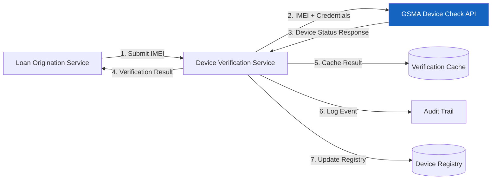
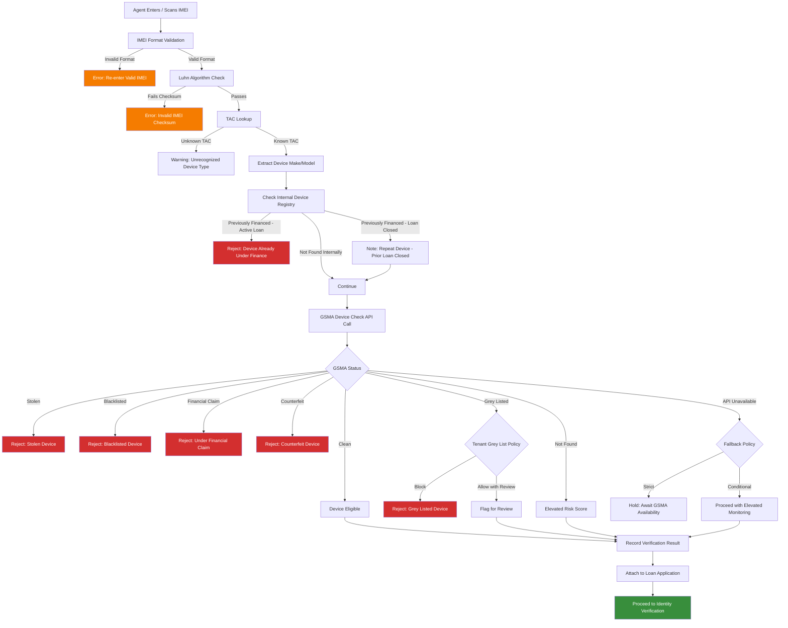

# Device Verification and GSMA Integration

## Overview

Device verification is a critical control point in the mobile device lending lifecycle. Before any device is financed, the platform must confirm that the device is genuine, not stolen, not under an existing financial claim, and not blacklisted by any operator. This document details the integration with the GSMA Device Check API, the device verification workflow, IMEI validation rules, and post-default blacklisting processes.

---

## GSMA Device Check API Integration

### About GSMA Device Check

The GSMA Device Check service is an industry-standard database maintained by the GSM Association that aggregates device status information from mobile operators, law enforcement agencies, insurance companies, and financial institutions worldwide. It provides a consolidated view of a device's history and current status.

### Integration Architecture



### API Request

```
POST https://api.devicecheck.gsma.com/v2/check
Authorization: Bearer {api_token}
Content-Type: application/json

{
  "imei": "353456789012345",
  "requestSource": "FINANCING_CHECK",
  "requestorId": "IINOVI_PLATFORM",
  "includeHistory": true,
  "historyDepthYears": 10
}
```

### API Response Structure

```json
{
  "imei": "353456789012345",
  "tac": "35345678",
  "deviceMake": "Samsung",
  "deviceModel": "Galaxy A15",
  "status": {
    "stolen": false,
    "blacklisted": false,
    "greyListed": false,
    "financialClaim": false,
    "counterfeit": false
  },
  "history": [
    {
      "date": "2024-06-15",
      "event": "FIRST_ACTIVATION",
      "country": "KE",
      "operator": "SAFARICOM"
    },
    {
      "date": "2024-08-20",
      "event": "OPERATOR_CHANGE",
      "country": "KE",
      "operator": "AIRTEL"
    }
  ],
  "checkTimestamp": "2025-11-15T10:30:00Z",
  "checkId": "CHK-2025-001234"
}
```

### Error Handling

| Error Code | Meaning | Platform Response |
|---|---|---|
| 200 | Success | Process result |
| 400 | Invalid IMEI format | Reject; prompt for re-entry |
| 401 | Authentication failure | Retry with refreshed credentials; alert ops |
| 404 | IMEI not found in database | Treat as unverified; apply elevated risk score |
| 429 | Rate limit exceeded | Queue and retry with exponential backoff |
| 500 | GSMA service error | Retry; if persistent, apply fallback policy |
| 503 | Service unavailable | Queue for later check; conditional proceed per policy |

### Fallback Policy

When the GSMA Device Check API is unavailable:

1. Check the local verification cache for a recent result (within 24 hours).
2. If no cached result, check the internal device registry for known status.
3. If no internal data, apply tenant-configurable fallback policy:
   - **Strict**: Block the application until GSMA is available.
   - **Conditional**: Allow proceed with elevated monitoring and mandatory re-check within 24 hours.
   - **Permissive**: Allow proceed with standard monitoring (not recommended for production).

---

## Device Status Categories

### Status Definitions

| Status | Definition | Financing Decision |
|---|---|---|
| **Clean** | No adverse records; device has a clear history | Eligible for financing |
| **Stolen** | Reported stolen to law enforcement or an operator in any country | Ineligible; reject immediately |
| **Blacklisted** | Blacklisted by one or more operators (may include stolen, fraud, or unpaid device plans) | Ineligible; reject immediately |
| **Under Financial Claim** | Device is currently subject to an active financing agreement with another institution | Ineligible; reject immediately |
| **Grey Listed** | Device imported or activated outside authorized distribution channels | Tenant-configurable; may require additional verification |
| **Counterfeit** | Device TAC does not match a genuine manufacturer allocation | Ineligible; reject immediately |
| **Not Found** | IMEI not present in the GSMA database | Elevated risk; additional verification required |

### Status Precedence

When multiple statuses apply, the most restrictive status governs the decision:

```
Stolen > Blacklisted > Under Financial Claim > Counterfeit > Grey Listed > Not Found > Clean
```

---

## Pre-Financing Verification Flow

### End-to-End Process



### Verification Record

Each verification produces a record attached to the loan application:

```json
{
  "verificationId": "DV-2025-001234",
  "imei": "353456789012345",
  "imei2": "353456789012346",
  "verifiedAt": "2025-11-15T10:30:00Z",
  "verifiedBy": "AGENT-001",
  "gsmaCheckId": "CHK-2025-001234",
  "gsmaStatus": "CLEAN",
  "internalRegistryStatus": "NOT_FOUND",
  "tacLookup": {
    "tac": "35345678",
    "make": "Samsung",
    "model": "Galaxy A15",
    "deviceType": "SMARTPHONE"
  },
  "imeiValidation": {
    "formatValid": true,
    "luhnValid": true,
    "lengthValid": true
  },
  "overallResult": "ELIGIBLE",
  "riskFlags": []
}
```

---

## Post-Default Blacklisting Process

When a loan reaches terminal default and all recovery efforts have been exhausted, the platform initiates a device blacklisting process through the GSMA.

### Eligibility Criteria

Blacklisting is initiated only when all of the following conditions are met:

| Criterion | Requirement |
|---|---|
| Loan status | Terminal default or write-off |
| Recovery attempts | All collection stages exhausted per tenant policy |
| Outstanding balance | Greater than zero |
| Device status | Device confirmed as not returned |
| Approval | Authorized by collections manager (maker-checker) |
| Legal review | Confirmed compliant with local regulatory requirements |

### Blacklisting Workflow

| Step | Actor | Action | System |
|---|---|---|---|
| 1 | Collections Agent | Initiates blacklist request with justification | Creates pending request |
| 2 | Collections Manager | Reviews and approves (maker-checker) | Validates eligibility criteria |
| 3 | System | Submits IMEI to GSMA for blacklisting | API call to GSMA |
| 4 | GSMA | Processes blacklist and propagates to operators | Global propagation |
| 5 | System | Records blacklist confirmation | Updates device registry and audit trail |
| 6 | System | Sends customer notification | SMS informing of blacklisting |

### Blacklist API Request

```
POST https://api.devicecheck.gsma.com/v2/report
Authorization: Bearer {api_token}
Content-Type: application/json

{
  "imei": "353456789012345",
  "reportType": "FINANCIAL_DEFAULT",
  "reporterOrganization": "IINOVI_PLATFORM",
  "reporterReference": "LOAN-2025-001234",
  "reportDate": "2025-11-15",
  "description": "Device under defaulted financial agreement. All recovery attempts exhausted.",
  "requestedAction": "BLACKLIST"
}
```

### Blacklist Reversal

If a customer subsequently settles their outstanding balance, the blacklist can be reversed:

1. Customer makes full settlement payment.
2. System verifies payment clearance.
3. Collections manager approves reversal request.
4. Platform submits reversal to GSMA.
5. GSMA removes blacklist and notifies operators.
6. Customer is notified of blacklist removal.

---

## IMEI Format Validation

### Validation Rules

All IMEI values submitted to the platform undergo rigorous format validation before any downstream processing.

#### Rule 1: Length Check

- IMEI must be exactly 15 digits.
- No alphabetic characters, spaces, or special characters.
- Leading zeros are significant and must be preserved.

#### Rule 2: Luhn Algorithm (Check Digit Verification)

The 15th digit of the IMEI is a check digit calculated using the Luhn algorithm:

1. Starting from the rightmost digit (excluding the check digit), double every second digit.
2. If doubling results in a value greater than 9, subtract 9.
3. Sum all digits.
4. The check digit is the value needed to make the total sum a multiple of 10.

**Example Validation**

```
IMEI: 3 5 3 4 5 6 7 8 9 0 1 2 3 4 5
                                      ^ check digit

Step 1: Double alternating digits (right to left, excluding check digit):
        3  10  3  8  5  12  7  16  9  0  1  4  3  8

Step 2: Subtract 9 from values > 9:
        3  1  3  8  5  3  7  7  9  0  1  4  3  8

Step 3: Sum = 62

Step 4: Check digit = (10 - (62 mod 10)) mod 10 = 8

If the calculated check digit matches the 15th digit, the IMEI is valid.
```

#### Rule 3: TAC Validation

- The first 8 digits form the Type Allocation Code (TAC).
- The TAC is validated against the GSMA TAC database.
- A valid TAC confirms the device manufacturer and model.
- An unrecognized TAC may indicate a counterfeit device.

#### Rule 4: Serial Number Range

- Digits 9--14 form the device serial number.
- While the serial number itself is not independently validated, patterns of sequential serial numbers across loan applications may indicate fraud (bulk device diversion).

### Validation Response

| Check | Status | Action |
|---|---|---|
| Length valid, Luhn valid, TAC valid | Pass | Proceed |
| Length invalid | Fail | Reject; prompt for re-entry |
| Luhn invalid | Fail | Reject; prompt for re-entry |
| TAC unrecognized | Warning | Proceed with elevated risk flag |

---

## Dual-SIM IMEI Handling

### Background

Many devices in target markets are dual-SIM capable. Each SIM slot has its own IMEI. Proper handling of both IMEIs is critical for device identification, verification, and lock management.

### Capture Requirements

| Requirement | Detail |
|---|---|
| Primary IMEI (IMEI-1) | Required for all applications; canonical device identifier |
| Secondary IMEI (IMEI-2) | Required for dual-SIM devices; optional for single-SIM |
| Capture method | USSD code (*#06#), device settings, or barcode scan |
| Agent verification | Agent must confirm both IMEIs match the physical device |

### Validation Process

Both IMEIs undergo identical validation:

1. Format validation (length, Luhn, TAC).
2. Internal device registry check.
3. GSMA Device Check API call.
4. Fraud database cross-reference.

### Edge Cases

| Scenario | Handling |
|---|---|
| IMEI-1 clean, IMEI-2 blacklisted | Reject; both IMEIs must be clean |
| Only one IMEI provided for dual-SIM device | Warning; agent must confirm single-SIM or capture IMEI-2 |
| IMEIs have different TACs | Reject; invalid device configuration (possible tampering) |
| IMEI-2 matches a different device in registry | Reject; possible IMEI cloning or database error |

### Lock and Monitoring

- Knox Guard device lock applies to the physical device, affecting both SIM slots.
- SIM Control policies can be configured for both slots independently.
- Heartbeat monitoring reports SIM status for both slots.
- SIM change detection applies to both IMEI-1 and IMEI-2 slots.

---

## Device Registry

### Purpose

The internal Device Registry maintains a record of every device that has been verified, financed, or flagged through the platform. It serves as a fast lookup cache and supplements GSMA data with platform-specific information.

### Registry Record

| Field | Description |
|---|---|
| `imei1` | Primary IMEI |
| `imei2` | Secondary IMEI (if dual-SIM) |
| `tac` | Type Allocation Code |
| `make` | Device manufacturer |
| `model` | Device model |
| `firstSeenAt` | Timestamp of first appearance on platform |
| `currentStatus` | `AVAILABLE`, `FINANCED`, `RETURNED`, `DEFAULTED`, `BLACKLISTED` |
| `activeLoanId` | Reference to current active loan (if any) |
| `loanHistory` | Array of prior loan references |
| `gsmaLastChecked` | Timestamp of most recent GSMA verification |
| `gsmaLastStatus` | Most recent GSMA status result |
| `knoxDeviceId` | Knox Guard enrollment identifier (if enrolled) |
| `riskFlags` | Array of active risk flags |

### Status Transitions

| From | Event | To |
|---|---|---|
| -- | Device first verified | `AVAILABLE` |
| `AVAILABLE` | Loan disbursed | `FINANCED` |
| `FINANCED` | Loan fully repaid | `AVAILABLE` |
| `FINANCED` | Device returned (voluntary) | `RETURNED` |
| `FINANCED` | Loan defaulted | `DEFAULTED` |
| `DEFAULTED` | GSMA blacklist submitted | `BLACKLISTED` |
| `BLACKLISTED` | Customer settles, blacklist reversed | `AVAILABLE` |
| `RETURNED` | Refurbished, re-entered inventory | `AVAILABLE` |

---

## Monitoring and Reporting

### Key Metrics

| Metric | Description | Target |
|---|---|---|
| Verification success rate | Percentage of devices passing all checks | > 95% |
| GSMA API availability | Uptime of GSMA Device Check API | > 99.5% |
| Mean verification time | End-to-end verification duration | < 5 seconds |
| Blacklist hit rate | Percentage of applications rejected due to device status | Monitoring (no target) |
| Blacklist submission success rate | Percentage of post-default blacklist requests processed | > 99% |

### Alerts

| Condition | Alert |
|---|---|
| GSMA API downtime > 5 minutes | Operations team notification |
| Blacklist hit rate spike (> 2x daily average) | Fraud team notification |
| TAC validation failure rate spike | Possible counterfeit device ring; fraud alert |
| Verification latency > 10 seconds | Performance degradation alert |

---

## Related Documentation

- [Fraud Risk Framework](fraud-framework.md)
- [Identity Fraud Prevention](identity-fraud.md)
- [SIM Swap Detection](sim-swap-detection.md)
- [Central Customer Registry and Deduplication](../customer-registry/deduplication.md)
- [Audit Trail](../audit/audit-trail.md)
