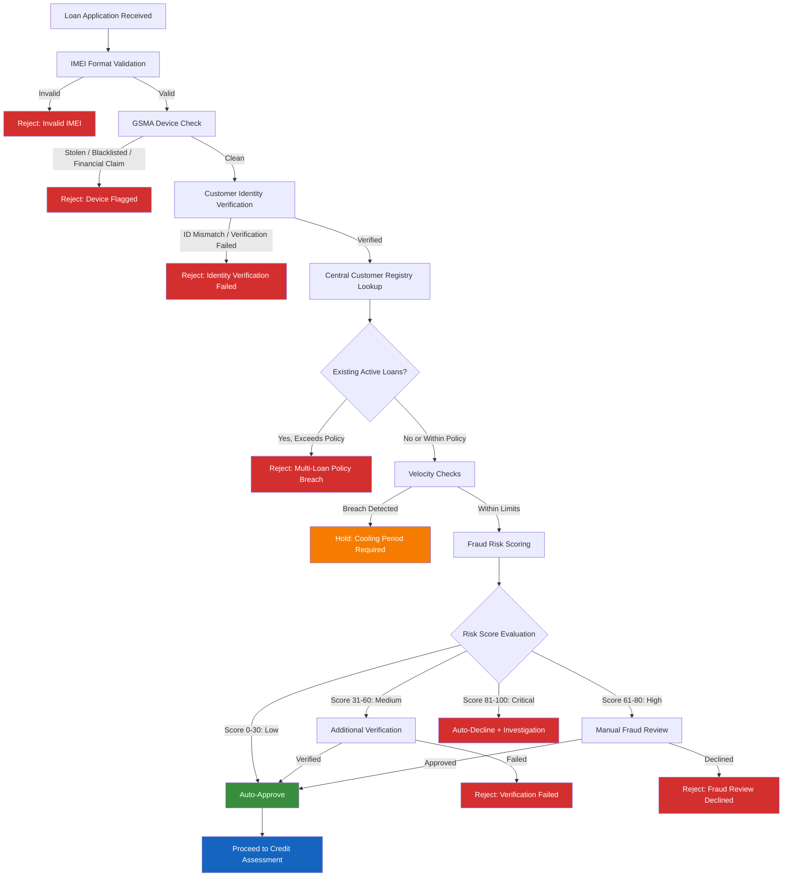

# Fraud Risk Framework

## Overview

The Fraud Risk Framework provides a comprehensive, multi-layered defense system for the Mobile Device Lending Solution. It addresses the unique fraud vectors inherent in device-financed lending across multiple tenants, geographies, and distribution channels. The framework operates across the full loan lifecycle -- from application through repayment -- and integrates real-time detection, risk scoring, velocity controls, and investigation workflows.

---

## Fraud Categories

### 1. Identity Fraud

Identity fraud occurs when a borrower misrepresents their identity to obtain a device loan they would not otherwise qualify for.

| Sub-Type | Description | Detection Method |
|---|---|---|
| Stolen ID | Use of another person's national ID document | ID verification API, biometric mismatch |
| Impersonation | Presenting as another person at point of sale | Biometric matching, liveness detection |
| Synthetic Identity | Fabricated identity using a mix of real and fake data | Cross-reference CRB, identity provider anomaly flags |
| Repeat Application | Same person applying under different identifiers | Central customer registry deduplication |

### 2. Device Fraud

Device fraud targets the physical asset being financed.

| Sub-Type | Description | Detection Method |
|---|---|---|
| Stolen Device | Financing a device that was previously reported stolen | GSMA Device Check API |
| Blacklisted IMEI | Device IMEI appears on national or international blacklists | IMEI validation + blacklist cross-reference |
| IMEI Tampering | Altered or cloned IMEI to bypass checks | Luhn algorithm validation, GSMA history check |
| Device Swapping | Replacing the financed device with a different unit post-disbursement | Knox Guard device binding, IMEI heartbeat monitoring |

### 3. Payment Fraud

Unauthorized or manipulated payment transactions.

| Sub-Type | Description | Detection Method |
|---|---|---|
| Unauthorized Mobile Money | Payments initiated from compromised wallets | Mobile money provider fraud flags, transaction verification |
| Chargeback Abuse | Legitimate payment reversed after device unlock | Payment reconciliation, chargeback pattern analysis |
| Overpayment Scam | Overpay then request refund to a different account | Refund policy enforcement, account matching |

### 4. Collusion Fraud

Coordinated fraud between internal actors (cashiers, agents) and customers.

| Sub-Type | Description | Detection Method |
|---|---|---|
| Cashier-Customer Collusion | Agent processes loan for ineligible customer in exchange for kickback | Agent performance anomaly detection, geo-clustering |
| Ghost Customers | Agent creates fictitious loan applications | Biometric verification, customer callback verification |
| Inventory Diversion | Devices diverted from authorized distribution | Inventory reconciliation, serial number tracking |

### 5. SIM Swap Fraud

Unauthorized SIM replacement used to intercept OTPs, bypass device lock controls, or hijack mobile money accounts.

| Sub-Type | Description | Detection Method |
|---|---|---|
| Unauthorized SIM Swap | SIM replaced without customer consent | Telco SIM swap API, Knox Guard SIM Control policy |
| SIM Cloning | Duplicate SIM created to intercept communications | Heartbeat anomaly detection, concurrent session alerts |

---

## Risk Scoring Model

### Score Composition

Each loan application receives a composite fraud risk score (0--100) computed from weighted signals:

| Signal Category | Weight | Inputs |
|---|---|---|
| Identity Verification | 25% | ID match confidence, biometric score, CRB status |
| Device Integrity | 20% | GSMA status, IMEI validation, device age |
| Customer History | 20% | Repeat customer flag, prior loan performance, registry matches |
| Velocity Indicators | 15% | Application frequency, MSISDN reuse, geo-velocity |
| Channel Risk | 10% | Agent risk profile, location risk tier, time-of-day |
| Payment Behavior | 10% | Mobile money account age, historical transaction patterns |

### Score Thresholds

| Score Range | Classification | Action |
|---|---|---|
| 0--30 | Low Risk | Auto-approve (subject to credit policy) |
| 31--60 | Medium Risk | Additional verification required (e.g., supervisor approval, callback) |
| 61--80 | High Risk | Manual review by fraud analyst |
| 81--100 | Critical Risk | Auto-decline, flag for investigation |

### Score Persistence

- Scores are stored with the loan application for audit purposes.
- Score components are individually logged to support model tuning.
- Historical scores contribute to customer risk profile evolution.

---

## Real-Time Fraud Detection Triggers

The following events trigger immediate fraud evaluation during loan origination and servicing:

### Origination Triggers

| Trigger | Condition | Response |
|---|---|---|
| GSMA Blacklist Hit | Device IMEI found on stolen/blacklisted registry | Block loan, alert fraud team |
| Identity Mismatch | ID verification returns low confidence or mismatch | Escalate to manual review |
| Velocity Breach | Application rate exceeds threshold for MSISDN or ID | Hold application, require cooling period |
| Duplicate Detection | Customer registry returns existing active loan | Evaluate multi-loan policy, potentially block |
| Agent Anomaly | Agent's application volume or approval rate deviates significantly | Flag for supervisory review |
| Geo-Anomaly | Application location inconsistent with customer address or prior history | Additional verification step |

### Servicing Triggers

| Trigger | Condition | Response |
|---|---|---|
| SIM Swap Detected | Device reports SIM change or telco notifies swap | Auto-lock device, verify with customer |
| Factory Reset Detected | OEM API reports factory reset event | Alert fraud team, trigger re-lock sequence |
| Payment Anomaly | Unusual payment pattern (e.g., full early payoff on high-risk account) | Flag for review |
| Heartbeat Loss | Device management app stops reporting | Escalate after configurable silence window |

---

## Velocity Checks

Velocity checks prevent rapid-fire abuse by limiting the rate of loan-related actions within defined time windows.

### Application Velocity

| Dimension | Limit | Window | Action on Breach |
|---|---|---|---|
| Per MSISDN | 1 application | 24 hours | Reject with cooling period |
| Per National ID | 1 application | 7 days | Reject, flag for review |
| Per Device (IMEI) | 1 application | Lifetime | Reject (device already financed) |
| Per Agent | 20 applications | 1 hour | Throttle agent, supervisory alert |
| Per Location | 50 applications | 1 hour | Location risk escalation |

### Payment Velocity

| Dimension | Limit | Window | Action on Breach |
|---|---|---|---|
| Per Loan | 5 payment attempts | 1 hour | Temporary block, fraud review |
| Per MSISDN (across loans) | 10 payments | 24 hours | Flag for investigation |

### Configuration

- All velocity thresholds are configurable per tenant and per loan product.
- Velocity state is maintained in a distributed cache (Redis) for sub-millisecond evaluation.
- Breaches are logged as audit events with full context.

---

## Multiple Loan Prevention

### Cross-Tenant Customer Registry Query

Before approving any loan, the platform queries the Central Customer Registry to determine the applicant's exposure across all tenants:

1. **Lookup by National ID** -- primary deduplication key.
2. **Lookup by MSISDN** -- secondary key, catches ID-sharing scenarios.
3. **Fuzzy Match on Name + Date of Birth** -- tertiary fallback for data quality issues.

### Enforcement Rules

| Rule | Default | Configurable |
|---|---|---|
| Maximum concurrent active loans per customer | 1 | Yes, per tenant policy |
| Maximum total outstanding exposure per customer | Defined by credit policy | Yes, currency amount |
| Minimum days between loan applications | 7 | Yes, per loan product |
| Cross-tenant visibility | Full exposure view | Privacy-filtered (amounts only, no tenant names) |

### Decision Flow

1. Application received with customer identifiers.
2. Registry returns all linked loans (active, defaulted, written-off).
3. Policy engine evaluates against tenant-specific multi-loan rules.
4. If within policy: proceed to credit scoring.
5. If exceeds policy: decline with reason code, log event.

---

## GSMA Device Check

### Integration Overview

The platform integrates with the GSMA Device Check API to verify the provenance and status of every device before financing.

### Verification Scope

| Check | Description | Blocking |
|---|---|---|
| Stolen Status | Device reported stolen in any participating country | Yes |
| Blacklisted | Device blacklisted by any operator | Yes |
| Financial Claim | Device is under an existing financial agreement | Yes |
| 10-Year History | Full status history over the past decade | Informational |
| Grey Market | Device imported outside authorized channels | Configurable |

### Pre-Financing Flow

1. Agent scans or enters the device IMEI at point of sale.
2. Platform sends IMEI to GSMA Device Check API.
3. API returns device status and history.
4. If any blocking condition is met, the loan application is immediately declined.
5. If clean, the result is cached and attached to the loan record.

### Post-Default Blacklisting

When a loan enters terminal default:

1. The collections team initiates the blacklist request after all recovery options are exhausted.
2. The platform submits the IMEI to GSMA for blacklisting.
3. GSMA propagates the blacklist to participating operators globally.
4. The blacklist status is recorded in the loan and device audit trail.

---

## IMEI Validation

### Format Validation

All IMEIs are validated before any downstream processing:

- **Length Check**: Must be exactly 15 digits.
- **Luhn Algorithm**: The check digit (15th digit) must satisfy the Luhn checksum.
- **TAC Validation**: The first 8 digits (Type Allocation Code) are validated against the GSMA TAC database to confirm the device make and model.

### Fraud Database Cross-Reference

| Database | Check | Frequency |
|---|---|---|
| Internal Fraud Registry | Previously defaulted or fraud-flagged devices | Real-time |
| GSMA Device Check | Global stolen/blacklisted status | Real-time |
| National Operator Blacklist | Country-specific blacklist | Real-time |
| Tenant Device Inventory | Verify device originated from authorized stock | Real-time |

### Dual-SIM IMEI Handling

For dual-SIM devices, both IMEI slots are captured and validated:

- IMEI-1 (primary) is used as the canonical device identifier.
- IMEI-2 is stored, validated, and cross-referenced independently.
- Both IMEIs are submitted to GSMA Device Check.
- Device lock policies apply to the physical device (both slots).

---

## Factory Reset Detection

### Detection Methods

| Method | Mechanism | Latency |
|---|---|---|
| OEM API (Samsung Knox) | Knox Guard detects reset via firmware-level integration | Near real-time |
| Device Management App Heartbeat | App ceases reporting after reset; absence triggers alert | Minutes to hours (configurable threshold) |
| OEM Push Notification | Some OEMs provide push callbacks on factory reset events | Near real-time |

### Response Workflow

1. Factory reset event detected.
2. System generates a `FACTORY_RESET_DETECTED` event.
3. Device is flagged in Portfolio Service as `AT_RISK`.
4. If device is under active loan with outstanding balance:
   - Attempt remote re-lock via Knox Guard (persists through reset).
   - Send notification to customer (SMS to registered MSISDN).
   - Alert assigned collections agent.
5. If re-lock is successful, update device status to `LOCKED`.
6. If re-lock fails, escalate to fraud investigation.

---

## Fraud Investigation Workflow

### Case Lifecycle

| Stage | Description | SLA |
|---|---|---|
| Detection | Automated alert generated by fraud engine | Immediate |
| Triage | Fraud analyst reviews alert, assigns severity | 4 hours |
| Investigation | Evidence gathering, customer contact, agent interview | 48 hours |
| Decision | Confirm fraud or false positive | 72 hours |
| Action | Lock device, write-off loan, blacklist customer/agent, refer to law enforcement | Per policy |
| Closure | Document findings, update fraud models | 7 days |

### Evidence Collection

- Loan application data (ID scan, biometrics, agent notes).
- Device telemetry (location history, SIM changes, heartbeat logs).
- Payment history and mobile money transaction records.
- GSMA Device Check results.
- Customer registry matches and cross-tenant exposure.
- Agent activity logs and performance metrics.

### Escalation Matrix

| Severity | Criteria | Escalation |
|---|---|---|
| Low | Single anomaly, low value, likely false positive | Fraud analyst |
| Medium | Multiple signals, moderate value, pattern match | Senior fraud analyst |
| High | Confirmed fraud, high value, or organized ring suspected | Fraud manager + legal |
| Critical | Internal collusion, systemic vulnerability, law enforcement required | Head of risk + executive |

---

## Fraud Detection During Loan Origination

The following diagram illustrates the end-to-end fraud detection flow executed during loan origination:

---

## Configuration and Tuning

### Tenant-Level Overrides

Each tenant may customize the following fraud parameters:

- Risk score thresholds and corresponding actions.
- Velocity check limits and time windows.
- Multi-loan policy (maximum concurrent loans, maximum exposure).
- GSMA Device Check enforcement (blocking vs. advisory for grey market devices).
- Investigation SLAs and escalation paths.

### Model Feedback Loop

- Confirmed fraud cases and false positives are fed back into the risk scoring model.
- Monthly model performance review (precision, recall, false positive rate).
- Quarterly threshold recalibration based on observed fraud patterns.
- A/B testing of new detection rules in shadow mode before enforcement.

---

## Related Documentation

- [SIM Swap Detection](sim-swap-detection.md)
- [Identity Fraud Prevention](identity-fraud.md)
- [Device Verification and GSMA Integration](device-verification.md)
- [Central Customer Registry and Deduplication](../customer-registry/deduplication.md)
- [Audit Trail](../audit/audit-trail.md)
