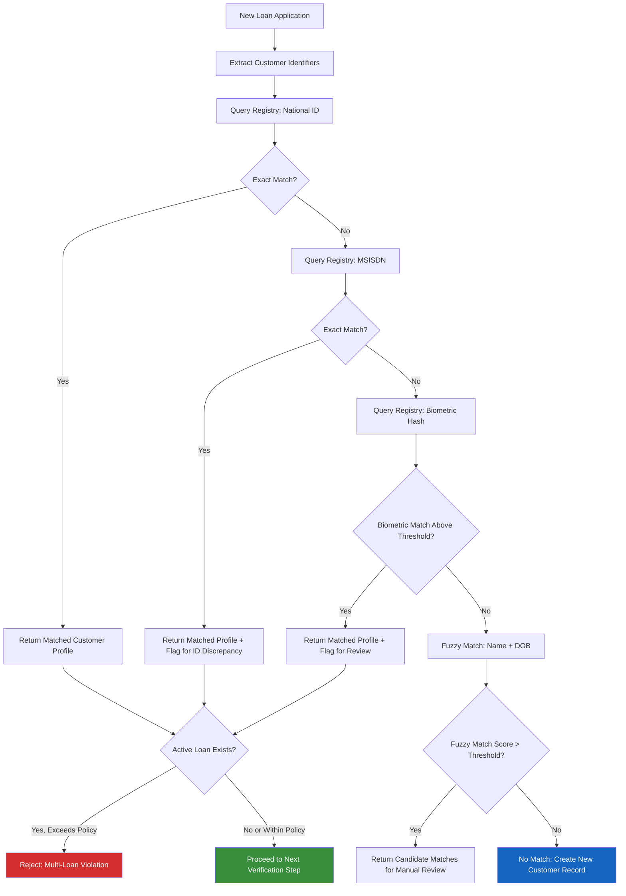

# Identity Fraud Prevention

## Overview

Identity fraud is the most prevalent fraud vector in mobile device lending. It occurs when an individual misrepresents their identity -- using stolen documents, fabricated credentials, or manipulated biometrics -- to obtain a financed device they have no intention of repaying. This document describes the platform's multi-layered identity fraud prevention strategy, including central registry deduplication, identity verification, biometric matching, velocity controls, blacklist checking, and fraud ring detection.

---

## Duplicate Detection via Central Customer Registry

### Purpose

The Central Customer Registry maintains a platform-wide (not tenant-scoped) view of every customer who has applied for or received a device loan. Its primary fraud prevention function is to detect when a single individual attempts to obtain multiple loans -- whether within a single tenant or across multiple tenants.

### Deduplication Keys

The registry uses a hierarchical matching strategy to identify duplicate customers:

| Priority | Key | Match Type | Confidence |
|---|---|---|---|
| 1 | National ID Number | Exact | Very High |
| 2 | MSISDN | Exact | High |
| 3 | Biometric Hash | Fuzzy (threshold-based) | Very High |
| 4 | Full Name + Date of Birth | Fuzzy (Levenshtein distance) | Medium |
| 5 | Full Name + Location | Fuzzy | Low |

### Matching Workflow

### Cross-Tenant Exposure View

When a match is found, the registry returns an exposure summary:

| Data Point | Shared Cross-Tenant | Rationale |
|---|---|---|
| Number of active loans | Yes | Multi-loan policy enforcement |
| Total outstanding balance | Yes (aggregated) | Exposure limit enforcement |
| Loan performance status | Yes (categories only) | Risk assessment |
| Tenant names | No | Privacy protection |
| Loan product details | No | Competitive sensitivity |
| Payment history details | No | Privacy protection |
| Default/write-off history | Yes (flags only) | Risk assessment |

---

## ID Verification

### National ID Cross-Check

Every loan application requires verification of the customer's national identification document against an authoritative identity provider.

**Verification Flow**

1. Agent captures the customer's national ID number and scans the physical document (front and back).
2. Platform submits the ID number, name, and date of birth to the identity provider API.
3. Identity provider returns:
   - Match status (confirmed / partial match / no match / not found).
   - Data quality indicators (e.g., ID expired, ID format invalid).
   - Photograph (where available) for biometric comparison.

**Identity Provider Response Handling**

| Response | Action | Risk Impact |
|---|---|---|
| Full Match | Proceed | Risk score reduced |
| Partial Match (name variance) | Manual review; agent confirms with customer | Neutral |
| No Match | Reject application | Application declined |
| ID Not Found | Reject or manual escalation (depending on provider coverage) | High risk flag |
| ID Expired | Reject; customer must renew ID | Application declined |
| Provider Unavailable | Queue for retry; allow conditional proceed if retry policy permits | Elevated monitoring |

### Document Authenticity

Where supported, the platform performs additional checks on the scanned ID document:

- **MRZ Validation**: Machine-Readable Zone parsed and cross-checked against entered data.
- **Hologram / Security Feature Detection**: Computer vision analysis for document tampering indicators.
- **Document Expiry Check**: Reject expired identification documents.
- **Document Type Validation**: Accept only recognized national ID types per jurisdiction.

---

## Biometric Matching

### Enrollment

During the first loan application, the customer's biometric data is captured:

- **Facial Photograph**: High-resolution selfie captured via the agent's device or in-app camera.
- **Liveness Detection**: Anti-spoofing check ensures a live person is present (blink detection, head movement, 3D depth analysis).

### Matching Process

| Scenario | Source Image | Target Image | Purpose |
|---|---|---|---|
| ID Verification | Selfie (live capture) | ID document photograph | Confirm applicant matches ID holder |
| Repeat Customer | Selfie (live capture) | Previously enrolled biometric | Confirm returning customer identity |
| Cross-Tenant Check | Selfie (live capture) | Registry biometric hash | Detect same person under different IDs |
| Fraud Investigation | Selfie (live capture) | Fraud database | Identify known fraudsters |

### Match Scoring

| Score Range | Interpretation | Action |
|---|---|---|
| 95--100% | Strong match | Accept |
| 80--94% | Probable match | Manual review with side-by-side comparison |
| 50--79% | Uncertain | Reject or require in-person verification |
| Below 50% | No match | Reject application |

### Privacy and Data Handling

- Biometric data is stored as irreversible hashes, not raw images.
- Raw images are retained only for the duration of the verification session and then discarded.
- Biometric hashes are stored in the Central Customer Registry for deduplication.
- All biometric processing complies with applicable data protection regulations.

---

## Velocity Checks on Applications

### Application Velocity Rules

Velocity checks detect rapid-fire application patterns that are indicative of identity fraud or coordinated fraud rings.

| Dimension | Threshold | Window | Rationale |
|---|---|---|---|
| Applications per National ID | 1 | 7 days | Prevents repeat applications with same ID |
| Applications per MSISDN | 1 | 24 hours | Prevents phone number recycling |
| Applications per biometric | 1 | 30 days | Catches same person with different IDs |
| Applications per device IMEI | 1 | Lifetime | Device should only be financed once |
| Applications per agent | 20 | 1 hour | Catches agent-driven fraud |
| Applications per location | 50 | 1 hour | Detects location-based fraud surges |
| Declined applications per ID | 3 | 30 days | Auto-blacklist after repeated declines |

### Geo-Velocity Checks

Geo-velocity detects physically impossible application patterns:

- Application submitted in City A at 10:00 AM.
- Application submitted in City B (500 km away) at 10:30 AM.
- Travel time between locations makes both applications impossible for a single person.
- Trigger: `GEO_VELOCITY_BREACH` -- both applications flagged for investigation.

### Implementation

- Velocity counters are maintained in a distributed cache (Redis) with TTL matching the check window.
- Atomic increment operations ensure accuracy under concurrent load.
- Breaches generate audit events with full application context.
- Thresholds are configurable per tenant and per loan product.

---

## Blacklist Checking

### Internal Blacklist

The platform maintains an internal blacklist of individuals and identifiers associated with confirmed fraud or severe default.

| Blacklist Entity | Identifier Types | Source |
|---|---|---|
| Customer | National ID, MSISDN, Biometric Hash | Fraud investigations, terminal defaults |
| Device | IMEI | Stolen device reports, default blacklisting |
| Agent | Agent ID, MSISDN | Confirmed collusion, policy violations |
| Location | GPS coordinates, store ID | Fraud cluster identification |

**Blacklist Check Timing**

- Checked at application submission (blocking).
- Checked at disbursement (blocking).
- Checked periodically against active portfolio (monitoring).

### Credit Reference Bureau (CRB) Integration

| CRB Check | Description | Impact |
|---|---|---|
| Credit Score | Numerical creditworthiness score | Input to risk scoring model |
| Negative Listings | Defaults, write-offs, legal actions | May be auto-decline depending on policy |
| Active Credit Facilities | Current borrowing across lenders | Input to affordability assessment |
| Inquiry History | Recent credit applications by the customer | Velocity signal |
| Fraud Alerts | Fraud markers placed by other lenders | High-severity flag |

**CRB Response Handling**

| CRB Status | Action |
|---|---|
| Clean record, acceptable score | Proceed |
| Negative listing (minor, old) | Elevated risk score; may proceed with conditions |
| Negative listing (major, recent) | Auto-decline |
| Fraud alert active | Auto-decline, create internal fraud case |
| CRB unavailable | Conditional proceed with elevated monitoring or queue for retry |

---

## Fraud Ring Detection Patterns

### What Are Fraud Rings?

Fraud rings are coordinated groups of individuals who systematically exploit lending processes. In device lending, common patterns include:

- A single organizer recruits multiple individuals to apply for loans using their real or stolen IDs.
- Devices are collected and resold on the black market.
- Loans are never repaid.

### Detection Signals

| Signal | Description | Detection Method |
|---|---|---|
| Shared Contact Information | Multiple applications sharing the same phone number, address, or next-of-kin | Graph analysis on application data |
| Common Agent | Disproportionate number of defaults linked to a single agent | Agent performance analytics |
| Geographic Clustering | Multiple applications from the same location in a short timeframe | Geo-temporal analysis |
| Sequential IMEIs | Devices with consecutive serial numbers applied for by different customers | IMEI sequence analysis |
| Payment Pattern Similarity | Multiple loans with identical payment behavior (e.g., all default on day 30) | Payment pattern clustering |
| Biometric Similarity | Facial recognition matches across multiple applications with different IDs | Cross-application biometric comparison |
| Linked Financial Accounts | Multiple loans with payments from the same mobile money account | Payment source analysis |

### Graph-Based Analysis

The platform constructs relationship graphs to identify fraud rings:

**Nodes**: Customers, MSISDNs, Devices, Agents, Locations, Mobile Money Accounts.

**Edges**: Application relationships, shared identifiers, payment flows.

**Detection Rules**:

1. **Connected Component Analysis**: Groups of customers connected by two or more shared attributes trigger investigation.
2. **Centrality Detection**: Nodes with unusually high connectivity (e.g., one MSISDN linked to 10 customers) are flagged.
3. **Temporal Clustering**: Multiple applications from connected nodes within a short time window.
4. **Default Correlation**: Connected nodes with correlated default events.

### Investigation Triggers

| Pattern | Minimum Threshold | Action |
|---|---|---|
| Shared MSISDN across applications | 3 applications | Flag all for review |
| Same agent, high default rate | Default rate > 2x portfolio average | Agent suspension pending review |
| Geographic cluster + high decline rate | 5 applications from same location, > 50% declined | Location risk escalation |
| Sequential IMEI applications | 3 sequential IMEIs | Flag all, investigate supply chain |
| Biometric match, different IDs | Any match > 80% confidence | Immediate fraud case |

---

## Response and Remediation

### Immediate Actions

| Finding | Response |
|---|---|
| Confirmed identity fraud (single) | Lock device, blacklist customer, report to law enforcement |
| Confirmed fraud ring | Lock all linked devices, blacklist all participants, suspend agent, report to law enforcement |
| Suspected fraud (insufficient evidence) | Enhanced monitoring, restrict further applications |
| False positive | Update risk model, document for model training |

### Preventive Measures

- Regular agent training on fraud awareness and document verification.
- Randomized quality assurance audits on approved applications.
- Customer callback verification for high-value loans.
- Periodic review of blacklist accuracy and coverage.
- Fraud trend reporting to tenants (anonymized, aggregated).

---

## Related Documentation

- [Fraud Risk Framework](fraud-framework.md)
- [SIM Swap Detection](sim-swap-detection.md)
- [Device Verification and GSMA Integration](device-verification.md)
- [Central Customer Registry and Deduplication](../customer-registry/deduplication.md)
- [Audit Trail](../audit/audit-trail.md)
