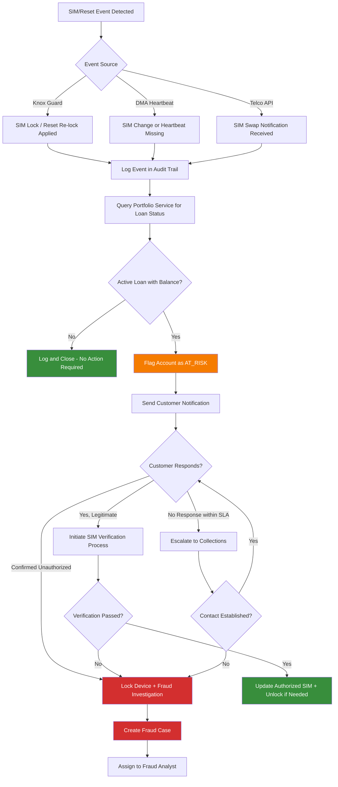

# SIM Swap and Factory Reset Detection

## Overview

SIM swap and factory reset events represent critical security threats in the device lending lifecycle. A SIM swap may indicate account takeover or an attempt to bypass device lock controls. A factory reset may signal an attempt to remove device management software or circumvent payment enforcement. This document details the detection methods, response workflows, and integration points for both event types.

---

## SIM Swap Detection Methods

### Method 1: Knox Guard SIM Control Policy

Samsung Knox Guard provides firmware-level SIM control that persists through factory resets and software modifications.

**How It Works**

1. During device enrollment, Knox Guard registers the authorized SIM card(s) associated with the financed device.
2. The SIM Control policy is pushed to the device as part of the Knox Guard configuration.
3. If the SIM is removed or replaced with an unauthorized SIM, Knox Guard automatically locks the device.
4. The lock is enforced at the firmware level and cannot be bypassed by the end user.

**Configuration Options**

| Parameter | Description | Default |
|---|---|---|
| `allowedSimCards` | List of ICCID(s) authorized for this device | SIM present at enrollment |
| `lockOnSimRemoval` | Lock device when SIM is physically removed | Enabled |
| `lockOnSimChange` | Lock device when a different SIM is inserted | Enabled |
| `graceWindowMinutes` | Time allowed before lock engages (for legitimate SIM swaps) | 0 (immediate) |
| `notifyOnSimEvent` | Send event notification to platform | Enabled |

**Advantages**

- Operates at the firmware level; cannot be circumvented by app uninstall or factory reset.
- Near-instantaneous detection and response.
- Works even when the device has no internet connectivity (lock queued, enforced on next boot).

**Limitations**

- Available only on Samsung devices with Knox Guard support.
- Requires Knox Guard license and enrollment.
- Grace window configuration must balance security with user convenience (e.g., legitimate SIM upgrades).

---

### Method 2: Device Management App Heartbeat Monitoring

The Device Management App (DMA) installed on the financed device provides an application-level SIM monitoring capability.

**How It Works**

1. The DMA reads the current SIM ICCID and MSISDN at each heartbeat interval.
2. Each heartbeat payload includes the current SIM identifier(s).
3. The platform compares the reported SIM against the authorized SIM on file.
4. A mismatch triggers a `SIM_CHANGE_DETECTED` event.

**Heartbeat Payload (Relevant Fields)**

```json
{
  "deviceId": "IMEI-123456789012345",
  "timestamp": "2025-11-15T10:30:00Z",
  "simSlot1": {
    "iccid": "8925401234567890123",
    "msisdn": "+254712345678",
    "operator": "Safaricom"
  },
  "simSlot2": {
    "iccid": null,
    "msisdn": null,
    "operator": null
  },
  "batteryLevel": 72,
  "connectivityStatus": "MOBILE_DATA"
}
```

**Detection Logic**

| Condition | Event Generated | Severity |
|---|---|---|
| SIM ICCID changed from registered value | `SIM_CHANGE_DETECTED` | High |
| SIM removed (slot empty) | `SIM_REMOVED` | Medium |
| New SIM inserted in previously empty slot | `SIM_ADDED` | Low |
| Both SIM slots changed simultaneously | `DUAL_SIM_CHANGE_DETECTED` | Critical |
| No heartbeat received within threshold | `HEARTBEAT_MISSING` | Medium |

**Heartbeat Configuration**

| Parameter | Description | Default |
|---|---|---|
| `heartbeatIntervalMinutes` | Normal reporting interval | 60 |
| `elevatedHeartbeatIntervalMinutes` | Interval when account is flagged | 15 |
| `missedHeartbeatThreshold` | Consecutive misses before alert | 3 |
| `reportSimDetails` | Include SIM information in heartbeat | Enabled |

**Advantages**

- Works across all Android device manufacturers (not limited to Samsung).
- Provides additional device telemetry alongside SIM monitoring.
- Configurable detection sensitivity.

**Limitations**

- Can be circumvented by factory reset (app is removed).
- Detection latency depends on heartbeat interval.
- Requires internet connectivity to report.

---

### Method 3: Telco SIM Swap Notification API

Integration with mobile network operator (MNO) APIs to receive real-time SIM swap notifications.

**How It Works**

1. The platform registers MSISDNs of active loan customers with the telco SIM swap notification service.
2. When a SIM swap is processed by the MNO for a registered MSISDN, the MNO sends a webhook notification to the platform.
3. The platform processes the notification and triggers the appropriate response workflow.

**Webhook Payload (Example)**

```json
{
  "eventType": "SIM_SWAP",
  "msisdn": "+254712345678",
  "previousIccid": "8925401234567890123",
  "newIccid": "8925401234567890456",
  "swapTimestamp": "2025-11-15T10:25:00Z",
  "swapChannel": "RETAIL_STORE",
  "operatorCode": "SAFARICOM"
}
```

**Integration Considerations**

| Aspect | Detail |
|---|---|
| API Availability | Varies by MNO; not universally available |
| Latency | Typically near real-time (seconds to minutes) |
| Coverage | Only covers the specific MNO integrated |
| Cost | Per-event or subscription-based pricing |
| Data Privacy | Requires customer consent for MSISDN registration |

**Advantages**

- Detects SIM swaps even when the device is off or the DMA is not installed.
- Independent of device manufacturer or management software.
- Captures swaps initiated through any channel (retail, USSD, customer care).

**Limitations**

- Requires commercial agreement with each MNO.
- API specifications vary across operators and markets.
- May not be available in all operating regions.

---

## Factory Reset Detection via OEM APIs

### Samsung Knox Guard

Knox Guard provides the most robust factory reset detection through firmware-level integration.

**Detection Mechanism**

- Knox Guard firmware agent survives factory reset.
- On first boot after reset, the agent contacts the Knox Guard server.
- The server reports the reset event to the platform via webhook.
- Device lock policy is re-applied automatically.

**Event Payload**

```json
{
  "eventType": "FACTORY_RESET_DETECTED",
  "deviceId": "IMEI-123456789012345",
  "knoxDeviceId": "KG-ABC123",
  "resetTimestamp": "2025-11-15T10:30:00Z",
  "resetMethod": "SETTINGS_MENU",
  "postResetStatus": "LOCK_REAPPLIED"
}
```

### Other OEM APIs

| OEM | API | Reset Detection | Lock Persistence |
|---|---|---|---|
| Samsung | Knox Guard | Yes, firmware-level | Yes, survives reset |
| Google | Android Enterprise (AMAPI) | Yes, via managed profile loss | Partial (FRP only) |
| Other Android | Device Management App | No (app removed on reset) | No |

### Detection via Heartbeat Absence

For devices without OEM-level reset detection:

1. The DMA stops sending heartbeats after factory reset.
2. After the configured `missedHeartbeatThreshold` is exceeded, a `HEARTBEAT_MISSING` alert is generated.
3. The system attempts to contact the customer via SMS/call to determine status.
4. If unreachable, the case is escalated to fraud investigation.

---

## Alert and Response Workflow



### Response Actions by Event Type

| Event | Immediate Action | Follow-Up |
|---|---|---|
| `SIM_CHANGE_DETECTED` | Lock device (if Knox Guard) | Customer verification call |
| `SIM_REMOVED` | Monitor; lock after grace period | SMS to registered MSISDN |
| `DUAL_SIM_CHANGE_DETECTED` | Immediate lock | Fraud case creation |
| `FACTORY_RESET_DETECTED` | Re-apply lock (Knox Guard) | Alert collections agent |
| `HEARTBEAT_MISSING` | Attempt push notification | Escalate after threshold |
| `SIM_SWAP` (Telco) | Hold pending payments | Customer verification |

---

## Integration with Portfolio Service

### Account Flagging

When a SIM swap or factory reset event is confirmed, the Portfolio Service is updated:

```
POST /api/v1/portfolio/loans/{loanId}/flags
{
  "flagType": "SIM_SWAP_DETECTED" | "FACTORY_RESET_DETECTED",
  "severity": "HIGH",
  "timestamp": "2025-11-15T10:30:00Z",
  "sourceEvent": "{eventId}",
  "autoActions": ["LOCK_DEVICE", "HOLD_DISBURSEMENT", "ESCALATE_COLLECTIONS"]
}
```

### Triggered Actions

| Flag Type | Portfolio Action | Device Action | Notification |
|---|---|---|---|
| `SIM_SWAP_DETECTED` | Suspend auto-debit | Lock device | SMS + Push to old MSISDN |
| `FACTORY_RESET_DETECTED` | Flag for review | Re-lock via Knox Guard | SMS to registered MSISDN |
| `DUAL_SIM_CHANGE` | Freeze account | Immediate lock | SMS + Outbound call |
| `HEARTBEAT_MISSING` | Add watch flag | Queue lock command | SMS reminder to check app |

### Portfolio Service State Transitions

| Current State | Event | New State |
|---|---|---|
| `ACTIVE` | SIM swap detected | `AT_RISK` |
| `ACTIVE` | Factory reset detected | `AT_RISK` |
| `AT_RISK` | Customer verified (legitimate) | `ACTIVE` |
| `AT_RISK` | Fraud confirmed | `FRAUD_INVESTIGATION` |
| `FRAUD_INVESTIGATION` | Case resolved (fraud) | `DEFAULT` or `WRITE_OFF` |
| `FRAUD_INVESTIGATION` | Case resolved (false positive) | `ACTIVE` |

---

## SIM Change Verification Process

### Legitimate SIM Change Scenarios

- Customer upgraded to a new SIM (same MSISDN, new ICCID).
- Customer switched to a different mobile operator (new MSISDN).
- SIM card was damaged and replaced by the MNO.
- Customer purchased a new SIM for a different slot (dual-SIM device).

### Verification Steps

| Step | Action | Channel | Timeout |
|---|---|---|---|
| 1 | Send OTP to the originally registered MSISDN | SMS | 15 minutes |
| 2 | If OTP verified, request reason for SIM change | IVR / Agent Call | 24 hours |
| 3 | If original MSISDN unreachable, contact via alternative channels | Email / WhatsApp | 48 hours |
| 4 | If contact established, verify identity (ID number, DOB, security questions) | Agent Call | During call |
| 5 | If verified, update authorized SIM in Knox Guard and DMA | System | Immediate |
| 6 | If not verified within SLA, escalate to fraud investigation | System | Automatic |

### Verification Outcomes

| Outcome | Action |
|---|---|
| Legitimate, identity verified | Update SIM records, unlock device, close alert |
| Legitimate, identity not fully verified | Require in-person visit to agent with original ID |
| Fraudulent, customer denies SIM swap | Lock device, escalate to fraud team |
| Unable to contact customer | Maintain lock, create collections case |

---

## Monitoring and Metrics

### Key Performance Indicators

| Metric | Target | Measurement |
|---|---|---|
| SIM swap detection rate | > 95% | Detected swaps / Total swaps (from telco data) |
| Mean time to detect (MTTD) | < 5 minutes | Time from swap to platform alert |
| Mean time to respond (MTTR) | < 30 minutes | Time from alert to device lock |
| False positive rate | < 10% | False alerts / Total alerts |
| Verification completion rate | > 80% | Completed verifications / Total verification attempts |

### Dashboard Views

- Real-time SIM event feed with severity classification.
- Heatmap of SIM swap events by geography and time.
- Agent performance view (SIM events per agent's portfolio).
- Trend analysis (daily/weekly/monthly SIM swap volumes).

---

## Related Documentation

- [Fraud Risk Framework](fraud-framework.md)
- [Device Verification and GSMA Integration](device-verification.md)
- [Notification Service](../notifications/notification-service.md)
- [Dunning Escalation](../notifications/dunning-escalation.md)
- [Audit Trail](../audit/audit-trail.md)
