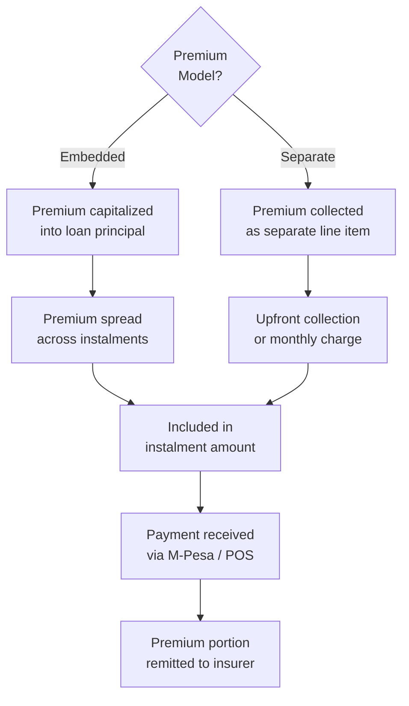
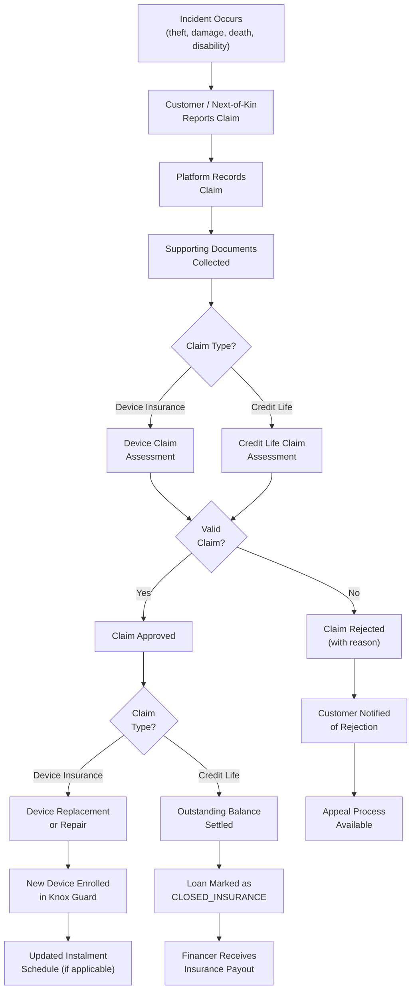
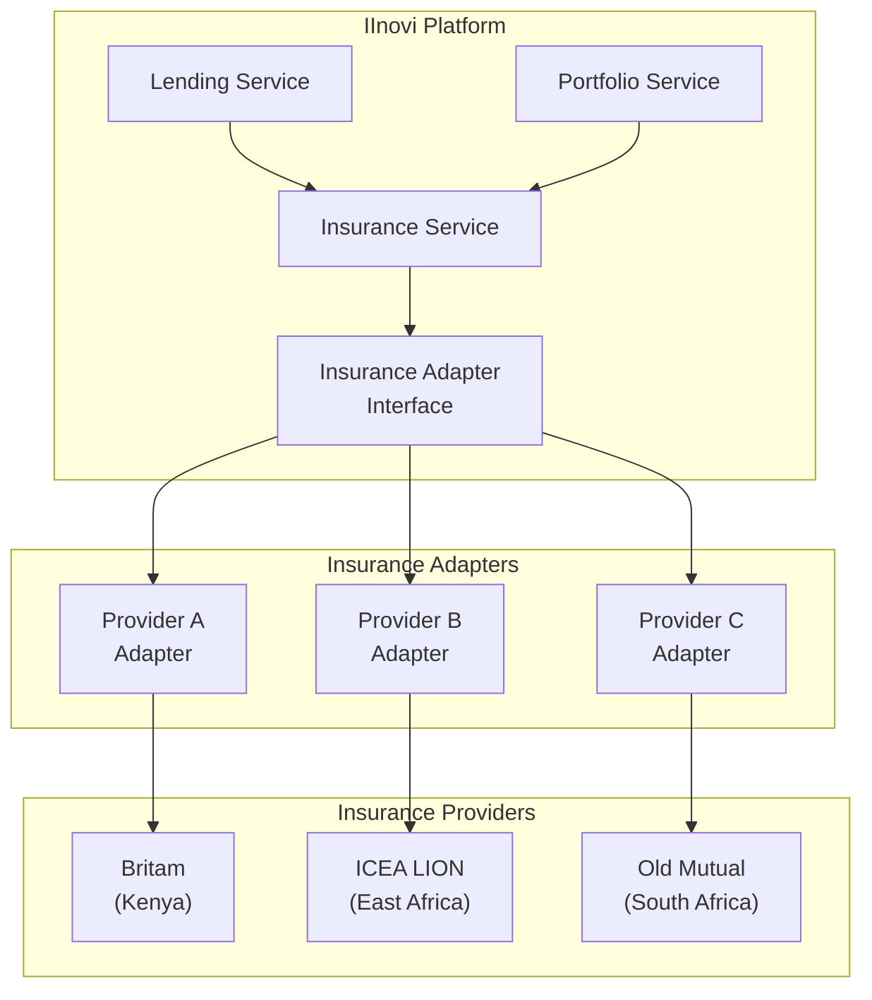

# Device and Credit Life Insurance

## Overview

The IInovi platform supports optional insurance integration to protect both customers and capital providers against device-related losses and credit risk events. Two primary insurance products are available:

1. **Device Insurance** -- covers physical damage, theft, and accidental breakage of the financed device.
2. **Credit Life Insurance** -- covers the remaining loan balance in the event of the customer's death or permanent disability.

Both products are optional features that can be configured per loan product. They can be bundled into the loan (embedded in the instalment) or offered as a separate line item. The platform manages premium calculation, collection, claims processing, and integration with insurance providers.

### Design Principles

| Principle | Application |
|---|---|
| **Optional by Design** | Insurance is never forced; it is offered as an opt-in or can be bundled as part of the product definition |
| **Transparent Pricing** | Insurance premiums are clearly disclosed as part of the total cost of credit |
| **Integrated Claims** | Claims are processed within the portfolio management workflow, not as a separate system |
| **Provider Agnostic** | The platform integrates with multiple insurance providers through an adapter pattern |
| **Regulatory Compliance** | Insurance offerings comply with local insurance regulations and consumer protection requirements |

---

## Device Insurance

### Coverage Scope

Device insurance covers the following risks for the financed device during the loan tenor:

| Risk | Description | Covered | Conditions |
|---|---|---|---|
| **Theft** | Device stolen from the customer | Yes | Police report required; waiting period may apply |
| **Accidental Damage** | Physical damage from drops, impacts, or liquid contact | Yes | Within first occurrence or per-policy limit |
| **Screen Crack** | Cracked or shattered screen | Yes | Often treated as a sub-limit of accidental damage |
| **Electrical / Mechanical Breakdown** | Failure beyond manufacturer warranty | Optional | Depends on product configuration |
| **Loss** | Device lost (not stolen) | Optional | Higher premium; may require location evidence |
| **Cosmetic Damage** | Scratches, dents that do not affect functionality | No | Excluded from coverage |
| **Intentional Damage** | Deliberate destruction by the customer | No | Fraud; excluded from coverage |

### Coverage Period

The insurance coverage is active from the date of device handover until the earlier of:

- Loan maturity date (final instalment paid)
- Early settlement date
- Successful claim and replacement
- Policy cancellation

### Product Configuration

Insurance can be configured at the loan product level:

| Parameter | Description | Example Values |
|---|---|---|
| `insurance_required` | Whether insurance is mandatory for this product | `false` (optional) |
| `insurance_bundled` | Whether premium is embedded in the instalment | `true` / `false` |
| `coverage_type` | Type of coverage offered | `THEFT_DAMAGE`, `COMPREHENSIVE` |
| `premium_model` | How the premium is calculated | `FLAT_RATE`, `PERCENTAGE_OF_PRINCIPAL` |
| `premium_rate` | Premium rate (percentage or flat amount) | `2.5%` of principal or `KES 500` |
| `excess_amount` | Customer's excess (deductible) per claim | `KES 1,000` |
| `max_claims` | Maximum number of claims per policy | `1` or `2` |
| `waiting_period_days` | Days after activation before claims are accepted | `7` |
| `provider_id` | Insurance provider / underwriter | `INS-PROVIDER-001` |

### Premium Models

| Model | Calculation | When to Use |
|---|---|---|
| **Flat Rate** | Fixed amount per policy term (e.g., KES 500) | Simple, low-value devices; easy for customers to understand |
| **Percentage of Principal** | Percentage of the loan principal (e.g., 2.5%) | Scales with device value; fair pricing across price segments |
| **Percentage of Device Price** | Percentage of the retail device price | When insurance covers replacement at retail value |
| **Monthly Premium** | Fixed or calculated amount per month, collected with instalment | When insurance is a recurring charge rather than upfront |

### Premium Collection



#### Embedded Premium Example

```
Device price:      KES 30,000
Deposit:           KES  6,000
Loan principal:    KES 24,000
Insurance premium: KES    600 (2.5% of principal)
Effective principal: KES 24,600
Tenor:             6 months
Monthly instalment: KES 4,100 (principal) + KES 100 (insurance) = KES 4,200

Note: Total cost of credit disclosure includes the insurance premium separately.
```

---

## Credit Life Insurance

### Coverage Scope

Credit life insurance covers the outstanding loan balance in the event of specific life events affecting the borrower.

| Event | Description | Benefit | Evidence Required |
|---|---|---|---|
| **Death** | Customer dies during the loan tenor | Full outstanding balance settled | Death certificate; next-of-kin claim |
| **Permanent Total Disability** | Customer permanently unable to work | Full outstanding balance settled | Medical certificate; disability assessment |
| **Temporary Disability** | Customer temporarily unable to work | Instalment deferral (optional) | Medical certificate |
| **Involuntary Retrenchment** | Customer loses employment involuntarily | Instalment cover for defined period (optional) | Retrenchment letter; employer confirmation |

### Credit Life Policy Parameters

| Parameter | Description | Example Values |
|---|---|---|
| `credit_life_enabled` | Whether credit life insurance is available for this product | `true` / `false` |
| `credit_life_required` | Whether credit life is mandatory | `false` (typically optional) |
| `credit_life_premium_rate` | Premium as percentage of outstanding balance | `0.5%` of outstanding per month |
| `credit_life_premium_model` | Flat or reducing balance premium | `REDUCING_BALANCE`, `FLAT` |
| `death_cover` | Cover for death of borrower | `true` |
| `disability_cover` | Cover for permanent disability | `true` |
| `retrenchment_cover` | Cover for involuntary retrenchment | `false` (optional add-on) |
| `max_cover_amount` | Maximum insured amount per policy | KES 100,000 |
| `beneficiary` | Who receives the benefit | Financer (loan balance settled) |

### Premium Calculation

#### Flat Premium Model

```
Monthly premium = Original principal x Premium rate
Example: KES 24,000 x 0.5% = KES 120 per month (fixed throughout tenor)
```

#### Reducing Balance Model

```
Monthly premium = Current outstanding balance x Premium rate
Month 1: KES 24,000 x 0.5% = KES 120
Month 2: KES 20,000 x 0.5% = KES 100
Month 3: KES 16,000 x 0.5% = KES  80
...
```

The reducing balance model results in lower total premium cost and is more equitable, as the customer pays proportionally to the risk exposure.

---

## Claims Process

### Claims Workflow



### Device Insurance Claims

#### Claim Submission Requirements

| Document | Theft | Accidental Damage | Screen Crack |
|---|---|---|---|
| Claim form (platform or app) | Required | Required | Required |
| Police report / OB number | Required | Not required | Not required |
| Photos of damage | N/A | Required | Required |
| IMEI verification | Required | Required | Required |
| Device inspection | N/A | May be required | May be required |
| Statutory declaration | Required | Not required | Not required |

#### Claim Outcomes

| Outcome | Action | Effect on Loan |
|---|---|---|
| **Replacement** | Insurer provides a replacement device of equivalent specification | New device enrolled in Knox Guard; loan continues with same schedule |
| **Repair** | Device sent for authorized repair | Temporary device may be provided; loan continues |
| **Cash Payout** | Insurer pays the insured value; customer purchases replacement | Customer must enroll new device; loan continues |
| **Rejection** | Claim does not meet policy conditions | No action; loan continues as-is |

### Credit Life Insurance Claims

#### Claim Submission Requirements

| Document | Death | Permanent Disability |
|---|---|---|
| Claim form | Required (next-of-kin) | Required |
| Death certificate | Required | N/A |
| Medical certificate / disability assessment | N/A | Required |
| ID of claimant (next-of-kin) | Required | Required |
| Police report (if applicable) | If accidental death | If accidental |
| Employer letter (retrenchment) | N/A | N/A |

#### Claim Processing

| Step | Timeline | Responsible |
|---|---|---|
| Claim received and logged | Day 0 | Platform (automated) |
| Documents verified | Within 2 business days | Claims officer |
| Claim submitted to insurer | Within 3 business days | Platform (automated via adapter) |
| Insurer assessment | 5 - 15 business days | Insurance provider |
| Payout received | Within 5 business days of approval | Insurance provider |
| Loan balance settled | Within 1 business day of payout | Platform (automated) |
| Device released from Knox Guard | Within 1 business day of loan closure | Platform (automated) |
| Customer / next-of-kin notified | Same day as settlement | Notification service |

---

## Insurance Provider Integration

### Integration Architecture



### Insurance Adapter Interface

```python
class InsuranceAdapter(Protocol):
    async def create_policy(
        self,
        loan: LoanRecord,
        customer: CustomerIdentity,
        product_config: InsuranceProductConfig,
    ) -> PolicyReference:
        """Create an insurance policy for a new loan."""
        ...

    async def cancel_policy(
        self,
        policy_reference: str,
        reason: CancellationReason,
    ) -> CancellationConfirmation:
        """Cancel an active policy (early settlement, write-off, etc.)."""
        ...

    async def submit_claim(
        self,
        policy_reference: str,
        claim: ClaimSubmission,
    ) -> ClaimReference:
        """Submit an insurance claim."""
        ...

    async def check_claim_status(
        self,
        claim_reference: str,
    ) -> ClaimStatus:
        """Check the status of a submitted claim."""
        ...

    async def report_premium_collection(
        self,
        policy_reference: str,
        premium_amount: Decimal,
        collection_date: date,
    ) -> PremiumConfirmation:
        """Report premium collection to the insurer."""
        ...
```

### Provider Integration Methods

| Integration Aspect | Method A (API) | Method B (File-based) |
|---|---|---|
| **Policy creation** | REST API call | Batch file (daily) |
| **Premium reporting** | REST API call (per collection) | Monthly premium file |
| **Claims submission** | REST API call | Email with structured attachment |
| **Claims status** | REST API poll or webhook | Email or portal |
| **Settlement** | API confirmation + bank transfer | Bank transfer + reconciliation file |
| **Authentication** | OAuth2 / API key | SFTP credentials |

---

## Policy Management

### Policy Lifecycle

```mermaid
stateDiagram-v2
    [*] --> PENDING : Loan application<br/>with insurance
    PENDING --> ACTIVE : Loan activated;<br/>policy issued
    ACTIVE --> CLAIM_IN_PROGRESS : Claim submitted
    CLAIM_IN_PROGRESS --> ACTIVE : Claim rejected<br/>(device insurance)
    CLAIM_IN_PROGRESS --> SETTLED : Claim approved<br/>(credit life)
    CLAIM_IN_PROGRESS --> REPLACED : Claim approved<br/>(device replaced)
    ACTIVE --> EXPIRED : Loan matured<br/>(paid off)
    ACTIVE --> CANCELLED : Loan cancelled<br/>or written off
    REPLACED --> ACTIVE : New device<br/>enrolled
    SETTLED --> [*]
    EXPIRED --> [*]
    CANCELLED --> [*]
```



### Policy Record Structure

| Field | Description |
|---|---|
| `policy_id` | Unique policy identifier |
| `loan_id` | Associated loan reference |
| `customer_id` | Policyholder reference |
| `insurance_type` | `DEVICE` or `CREDIT_LIFE` |
| `provider_id` | Insurance provider identifier |
| `provider_policy_ref` | Provider's policy number |
| `coverage_type` | `THEFT_DAMAGE`, `COMPREHENSIVE`, `DEATH_DISABILITY` |
| `insured_amount` | Maximum coverage amount |
| `premium_total` | Total premium for the policy term |
| `premium_collected` | Premium collected to date |
| `premium_model` | `FLAT_RATE`, `PERCENTAGE`, `REDUCING_BALANCE` |
| `status` | `PENDING`, `ACTIVE`, `CLAIM_IN_PROGRESS`, `SETTLED`, `EXPIRED`, `CANCELLED` |
| `effective_date` | Policy start date |
| `expiry_date` | Policy end date |
| `claims_count` | Number of claims made |
| `created_at` | Record creation timestamp |
| `updated_at` | Last modification timestamp |

### Premium Remittance

Collected premiums are remitted to the insurance provider on an agreed schedule:

| Remittance Model | Frequency | Description |
|---|---|---|
| **Per-collection** | Real-time | Premium portion remitted with each instalment payment (requires real-time integration) |
| **Daily batch** | Daily | All premiums collected during the day are batched and remitted |
| **Monthly settlement** | Monthly | All premiums collected during the month are settled in a single transfer |

### Premium Reconciliation

| Check | Description | Frequency |
|---|---|---|
| **Collection vs. remittance** | Verify all collected premiums have been remitted to the insurer | Monthly |
| **Policy vs. loan count** | Verify all insured loans have active policies with the provider | Monthly |
| **Provider statement match** | Reconcile platform records against the provider's premium statement | Monthly |
| **Unearned premium** | Calculate unearned premium for cancelled or early-settled loans | Monthly |

---

## Regulatory Considerations

| Requirement | Details |
|---|---|
| **Insurance licensing** | Insurance products must be underwritten by a licensed insurer; the platform acts as an intermediary or agent |
| **Disclosure** | Insurance premiums must be disclosed as part of the total cost of credit |
| **Voluntary nature** | Insurance must not be a precondition for loan approval unless explicitly configured and disclosed |
| **Claims handling** | Claims must be processed within regulatory timelines per jurisdiction |
| **Premium handling** | Collected premiums must be held in trust and remitted to the insurer per regulatory requirements |
| **Cooling-off period** | Customers may cancel insurance within a cooling-off period (typically 14-30 days) with a full premium refund |

---

## Related Documents

- [Loan Product Definition](../financial-lending/loan-product-definition.md) -- product configuration including insurance parameters
- [Portfolio Management](../financial-lending/portfolio-management.md) -- loan lifecycle and status management
- [Financial Flows](../financial-lending/financial-flows.md) -- fund flows including premium remittance
- [Consumer Protection Compliance](../compliance/consumer-protection.md) -- disclosure and transparency obligations
- [Licensing Requirements](../compliance/licensing.md) -- insurance intermediary licensing
- [Notification Service](../notifications/notification-service.md) -- customer communications for claims
- [Documentation Index](../README.md) -- full documentation map
