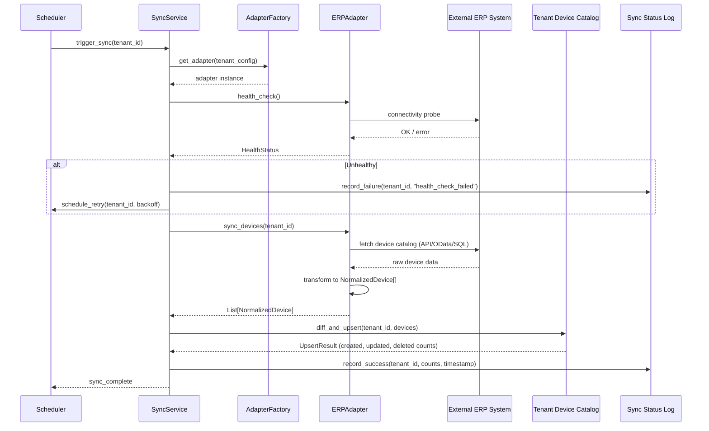

# ERP Integration Architecture -- Adapter Pattern

## 1. Overview

The IInovi platform enables mobile device lending across a diverse ecosystem of partners -- telcos, retailers, and distributors -- each operating their own Enterprise Resource Planning (ERP) system. To support this heterogeneity without coupling the platform to any single ERP vendor, the integration layer is built on the **Adapter Pattern**.

The adapter pattern defines a stable, abstract contract (the ERP Adapter Interface) that the platform programs against. Concrete implementations -- one per ERP vendor -- translate between the platform's normalized data model and the vendor-specific API surface. This allows the platform to:

- Onboard new ERP vendors without modifying core business logic.
- Maintain a single, consistent device catalog across all tenants regardless of upstream ERP.
- Isolate ERP-specific failure modes, authentication schemes, and data formats behind a uniform interface.
- Enable tenant-scoped configuration so each partner can connect their own ERP instance independently.

---

## 2. Adapter Pattern Architecture

### 2.1 Why the Adapter Pattern

| Concern | Without Adapters | With Adapters |
|---|---|---|
| Adding a new ERP | Requires changes across sync, pricing, reservation, and sale modules | Implement a single new adapter class |
| Testing | Requires live ERP connections or per-vendor mocks | Mock the adapter interface uniformly |
| Failure isolation | ERP-specific errors leak into core logic | Errors are caught and normalized at the adapter boundary |
| Multi-tenant support | Conditional branching per tenant's ERP type | Tenant configuration selects the correct adapter at runtime |

### 2.2 Class Diagram

```mermaid
classDiagram
    class ERPAdapterInterface {
        <<abstract>>
        +sync_devices(tenant_id: str) List~NormalizedDevice~
        +get_pricing(tenant_id: str, sku: str) PricingResult
        +reserve_device(tenant_id: str, sku: str, quantity: int) ReservationResult
        +confirm_sale(tenant_id: str, reservation_id: str, sale_details: dict) SaleConfirmation
        +health_check() HealthStatus
    }

    class SAPAdapter {
        -sap_client: SAPClient
        -auth_provider: SAPOAuthProvider
        +sync_devices(tenant_id: str) List~NormalizedDevice~
        +get_pricing(tenant_id: str, sku: str) PricingResult
        +reserve_device(tenant_id: str, sku: str, quantity: int) ReservationResult
        +confirm_sale(tenant_id: str, reservation_id: str, sale_details: dict) SaleConfirmation
        +health_check() HealthStatus
    }

    class OracleNetSuiteAdapter {
        -netsuite_client: NetSuiteRESTClient
        -token_manager: NetSuiteTokenManager
        +sync_devices(tenant_id: str) List~NormalizedDevice~
        +get_pricing(tenant_id: str, sku: str) PricingResult
        +reserve_device(tenant_id: str, sku: str, quantity: int) ReservationResult
        +confirm_sale(tenant_id: str, reservation_id: str, sale_details: dict) SaleConfirmation
        +health_check() HealthStatus
    }

    class MicrosoftDynamicsAdapter {
        -dynamics_client: DynamicsClient
        -azure_auth: AzureADAuthProvider
        +sync_devices(tenant_id: str) List~NormalizedDevice~
        +get_pricing(tenant_id: str, sku: str) PricingResult
        +reserve_device(tenant_id: str, sku: str, quantity: int) ReservationResult
        +confirm_sale(tenant_id: str, reservation_id: str, sale_details: dict) SaleConfirmation
        +health_check() HealthStatus
    }

    class CustomRESTAdapter {
        -http_client: HTTPClient
        -field_mapping: dict
        +sync_devices(tenant_id: str) List~NormalizedDevice~
        +get_pricing(tenant_id: str, sku: str) PricingResult
        +reserve_device(tenant_id: str, sku: str, quantity: int) ReservationResult
        +confirm_sale(tenant_id: str, reservation_id: str, sale_details: dict) SaleConfirmation
        +health_check() HealthStatus
    }

    class AdapterFactory {
        +get_adapter(tenant_config: TenantERPConfig) ERPAdapterInterface
    }

    class NormalizedDevice {
        +sku: str
        +name: str
        +brand: str
        +model: str
        +oem: str
        +price: Decimal
        +currency: str
        +category: str
        +image_url: str
        +specs: dict
        +stock_quantity: int
        +last_synced_at: datetime
    }

    ERPAdapterInterface <|-- SAPAdapter
    ERPAdapterInterface <|-- OracleNetSuiteAdapter
    ERPAdapterInterface <|-- MicrosoftDynamicsAdapter
    ERPAdapterInterface <|-- CustomRESTAdapter
    AdapterFactory --> ERPAdapterInterface : creates
    ERPAdapterInterface --> NormalizedDevice : produces
```



---

## 3. ERP Adapter Interface

The abstract contract that all ERP connectors must implement.

```python
from abc import ABC, abstractmethod
from typing import List, Optional
from dataclasses import dataclass
from decimal import Decimal
from datetime import datetime


@dataclass
class NormalizedDevice:
    sku: str
    name: str
    brand: str
    model: str
    oem: str
    price: Decimal
    currency: str
    category: str
    image_url: Optional[str]
    specs: dict
    stock_quantity: int
    last_synced_at: datetime


@dataclass
class PricingResult:
    sku: str
    retail_price: Decimal
    wholesale_price: Optional[Decimal]
    currency: str
    tax_rate: Decimal
    valid_from: datetime
    valid_until: Optional[datetime]


@dataclass
class ReservationResult:
    reservation_id: str
    sku: str
    quantity: int
    expires_at: datetime
    status: str  # "reserved", "failed", "partial"


@dataclass
class SaleConfirmation:
    sale_id: str
    reservation_id: str
    status: str  # "confirmed", "failed", "pending"
    erp_reference: str
    timestamp: datetime


@dataclass
class HealthStatus:
    healthy: bool
    latency_ms: int
    last_successful_sync: Optional[datetime]
    error_message: Optional[str]


class ERPAdapterInterface(ABC):
    """Abstract contract for all ERP integrations."""

    @abstractmethod
    def sync_devices(self, tenant_id: str) -> List[NormalizedDevice]:
        """Pull the full device catalog from the ERP and return normalized records."""
        ...

    @abstractmethod
    def get_pricing(self, tenant_id: str, sku: str) -> PricingResult:
        """Fetch current pricing for a specific device SKU."""
        ...

    @abstractmethod
    def reserve_device(
        self, tenant_id: str, sku: str, quantity: int
    ) -> ReservationResult:
        """Place a temporary hold on inventory in the ERP."""
        ...

    @abstractmethod
    def confirm_sale(
        self, tenant_id: str, reservation_id: str, sale_details: dict
    ) -> SaleConfirmation:
        """Confirm a completed sale and create the corresponding ERP transaction."""
        ...

    @abstractmethod
    def health_check(self) -> HealthStatus:
        """Verify connectivity and authentication with the ERP endpoint."""
        ...
```

### 3.1 Method Responsibilities

| Method | Purpose | Invocation Trigger |
|---|---|---|
| `sync_devices` | Full or delta pull of device inventory, prices, and metadata | Scheduled sync job |
| `get_pricing` | Real-time price lookup for a single SKU | Checkout flow, quote generation |
| `reserve_device` | Temporary inventory hold while a credit application is processed | Credit approval event |
| `confirm_sale` | Finalize the ERP-side transaction after loan disbursement | Loan disbursement event |
| `health_check` | Connectivity and auth validation | Monitoring, pre-sync validation |

---

## 4. Connector Implementations

### 4.1 SAP Adapter

Targets SAP S/4HANA and SAP Business One via the SAP OData / RFC API surface.

- **Authentication**: OAuth 2.0 client credentials via SAP Business Technology Platform, or basic auth for on-premise instances.
- **Device sync**: Queries `MaterialMaster` and `ProductValuation` OData entities. Maps SAP material groups to platform device categories.
- **Inventory**: Reads `MaterialStock` by plant/storage location.
- **Reservation**: Creates SAP reservation documents via `MM_RESERVATION_CREATE` BAPI.
- **Sale confirmation**: Posts sales orders via `SD_SALESDOCUMENT_CREATE` BAPI or OData Sales Order API.

### 4.2 Oracle NetSuite Adapter

Targets Oracle NetSuite via SuiteTalk REST Web Services and RESTlets.

- **Authentication**: Token-Based Authentication (TBA) with consumer key/secret and token key/secret.
- **Device sync**: Queries `InventoryItem` records using SuiteQL. Filters by subsidiary and location for tenant scoping.
- **Inventory**: Reads `quantityAvailable` and `quantityOnHand` from inventory item records.
- **Reservation**: Creates `TransferOrder` or custom `InventoryReservation` records.
- **Sale confirmation**: Creates `SalesOrder` records with line items and custom fields for loan reference.

### 4.3 Microsoft Dynamics Adapter

Targets Dynamics 365 Finance and Operations and Dynamics 365 Business Central.

- **Authentication**: Azure AD OAuth 2.0 with application (client credentials) or delegated permissions.
- **Device sync**: Queries `ReleasedProducts` (F&O) or `Items` (Business Central) via OData v4 endpoints.
- **Inventory**: Reads `InventoryOnHand` entity with warehouse/site filtering.
- **Reservation**: Creates inventory reservation journals or sales order lines with reservation marking.
- **Sale confirmation**: Posts sales orders and triggers invoice posting via API actions.

### 4.4 Custom REST Adapter

A configurable adapter for partners that expose device and inventory data through proprietary REST APIs.

- **Authentication**: Supports API key, OAuth 2.0, and mutual TLS. Configured per tenant.
- **Field mapping**: A declarative JSON mapping configuration translates arbitrary response payloads to the `NormalizedDevice` schema. Supports JSONPath expressions for nested fields.
- **Endpoints**: Configurable URL templates for each operation (list devices, get price, reserve, confirm).
- **Validation**: Response payloads are validated against the normalized schema; unmappable fields are logged and skipped.

```json
{
  "field_mapping": {
    "sku": "$.product.productCode",
    "name": "$.product.displayName",
    "brand": "$.product.manufacturer",
    "model": "$.product.modelNumber",
    "oem": "$.product.oem",
    "price": "$.product.pricing.unitPrice",
    "currency": "$.product.pricing.currencyCode",
    "category": "$.product.category.name",
    "image_url": "$.product.images[0].url",
    "specs": "$.product.specifications",
    "stock_quantity": "$.product.inventory.available"
  }
}
```

---

## 5. Device Sync Service

The Device Sync Service is a scheduled background job responsible for keeping each tenant's device catalog current with their upstream ERP.

### 5.1 Sync Job Architecture

Each tenant has an independently scheduled sync job. The scheduler respects the tenant's configured sync frequency and timezone.

```
Tenant A (SAP)         -> Sync every 4 hours, UTC+3
Tenant B (NetSuite)    -> Sync every 6 hours, UTC+0
Tenant C (Custom REST) -> Sync every 1 hour,  UTC+2
```

### 5.2 Sync Process

1. **Pre-flight**: Run `health_check()` on the tenant's adapter. Abort if unhealthy.
2. **Pull**: Call `sync_devices(tenant_id)` to retrieve the full device list from the ERP.
3. **Diff**: Compare incoming records against the existing tenant-scoped catalog by SKU.
4. **Upsert**: Insert new devices, update changed records (price, stock, specs), and soft-delete devices no longer present in the ERP response.
5. **Post-sync**: Update the sync status record with timestamp, record counts, and outcome.

### 5.3 Sequence Diagram



---

## 6. Normalized Device Model

All ERP-specific device representations are transformed into a single normalized schema before entering the platform's device catalog. This decouples the catalog, storefront, and credit-scoring modules from ERP-specific data structures.

| Field | Type | Description |
|---|---|---|
| `sku` | `string` | Stock Keeping Unit -- unique device identifier within the tenant's catalog |
| `name` | `string` | Human-readable device display name |
| `brand` | `string` | Consumer-facing brand (e.g., Samsung, Xiaomi, Tecno) |
| `model` | `string` | Model identifier (e.g., Galaxy A15, Redmi Note 13) |
| `oem` | `string` | Original Equipment Manufacturer |
| `price` | `decimal` | Unit retail price in the tenant's base currency |
| `currency` | `string` | ISO 4217 currency code |
| `category` | `string` | Device category (smartphone, feature_phone, tablet, router, accessory) |
| `image_url` | `string` | URL to the primary product image |
| `specs` | `json` | Structured technical specifications (RAM, storage, battery, display, OS) |
| `stock_quantity` | `integer` | Available inventory count at time of last sync |
| `last_synced_at` | `datetime` | UTC timestamp of the most recent successful sync |

### 6.1 Specs Schema

The `specs` field follows a semi-structured schema to support filtering and comparison across the storefront.

```json
{
  "ram_gb": 4,
  "storage_gb": 128,
  "battery_mah": 5000,
  "display_inches": 6.5,
  "os": "Android 14",
  "network": ["4G LTE", "3G"],
  "sim_slots": 2,
  "camera_mp": 50
}
```

---

## 7. Data Flow

The end-to-end data flow from an external ERP system to the tenant-scoped device catalog:

```
External ERP System
       |
       | (vendor-specific API: OData, REST, BAPI, SuiteQL)
       v
  ERP Adapter (vendor-specific implementation)
       |
       | transforms raw data using vendor-specific field mappings
       v
  Normalized Device Model (List[NormalizedDevice])
       |
       | diff against existing catalog, upsert changes
       v
  Tenant-Scoped Device Catalog (database)
       |
       | serves storefront, credit scoring, and order modules
       v
  Platform Services (Storefront API, Credit Engine, Order Service)
```

Each stage is independently testable. The adapter boundary is the primary seam for unit testing (mock the ERP, assert normalized output). Integration tests validate the adapter against sandbox ERP instances.

---

## 8. Error Handling, Retry, and Sync Status Tracking

### 8.1 Error Categories

| Category | Examples | Handling Strategy |
|---|---|---|
| **Transient** | Network timeout, HTTP 429/503, ERP maintenance window | Exponential backoff retry (max 5 attempts) |
| **Authentication** | Expired token, revoked credentials, certificate mismatch | Attempt token refresh; alert tenant admin if refresh fails |
| **Data quality** | Missing required fields, invalid SKU format, negative stock | Log warning, skip invalid record, continue sync |
| **Permanent** | HTTP 404 endpoint removed, schema version mismatch | Halt sync, alert platform operations team |

### 8.2 Retry Strategy

```python
RETRY_CONFIG = {
    "max_attempts": 5,
    "base_delay_seconds": 2,
    "max_delay_seconds": 300,
    "backoff_factor": 2,
    "retryable_status_codes": [408, 429, 500, 502, 503, 504],
}
```

Retries are applied at the HTTP transport layer within each adapter. The sync service itself retries the full sync operation on transient failures, with a separate backoff schedule configured per tenant.

### 8.3 Sync Status Tracking

Every sync execution is recorded in a `sync_status` table for observability and debugging.

| Field | Type | Description |
|---|---|---|
| `sync_id` | `uuid` | Unique identifier for this sync run |
| `tenant_id` | `string` | Tenant that owns this sync |
| `adapter_type` | `string` | ERP adapter used (sap, netsuite, dynamics, custom_rest) |
| `status` | `enum` | `pending`, `running`, `success`, `partial_success`, `failed` |
| `started_at` | `datetime` | When the sync began |
| `completed_at` | `datetime` | When the sync finished (null if still running) |
| `devices_created` | `integer` | Count of new devices added |
| `devices_updated` | `integer` | Count of existing devices modified |
| `devices_deleted` | `integer` | Count of devices soft-deleted |
| `errors` | `json[]` | Array of error records with SKU, error type, and message |
| `next_scheduled_at` | `datetime` | When the next sync is scheduled |

A sync with some invalid records but a majority of successful upserts is recorded as `partial_success`, allowing operations teams to investigate data quality issues without blocking the catalog update.

---

## 9. Tenant-Scoped ERP Configuration

Each tenant maintains its own ERP configuration, stored encrypted at rest and decrypted only at sync time.

```json
{
  "tenant_id": "tn_safaricom_ke",
  "erp_type": "sap",
  "connection": {
    "base_url": "https://erp.safaricom.co.ke/sap/opu/odata/sap/",
    "auth_type": "oauth2_client_credentials",
    "client_id": "********",
    "client_secret": "********",
    "token_url": "https://auth.safaricom.co.ke/oauth/token",
    "timeout_seconds": 30
  },
  "sync_schedule": {
    "frequency": "every_4_hours",
    "timezone": "Africa/Nairobi",
    "enabled": true
  },
  "field_overrides": {
    "category_mapping": {
      "ZSMARTPHONE": "smartphone",
      "ZFEATURE": "feature_phone",
      "ZTABLET": "tablet"
    }
  },
  "alerting": {
    "on_failure": ["ops@partner.com"],
    "on_partial_success": ["ops@partner.com"]
  }
}
```

### 9.1 Configuration Management

- **Storage**: Tenant ERP configurations are stored in a dedicated configuration store with AES-256 encryption for credentials.
- **Validation**: Configurations are validated against a JSON schema on save. A `health_check()` call is triggered on update to verify connectivity before the configuration goes live.
- **Versioning**: Configuration changes are versioned so that sync failures can be correlated with configuration updates.
- **Access control**: Only tenant administrators and platform operations staff can view or modify ERP configurations. Credential fields are write-only (never returned in API responses).

---

## 10. Adapter Factory

The `AdapterFactory` resolves the correct adapter implementation at runtime based on tenant configuration.

```python
class AdapterFactory:
    _registry: dict[str, type[ERPAdapterInterface]] = {
        "sap": SAPAdapter,
        "netsuite": OracleNetSuiteAdapter,
        "dynamics": MicrosoftDynamicsAdapter,
        "custom_rest": CustomRESTAdapter,
    }

    @classmethod
    def get_adapter(cls, tenant_config: TenantERPConfig) -> ERPAdapterInterface:
        adapter_cls = cls._registry.get(tenant_config.erp_type)
        if adapter_cls is None:
            raise UnsupportedERPError(
                f"No adapter registered for ERP type: {tenant_config.erp_type}"
            )
        return adapter_cls(tenant_config.connection)

    @classmethod
    def register_adapter(cls, erp_type: str, adapter_cls: type[ERPAdapterInterface]):
        cls._registry[erp_type] = adapter_cls
```

New ERP adapters can be registered at application startup or loaded dynamically from a plugin directory, enabling third-party integrators to contribute adapters without modifying platform code.
