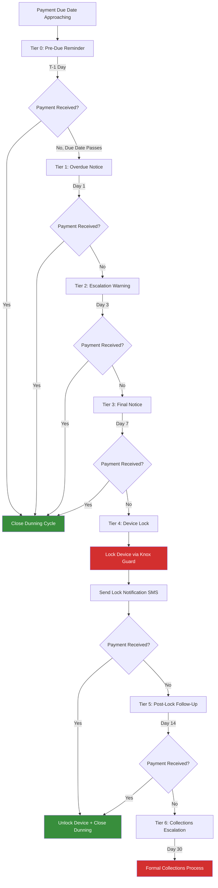

# Dunning Escalation Templates

## Overview

The dunning escalation framework defines a structured, tiered communication sequence for collecting overdue payments from borrowers. Each tier escalates in urgency, channel intensity, and consequences. All timings, templates, channels, and escalation rules are configurable per loan product and per tenant. The framework integrates with the Unified Notification Service for delivery and with the Device Management Service for enforcement actions.

---

## Tiered Communication Schedule

### Default Escalation Timeline

| Tier | Name | Timing | Channels | Message Intent |
|---|---|---|---|---|
| 0 | Pre-Due Reminder | 1 day before due date | Push + SMS | Friendly reminder that payment is due tomorrow |
| 1 | Overdue Notice | Day 1 past due | Push + SMS | Inform customer that payment is overdue |
| 2 | Escalation Warning | Day 3 past due | Push + SMS | Warn of consequences if payment is not made |
| 3 | Final Notice | Day 7 past due (configurable) | Push + SMS + Voice (outbound call) | Last notice before enforcement action |
| 4 | Device Lock | After grace period (configurable) | Lock + SMS | Device locked; payment required to unlock |
| 5 | Post-Lock Follow-Up | Day 14 past due | SMS + Voice | Continued collection effort post-lock |
| 6 | Collections Escalation | Day 30 past due | SMS + Voice + Field Visit | Formal demand and recovery initiation |

### Escalation Flow



---

## Template Content by Tier

### Tier 0: Pre-Due Reminder

**Timing**: 1 day before due date

**Channels**: Push Notification + SMS

**Intent**: Friendly, non-threatening reminder

**SMS Template (English)**

```
Dear {{customer.firstName}}, your payment of {{loan.nextPaymentAmount}} for your {{device.model}} is due tomorrow ({{loan.nextPaymentDate}}). Pay via M-Pesa to avoid late fees. Paybill: {{tenant.paybillNumber}}, Account: {{loan.accountNumber}}. {{tenant.name}}
```

**SMS Template (Swahili)**

```
Habari {{customer.firstName}}, malipo yako ya {{loan.nextPaymentAmount}} ya {{device.model}} yako yanatarajiwa kesho ({{loan.nextPaymentDate}}). Lipa kupitia M-Pesa kuepuka adhabu. Paybill: {{tenant.paybillNumber}}, Akaunti: {{loan.accountNumber}}. {{tenant.name}}
```

**Push Notification Template**

```
Title: Payment Reminder
Body: Your payment of {{loan.nextPaymentAmount}} is due tomorrow. Tap to pay now.
Action: Deep link to payment screen in DMA
```

---

### Tier 1: Overdue Notice

**Timing**: Day 1 past due

**Channels**: Push Notification + SMS

**Intent**: Inform that payment is overdue; maintain a cooperative tone

**SMS Template (English)**

```
Dear {{customer.firstName}}, your payment of {{loan.nextPaymentAmount}} for your {{device.model}} was due on {{loan.nextPaymentDate}} and has not been received. Please pay today to stay current. Paybill: {{tenant.paybillNumber}}, Account: {{loan.accountNumber}}. Questions? Call {{tenant.contactPhone}}. {{tenant.name}}
```

**SMS Template (Swahili)**

```
Habari {{customer.firstName}}, malipo yako ya {{loan.nextPaymentAmount}} ya {{device.model}} yako yalipaswa kulipwa {{loan.nextPaymentDate}} na hayajapokelewa. Tafadhali lipa leo. Paybill: {{tenant.paybillNumber}}, Akaunti: {{loan.accountNumber}}. Maswali? Piga {{tenant.contactPhone}}. {{tenant.name}}
```

**Push Notification Template**

```
Title: Payment Overdue
Body: Your payment of {{loan.nextPaymentAmount}} is overdue. Please pay now to avoid further action.
Action: Deep link to payment screen in DMA
```

---

### Tier 2: Escalation Warning

**Timing**: Day 3 past due

**Channels**: Push Notification + SMS

**Intent**: Warn of specific consequences; create urgency

**SMS Template (English)**

```
IMPORTANT: {{customer.firstName}}, your payment of {{loan.nextPaymentAmount}} is now {{loan.daysOverdue}} days overdue. Your {{device.model}} will be restricted if payment is not received soon. Pay now to avoid device restrictions. Paybill: {{tenant.paybillNumber}}, Account: {{loan.accountNumber}}. {{tenant.name}} {{tenant.contactPhone}}
```

**SMS Template (Swahili)**

```
MUHIMU: {{customer.firstName}}, malipo yako ya {{loan.nextPaymentAmount}} yamecheleweshwa siku {{loan.daysOverdue}}. {{device.model}} yako itazuiwa ikiwa malipo hayatapokelewa hivi karibuni. Lipa sasa kuepuka vizuizi. Paybill: {{tenant.paybillNumber}}, Akaunti: {{loan.accountNumber}}. {{tenant.name}} {{tenant.contactPhone}}
```

**Push Notification Template**

```
Title: Urgent: Device Restriction Warning
Body: Your payment is {{loan.daysOverdue}} days overdue. Your device may be restricted if you don't pay soon. Tap to pay.
Action: Deep link to payment screen in DMA
```

---

### Tier 3: Final Notice

**Timing**: Day 7 past due (configurable per loan product)

**Channels**: Push Notification + SMS + Outbound Voice Call

**Intent**: Final warning before enforcement; maximum urgency

**SMS Template (English)**

```
FINAL NOTICE: {{customer.firstName}}, your payment of {{loan.outstandingBalance}} (total overdue) for your {{device.model}} remains unpaid after {{loan.daysOverdue}} days. YOUR DEVICE WILL BE LOCKED if payment is not received within 24 hours. Pay immediately. Paybill: {{tenant.paybillNumber}}, Account: {{loan.accountNumber}}. Contact us: {{tenant.contactPhone}}. {{tenant.name}}
```

**SMS Template (Swahili)**

```
ILANI YA MWISHO: {{customer.firstName}}, malipo yako ya {{loan.outstandingBalance}} (jumla inayodaiwa) ya {{device.model}} yako hayajalipwa baada ya siku {{loan.daysOverdue}}. SIMU YAKO ITAFUNGWA ikiwa malipo hayatapokelewa ndani ya masaa 24. Lipa mara moja. Paybill: {{tenant.paybillNumber}}, Akaunti: {{loan.accountNumber}}. Wasiliana nasi: {{tenant.contactPhone}}. {{tenant.name}}
```

**Push Notification Template**

```
Title: FINAL NOTICE - Device Will Be Locked
Body: Your device will be locked in 24 hours unless you pay {{loan.outstandingBalance}} now.
Action: Deep link to payment screen in DMA
```

**Voice Call Script (IVR)**

```
Hello {{customer.firstName}}, this is an important message from {{tenant.name}} regarding 
your {{device.model}} loan. Your payment of {{loan.outstandingBalance}} is {{loan.daysOverdue}} 
days overdue. This is your final notice. If payment is not received within 24 hours, your 
device will be locked. To make a payment now, press 1. To speak with a representative, 
press 2. To hear this message again, press 3.
```

---

### Tier 4: Device Lock

**Timing**: After grace period expires (configurable; default is 24 hours after final notice)

**Channels**: Device Lock (Knox Guard) + SMS

**Intent**: Enforcement action with clear instructions for resolution

**SMS Template (English)**

```
{{customer.firstName}}, your {{device.model}} has been locked due to non-payment. Outstanding amount: {{loan.outstandingBalance}}. To unlock your device, pay the overdue amount via Paybill: {{tenant.paybillNumber}}, Account: {{loan.accountNumber}}. Your device will be unlocked automatically upon payment confirmation. For help: {{tenant.contactPhone}}. {{tenant.name}}
```

**SMS Template (Swahili)**

```
{{customer.firstName}}, {{device.model}} yako imefungwa kwa sababu ya malipo ambayo hayajalipwa. Kiasi kinachohitajika: {{loan.outstandingBalance}}. Ili kufungua simu yako, lipa kiasi kinachokosekana kupitia Paybill: {{tenant.paybillNumber}}, Akaunti: {{loan.accountNumber}}. Simu yako itafunguliwa moja kwa moja baada ya malipo kuthibitishwa. Kwa msaada: {{tenant.contactPhone}}. {{tenant.name}}
```

---

### Tier 5: Post-Lock Follow-Up

**Timing**: Day 14 past due

**Channels**: SMS + Outbound Voice Call

**Intent**: Continued engagement; offer resolution paths

**SMS Template (English)**

```
{{customer.firstName}}, your {{device.model}} remains locked. Outstanding: {{loan.outstandingBalance}}. We want to help you resolve this. You may be eligible for a payment plan. Contact us at {{tenant.contactPhone}} to discuss options. Pay any amount to start the unlocking process. Paybill: {{tenant.paybillNumber}}, Account: {{loan.accountNumber}}. {{tenant.name}}
```

---

### Tier 6: Collections Escalation

**Timing**: Day 30 past due

**Channels**: SMS + Voice + Field Collection (where applicable)

**Intent**: Formal collections; reference to legal/CRB consequences

**SMS Template (English)**

```
FORMAL NOTICE: {{customer.firstName}}, your loan for {{device.model}} is {{loan.daysOverdue}} days overdue with {{loan.outstandingBalance}} outstanding. Continued non-payment may result in: (1) negative CRB listing, (2) permanent device blacklisting, (3) legal action. Contact {{tenant.contactPhone}} immediately to arrange payment. {{tenant.name}}
```

---

## Configurable Timings

### Per Loan Product Configuration

All escalation timings are configurable at the loan product level:

| Parameter | Description | Default | Min | Max |
|---|---|---|---|---|
| `preReminder.daysBefore` | Days before due date for Tier 0 | 1 | 1 | 7 |
| `tier1.daysOverdue` | Days overdue for Tier 1 | 1 | 1 | 3 |
| `tier2.daysOverdue` | Days overdue for Tier 2 | 3 | 2 | 7 |
| `tier3.daysOverdue` | Days overdue for Tier 3 (final notice) | 7 | 3 | 14 |
| `lockGracePeriodHours` | Hours between final notice and lock | 24 | 0 | 72 |
| `tier5.daysOverdue` | Days overdue for post-lock follow-up | 14 | 7 | 30 |
| `tier6.daysOverdue` | Days overdue for collections escalation | 30 | 14 | 60 |
| `maxRemindersPerTier` | Maximum messages per tier before auto-advancing | 1 | 1 | 3 |

### Configuration Example

```json
{
  "loanProductId": "LP-SMARTPHONE-30DAY",
  "dunningConfig": {
    "preReminder": { "daysBefore": 1, "channels": ["PUSH", "SMS"] },
    "tier1": { "daysOverdue": 1, "channels": ["PUSH", "SMS"] },
    "tier2": { "daysOverdue": 3, "channels": ["PUSH", "SMS"] },
    "tier3": { "daysOverdue": 7, "channels": ["PUSH", "SMS", "VOICE"] },
    "lock": { "gracePeriodHours": 24 },
    "tier5": { "daysOverdue": 14, "channels": ["SMS", "VOICE"] },
    "tier6": { "daysOverdue": 30, "channels": ["SMS", "VOICE", "FIELD"] },
    "maxRemindersPerTier": 1,
    "respectQuietHours": true,
    "sendOnWeekends": true
  }
}
```

---

## Template Variables

### Full Variable Reference

| Variable | Type | Description | Example Value |
|---|---|---|---|
| `{{customer.firstName}}` | String | Customer's first name | John |
| `{{customer.lastName}}` | String | Customer's last name | Mwangi |
| `{{customer.fullName}}` | String | Customer's full name | John Mwangi |
| `{{loan.accountNumber}}` | String | Loan account reference | LN-2025-001234 |
| `{{loan.nextPaymentAmount}}` | Currency | Next installment amount due | KES 2,500 |
| `{{loan.nextPaymentDate}}` | Date | Next payment due date | 15 Dec 2025 |
| `{{loan.outstandingBalance}}` | Currency | Total remaining balance | KES 12,500 |
| `{{loan.overdueAmount}}` | Currency | Overdue amount only | KES 2,500 |
| `{{loan.daysOverdue}}` | Integer | Number of days past due | 3 |
| `{{loan.totalPaid}}` | Currency | Total amount paid to date | KES 12,500 |
| `{{loan.remainingInstallments}}` | Integer | Number of payments remaining | 8 |
| `{{device.model}}` | String | Device make and model | Samsung Galaxy A15 |
| `{{device.imei}}` | String | Device IMEI (last 4 digits) | ***2345 |
| `{{tenant.name}}` | String | Financer display name | MobiFinance |
| `{{tenant.contactPhone}}` | Phone | Financer support phone | +254 800 123 456 |
| `{{tenant.contactEmail}}` | Email | Financer support email | support@mobifinance.co.ke |
| `{{tenant.paybillNumber}}` | String | Payment paybill number | 123456 |
| `{{tenant.website}}` | URL | Financer website | www.mobifinance.co.ke |
| `{{payment.dueDate}}` | Date | Original due date | 12 Dec 2025 |

### Variable Formatting Rules

| Type | Format | Example |
|---|---|---|
| Currency | Locale-specific with currency code | KES 2,500 |
| Date | Locale-specific date format | 15 Dec 2025 (en), 15 Des 2025 (sw) |
| Phone | International format | +254 800 123 456 |
| IMEI | Last 4 digits only (privacy) | ***2345 |

---

## Multi-Language Support

### Language Selection Rules

1. Use the customer's preferred language (from profile).
2. If no preference, use the language of the originating tenant's default.
3. If no tenant default, use English.

### Translation Requirements

| Requirement | Detail |
|---|---|
| All dunning templates must be available in all tenant-supported languages | Mandatory |
| Translations must be reviewed by native speakers | Quality assurance |
| Legal/regulatory content must be reviewed by legal counsel per jurisdiction | Compliance |
| Variable placeholders must not be translated | Technical |
| Character count must respect SMS limits per encoding | GSM-7 vs UCS-2 |

### SMS Encoding Considerations

| Language | Encoding | Characters per SMS | Notes |
|---|---|---|---|
| English | GSM-7 | 160 | Standard Latin characters |
| Swahili | GSM-7 | 160 | Standard Latin characters |
| French | GSM-7 (with extensions) | 160 | Some accented characters use 2 bytes |
| Arabic | UCS-2 | 70 | Right-to-left script |
| Portuguese | GSM-7 (with extensions) | 160 | Some accented characters use 2 bytes |

Templates must be authored within channel character limits to avoid multi-part SMS charges.

---

## Channel Selection Rules

### Decision Matrix

| Factor | Push Preferred | SMS Preferred | Voice Preferred |
|---|---|---|---|
| DMA app installed and active | Yes | Fallback | Escalation only |
| DMA app not installed | No | Yes | Escalation only |
| Time-critical (Tier 3+) | Yes (+ SMS) | Yes | Tier 3+ |
| Customer opted out of push | No | Yes | Escalation only |
| Quiet hours active | Deferred | Deferred (except Tier 4+) | Never during quiet hours |
| Multiple overdue payments | Yes | Yes | Yes (Tier 3+) |

### Channel Cost Optimization

| Channel | Relative Cost | Preferred Use |
|---|---|---|
| Push Notification | Lowest (near zero) | First choice for all non-critical |
| In-App | Lowest (near zero) | Supplementary; not relied upon for dunning |
| SMS | Medium | Mandatory for all dunning tiers |
| WhatsApp | Medium | Optional supplementary channel |
| Voice/IVR | Highest | Reserved for Tier 3+ only |
| Field Visit | Highest | Reserved for Tier 6 only |

---

## Payment During Dunning

### Payment Detection

- When a payment is received at any dunning tier, the dunning cycle is interrupted.
- If the payment covers the full overdue amount, the cycle resets.
- If the payment is partial, the tier may hold or advance depending on remaining overdue amount.

### Auto-Unlock on Payment

| Condition | Action |
|---|---|
| Full overdue amount paid, device locked | Automatic unlock within 5 minutes |
| Partial payment received, device locked | Configurable: unlock on any payment or require minimum threshold |
| Payment received, not yet locked | Reset dunning tier to Tier 0 (next cycle) |

### Payment Confirmation Notification

After any payment during dunning, a transactional confirmation is sent:

```
Thank you, {{customer.firstName}}! Your payment of {{payment.amount}} has been received. 
Remaining balance: {{loan.outstandingBalance}}. 
{{#if device.locked}}Your device will be unlocked shortly.{{/if}}
{{tenant.name}}
```

---

## Reporting and Analytics

### Dunning Performance Metrics

| Metric | Description | Target |
|---|---|---|
| Cure rate by tier | Percentage of accounts that pay at each tier | Tier 0: >30%, Tier 1: >20% |
| Time to cure | Average days from first overdue to payment | < 7 days |
| Lock-to-payment conversion | Percentage of locked devices that result in payment | > 60% |
| Channel effectiveness | Cure rate attributed to each channel | Tracked per channel |
| Message delivery rate | Percentage of dunning messages delivered | > 95% (SMS) |
| Opt-out rate during dunning | Customers who opt out during collection | < 2% |

---

## Related Documentation

- [Notification Service](notification-service.md)
- [Fraud Risk Framework](../fraud-prevention/fraud-framework.md)
- [Audit Trail](../audit/audit-trail.md)
