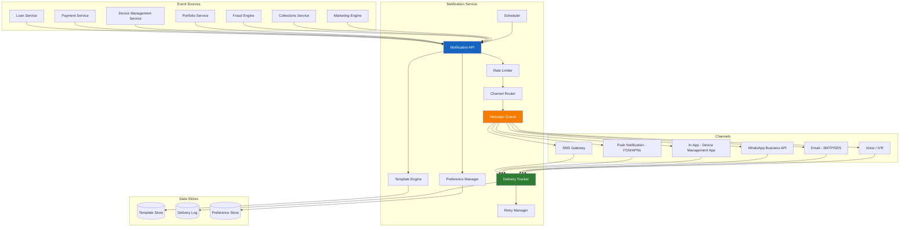

# Unified Notification Service

## Overview

The Unified Notification Service provides a centralized, multi-channel communication layer for the Mobile Device Lending Solution. It handles all outbound communications -- from transactional confirmations and operational alerts to marketing messages and dunning sequences. The service supports configurable templates, multi-language delivery, delivery tracking with fallback logic, and tenant-specific customization.

---

## Architecture



### Component Responsibilities

| Component | Description |
|---|---|
| **Notification API** | Receives notification requests from internal services; validates, enriches, and routes |
| **Channel Router** | Selects the appropriate delivery channel(s) based on notification type, customer preferences, and fallback rules |
| **Template Engine** | Renders message content from templates with variable substitution and language selection |
| **Message Queue** | Asynchronous message buffer ensuring reliable delivery under load |
| **Rate Limiter** | Enforces per-customer and per-channel rate limits to prevent notification fatigue |
| **Preference Manager** | Manages customer opt-in/opt-out preferences and channel preferences |
| **Delivery Tracker** | Monitors delivery status (sent, delivered, failed, read) from channel providers |
| **Scheduler** | Manages time-based notification delivery (e.g., dunning schedules, payment reminders) |
| **Retry Manager** | Handles failed deliveries with configurable retry policies and channel fallback |

---

## Channels

### SMS

| Aspect | Detail |
|---|---|
| Provider | Aggregator (e.g., Africa's Talking, Twilio, Infobip) |
| Delivery Confirmation | Delivery receipt (DLR) from carrier |
| Character Limit | 160 characters (GSM-7) or 70 characters (UCS-2 for non-Latin scripts) |
| Use Cases | Payment confirmations, lock/unlock notifications, OTPs, dunning messages |
| Fallback Role | Primary fallback when push notification fails |
| Cost | Per-message pricing; cost-optimized via template length control |

### Push Notification

| Aspect | Detail |
|---|---|
| Provider | Firebase Cloud Messaging (FCM) for Android |
| Delivery Confirmation | FCM delivery receipt; app-level read receipt |
| Requirements | Device Management App installed, internet connectivity, notification permissions |
| Use Cases | Payment reminders, status updates, promotional messages |
| Preferred Channel | First-choice for non-critical notifications (zero marginal cost) |
| Limitation | Does not work if app uninstalled or device offline |

### In-App (Device Management App)

| Aspect | Detail |
|---|---|
| Mechanism | Notification center within the DMA; persistent until dismissed |
| Delivery Confirmation | App confirms receipt at next sync |
| Use Cases | Loan details, payment schedule, policy updates, educational content |
| Advantage | Rich content support (formatted text, images, deep links) |
| Limitation | Only visible when customer opens the app |

### WhatsApp

| Aspect | Detail |
|---|---|
| Provider | WhatsApp Business API (via BSP) |
| Delivery Confirmation | Sent, delivered, read receipts |
| Template Requirement | All outbound messages must use pre-approved templates (WhatsApp policy) |
| Use Cases | Payment receipts, loan summaries, customer support conversations |
| Opt-In Required | Customer must opt in to WhatsApp communication |
| Rich Content | Supports buttons, document attachments, location sharing |

### Email

| Aspect | Detail |
|---|---|
| Provider | Amazon SES, SendGrid, or equivalent |
| Delivery Confirmation | Delivery, bounce, and open tracking |
| Use Cases | Loan agreements, formal notices, monthly statements, marketing |
| Limitation | Low penetration in some markets; not suitable for time-sensitive alerts |
| Format | HTML templates with plain-text fallback |

### Voice / IVR

| Aspect | Detail |
|---|---|
| Provider | Telephony provider with IVR capability |
| Use Cases | Final dunning notice (human or automated call), fraud verification callback |
| Trigger | Escalation channel for high-severity events only |
| Cost | Highest per-interaction cost; used sparingly |

---

## Template Management

### Template Structure

Each notification template is defined by the following attributes:

| Attribute | Description |
|---|---|
| `templateId` | Unique identifier |
| `eventType` | The triggering event (e.g., `PAYMENT_RECEIVED`, `DEVICE_LOCKED`) |
| `channel` | Target channel (SMS, PUSH, WHATSAPP, EMAIL, IN_APP, VOICE) |
| `language` | ISO 639-1 language code (e.g., `en`, `sw`, `fr`) |
| `tenantId` | Tenant-specific override (null = platform default) |
| `subject` | Subject line (email/push) |
| `body` | Message body with variable placeholders |
| `variables` | List of expected template variables |
| `maxLength` | Maximum rendered length (channel-specific) |
| `isActive` | Whether the template is currently in use |
| `version` | Template version number |
| `approvedAt` | Timestamp of last approval (required for WhatsApp) |

### Template Variables

| Variable | Description | Example |
|---|---|---|
| `{{customer.firstName}}` | Customer's first name | John |
| `{{customer.lastName}}` | Customer's last name | Mwangi |
| `{{loan.outstandingBalance}}` | Current outstanding balance | KES 12,500 |
| `{{loan.nextPaymentAmount}}` | Next installment amount | KES 2,500 |
| `{{loan.nextPaymentDate}}` | Next payment due date | 15 Dec 2025 |
| `{{loan.daysOverdue}}` | Number of days past due | 3 |
| `{{device.model}}` | Financed device model | Samsung Galaxy A15 |
| `{{device.imei}}` | Device IMEI (masked) | ***2345 |
| `{{tenant.name}}` | Financer name | MobiFinance |
| `{{tenant.contactPhone}}` | Financer support number | +254 800 123 456 |
| `{{tenant.contactEmail}}` | Financer support email | support@mobifinance.co.ke |
| `{{payment.amount}}` | Payment amount received | KES 2,500 |
| `{{payment.reference}}` | Payment transaction reference | PAY-2025-001234 |

### Template Hierarchy

Templates follow a resolution hierarchy:

1. **Tenant + Language + Channel**: Most specific; used if available.
2. **Tenant + Default Language + Channel**: Tenant override in default language.
3. **Platform Default + Language + Channel**: Platform-wide template in requested language.
4. **Platform Default + Default Language + Channel**: Ultimate fallback.

### Template Examples

**Payment Received (SMS, English)**

```
Dear {{customer.firstName}}, your payment of {{payment.amount}} for {{device.model}} has been received. Outstanding balance: {{loan.outstandingBalance}}. Ref: {{payment.reference}}. Thank you. {{tenant.name}}
```

**Device Locked (SMS, English)**

```
Dear {{customer.firstName}}, your {{device.model}} has been locked due to overdue payment of {{loan.outstandingBalance}}. Please pay to restore access. Contact: {{tenant.contactPhone}}. {{tenant.name}}
```

---

## Delivery Tracking

### Delivery Status Lifecycle

| Status | Description | Source |
|---|---|---|
| `QUEUED` | Message accepted and queued for delivery | Internal |
| `SENT` | Message dispatched to channel provider | Internal |
| `DELIVERED` | Channel provider confirms delivery to device/inbox | Provider callback |
| `READ` | Recipient opened/read the message | Provider callback (WhatsApp, email, push) |
| `FAILED` | Delivery attempt failed | Provider callback |
| `EXPIRED` | Message TTL exceeded without delivery | Internal |
| `OPTED_OUT` | Recipient has opted out of this channel | Internal |

### Fallback Logic

When a delivery fails on the primary channel, the system executes a fallback chain:


**Fallback Rules**

| Primary Channel | First Fallback | Second Fallback | Third Fallback |
|---|---|---|---|
| Push | SMS | WhatsApp | Email |
| SMS | WhatsApp | Push | Email |
| WhatsApp | SMS | Push | Email |
| Email | SMS | Push | WhatsApp |
| In-App | Push | SMS | -- |

**Fallback Timing**

| Scenario | Wait Before Fallback |
|---|---|
| Push not delivered | 15 minutes |
| SMS delivery receipt not received | 60 minutes |
| WhatsApp not delivered | 30 minutes |
| Email bounced | Immediate |
| Email not opened (time-sensitive) | 4 hours |

---

## Notification Types

### Transactional Notifications

Triggered by specific business events. Delivery is mandatory and cannot be opted out of.

| Event | Channel(s) | Priority | Example |
|---|---|---|---|
| Payment Received | SMS + Push | High | "Payment of KES 2,500 received" |
| Payment Receipt | SMS + In-App | High | Detailed receipt with reference number |
| Loan Disbursed | SMS + Push + Email | High | Loan terms confirmation |
| Device Unlocked | Push + SMS | High | "Your device has been unlocked" |
| OTP / Verification Code | SMS | Critical | 6-digit verification code |

### Operational Notifications

Status changes and system events relevant to the customer.

| Event | Channel(s) | Priority | Example |
|---|---|---|---|
| Loan Status Change | Push + In-App | Medium | "Your loan status has been updated" |
| Device Lock Warning | Push + SMS | High | "Payment overdue; device may be locked" |
| SIM Change Alert | SMS (old MSISDN) | High | "SIM change detected on your device" |
| KYC Verification Result | Push + In-App | Medium | "Your identity has been verified" |
| Loan Maturity | Push + SMS | Medium | "Congratulations, your final payment is due" |

### Marketing Notifications

Promotional messages that require opt-in and respect communication preferences.

| Event | Channel(s) | Priority | Example |
|---|---|---|---|
| Top-Up Eligibility | Push + In-App | Low | "You qualify for a device upgrade" |
| New Product Announcement | Push + Email | Low | "New devices now available" |
| Referral Program | In-App + WhatsApp | Low | "Refer a friend and earn rewards" |
| Seasonal Promotion | Push + SMS | Low | "Special holiday offer on device financing" |

### Dunning Notifications

Payment collection communications that follow a defined escalation schedule.

| Stage | Channel(s) | Priority | Timing |
|---|---|---|---|
| Pre-Due Reminder | Push + SMS | Medium | 1 day before due date |
| Overdue Notice | Push + SMS | High | Day 1 overdue |
| Escalation Warning | Push + SMS | High | Day 3 overdue |
| Final Notice | Push + SMS + Voice | Critical | Day 7 overdue |
| Lock Notification | SMS | Critical | At device lock |

See [Dunning Escalation Templates](dunning-escalation.md) for detailed escalation schedules and template content.

---

## Rate Limiting and Opt-Out Management

### Rate Limits

To prevent notification fatigue and comply with regulations, the following rate limits are enforced:

| Scope | Limit | Window | Applies To |
|---|---|---|---|
| Per customer, all channels | 10 messages | 24 hours | All non-critical notifications |
| Per customer, SMS | 5 messages | 24 hours | SMS channel |
| Per customer, Push | 8 messages | 24 hours | Push notifications |
| Per customer, WhatsApp | 3 messages | 24 hours | WhatsApp |
| Per customer, marketing | 2 messages | 7 days | Marketing notifications only |
| Per customer, voice | 1 call | 7 days | Voice/IVR |

**Exempt from Rate Limits**

- OTP / verification codes.
- Device lock/unlock notifications.
- Fraud alerts.
- Regulatory-required communications.

### Opt-Out Management

| Channel | Opt-Out Mechanism | Scope |
|---|---|---|
| SMS | Reply STOP | All marketing SMS; transactional SMS cannot be opted out |
| Push | Device notification settings | All push notifications |
| WhatsApp | Reply STOP or block business number | All WhatsApp messages |
| Email | Unsubscribe link in footer | Marketing emails; transactional emails cannot be opted out |
| Voice | Verbal opt-out during call | Marketing/dunning calls |
| In-App | Preference settings in DMA | Marketing notifications |

### Preference Storage

Customer preferences are stored in the Preference Store and checked before every non-transactional notification:

```json
{
  "customerId": "CUS-2025-001234",
  "preferences": {
    "sms": { "marketing": false, "operational": true, "dunning": true },
    "push": { "marketing": true, "operational": true, "dunning": true },
    "whatsapp": { "marketing": false, "operational": true, "dunning": true },
    "email": { "marketing": true, "operational": true, "dunning": true },
    "voice": { "marketing": false, "dunning": true }
  },
  "language": "en",
  "quietHours": { "start": "21:00", "end": "07:00", "timezone": "Africa/Nairobi" },
  "updatedAt": "2025-11-15T10:30:00Z"
}
```

### Quiet Hours

- Non-critical notifications are deferred during customer-specified quiet hours.
- Critical notifications (device lock, fraud alerts, OTPs) are exempt from quiet hours.
- Default quiet hours: 21:00 -- 07:00 local time (configurable per tenant).

---

## Multi-Language Support

### Supported Languages

Languages are configurable per tenant. The platform provides default templates in:

| Language | Code | Coverage |
|---|---|---|
| English | `en` | All templates |
| Swahili | `sw` | All templates |
| French | `fr` | All templates |
| Portuguese | `pt` | All templates |
| Arabic | `ar` | All templates |

Additional languages can be added per tenant without platform changes.

### Language Selection Logic

1. Use the customer's explicitly stated language preference.
2. If no preference, use the language of the customer's most recent interaction.
3. If no interaction history, use the tenant's default language.
4. If no tenant default, use English (`en`).

---

## Monitoring and Metrics

### Key Performance Indicators

| Metric | Target | Measurement |
|---|---|---|
| Delivery rate (SMS) | > 95% | Delivered / Sent |
| Delivery rate (Push) | > 85% | Delivered / Sent |
| Delivery rate (WhatsApp) | > 90% | Delivered / Sent |
| Mean delivery time (SMS) | < 30 seconds | Provider DLR timestamp - sent timestamp |
| Fallback trigger rate | < 10% | Fallback events / Total sends |
| Opt-out rate (marketing) | < 5% monthly | Opt-outs / Total marketing recipients |
| Template rendering errors | < 0.1% | Rendering failures / Total renders |

### Alerting

| Condition | Alert | Severity |
|---|---|---|
| SMS delivery rate drops below 90% | Operations team | High |
| Push delivery rate drops below 70% | Operations team | Medium |
| Channel provider outage | Operations team + fallback activation | Critical |
| Rate limit breach (system-level) | Engineering team | High |
| Template rendering failure spike | Engineering team | Medium |

---

## Related Documentation

- [Dunning Escalation Templates](dunning-escalation.md)
- [Fraud Risk Framework](../fraud-prevention/fraud-framework.md)
- [Audit Trail](../audit/audit-trail.md)
