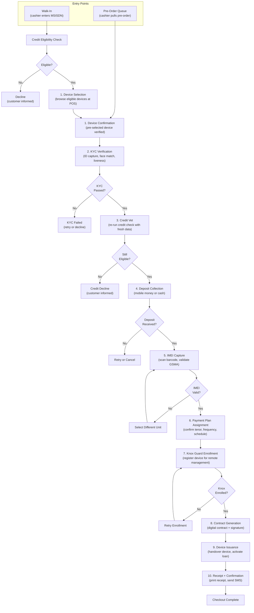
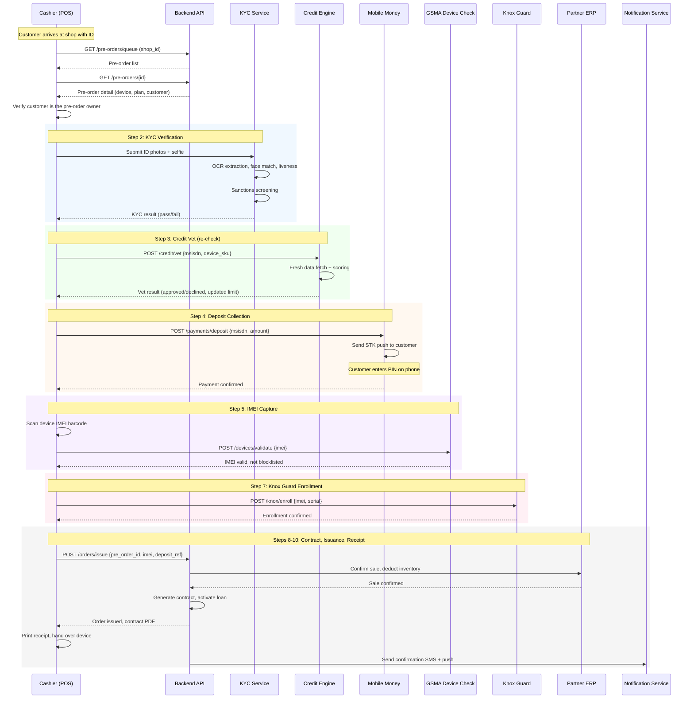
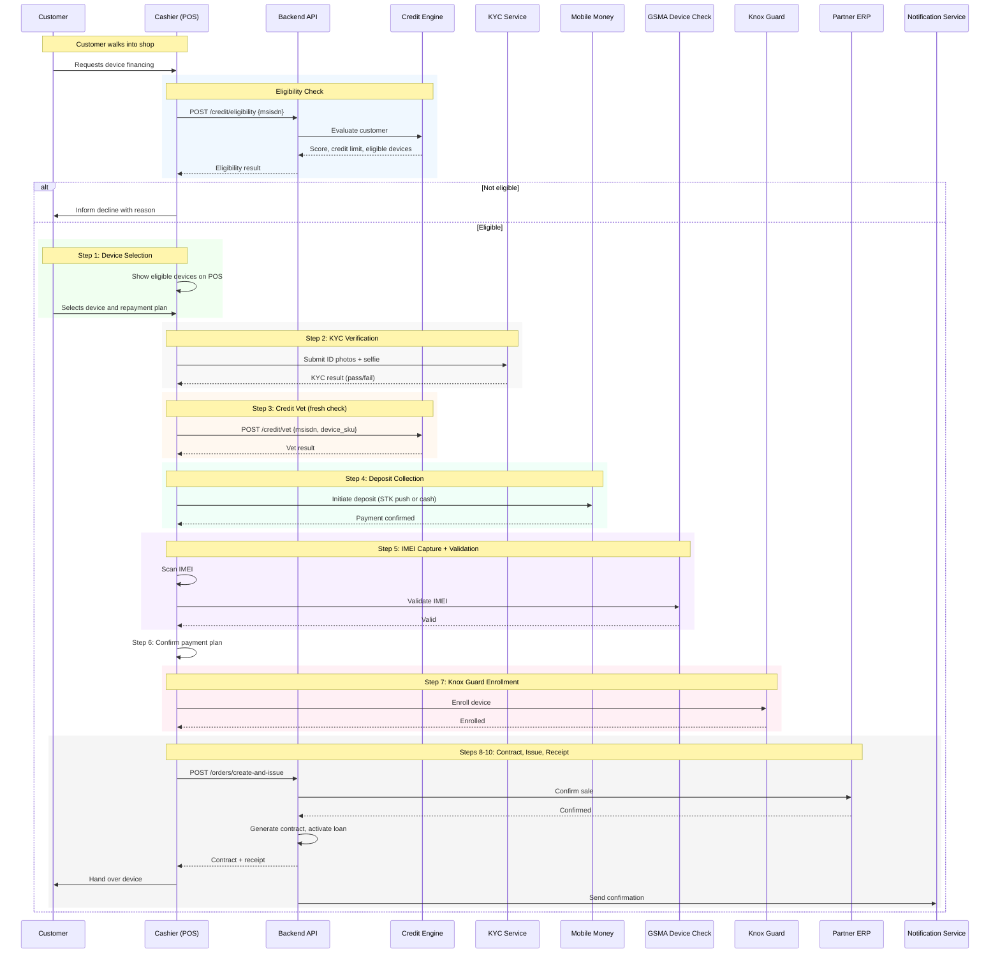
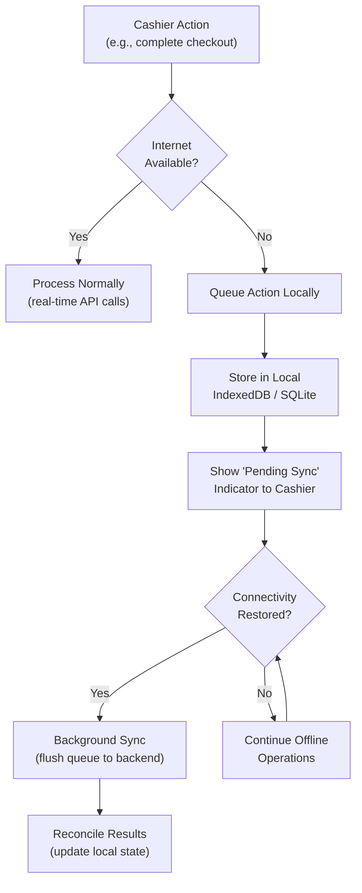

# POS Fulfilment Flow

## 1. Overview

The IInovi POS (Point of Sale) application is the **in-shop fulfilment tool** used by cashiers at partner shops to complete device lending transactions. It handles both **pre-order fulfilment** (where the customer pre-selected a device remotely) and **on-shop fulfilment** (where the customer walks in and selects a device at the shop). After the initial device selection step, both flows converge into a **unified checkout process** with identical steps.

The POS application runs on tablets or desktop browsers at partner shops. It integrates with the IInovi backend for credit evaluation, the partner's ERP for inventory management, mobile money providers for deposit collection, Samsung Knox Guard for device enrollment, and the platform's notification service for customer communications.

### 1.1 Two Entry Points, One Checkout

| Entry Point | Origin | How It Starts |
|------------|--------|---------------|
| **Pre-order fulfilment** | Customer created a pre-order via mobile app or USSD | Cashier pulls the pre-order from the shop's queue |
| **On-shop fulfilment** | Customer walks into the shop without a pre-order | Cashier enters the customer's MSISDN and starts a new application |

Both entry points feed into the same checkout pipeline starting at the KYC verification step.

---

## 2. Unified Checkout Steps

### 2.1 Checkout Pipeline



### 2.2 Step Breakdown

| Step | Action | System Interaction | Failure Handling |
|------|--------|-------------------|------------------|
| **1. Device Selection / Confirmation** | Walk-in: customer browses eligible devices. Pre-order: cashier confirms the pre-selected device. | Catalog service (filter by credit limit) | Walk-in: no eligible devices leads to decline. Pre-order: device unavailable prompts alternative selection. |
| **2. KYC Verification** | Cashier captures ID document (front/back), performs selfie face-match with liveness detection, runs sanctions screening. | KYC service, face-match engine, sanctions database | Failed face-match: retry with better lighting. Expired ID: customer must provide alternative. Sanctions hit: immediate decline. |
| **3. Credit Vet** | Fresh credit evaluation using current telco and platform data. Confirms the customer still qualifies for the selected device. | Credit scoring engine, MSISDN data adapter | Score deterioration: downgrade to a less expensive device or decline. |
| **4. Deposit Collection** | Cashier initiates deposit payment via mobile money (STK push to customer's phone) or accepts cash. | Mobile money gateway, payment service | STK push timeout: retry or accept cash. Insufficient funds: customer can top up and retry. |
| **5. IMEI Capture** | Cashier scans the device box barcode or manually enters the IMEI. System validates against GSMA blocklist. | GSMA Device Check API | Blocklisted IMEI: select a different unit. TAC mismatch: verify the correct device model is being scanned. |
| **6. Payment Plan Assignment** | Confirm the repayment plan (tenor, frequency, instalment amount). For pre-orders, the plan was pre-selected; for walk-ins, the customer chooses at this step. | Loan product service | None -- configuration-driven. |
| **7. Knox Guard Enrollment** | The device IMEI is registered with Samsung Knox Guard for remote lock/unlock capability. | Knox Guard API | Enrollment failure: retry. Persistent failure: escalate to support; device is not issued until enrollment succeeds. |
| **8. Contract Generation** | A digital loan contract is generated with customer details, device details, IMEI, repayment schedule, and terms. Customer signs via on-screen signature or OTP confirmation. | Document service, SMS gateway (for OTP) | Signature failure: retry. Customer refuses to sign: cancel transaction. |
| **9. Device Issuance** | Cashier hands the device to the customer. The customer powers it on and confirms it is functional. The POS records the issuance event. | Order service, ERP (confirm sale) | Customer reports defect: swap unit (re-do IMEI capture). |
| **10. Receipt and Confirmation** | Receipt is printed (or sent digitally). Confirmation SMS is sent to the customer with loan details and first payment date. | Receipt printer / PDF service, notification service | Print failure: send digital receipt via SMS/email. |

---

## 3. Pre-Order Fulfilment Flow

### 3.1 Sequence Diagram



### 3.2 Pre-Order-Specific Considerations

| Consideration | Detail |
|---------------|--------|
| **Device already selected** | The device model and repayment plan were chosen during pre-order creation. The cashier confirms rather than re-selects. |
| **Credit re-check is mandatory** | Even though the customer was evaluated at pre-order time, a fresh credit check is required because the customer's situation may have changed. |
| **Deposit may be pre-paid** | If the customer paid the deposit via mobile money during the pre-order flow (app-based pre-orders), this step is skipped at the POS. The cashier verifies the deposit was received. |
| **Queue management** | The cashier retrieves the pre-order from a prioritized queue (see [Pre-Order Lifecycle](pre-order-flow.md), Section 7). |

---

## 4. On-Shop (Walk-In) Fulfilment Flow

### 4.1 Sequence Diagram



### 4.2 Walk-In-Specific Considerations

| Consideration | Detail |
|---------------|--------|
| **No prior device selection** | The cashier guides the customer through device browsing at the POS, showing only devices within the customer's credit limit |
| **Single-visit completion** | The entire flow -- from eligibility check to device handover -- is completed in one shop visit, typically within 15 minutes |
| **Immediate credit check** | The eligibility check happens at the start of the interaction, before any device is selected |
| **Physical device inspection** | The customer can physically inspect demo units before deciding, which is not possible in the pre-order flow |
| **Cash deposit option** | Walk-in customers more commonly pay the deposit in cash, since they are physically present |

---

## 5. ERP Integration

### 5.1 Integration Points

The POS interacts with the partner's ERP system at two key moments during the fulfilment flow:

| Integration Point | Timing | Purpose | API Call |
|-------------------|--------|---------|----------|
| **Device reservation** | After `HumanValidated` (pre-order) or after credit vet (walk-in) | Reserve a specific device unit in the ERP inventory to prevent double-selling | `POST /erp/inventory/reserve {sku, shop_id, quantity: 1}` |
| **Sale confirmation** | At device issuance | Confirm the sale in the ERP, deduct inventory, and create a sales record | `POST /erp/sales/confirm {reservation_id, imei, customer_ref, sale_amount}` |

### 5.2 ERP Adapter Pattern

The platform uses an **adapter pattern** to integrate with different partner ERP systems (SAP, Oracle, Odoo, custom systems). Each adapter implements a standard interface:

```python
class ErpAdapter(ABC):
    @abstractmethod
    def reserve_device(
        self, sku: str, shop_id: str, pre_order_ref: str
    ) -> ErpReservation:
        ...

    @abstractmethod
    def confirm_sale(
        self, reservation_id: str, imei: str, sale_details: SaleDetails
    ) -> ErpSaleConfirmation:
        ...

    @abstractmethod
    def release_reservation(self, reservation_id: str) -> bool:
        ...

    @abstractmethod
    def check_stock(self, sku: str, shop_id: str) -> StockLevel:
        ...
```

### 5.3 Stock Synchronization

| Scenario | Handling |
|----------|---------|
| **Real-time stock** | If the ERP supports webhooks or real-time APIs, stock levels are fetched on demand |
| **Periodic sync** | If real-time is not available, stock levels are synced every 15 minutes via a background job |
| **Stock discrepancy** | If the IMEI scanned at the POS does not match ERP records, the cashier is prompted to resync or contact the shop manager |

---

## 6. Offline Resilience

### 6.1 Connectivity Challenges

Partner shops in emerging markets frequently experience intermittent internet connectivity. The POS is designed to continue operating during brief connectivity outages.

### 6.2 Offline Strategy



### 6.3 Offline Capabilities

| Capability | Online Required | Offline Behaviour |
|------------|:-:|----------------|
| **View pre-order queue** | No (cached) | Displays last-synced queue; new pre-orders will not appear until reconnection |
| **KYC document capture** | No | Photos are captured and stored locally; verification is queued |
| **Credit evaluation** | Yes | Cannot proceed without connectivity; cashier is informed |
| **Deposit collection (mobile money)** | Yes | STK push requires connectivity; cash deposits can be recorded locally |
| **IMEI capture** | No | Barcode scanning and Luhn validation work offline |
| **GSMA device check** | Yes | Queued; if unavailable, cashier can proceed with a risk acknowledgement (configurable per partner) |
| **Knox Guard enrollment** | Yes | Queued; device issuance is blocked until enrollment succeeds |
| **Contract generation** | No (template cached) | Contract is generated locally from cached template and synced |
| **Receipt printing** | No | Receipt is generated and printed locally |
| **Sale confirmation to ERP** | Yes | Queued and synced when connectivity is restored |

### 6.4 Sync Queue

All queued operations are stored in a local database with:

- Operation type and payload.
- Timestamp of creation.
- Number of sync attempts.
- Status: `pending`, `syncing`, `synced`, `failed`.

A background sync worker processes the queue in FIFO order when connectivity is restored. Failed operations are retried with exponential backoff (up to 3 retries). Persistently failed operations are flagged for manual resolution.

---

## 7. Receipt and Contract Generation

### 7.1 Receipt Content

The receipt generated at the point of issuance includes:

| Field | Source |
|-------|--------|
| Partner name and shop address | Partner configuration |
| Receipt number | Auto-generated sequence |
| Date and time | POS system clock |
| Cashier name and ID | Authenticated POS user |
| Customer name and MSISDN | Customer profile |
| Device description (brand, model, color) | Catalog |
| IMEI | Captured at POS |
| Retail price | Catalog |
| BNPL price (total cost of credit) | Loan product |
| Deposit paid | Payment record |
| Financed amount | BNPL price minus deposit |
| Repayment schedule summary | Loan service |
| First payment date and amount | Repayment schedule |
| Terms reference | Contract ID |

### 7.2 Contract Content

The loan contract is a more detailed legal document containing:

- Full customer identification (name, ID number, MSISDN, address).
- Full device identification (brand, model, color, IMEI, serial number).
- Financial terms: retail price, BNPL price, deposit, financed amount, interest/fees, total cost of credit.
- Complete repayment schedule with dates and amounts.
- Terms and conditions: late payment fees, device locking policy, early settlement terms, default consequences.
- Consent statements: data processing consent, telco data access consent, Knox Guard consent.
- Partner and platform identification.
- Customer signature (digital) and timestamp.

### 7.3 Delivery

| Output | Method |
|--------|--------|
| **Printed receipt** | Thermal printer connected to POS tablet, or A4 print for desktop POS |
| **Digital receipt** | Sent via SMS (short link to view) and/or email |
| **Contract PDF** | Stored in platform document storage; accessible to customer via app or secure link |
| **Contract SMS** | SMS with a link to view and download the signed contract |

---

## 8. Pre-Order vs On-Shop Comparison

| Aspect | Pre-Order | On-Shop (Walk-In) |
|--------|-----------|-------------------|
| **Device selection** | Done remotely (app or USSD) before shop visit | Done at the POS with cashier assistance |
| **Credit check** | Initial check at pre-order time; re-check at shop | Single check at the start of the shop visit |
| **KYC** | Performed at shop during pre-order validation | Performed at shop during the checkout flow |
| **Deposit** | May be pre-paid via mobile money (app) or paid at shop | Always paid at shop (mobile money or cash) |
| **Device reservation** | Reserved in ERP after validation | Reserved implicitly (device is physically present) |
| **Customer visits** | Minimum 1 shop visit (may require 2 if validation and pickup are separate) | Single shop visit |
| **Time at shop** | 10--15 minutes (KYC + deposit + IMEI + issuance) | 15--20 minutes (includes eligibility check + device browsing) |
| **Queue management** | Cashier pulls from pre-order queue | No queue; cashier starts a new flow |
| **Checkout steps** | Steps 2--10 (device already selected) | Steps 1--10 (full flow) |

---

## 9. Error Recovery

### 9.1 Common Error Scenarios

| Scenario | Impact | Recovery |
|----------|--------|----------|
| **Mobile money timeout** | Deposit not confirmed | Retry STK push; accept cash as alternative; customer can retry after topping up |
| **GSMA check failure** | Cannot validate IMEI | Select a different device unit; if API is down, proceed with manual validation (partner risk acceptance required) |
| **Knox enrollment failure** | Device cannot be enrolled for remote management | Retry enrollment; if persistent, escalate to Knox support. Device must not be issued without enrollment (unless partner policy allows). |
| **ERP sync failure** | Sale not confirmed in ERP | Sale is queued for sync; the device is issued to the customer. ERP reconciliation happens when connectivity is restored. |
| **KYC face-match failure** | Customer identity not verified | Retry with better lighting or angle; try alternative ID document; escalate to manager for manual override (with audit trail). |
| **POS crash mid-checkout** | Transaction state unclear | The POS persists state at each step; on restart, the cashier can resume from the last completed step. |
| **Power outage** | POS shuts down | Battery backup recommended; transaction state is persisted to disk and can be resumed. |

### 9.2 Transaction Idempotency

All critical operations (deposit collection, IMEI binding, Knox enrollment, loan activation) use **idempotency keys** to prevent double-processing if a network retry occurs. The backend rejects duplicate requests with the same idempotency key and returns the original response.

---

## 10. Cashier Experience

### 10.1 POS Dashboard

The cashier's POS dashboard provides:

| Section | Content |
|---------|---------|
| **Pre-Order Queue** | List of pending pre-orders routed to this shop, sorted by urgency |
| **Active Checkout** | Current checkout session with step-by-step progress indicator |
| **Today's Summary** | Number of devices issued today, total deposits collected, pending pre-orders |
| **Alerts** | Pre-orders approaching expiry, sync failures, inventory warnings |

### 10.2 Checkout Progress Indicator

The POS displays a clear step-by-step progress bar during checkout:

```
[1. Device] -> [2. KYC] -> [3. Credit] -> [4. Deposit] -> [5. IMEI] -> [6. Plan] -> [7. Knox] -> [8. Contract] -> [9. Issue] -> [10. Receipt]
   DONE         DONE        DONE         CURRENT
```

Each completed step shows a checkmark. The current step is highlighted. The cashier can navigate back to review completed steps but cannot skip ahead.

### 10.3 Cashier Authentication

| Measure | Detail |
|---------|--------|
| **Login** | Username and password; session timeout after 30 minutes of inactivity |
| **Role-based access** | Cashier, Senior Cashier (can override KYC failures), Manager (can extend TTLs and approve exceptions) |
| **Audit trail** | Every action is logged with the cashier's user ID and timestamp |
| **Multi-shop access** | A cashier is assigned to one shop; shop transfer requires admin action |
