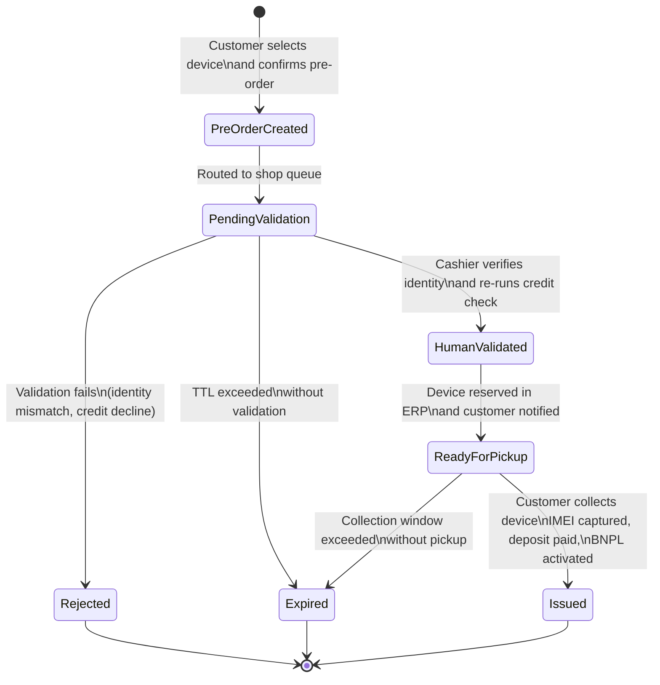
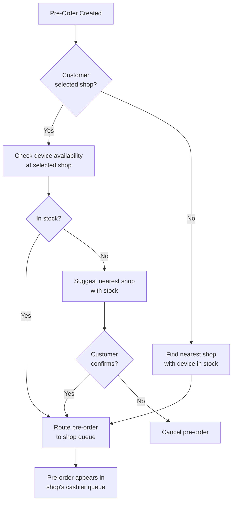
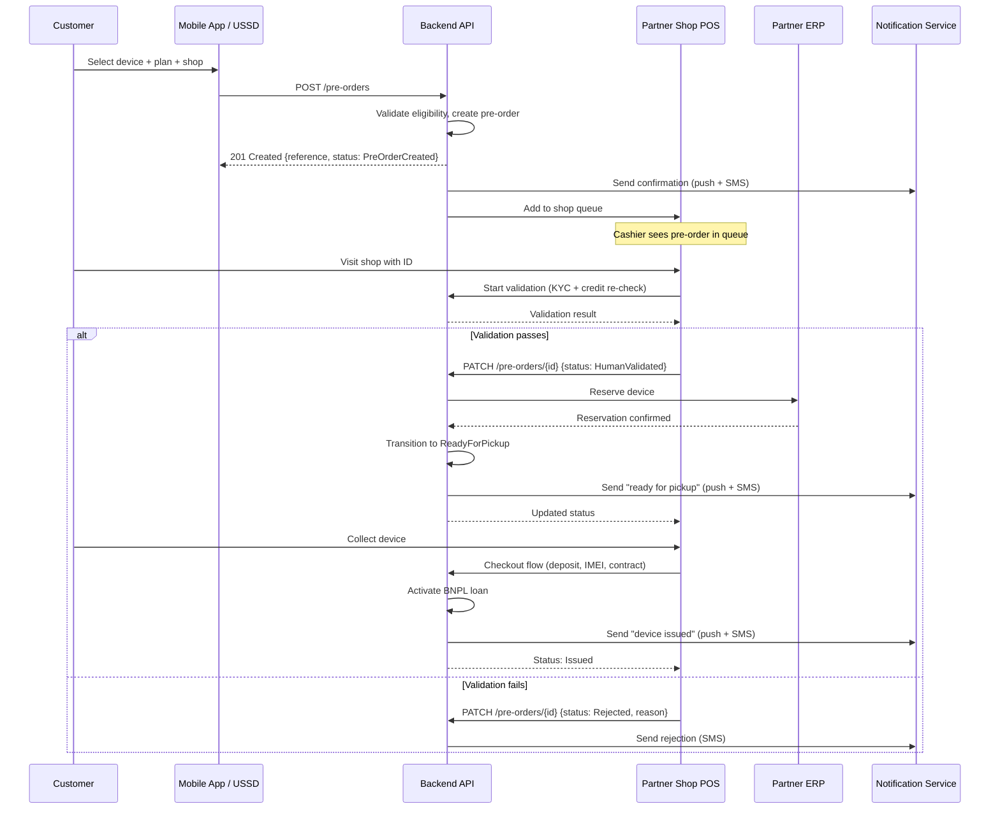
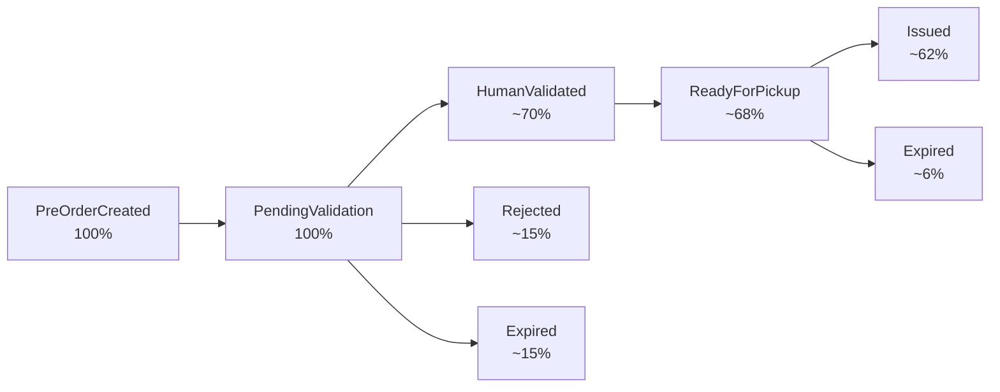

# Pre-Order Lifecycle

## 1. Overview

A **pre-order** is a customer-initiated request to acquire a specific device through the IInovi BNPL platform, created remotely via the mobile app or USSD channel. Unlike an on-shop (walk-in) order where the entire process is completed in a single visit, a pre-order captures the customer's device selection and routes it to a partner shop for human validation, identity verification, and eventual device issuance.

Pre-orders exist because device lending requires in-person KYC verification and physical device handover. The pre-order bridges the gap between remote device discovery (app or USSD) and in-shop fulfilment, allowing customers to browse, select, and reserve a device from anywhere, then visit a shop only for the final steps.

### 1.1 Key Characteristics

| Characteristic | Detail |
|----------------|--------|
| **Origin channels** | Mobile app, USSD |
| **Requires in-person step** | Yes -- KYC verification, deposit collection (if not pre-paid), IMEI capture, and device handover occur at the shop |
| **Time-bound** | Pre-orders expire if not fulfilled within a configurable TTL |
| **Human validation** | A cashier at the partner shop must validate the customer's identity and re-confirm credit eligibility |
| **Routing** | Pre-orders are routed to a specific partner shop selected by the customer |

---

## 2. Pre-Order State Machine

### 2.1 State Diagram

### 2.2 State Descriptions

| State | Description | Entry Condition | Exit Conditions |
|-------|-------------|-----------------|-----------------|
| **PreOrderCreated** | Customer has selected a device and repayment plan, and confirmed the pre-order via the app or USSD. The pre-order is stored with device details, selected shop, and customer MSISDN. | Customer confirms pre-order in app or USSD | Routed to shop queue (auto-transition) |
| **PendingValidation** | The pre-order has been routed to the selected shop's cashier queue. It is awaiting a cashier to pick it up, verify the customer's identity in person, and re-run the credit check. | Pre-order routed to shop | Cashier validates or rejects; or TTL expires |
| **HumanValidated** | A cashier at the shop has verified the customer's identity (KYC check) and confirmed that the customer still passes the credit evaluation. The device model is reserved in the partner's ERP/inventory system. | Cashier completes validation successfully | Device reservation confirmed |
| **ReadyForPickup** | The device is physically reserved at the shop and the customer has been notified (push notification, SMS) to visit and collect it. A collection window starts ticking. | ERP confirms device reservation | Customer collects device; or collection window expires |
| **Issued** | The customer has visited the shop, the deposit has been collected, the specific device unit's IMEI has been captured and validated, the BNPL loan has been activated, and the device has been handed over. | Device issued to customer | Terminal state |
| **Rejected** | The cashier determined that the customer cannot proceed. Reasons include identity verification failure, credit re-check decline, or document issues. The customer is notified with a reason. | Validation fails | Terminal state |
| **Expired** | The pre-order was not acted upon within the configured TTL. This can occur if the customer does not visit the shop within the validation window, or if a validated pre-order is not collected within the pickup window. The reserved device (if any) is released back to inventory. | TTL exceeded | Terminal state |

---

## 3. Detailed State Transitions

### 3.1 PreOrderCreated --> PendingValidation

This transition is **automatic** and occurs immediately after pre-order creation:

1. The pre-order is persisted with status `PreOrderCreated`.
2. The system identifies the selected shop and adds the pre-order to the shop's validation queue.
3. The status transitions to `PendingValidation`.
4. The validation TTL timer starts (configurable, default: 72 hours).
5. The cashier queue at the shop is updated (visible in the POS application).

### 3.2 PendingValidation --> HumanValidated

This transition requires **cashier action** at the shop:

1. The cashier opens the pre-order from the shop's queue in the POS application.
2. The customer is present at the shop with identification documents.
3. The cashier performs KYC verification:
   - Captures the customer's ID document (photo).
   - Performs a face-match between the ID photo and a live selfie.
   - Confirms the customer's MSISDN matches the pre-order.
4. The cashier triggers a **credit re-check** to confirm the customer is still eligible (scores can change between pre-order creation and shop visit).
5. If KYC passes and the credit re-check returns an approved decision, the status transitions to `HumanValidated`.

### 3.3 PendingValidation --> Rejected

If validation fails at any step:

1. **KYC failure** -- identity document expired, face-match score below threshold, sanctions screening hit, or duplicate account detected.
2. **Credit re-check decline** -- customer's credit score has deteriorated since the pre-order was created (e.g., new default on another loan, telco data changes).
3. **Customer no-show with document issues** -- customer cannot provide required identification.

The cashier selects a rejection reason in the POS. The pre-order transitions to `Rejected`, and the customer is notified via push notification and SMS with the reason.

### 3.4 HumanValidated --> ReadyForPickup

After successful validation:

1. The system sends a **device reservation request** to the partner's ERP (if ERP integration is configured) or to the platform's internal inventory service.
2. The ERP reserves a unit of the selected device model at the shop.
3. If reservation succeeds, the status transitions to `ReadyForPickup`.
4. The customer receives a notification: "Your device is ready for collection at [Shop Name]. Please visit within [N] days."
5. The pickup TTL timer starts (configurable, default: 7 days).

If device reservation fails (out of stock), the cashier is prompted to:
- Check if the device is available at a nearby shop and offer to transfer the pre-order.
- Offer an alternative device to the customer.
- Cancel the pre-order.

### 3.5 ReadyForPickup --> Issued

The final step, where the customer collects the device:

1. The customer visits the shop within the pickup window.
2. The cashier retrieves the pre-order in the POS and begins the checkout flow.
3. **Deposit collection** -- the customer pays the required deposit (mobile money STK push or cash).
4. **IMEI capture** -- the cashier scans the specific device unit's IMEI barcode.
5. **GSMA device check** -- the IMEI is validated against the GSMA blocklist.
6. **Contract generation** -- the loan contract is generated and signed (digital signature or OTP confirmation).
7. **Knox Guard enrollment** -- the device is registered with Samsung Knox Guard.
8. **Device handover** -- the cashier hands the device to the customer.
9. The pre-order transitions to `Issued` and the BNPL loan is activated.

### 3.6 Expiry Transitions

| Expiry Scenario | TTL Default | Trigger | Action |
|-----------------|-------------|---------|--------|
| **Validation expiry** | 72 hours after `PendingValidation` | Customer does not visit the shop; cashier does not process | Pre-order transitions to `Expired`; customer notified |
| **Pickup expiry** | 7 days after `ReadyForPickup` | Customer does not collect the reserved device | Pre-order transitions to `Expired`; device reservation released in ERP; customer notified |

---

## 4. Pre-Order Routing

### 4.1 Shop Selection

The customer selects a partner shop during the pre-order flow:

| Selection Method | Channel | Detail |
|-----------------|---------|--------|
| **Map-based** | Mobile app | Customer taps a shop pin on the map; nearest shops are highlighted |
| **List-based** | Mobile app, USSD | Customer selects from a list sorted by proximity (GPS-based on app, area-based on USSD) |
| **Manual** | USSD | Customer enters a city or area name; matching shops are listed |

### 4.2 Routing Logic

### 4.3 Stock Availability Check

Before routing, the system optionally checks whether the selected device model is in stock at the target shop (if real-time inventory data is available via ERP integration). If the device is not in stock:

- The customer is informed and offered alternative shops with availability.
- If no nearby shop has stock, the customer can proceed anyway (the device may be restocked before their visit) with a warning that availability is not guaranteed.

---

## 5. TTL Management and Expiry Rules

### 5.1 TTL Configuration

TTL values are configurable per partner and per pre-order state:

| TTL Parameter | Default | Configurable Range | Description |
|---------------|---------|-------------------|-------------|
| `validation_ttl` | 72 hours | 24 hours -- 7 days | Time allowed for the customer to visit the shop and for the cashier to validate |
| `pickup_ttl` | 7 days | 3 days -- 14 days | Time allowed for the customer to collect the device after validation |
| `total_ttl` | 10 days | Sum of validation + pickup TTLs | Maximum total lifetime of a pre-order |

### 5.2 Expiry Processing

Expiry is handled by a **scheduled job** that runs every 15 minutes:

1. Query all pre-orders in `PendingValidation` where `created_at + validation_ttl < now()`.
2. Query all pre-orders in `ReadyForPickup` where `validated_at + pickup_ttl < now()`.
3. For each expired pre-order:
   a. Transition status to `Expired`.
   b. If a device was reserved in the ERP, send a release request.
   c. Notify the customer via SMS and push notification.
   d. Log the expiry event for reporting.

### 5.3 Extension

In exceptional cases (e.g., shop closure, customer travel), a cashier or administrator can **extend** the TTL of a specific pre-order. Extensions are logged with the reason and the user who authorized them.

---

## 6. Notifications

### 6.1 Notification Matrix

| State Transition | Customer Notification | Cashier Notification |
|-----------------|----------------------|---------------------|
| PreOrderCreated --> PendingValidation | "Your pre-order #REF has been placed. Visit [Shop] within [N] days with your ID." (Push + SMS) | New item appears in shop queue (POS dashboard) |
| PendingValidation --> HumanValidated | "Your pre-order #REF has been approved at [Shop]." (Push + SMS) | Validation recorded in POS |
| HumanValidated --> ReadyForPickup | "Your [Device] is ready for collection at [Shop]. Collect within [N] days." (Push + SMS) | Device reservation confirmed in POS |
| ReadyForPickup --> Issued | "Your [Device] has been issued. Your first payment of [Amount] is due on [Date]." (Push + SMS) | Issuance recorded; receipt generated |
| PendingValidation --> Rejected | "Your pre-order #REF could not be approved. Reason: [Reason]. Contact support for details." (SMS) | Rejection recorded in POS |
| Any --> Expired | "Your pre-order #REF has expired. You can create a new order anytime." (SMS) | Expired item removed from active queue |
| Approaching TTL (24h before expiry) | "Reminder: Your pre-order #REF expires tomorrow. Visit [Shop] to complete collection." (SMS) | Highlighted in queue as "expiring soon" |

### 6.2 Notification Channels

| Channel | Used For | Technical Mechanism |
|---------|----------|-------------------|
| **Push notification** | App users; immediate status updates | FCM (Android) / APNs (iOS) |
| **SMS** | All customers (app and USSD); confirmations and reminders | SMS gateway (via notification service) |
| **POS dashboard** | Cashier alerts; queue updates | WebSocket or polling from POS frontend |

---

## 7. Cashier Queue Management

### 7.1 Queue Structure

Each partner shop has a **pre-order queue** visible in the POS application. The queue shows all pre-orders routed to that shop that are awaiting action.

| Queue Column | Description |
|-------------|-------------|
| **Reference** | Pre-order reference number (e.g., PO-2026-4821) |
| **Customer** | Customer name (from credit evaluation) and MSISDN |
| **Device** | Selected device model and variant |
| **Status** | Current state (PendingValidation, HumanValidated, ReadyForPickup) |
| **Created** | Pre-order creation timestamp |
| **Expires** | TTL expiry timestamp |
| **Priority** | Visual indicator for pre-orders approaching expiry |

### 7.2 Queue Actions

| Action | Available In State | Description |
|--------|-------------------|-------------|
| **Validate** | PendingValidation | Start the KYC and credit re-check process |
| **Reject** | PendingValidation | Reject the pre-order with a reason |
| **Issue** | ReadyForPickup | Begin the checkout and device handover flow |
| **Extend TTL** | Any active state | Extend the expiry window (requires manager approval for extensions beyond 7 days) |
| **Transfer** | PendingValidation | Transfer the pre-order to a different shop (e.g., customer preference change, stock unavailability) |

### 7.3 Queue Prioritization

Pre-orders in the queue are sorted by:

1. **Urgency** -- pre-orders closest to TTL expiry appear first.
2. **Status** -- `ReadyForPickup` (awaiting collection) appears above `PendingValidation` (awaiting cashier action).
3. **Creation time** -- older pre-orders appear before newer ones within the same priority group.

---

## 8. Pre-Order Flow Sequence

---

## 9. Reporting and Analytics

### 9.1 Key Metrics

| Metric | Description |
|--------|-------------|
| **Pre-order volume** | Number of pre-orders created per day/week/month |
| **Conversion rate** | Percentage of pre-orders that reach `Issued` status |
| **Rejection rate** | Percentage of pre-orders rejected at validation |
| **Expiry rate** | Percentage of pre-orders that expire without fulfilment |
| **Time to validation** | Average time from `PreOrderCreated` to `HumanValidated` |
| **Time to collection** | Average time from `ReadyForPickup` to `Issued` |
| **End-to-end time** | Average time from `PreOrderCreated` to `Issued` |
| **Queue depth** | Number of pending pre-orders per shop |

### 9.2 Funnel Analysis

The funnel above shows illustrative conversion rates. Actual rates vary by market, partner, and customer segment. The platform tracks these metrics in real time and surfaces them in partner dashboards.
