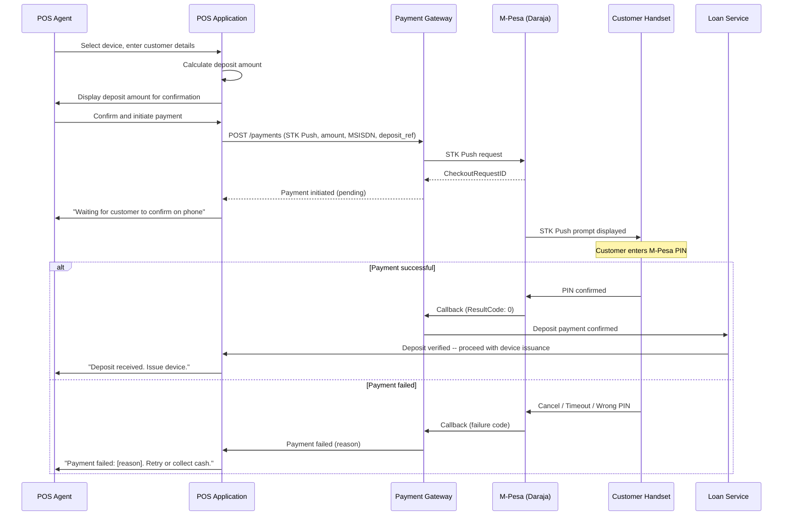
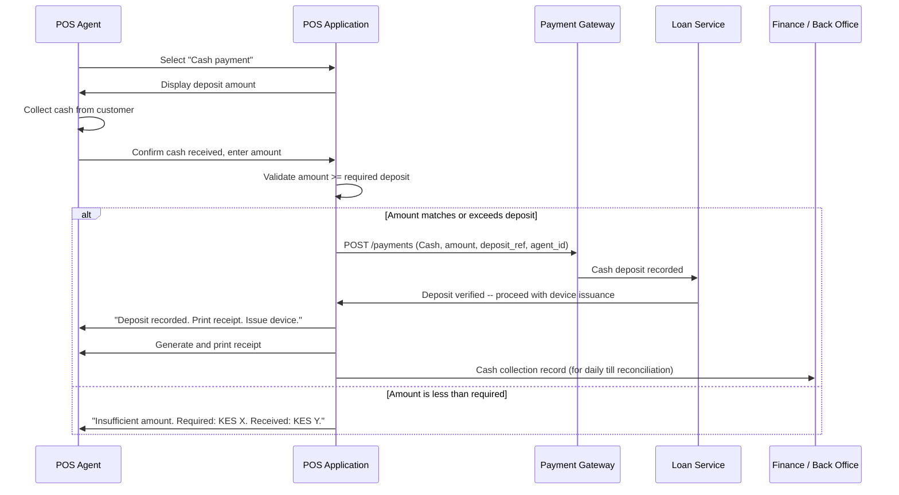
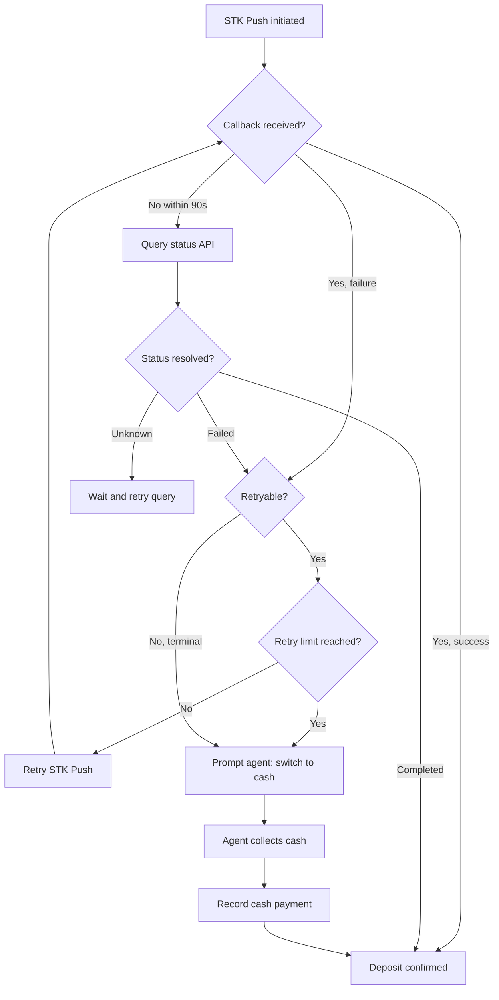

# Down Payment Collection at POS

## Overview

A deposit (down payment) is collected from the customer before a financed device is handed over. This payment serves as the customer's initial commitment, reduces the financed principal, and acts as a behavioural signal for credit scoring. Deposits are collected at the point of sale -- either via STK Push (mobile money) or cash, recorded by the agent.

No device is issued until the deposit is verified as received. This is a hard gate in the loan activation workflow.

## Deposit Triggers and Rules

### When a Deposit Is Required

A deposit is required for every device financing transaction. The deposit amount is determined by a combination of product-level rules and device-tier configuration.

### Deposit Amount Determination

| Factor | Rule | Example |
|---|---|---|
| **Product type** | Each financing product defines a minimum deposit percentage of the device retail price. | "Standard 12-month" requires 20% deposit. |
| **Device tier** | Higher-value devices may require a higher deposit percentage or a fixed minimum. | Tier 1 (< KES 10,000): 10% minimum. Tier 3 (> KES 30,000): 30% minimum. |
| **Customer segment** | Returning customers with good repayment history may qualify for reduced deposit. | Repeat customer: 10% instead of 20%. |
| **Promotional override** | Time-limited campaigns may reduce or waive deposit requirements. | "Back to school" campaign: 0% deposit on select devices. |

### Deposit Calculation

```
deposit_amount = max(
    device_retail_price * product_deposit_percentage,
    device_tier_minimum_deposit,
    product_absolute_minimum_deposit
)

if customer_segment_override applies:
    deposit_amount = apply_segment_discount(deposit_amount)

if promotional_override applies:
    deposit_amount = apply_promo_rules(deposit_amount)
```

The final deposit amount is communicated to the POS agent and the customer before the payment is initiated.

## Collection Methods

### STK Push (Mobile Money)

The preferred collection method. The POS agent initiates an STK Push from the platform's POS application, prompting the customer to authorize payment on their handset.

#### STK Push Deposit Flow



### Cash Collection

When STK Push is unavailable (network issues, customer preference, phone not M-Pesa enabled), the deposit can be collected in cash at the POS.

#### Cash Collection Flow



#### Cash Recording Requirements

| Field | Description |
|---|---|
| `deposit_reference` | System-generated reference for the deposit. |
| `agent_id` | Unique identifier of the POS agent recording the payment. |
| `shop_id` | Identifier of the partner shop / POS location. |
| `amount` | Cash amount received (must equal or exceed required deposit). |
| `currency` | Transaction currency (e.g., KES). |
| `timestamp` | Date and time of cash receipt. |
| `customer_id_type` | Type of ID presented (national ID, passport). |
| `customer_id_number` | ID number (for audit trail). |

#### Receipt Generation

Upon cash collection, the POS application generates a receipt containing:

- Receipt number (unique, sequential per shop per day)
- Customer name and phone number
- Device description and IMEI
- Deposit amount and payment method (Cash)
- Loan reference number
- Date and time
- Agent name and shop location
- Terms summary (instalment amount, tenure, total cost)

Receipts are generated as a printable format for thermal printers and are also stored digitally in the platform for audit purposes.

## Deposit Verification Before Device Issuance

Device issuance is gated on confirmed deposit receipt. The loan service will not transition a loan to `ACTIVE` status, and the POS application will not display the "Issue Device" action, until the deposit payment is in `COMPLETED` state.

### Verification Matrix

| Payment Method | Verification Source | Typical Confirmation Time |
|---|---|---|
| STK Push (M-Pesa) | M-Pesa callback (ResultCode: 0) | 5 -- 30 seconds |
| STK Push (Airtel) | Airtel callback (status: TS) | 10 -- 45 seconds |
| Cash | Agent confirmation in POS app | Immediate (agent-attested) |

### Verification Failure Safeguards

| Scenario | Safeguard |
|---|---|
| STK Push callback not received within 90 seconds | POS polls gateway for status; gateway queries M-Pesa status API. |
| Callback received but processing delayed | POS displays "Verifying payment..." and retries status check every 10 seconds. |
| Agent records cash but amount is disputed | Cash records require daily reconciliation against physical till count. Discrepancies are flagged. |
| System outage during verification | Deposit cannot be verified; device issuance is blocked. Agent is instructed to wait or contact support. |

## Deposit as Scoring Signal

The deposit payment event is forwarded to the credit scoring module as a behavioural input. How and when a customer pays their deposit provides predictive signal for future repayment behaviour.

### Scoring Inputs from Deposit

| Signal | Weight | Interpretation |
|---|---|---|
| **Payment method** | Low | Mobile money payers may correlate with higher digital literacy and mobile engagement. |
| **Time to complete** | Medium | Customers who pay immediately (within 5 minutes of prompt) may indicate readiness and financial preparedness. |
| **Number of failed attempts** | Medium | Multiple STK Push failures before success may indicate marginal affordability. |
| **Amount relative to required** | Low | Paying exactly the minimum vs. voluntarily paying more may indicate different risk profiles. |
| **Payment channel** | Low | Cash-only customers may have limited mobile money usage, affecting future collection channel options. |

These signals are combined with other application data (ID verification, income proxies, device selection) to produce an initial risk score that informs loan terms and monitoring intensity.

## Failed STK Push Handling

STK Push failures are common in mobile money markets due to network variability, customer hesitation, and handset limitations. The POS flow is designed to handle failures gracefully and offer the agent clear next steps.

### Failure Scenarios and Handling

| Failure Reason | M-Pesa Code | User Experience | System Action | Agent Guidance |
|---|---|---|---|---|
| **Timeout** | `1037` | Customer did not respond within ~60 seconds. | Mark FAILED; allow retry. | "Customer did not respond. Ask them to check their phone and try again." |
| **Insufficient funds** | `1` | Customer's M-Pesa balance is too low. | Mark FAILED; do not auto-retry. | "Insufficient M-Pesa balance. Customer can top up and retry, or pay cash." |
| **User cancelled** | `1032` | Customer actively dismissed the prompt. | Mark FAILED; allow retry. | "Customer cancelled the payment. Confirm they are ready and try again." |
| **Wrong PIN** | `2001` | Customer entered incorrect M-Pesa PIN. | Mark FAILED; allow retry (max 3). | "Wrong PIN entered. Customer can try again (X attempts remaining)." |
| **Service unavailable** | `1025` | M-Pesa service is temporarily down. | Mark FAILED; auto-retry after 2 min. | "M-Pesa is temporarily unavailable. System will retry automatically." |
| **Phone unreachable** | `1` | Customer's phone is off or out of coverage. | Mark FAILED; do not auto-retry. | "Phone is unreachable. Ask customer to check their phone is on and has signal." |

### Retry Limits

| Context | Max Retries | Cooldown Between Retries |
|---|---|---|
| Agent-initiated retry | 5 per deposit transaction | 30 seconds minimum |
| Auto-retry (transient failure) | 3 | Exponential backoff: 30s, 2m, 8m |
| Wrong PIN | 3 total | No cooldown (customer-driven) |

After exhausting retries, the agent is prompted to switch to cash collection.

### Fallback to Cash



## Daily Cash Reconciliation

Cash deposits collected at POS require reconciliation against the physical till at the end of each business day.

### Reconciliation Process

1. **System total**: Sum of all cash deposits recorded in the POS application for the shop on that day.
2. **Physical count**: Agent or shop manager counts the physical cash in the till.
3. **Comparison**: The system total and physical count must match within a configurable tolerance (default: KES 0).
4. **Discrepancy handling**:
   - **Surplus**: More cash than system records. May indicate an unrecorded payment or error. Flagged for investigation.
   - **Shortage**: Less cash than system records. May indicate theft, error, or unrecorded expense. Escalated to the shop manager and finance team.

### Accountability

- Each cash transaction is attributed to a specific agent.
- Agents must reconcile their individual collections before handing over the till.
- Persistent discrepancies result in operational review and potential suspension of the agent's cash collection privileges.
