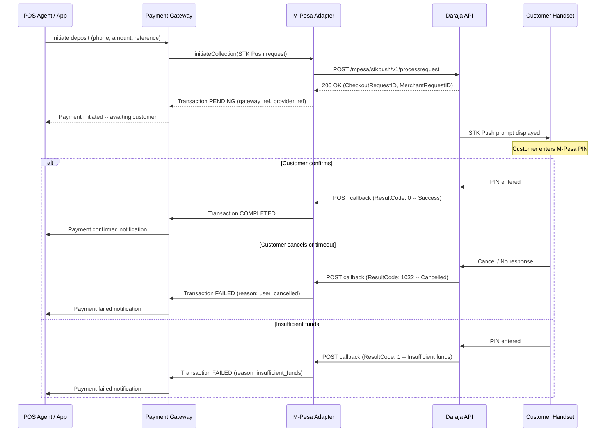
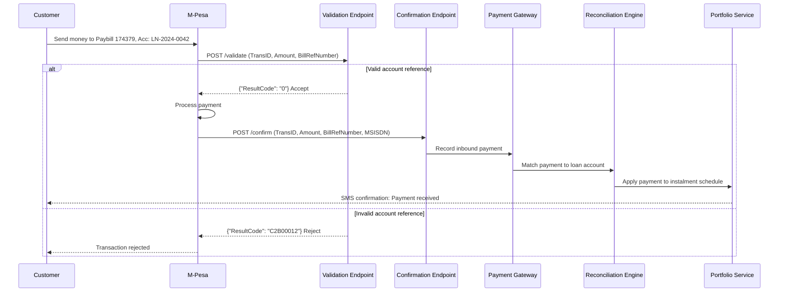
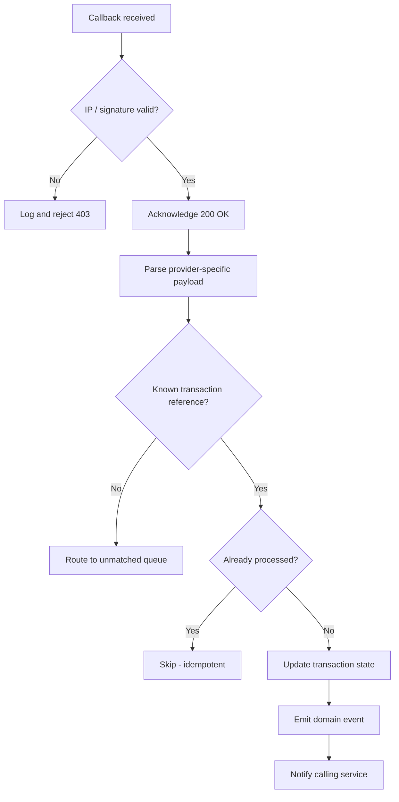

# Mobile Money Integration

## Overview

Mobile money is the primary payment channel for the device lending platform. In the markets served (Kenya, Uganda, Tanzania, Ghana, Malawi, Cameroon), mobile money accounts significantly outnumber traditional bank accounts, making M-Pesa, Airtel Money, and MTN MoMo the dominant rails for loan repayments and disbursements.

This document details the integration architecture for each supported mobile money provider, covering inbound collections (STK Push, C2B), outbound disbursements (B2C), callback handling, and provider-specific configuration.

## Provider Summary

| Provider | API | Markets | Inbound (Collection) | Outbound (Disbursement) |
|---|---|---|---|---|
| M-Pesa | Daraja 2.0 | Kenya, Tanzania | STK Push (Lipa Na M-Pesa Online), C2B Paybill | B2C |
| Airtel Money | Airtel Money API | Kenya, Uganda, Tanzania, Malawi | USSD Push, C2B | B2C |
| MTN MoMo | MTN MoMo API v1 | Uganda, Ghana, Cameroon | RequestToPay | Disbursement (Transfer) |

---

## M-Pesa Daraja API

### Authentication

All Daraja API calls require an OAuth 2.0 Bearer token obtained from the auth endpoint.

```
GET https://api.safaricom.co.ke/oauth/v1/generate?grant_type=client_credentials
Authorization: Basic base64(consumer_key:consumer_secret)
```

Tokens expire after 3600 seconds. The adapter caches the token and refreshes proactively before expiry.

### STK Push (Lipa Na M-Pesa Online)

STK Push initiates a payment prompt on the customer's handset. The platform uses this for:

- **Deposit collection** -- triggered when a customer selects a device at POS and the agent initiates deposit payment.
- **Instalment collection** -- triggered by the collections service when sending payment reminders or when a customer requests to pay via the self-service portal.

#### Request Parameters

| Parameter | Description | Example |
|---|---|---|
| `BusinessShortCode` | Organisation shortcode (Paybill) | `174379` |
| `Amount` | Transaction amount (whole number, KES) | `2500` |
| `PartyA` | Customer phone number (MSISDN, 2547...) | `254712345678` |
| `PartyB` | Organisation shortcode | `174379` |
| `PhoneNumber` | Customer phone for STK prompt | `254712345678` |
| `CallBackURL` | HTTPS endpoint for async result | `https://api.example.co.ke/callbacks/mpesa/stk` |
| `AccountReference` | Loan or deposit reference | `DEP-20240315-001` |
| `TransactionDesc` | Human-readable description | `Device deposit payment` |
| `Timestamp` | Request timestamp (YYYYMMDDHHmmss) | `20240315143022` |
| `Password` | Base64 of shortcode + passkey + timestamp | (generated) |

#### STK Push Flow



#### STK Push Result Codes

| ResultCode | Meaning | Platform Action |
|---|---|---|
| `0` | Success | Mark payment COMPLETED; proceed with loan activation. |
| `1` | Insufficient funds | Mark FAILED; notify customer. |
| `1032` | Request cancelled by user | Mark FAILED; allow retry. |
| `1037` | Timeout (no response within ~60s) | Mark FAILED; allow retry. |
| `2001` | Wrong PIN entered | Mark FAILED; allow retry (up to 3 attempts). |
| `1025` | Server error on provider side | Mark FAILED; auto-retry after backoff. |

### C2B (Customer to Business)

C2B handles customer-initiated payments where the customer sends money to the platform's Paybill number with an account reference (typically the loan account number).

This is the primary channel for scheduled instalment repayments. Customers receive an SMS with payment instructions:

> Pay KES 1,200 to Paybill 174379, Account LN-2024-0042

#### Paybill Registration

The platform registers validation and confirmation URLs with Safaricom for each shortcode:

```
POST https://api.safaricom.co.ke/mpesa/c2b/v1/registerurl
{
  "ShortCode": "174379",
  "ResponseType": "Completed",
  "ConfirmationURL": "https://api.example.co.ke/callbacks/mpesa/c2b/confirm",
  "ValidationURL": "https://api.example.co.ke/callbacks/mpesa/c2b/validate"
}
```

#### C2B Flow



#### Validation Logic

The validation endpoint performs real-time checks before accepting a C2B payment:

1. **Account reference exists** -- The `BillRefNumber` maps to an active loan account.
2. **Loan is active** -- The loan has not been fully repaid or written off.
3. **Amount is positive** -- Basic sanity check.
4. **Currency matches** -- The transaction currency matches the loan currency.

If validation fails, the payment is rejected at the M-Pesa level and the customer retains their funds.

### B2C (Business to Customer)

B2C transfers funds from the platform's M-Pesa account to a recipient. The primary use case is disbursement to partner shops after loan activation.

#### Request Parameters

| Parameter | Description | Example |
|---|---|---|
| `InitiatorName` | API operator username | `api_operator` |
| `SecurityCredential` | Encrypted credential | (generated from certificate) |
| `CommandID` | Transaction type | `BusinessPayment` |
| `Amount` | Amount in KES | `35000` |
| `PartyA` | Organisation shortcode | `174379` |
| `PartyB` | Recipient phone (MSISDN) | `254722000001` |
| `Remarks` | Description | `Device disbursement LN-2024-0042` |
| `QueueTimeOutURL` | Timeout callback | `https://api.example.co.ke/callbacks/mpesa/b2c/timeout` |
| `ResultURL` | Result callback | `https://api.example.co.ke/callbacks/mpesa/b2c/result` |
| `Occasion` | Optional reference | `DISB-20240315-007` |

---

## Airtel Money API

### Authentication

Airtel Money uses OAuth 2.0 client credentials:

```
POST https://openapi.airtel.africa/auth/oauth2/token
{
  "client_id": "<client_id>",
  "client_secret": "<client_secret>",
  "grant_type": "client_credentials"
}
```

### Collection (USSD Push)

Airtel's collection API initiates a USSD prompt on the customer's handset, similar to M-Pesa's STK Push.

```
POST https://openapi.airtel.africa/merchant/v1/payments/
{
  "reference": "INS-2024-0042-03",
  "subscriber": {
    "country": "KE",
    "currency": "KES",
    "msisdn": "712345678"
  },
  "transaction": {
    "amount": 1200,
    "country": "KE",
    "currency": "KES",
    "id": "txn-uuid-here"
  }
}
```

The callback is delivered to a pre-configured URL registered during onboarding.

### Disbursement

```
POST https://openapi.airtel.africa/standard/v1/disbursements/
{
  "payee": {
    "msisdn": "712345678"
  },
  "reference": "DISB-2024-0042",
  "pin": "<encrypted_pin>",
  "transaction": {
    "amount": 35000,
    "id": "disb-uuid-here"
  }
}
```

### Airtel Money Status Codes

| Status | Meaning | Platform Action |
|---|---|---|
| `TS` | Transaction successful | Mark COMPLETED. |
| `TF` | Transaction failed | Mark FAILED; check `status_code` for reason. |
| `TA` | Transaction ambiguous | Query status endpoint; escalate if unresolved. |
| `TIP` | Transaction in progress | Continue polling; await callback. |

---

## MTN MoMo API

### Authentication

MTN MoMo uses API Key + OAuth 2.0. First, obtain an API user and key from the MTN Developer Portal, then request a token:

```
POST https://proxy.momoapi.mtn.com/collection/token/
Authorization: Basic base64(api_user_id:api_key)
Ocp-Apim-Subscription-Key: <subscription_key>
```

### RequestToPay (Collection)

```
POST https://proxy.momoapi.mtn.com/collection/v1_0/requesttopay
X-Reference-Id: <unique_uuid>
X-Target-Environment: production
Ocp-Apim-Subscription-Key: <subscription_key>
Authorization: Bearer <token>

{
  "amount": "1200",
  "currency": "UGX",
  "externalId": "INS-2024-0042-03",
  "payer": {
    "partyIdType": "MSISDN",
    "partyId": "256771234567"
  },
  "payerMessage": "Instalment payment for loan LN-2024-0042",
  "payeeNote": "Instalment 3 of 12"
}
```

The `X-Reference-Id` is used to query the transaction status:

```
GET /collection/v1_0/requesttopay/{referenceId}
```

### Disbursement (Transfer)

```
POST https://proxy.momoapi.mtn.com/disbursement/v1_0/transfer
X-Reference-Id: <unique_uuid>

{
  "amount": "35000",
  "currency": "UGX",
  "externalId": "DISB-2024-0042",
  "payee": {
    "partyIdType": "MSISDN",
    "partyId": "256771234567"
  },
  "payerMessage": "Device disbursement",
  "payeeNote": "Loan LN-2024-0042 disbursement"
}
```

### MTN MoMo Status Values

| Status | Meaning | Platform Action |
|---|---|---|
| `SUCCESSFUL` | Transaction completed | Mark COMPLETED. |
| `FAILED` | Transaction failed | Mark FAILED; inspect `reason` field. |
| `PENDING` | Still processing | Continue polling (max 120s). |
| `REJECTED` | Payer declined the request | Mark FAILED; notify customer. |

---

## Provider Configuration

All provider credentials and configuration are managed through a secure secrets manager. No credentials are stored in application configuration files or source control.

### Configuration Structure

```yaml
mobile_money:
  mpesa_ke:
    provider: mpesa_daraja
    market: KE
    currency: KES
    environment: production     # sandbox | production
    credentials:
      consumer_key: vault://payments/mpesa-ke/consumer_key
      consumer_secret: vault://payments/mpesa-ke/consumer_secret
      passkey: vault://payments/mpesa-ke/passkey
      initiator_name: vault://payments/mpesa-ke/initiator_name
      security_credential: vault://payments/mpesa-ke/security_credential
    shortcode: "174379"
    b2c_shortcode: "174379"
    callback_urls:
      stk_push: https://api.platform.co.ke/callbacks/mpesa/stk
      c2b_validation: https://api.platform.co.ke/callbacks/mpesa/c2b/validate
      c2b_confirmation: https://api.platform.co.ke/callbacks/mpesa/c2b/confirm
      b2c_result: https://api.platform.co.ke/callbacks/mpesa/b2c/result
      b2c_timeout: https://api.platform.co.ke/callbacks/mpesa/b2c/timeout
    timeout_seconds: 30
    stk_push_expiry_seconds: 60

  airtel_ke:
    provider: airtel_money
    market: KE
    currency: KES
    environment: production
    credentials:
      client_id: vault://payments/airtel-ke/client_id
      client_secret: vault://payments/airtel-ke/client_secret
      encryption_key: vault://payments/airtel-ke/encryption_key
    callback_url: https://api.platform.co.ke/callbacks/airtel
    timeout_seconds: 45

  mtn_ug:
    provider: mtn_momo
    market: UG
    currency: UGX
    environment: production
    credentials:
      api_user_id: vault://payments/mtn-ug/api_user_id
      api_key: vault://payments/mtn-ug/api_key
      subscription_key: vault://payments/mtn-ug/subscription_key
    callback_url: https://api.platform.co.ug/callbacks/mtn
    target_environment: production
    timeout_seconds: 45
```

### Credential Rotation

- Provider API credentials are rotated on a configurable schedule (default: every 90 days).
- The adapter supports dual-credential mode during rotation, allowing the old and new credentials to operate concurrently until the rotation is confirmed.
- Rotation events are logged in the audit trail.

---

## Callback Handling

### General Principles

1. **Acknowledge immediately.** All callback endpoints return `200 OK` within 1 second, before any business logic executes. Providers will retry or time out if acknowledgement is delayed.
2. **Verify authenticity.** Each provider has a specific mechanism for verifying that a callback originates from the real provider (IP whitelisting, signature verification, or payload structure validation).
3. **Idempotent processing.** Callbacks may be delivered more than once. The adapter deduplicates by provider transaction reference before updating the gateway.
4. **Log raw payloads.** The raw callback body is logged (with sensitive fields masked) before parsing, ensuring debugging is possible even if parsing fails.

### Verification per Provider

| Provider | Verification Method |
|---|---|
| M-Pesa | IP whitelist (Safaricom ranges); payload structure validation; reconciliation against initiated transaction. |
| Airtel Money | HMAC signature header; transaction ID cross-reference. |
| MTN MoMo | Callback URL contains an unguessable path segment; transaction reference cross-reference. |

### Callback Processing Pipeline



---

## Error Handling and Resilience

### Timeout Handling

If no callback is received within the expected window (varies by provider), the adapter queries the provider's status API:

| Provider | Status Query | Expected Callback Window |
|---|---|---|
| M-Pesa | `POST /mpesa/stkpushquery/v1/query` | 60 seconds |
| Airtel Money | `GET /standard/v1/payments/{id}` | 90 seconds |
| MTN MoMo | `GET /collection/v1_0/requesttopay/{id}` | 120 seconds |

If the status query also fails to resolve the transaction, it is escalated to the unresolved transactions queue for manual investigation.

### Network Resilience

- All outbound API calls use connection pooling and HTTP keep-alive.
- TLS certificate pinning is applied for provider API endpoints in production.
- DNS resolution is cached with a short TTL (30s) to handle provider DNS changes gracefully.
- Circuit breaker pattern: if a provider returns 5 consecutive failures within 60 seconds, the adapter trips the circuit and stops sending requests for 30 seconds before retrying.
