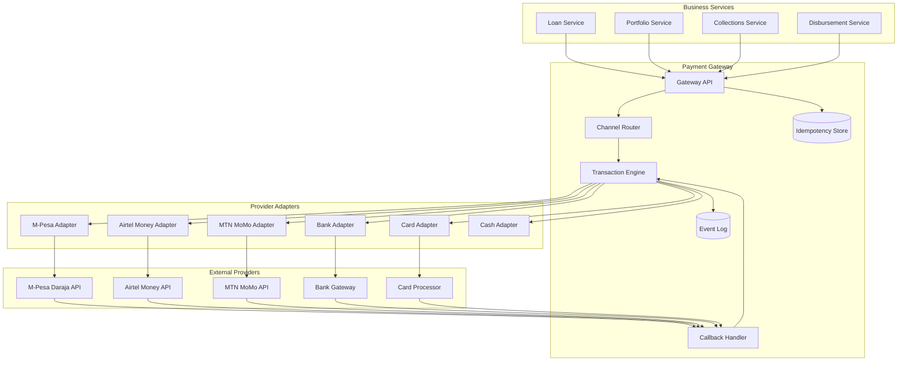
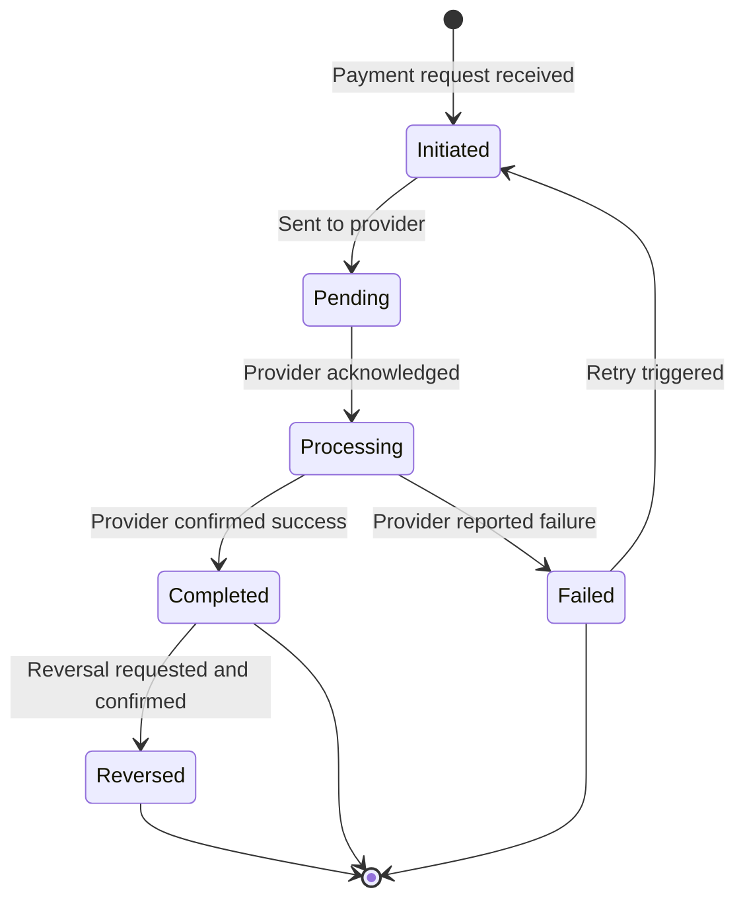
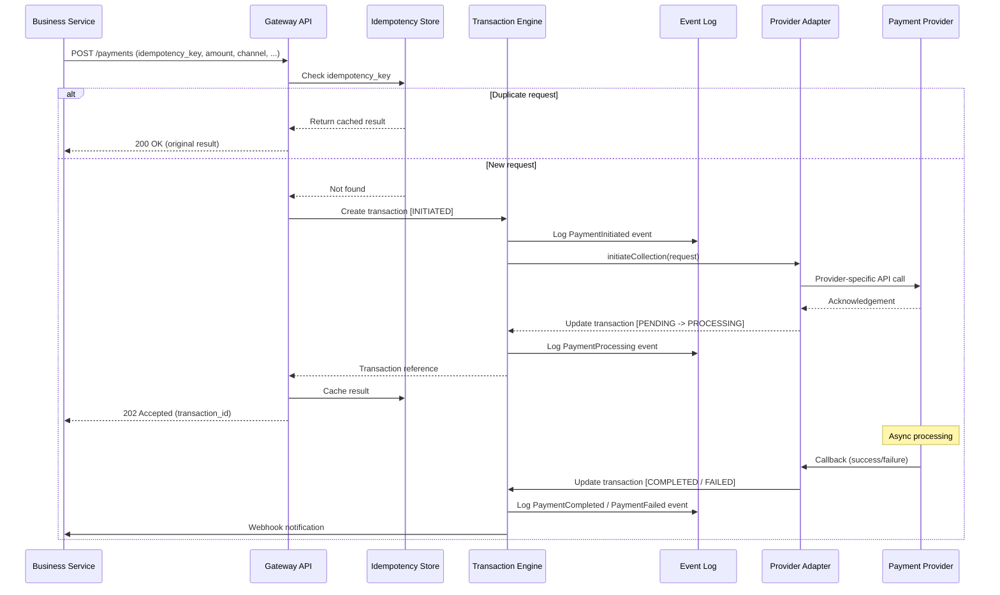

# Payment Gateway Architecture

## Overview

The Payment Gateway is the central abstraction layer that mediates all financial transactions within the device lending platform. It decouples business logic (loan origination, portfolio management, collections) from the underlying payment channels, providing a unified interface for initiating, tracking, and reconciling payments regardless of the provider or method.

All loan repayments, deposit collections, disbursements, and refunds flow through this gateway. The platform operates primarily in African markets where mobile money is the dominant payment rail, but the architecture supports bank transfers, card payments, and cash reconciliation as supplementary channels.

## Design Principles

| Principle | Description |
|---|---|
| **Channel agnosticism** | Business services interact with a single gateway API; they never call provider APIs directly. |
| **Provider isolation** | Each payment provider is encapsulated behind an adapter. Adding a new provider requires only a new adapter implementation. |
| **Idempotency** | Every payment request carries a client-generated idempotency key. Duplicate submissions return the original result without reprocessing. |
| **Auditability** | Every state transition is persisted as an immutable event, enabling full reconstruction of any transaction's history. |
| **Resilience** | Transient provider failures are handled with retry policies. Permanent failures surface clearly to calling services. |

## Supported Payment Channels

### Mobile Money

| Provider | Markets | Integration | Use Cases |
|---|---|---|---|
| M-Pesa (Daraja API) | Kenya, Tanzania | STK Push, C2B Paybill, B2C | Deposit collection, instalment collection, disbursement |
| Airtel Money | Kenya, Uganda, Tanzania, Malawi | Airtel Money API | Instalment collection, disbursement |
| MTN Mobile Money | Uganda, Ghana, Cameroon | MTN MoMo API | Instalment collection, disbursement |

### Bank Transfer

| Method | Direction | Use Cases |
|---|---|---|
| Direct Debit | Inbound | Scheduled instalment collection from bank accounts |
| EFT (Electronic Funds Transfer) | Outbound | Bulk disbursement to partner bank accounts |

### Card

| Type | Use Cases |
|---|---|
| Debit card | Online deposit or instalment payment via hosted checkout |
| Credit card | Online deposit or instalment payment via hosted checkout |

### Cash

| Method | Use Cases |
|---|---|
| POS-reconciled cash | Deposit collection at partner shop; recorded by agent, reconciled against daily till |

## Payment Types

| Payment Type | Direction | Trigger | Channels | Description |
|---|---|---|---|---|
| Deposit collection | Inbound | Loan approval, device selection | STK Push, Cash at POS | Down payment collected before device issuance. Amount determined by product rules and device tier. |
| Instalment collection | Inbound | Due date, customer-initiated | C2B Paybill, STK Push | Recurring loan repayment. Customer pays to Paybill with account reference or receives STK Push reminder. |
| Disbursement (B2C) | Outbound | Loan activation | B2C API | Funds transferred from financer to partner shop after deposit confirmation and device issuance. |
| Refund | Outbound | Overpayment, reversal | B2C API, reversal API | Return of excess funds to customer or reversal of an erroneous charge. |

## Architecture



## Adapter Pattern

Each payment provider is encapsulated behind a common `PaymentAdapter` interface. This enables the gateway to route transactions to the correct provider without the transaction engine or business services knowing provider-specific details.

### Adapter Interface

```typescript
interface PaymentAdapter {
  readonly providerId: string;
  readonly supportedChannels: PaymentChannel[];

  initiateCollection(request: CollectionRequest): Promise<PaymentResult>;
  initiateDisbursement(request: DisbursementRequest): Promise<PaymentResult>;
  initiateRefund(request: RefundRequest): Promise<PaymentResult>;
  queryStatus(providerReference: string): Promise<TransactionStatus>;
  validateCallback(headers: Record<string, string>, body: unknown): boolean;
  parseCallback(body: unknown): CallbackPayload;
}
```

### Adapter Registration

Adapters self-register with the channel router at startup. The router selects the appropriate adapter based on the requested channel, the customer's mobile network or bank, and the target market.

```typescript
class ChannelRouter {
  private adapters: Map<string, PaymentAdapter> = new Map();

  register(adapter: PaymentAdapter): void {
    this.adapters.set(adapter.providerId, adapter);
  }

  resolve(channel: PaymentChannel, market: string): PaymentAdapter {
    // Selection logic based on channel, market, and provider availability
  }
}
```

## Transaction Lifecycle

Every payment progresses through a defined set of states. State transitions are driven by provider responses and callbacks.



### State Definitions

| State | Description | Terminal |
|---|---|---|
| `INITIATED` | Payment request accepted by the gateway; idempotency key recorded. | No |
| `PENDING` | Request dispatched to the provider adapter; awaiting provider acknowledgement. | No |
| `PROCESSING` | Provider has acknowledged the request (e.g., STK Push sent to handset). Awaiting final result. | No |
| `COMPLETED` | Provider confirmed successful settlement of funds. | Yes |
| `FAILED` | Provider reported a terminal failure (e.g., insufficient funds, wrong PIN, timeout). | Yes |
| `REVERSED` | A previously completed transaction has been reversed or refunded. | Yes |

## Payment Flow



## Idempotency and Deduplication

### Idempotency Keys

Every payment request must include a client-generated `idempotency_key`. This key is unique per logical payment attempt and is used to prevent duplicate processing.

**Key format:** `{service}:{entity_type}:{entity_id}:{attempt}`
Example: `collections:instalment:INS-20240315-001:1`

### Deduplication Rules

| Scenario | Behaviour |
|---|---|
| Same idempotency key, same parameters | Return cached result; no reprocessing. |
| Same idempotency key, different parameters | Reject with `409 Conflict`. |
| Different idempotency key, same underlying payment | Allowed -- the reconciliation engine handles duplicate settlement detection downstream. |

### Idempotency Key Expiry

Keys are retained for 72 hours after the transaction reaches a terminal state. This window covers the maximum expected callback delay from any provider.

## Retry Policy

Failed transactions that are eligible for retry (transient failures only) follow an exponential backoff strategy:

| Attempt | Delay | Cumulative Wait |
|---|---|---|
| 1 | Immediate | 0s |
| 2 | 30s | 30s |
| 3 | 2 min | 2 min 30s |
| 4 | 8 min | 10 min 30s |
| 5 (max) | 30 min | 40 min 30s |

Non-retryable failures (e.g., insufficient funds, wrong PIN, account blocked) are immediately terminal and surfaced to the calling service for handling.

## Security Considerations

### Data Protection

- All API communication with payment providers uses TLS 1.2 or higher.
- Provider credentials (API keys, consumer secrets, certificates) are stored in a secrets manager, never in application configuration or source control.
- Callback payloads are verified using provider-specific signatures (e.g., M-Pesa callback verification, HMAC signatures).

### PCI DSS Compliance

Card payment processing adheres to PCI DSS requirements:

- The platform never stores full card numbers (PAN). Tokenisation is handled by the card processor.
- Card data entry uses a hosted payment page or iframe provided by the PCI-compliant processor.
- SAQ A or SAQ A-EP compliance level, depending on the integration method.

### Access Control

- Gateway API endpoints require service-to-service authentication (mTLS or signed JWTs).
- All payment operations are logged with the originating service, operator (where applicable), and IP address.
- Disbursement operations require dual authorization above configurable thresholds.

### Audit Trail

Every transaction state change produces an immutable event record containing:

- Transaction ID
- Previous and new state
- Timestamp (UTC)
- Actor (service, operator, or system)
- Provider response payload (sensitive fields redacted)

These events are stored in an append-only event log and are retained for a minimum of 7 years for regulatory compliance.

## Error Handling

| Error Category | Examples | Gateway Behaviour |
|---|---|---|
| Transient provider error | Timeout, 5xx response, network failure | Retry with exponential backoff up to max attempts. |
| Business rule rejection | Insufficient funds, wrong PIN, daily limit exceeded | Mark as FAILED; notify calling service with failure reason code. |
| Validation error | Invalid phone number, unsupported currency | Reject synchronously with 400 response. |
| Callback timeout | No callback received within expected window | Query provider status API; escalate to unresolved queue if still unknown. |
| Duplicate settlement | Same funds settled twice (provider-side issue) | Flag for reconciliation; initiate reversal if confirmed. |

## Configuration

Each provider adapter is configured per market deployment:

```yaml
payment_gateway:
  providers:
    mpesa_ke:
      adapter: mpesa_daraja
      market: KE
      environment: production
      credentials_secret: vault://payments/mpesa-ke-prod
      shortcode: "174379"
      callback_base_url: https://api.platform.co.ke/callbacks/mpesa
      timeout_seconds: 30
      retry:
        max_attempts: 5
        backoff_multiplier: 4
    airtel_ke:
      adapter: airtel_money
      market: KE
      environment: production
      credentials_secret: vault://payments/airtel-ke-prod
      callback_base_url: https://api.platform.co.ke/callbacks/airtel
      timeout_seconds: 45
      retry:
        max_attempts: 3
        backoff_multiplier: 2
```
