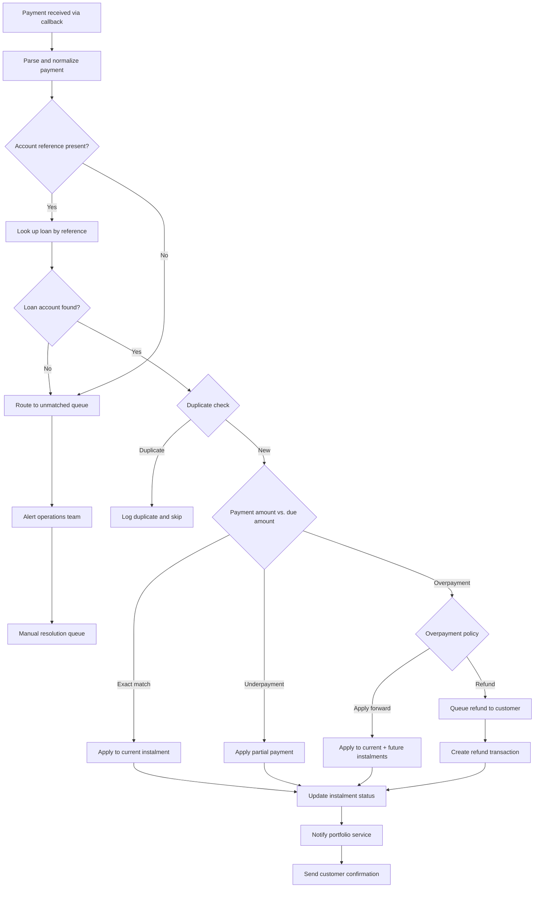
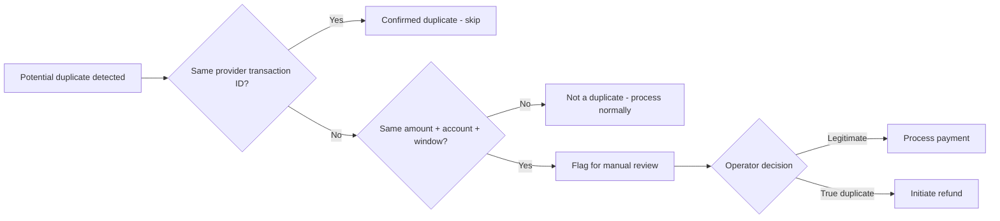
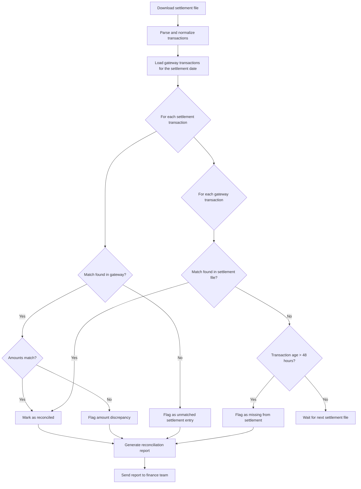

# Payment Reconciliation Engine

## Overview

The reconciliation engine is responsible for matching every inbound payment to a loan account, applying it correctly to the instalment schedule, and surfacing discrepancies for resolution. It operates both in real time (processing individual payment callbacks as they arrive) and in batch mode (daily settlement file reconciliation against bank and M-Pesa statements).

Accurate reconciliation is critical to the lending operation. A misapplied payment can cascade into incorrect arrears calculations, unwarranted penalty charges, and customer complaints. The engine is designed to be deterministic, auditable, and transparent at every step.

## Reconciliation Scope

| Source | Frequency | Method |
|---|---|---|
| M-Pesa C2B callbacks | Real-time | Match `BillRefNumber` to loan account reference. |
| M-Pesa STK Push callbacks | Real-time | Match by gateway transaction reference (pre-linked to loan). |
| Airtel Money callbacks | Real-time | Match by `reference` field (pre-linked to loan). |
| MTN MoMo callbacks | Real-time | Match by `externalId` field (pre-linked to loan). |
| Cash at POS | Real-time (agent-recorded) | Match by agent-entered loan/deposit reference. |
| M-Pesa settlement file | Daily (batch) | Reconcile gateway records against Safaricom daily statement. |
| Bank statement | Daily (batch) | Reconcile float account balance and settlement amounts. |

## Reconciliation Process



## Account Reference Matching

### Primary Match: Account Reference

For C2B payments (where the customer enters the account reference manually), matching relies on the `BillRefNumber` (M-Pesa) or equivalent field. The matching algorithm is tolerant of minor formatting variations:

| Input Variation | Normalisation Rule | Matches |
|---|---|---|
| `LN-2024-0042` | Canonical format | Exact match |
| `LN20240042` | Strip hyphens | Match |
| `ln-2024-0042` | Case-insensitive | Match |
| `LN 2024 0042` | Strip spaces, replace with hyphens | Match |
| `2024-0042` | Prefix inference (if unambiguous) | Match |
| `0042` | Too short, ambiguous | Route to unmatched queue |

### Secondary Match: Phone Number

If the account reference does not resolve to a loan, the engine attempts a secondary match using the sender's phone number (MSISDN):

1. Look up all active loans associated with the MSISDN.
2. If exactly one loan exists, apply the payment to that loan and flag it for review.
3. If multiple loans exist, route to the unmatched queue -- human intervention is required.

### Pre-linked Payments (STK Push)

For STK Push and USSD Push payments, the loan reference is established at the time the payment is initiated by the platform. No fuzzy matching is needed; the gateway transaction record already contains the loan ID.

## Partial Payment Handling

When a customer pays less than the full instalment amount:

1. **Record the partial payment** against the current instalment.
2. **Update the instalment status** to `PARTIALLY_PAID`.
3. **Calculate the remaining balance** on the instalment.
4. **Do not advance the instalment schedule** -- the instalment remains due.
5. **Notify the customer** of the remaining balance and the due date.
6. **Notify the collections service** so it can adjust reminder frequency or escalation.

### Partial Payment Stacking

Multiple partial payments are accumulated against the same instalment until the full amount is met. Each partial payment is recorded as an individual payment event linked to the instalment.

```
Instalment INS-003: KES 1,200 due on 2024-04-01
  Payment 1: KES 500 received 2024-03-28  -> Balance: KES 700
  Payment 2: KES 400 received 2024-04-01  -> Balance: KES 300
  Payment 3: KES 300 received 2024-04-03  -> Balance: KES 0 (PAID)
```

## Overpayment Handling

When a customer pays more than the current instalment amount:

### Policy Options (Configurable per Product)

| Policy | Behaviour |
|---|---|
| **Apply forward** (default) | Excess is applied to the next instalment(s) in sequence. If the excess covers multiple future instalments, they are all marked as paid. |
| **Hold as credit** | Excess is held as a credit balance on the loan account, automatically applied to the next instalment on its due date. |
| **Refund** | Excess is refunded to the customer via B2C transfer. Refund requires approval if above a configurable threshold. |

### Overpayment Flow

```
Instalment INS-003: KES 1,200 due
Customer pays: KES 2,000

Policy: Apply forward
  -> INS-003: KES 1,200 applied (PAID)
  -> INS-004: KES 800 applied (PARTIALLY_PAID, balance KES 400)
```

### Full Early Repayment

If the overpayment amount is sufficient to close the entire remaining loan balance, the reconciliation engine:

1. Applies payment to all remaining instalments.
2. Marks the loan as `FULLY_REPAID`.
3. Notifies the portfolio service and customer.
4. If any excess remains beyond the full loan balance, it is refunded via B2C.

## Duplicate Payment Detection

Duplicates can occur at multiple levels:

| Level | Detection Method | Action |
|---|---|---|
| **Provider transaction ID** | Exact match on M-Pesa `TransID`, Airtel `transaction.id`, or MTN `referenceId`. | Skip processing; return existing result. |
| **Same amount, same account, short window** | Same MSISDN, same account reference, same amount, within 5 minutes. | Flag as potential duplicate; route to review queue. Do not auto-reject (customer may legitimately pay twice in quick succession). |
| **Settlement file duplicate** | Transaction appears in settlement file but was already processed via callback. | Skip -- no action needed; confirms the callback was legitimate. |

### Duplicate Resolution Workflow



## Failed Payment Retry Logic

When a payment fails due to a transient error (provider timeout, temporary service unavailability), the gateway automatically retries using exponential backoff.

### Retry Schedule

| Attempt | Delay | Notes |
|---|---|---|
| 1 | Immediate | Initial attempt. |
| 2 | 30 seconds | First retry. |
| 3 | 2 minutes | |
| 4 | 8 minutes | |
| 5 | 30 minutes | Final automatic retry. |

### Non-Retryable Failures

The following failure reasons are terminal and are not retried:

| Failure Reason | Provider Code(s) | Action |
|---|---|---|
| Insufficient funds | M-Pesa `1`, Airtel `ESB000013` | Notify customer; schedule retry for next business day. |
| Wrong PIN | M-Pesa `2001` | Notify customer; allow manual retry. |
| User cancelled | M-Pesa `1032`, MTN `REJECTED` | Allow manual retry via collections. |
| Account blocked/inactive | Various | Escalate to operations. |
| Daily transaction limit exceeded | Various | Retry next day. |

### Escalation After Max Retries

If all automatic retry attempts are exhausted:

1. The payment is marked as `FAILED_FINAL`.
2. The collections service is notified to take alternative action (SMS reminder, agent call, alternative payment channel).
3. The failure is recorded for portfolio risk reporting.

## Daily Settlement File Reconciliation

### Process

Daily settlement reconciliation runs as a scheduled batch job, typically between 02:00 and 04:00 local time, after settlement files are available from providers.



### Reconciliation Outcomes

| Outcome | Description | Action |
|---|---|---|
| **Matched** | Gateway record and settlement entry agree on amount and status. | No action needed. |
| **Amount discrepancy** | Gateway and settlement amounts differ. | Investigate; may indicate a partial settlement or fee deduction. |
| **Missing from settlement** | Gateway shows COMPLETED but no corresponding settlement entry exists after 48 hours. | Investigate with provider; may indicate a failed settlement. |
| **Unmatched settlement entry** | Settlement file contains a transaction not in the gateway. | May be a direct payment not initiated via the platform; route to unmatched queue. |

### Settlement File Formats

| Provider | File Format | Delivery Method |
|---|---|---|
| M-Pesa (Safaricom) | CSV via SFTP or Safaricom portal download | Automated SFTP pull at 01:30 EAT |
| Airtel Money | CSV via partner portal | Manual download or API (where available) |
| MTN MoMo | JSON via API (`/account/v1_0/accountbalance`) | API call at 02:00 local |
| Bank | MT940/CSV via internet banking or SFTP | Automated SFTP pull at 01:00 EAT |

## Real-Time Payment Status Updates

When a payment is reconciled (either in real time or via batch), the reconciliation engine emits events consumed by the portfolio service:

### Event Types

| Event | Payload | Consumer |
|---|---|---|
| `PaymentApplied` | `loan_id`, `instalment_id`, `amount`, `payment_method`, `provider_ref` | Portfolio Service |
| `PartialPaymentApplied` | `loan_id`, `instalment_id`, `amount_applied`, `remaining_balance` | Portfolio Service, Collections |
| `OverpaymentDetected` | `loan_id`, `excess_amount`, `policy_action` | Portfolio Service, Finance |
| `PaymentUnmatched` | `provider_ref`, `amount`, `msisdn`, `account_ref_raw` | Operations Dashboard |
| `DuplicatePaymentDetected` | `original_payment_id`, `duplicate_provider_ref`, `amount` | Operations Dashboard |
| `LoanFullyRepaid` | `loan_id`, `final_payment_ref`, `total_paid` | Portfolio Service, Customer Comms |

## Unmatched Payment Queue

Payments that cannot be automatically matched are routed to the unmatched payment queue for manual resolution by the operations team.

### Queue Entry Contents

Each unmatched entry contains:

- Provider transaction reference
- Raw account reference entered by customer
- MSISDN of sender
- Amount and currency
- Timestamp
- Provider name
- Reason for non-match (e.g., "account reference not found", "multiple matching accounts")

### Resolution Options

| Action | Description |
|---|---|
| **Manual match** | Operator identifies the correct loan account and applies the payment. |
| **Refund** | Payment cannot be attributed; refund is initiated via B2C. |
| **Hold** | Payment is held pending customer contact for clarification. |
| **Create new account** | In rare cases, the payment is for a new deposit not yet registered in the system. Operator creates the record and applies the payment. |

### SLA for Resolution

| Queue Age | Escalation |
|---|---|
| < 4 hours | Standard queue -- operations team. |
| 4 -- 24 hours | Highlighted in daily report; team lead notified. |
| > 24 hours | Escalated to finance manager; customer contacted proactively. |
| > 72 hours | Executive escalation; regulatory risk if funds are held without attribution. |

## Monitoring and Alerts

| Metric | Threshold | Alert |
|---|---|---|
| Unmatched payment queue depth | > 50 entries | Warning to operations team. |
| Unmatched payment queue depth | > 200 entries | Critical alert to finance manager. |
| Reconciliation match rate (daily) | < 95% | Investigation required. |
| Settlement file not received by expected time | +2 hours | Alert to operations team. |
| Amount discrepancy count (daily) | > 10 | Alert to finance team. |
| Duplicate payment rate (daily) | > 2% of total volume | Investigation required. |
