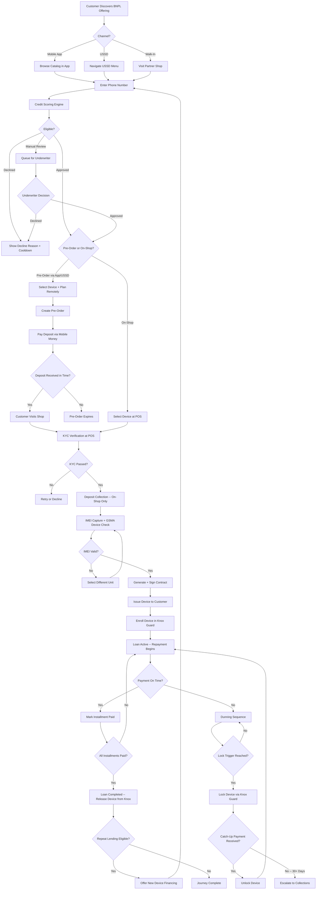

# Customer Journey -- BNPL Device Financing

## 1. Overview

This document describes the end-to-end journey a customer follows to acquire a mobile device through the IInovi buy-now-pay-later (BNPL) platform. The journey spans discovery, credit assessment, device selection, KYC verification, deposit payment, device issuance, repayment, and eventual loan completion.

Two primary acquisition flows are supported:

- **Pre-Order Flow** -- customer discovers and selects a device remotely (via mobile app or USSD), pays a deposit, and collects the device at a partner shop.
- **On-Shop Flow** -- customer walks into a partner shop, selects a device on the spot, completes KYC and deposit at the point of sale, and leaves with the device.

Both flows converge at the KYC verification stage and share the same repayment lifecycle thereafter.

---

## 2. Journey Stages at a Glance

| # | Stage | Channel | Key Action |
|---|-------|---------|------------|
| 1 | Discovery | App / USSD / Walk-in | Customer learns about BNPL offering |
| 2 | Credit Scoring | Backend | Eligibility and affordability assessment |
| 3 | Device Selection | App / USSD / POS | Customer chooses a device and payment plan |
| 4 | KYC Verification | POS (in-person) | Identity verification and document capture |
| 5 | Deposit Collection | Mobile Money / Cash | Customer pays the required deposit |
| 6 | IMEI Capture and Device Check | POS | Specific device unit is scanned and validated |
| 7 | Contract Signing | POS / App | Digital contract signed by customer |
| 8 | Device Issuance | POS | Customer receives the device |
| 9 | Knox Guard Registration | Backend | Device is enrolled in Samsung Knox Guard |
| 10 | Repayment Lifecycle | Mobile Money / USSD | Daily, weekly, or monthly installments |
| 11 | Dunning and Lock/Unlock | Backend / Knox | Overdue management and device locking |
| 12 | Loan Completion | Backend | Final payment, device release |
| 13 | Repeat Lending | App / USSD / POS | Top-up or new device financing |

---

## 3. Discovery

### 3.1 Mobile App

The partner-branded mobile app (available on Android and via progressive web app) allows customers to:

- Browse the partner's device catalog with photos, specifications, and BNPL pricing.
- Use a **payment calculator** to estimate deposit, installment amount, and total cost for different tenors and frequencies.
- Check preliminary eligibility by entering their phone number (triggers a soft credit check with no impact on credit score).
- Save devices to a wishlist for later.

### 3.2 USSD

For customers without smartphones or data connectivity, a USSD shortcode provides a text-based menu:

```
*123*456#
1. Browse Devices
2. Check My Eligibility
3. My Orders
4. Make a Payment
5. Help
```

The USSD flow is streamlined to the most common actions: eligibility check, device selection by category (e.g., "Phones under 200 USD"), and pre-order initiation.

### 3.3 Walk-In

Customers who visit a partner shop are assisted by a **cashier** using the IInovi POS application (tablet or desktop). The cashier guides the customer through eligibility, device selection, and the full onboarding flow in a single visit.

---

## 4. Credit Scoring and Eligibility Check

### 4.1 Trigger

An eligibility check is initiated when:

- The customer enters their phone number in the app or USSD.
- The cashier enters the customer's phone number at the POS.

### 4.2 Scoring Process

1. **Customer Identification** -- the phone number (MSISDN) is used to look up any existing customer record on the platform.
2. **Data Collection** -- depending on the partner category and assigned scoring strategy, the engine pulls:
   - Telco subscriber data (network tenure, ARPU, MoMo history) for telco partners.
   - Credit bureau data (where available and consented).
   - Alternative data signals (app telemetry, device metadata).
3. **Score Calculation** -- the scoring model produces a numeric score, which is mapped to an **IInovi Risk Band** (A through E).
4. **Decision** -- the risk band determines:
   - **Approved** (Bands A -- C): customer may proceed; the band determines the maximum device price tier, minimum deposit, and available tenors.
   - **Manual Review** (Band D): application is queued for underwriter review.
   - **Declined** (Band E): customer is informed they are not eligible at this time; a cooldown period applies before re-application.

### 4.3 Eligibility Response

The eligibility response returned to the customer (or cashier) includes:

| Field | Description |
|-------|-------------|
| `eligible` | Boolean |
| `risk_band` | A, B, C, D, or E |
| `max_device_price` | Maximum BNPL price the customer qualifies for |
| `min_deposit_pct` | Minimum deposit percentage required |
| `available_tenors` | List of repayment durations in days |
| `available_frequencies` | Supported repayment cadences |
| `pre_approved_devices` | List of device IDs within the customer's qualified price range |
| `decline_reason` | (If declined) coded reason for decline |
| `cooldown_until` | (If declined) earliest re-application date |

---

## 5. Device Selection

### 5.1 Pre-Order (App / USSD)

After receiving a positive eligibility response, the customer selects a device from the pre-approved list:

1. Choose a device model and color variant.
2. Select a repayment plan (tenor and frequency).
3. Review the payment summary: deposit amount, installment amount, total repayment, and repayment schedule.
4. Confirm the pre-order.

A pre-order is created in `pending_deposit` status. The customer has a configurable window (default: 48 hours) to pay the deposit via mobile money. If the deposit is not received within this window, the pre-order expires and the reserved stock is released.

### 5.2 On-Shop Selection

At the POS, the cashier:

1. Shows the customer available devices within their qualified price range.
2. Lets the customer physically inspect demo units.
3. Selects the chosen device in the POS application.
4. The POS displays the payment plan options and the customer confirms.

In the on-shop flow, device selection, KYC, deposit, and issuance happen in a single visit.

---

## 6. KYC Verification at POS

KYC is always completed in person at a partner shop, whether the customer pre-ordered remotely or walked in.

### 6.1 Required Documents

| Document | Capture Method |
|----------|---------------|
| Government-issued ID (national ID, passport, or driver's license) | Photo capture via POS camera or document scanner |
| Selfie / liveness check | POS front-facing camera with liveness detection |
| Proof of residence (utility bill, bank statement) | Photo capture (may be waived for telco partners with address-on-file) |

### 6.2 Verification Steps

1. **Document Capture** -- cashier uses the POS app to photograph the customer's ID (front and back).
2. **OCR Extraction** -- the platform extracts name, ID number, date of birth, and expiry date from the document image.
3. **Face Match** -- the customer's selfie is compared against the ID photo using a facial recognition service. A match score above the configured threshold (default: 85%) is required.
4. **Liveness Detection** -- the selfie capture includes a liveness challenge (blink, head turn) to prevent spoofing.
5. **Sanctions Screening** -- the extracted name and ID number are checked against sanctions and watchlists.
6. **Duplicate Check** -- the platform verifies that the customer does not have an existing active loan in default.

### 6.3 Outcomes

- **KYC Passed** -- proceed to deposit collection.
- **KYC Failed** -- the specific failure reason is displayed (document expired, face mismatch, sanctions hit). The customer may retry with a different document or be declined.

---

## 7. Deposit Collection

### 7.1 Deposit Calculation

The deposit amount is determined by:

```
deposit = max(device_bnpl_price * min_deposit_pct, device_deposit_floor)
```

The customer may choose to pay more than the minimum deposit (up to `max_deposit_pct`) to reduce the financed amount and installment size.

### 7.2 Payment Methods

| Method | Flow |
|--------|------|
| **Mobile Money** | An STK Push prompt is sent to the customer's phone. The customer enters their PIN to authorize payment. Confirmation is received in real time. |
| **Cash** | The cashier accepts cash at the POS and records the deposit in the system. A receipt is generated. |

### 7.3 Deposit Confirmation

Once the deposit is confirmed:

- The pre-order status transitions from `pending_deposit` to `deposit_paid`.
- The loan principal is calculated as `device_bnpl_price - deposit_amount`.
- The repayment schedule is generated (see Section 10).

---

## 8. IMEI Capture and GSMA Device Check

### 8.1 IMEI Capture

The cashier scans or manually enters the **IMEI** of the specific device unit being issued to the customer. The IMEI is a unique 15-digit identifier assigned to every mobile device.

The POS application supports:

- Barcode / QR code scanning from the device box.
- Manual IMEI entry with Luhn check digit validation.
- Dual-SIM devices: both IMEI 1 and IMEI 2 are captured.

### 8.2 GSMA Device Check

The captured IMEI is validated against the **GSMA Device Check** service:

| Check | Purpose |
|-------|---------|
| **Blocklist Status** | Verify the device is not reported as lost, stolen, or fraudulently obtained |
| **TAC Lookup** | Confirm the device model matches the selected catalog item (brand, model, OS) |
| **Network Compatibility** | Verify the device supports the required LTE bands for the customer's network |

If the IMEI fails any check, the cashier is alerted and must select a different device unit.

### 8.3 IMEI Binding

Once validated, the IMEI is permanently bound to the loan contract. This binding is critical for:

- Knox Guard enrollment (Section 9).
- Warranty and insurance tracking.
- Preventing device swaps during the loan term.

---

## 9. Contract Signing and Device Issuance

### 9.1 Digital Contract

A loan contract is generated containing:

- Customer name, ID number, and contact details.
- Device description (brand, model, color, IMEI).
- BNPL price, deposit paid, financed amount.
- Repayment schedule (dates, amounts, frequency).
- Terms and conditions (late fees, locking policy, early settlement).
- Partner and IInovi identification.

The customer reviews the contract on the POS screen or on their own device (via a secure link) and signs electronically:

- **At POS**: signature capture on the tablet screen.
- **On Phone**: OTP-confirmed acceptance via SMS.

The signed contract is stored in the tenant's isolated document storage and a copy is sent to the customer via SMS and/or email.

### 9.2 Device Issuance

After contract signing:

1. The cashier hands the device to the customer.
2. The customer powers on the device and confirms it is functional.
3. The POS records the issuance timestamp and the cashier's user ID.
4. The device status in the catalog transitions from `in_stock` to `financed`.
5. The loan status transitions to `active`.

---

## 10. Knox Guard Device Registration

### 10.1 What Is Knox Guard

Samsung Knox Guard is a cloud-based device management service that allows remote locking and unlocking of Samsung devices. IInovi uses Knox Guard as a **collateral enforcement mechanism**: if a customer falls behind on payments, the device can be remotely locked to restrict usage until the outstanding balance is cleared.

### 10.2 Enrollment Process

1. **API Call** -- immediately after device issuance, the platform sends a Knox Guard enrollment request containing the device IMEI and serial number.
2. **Device Registration** -- Knox Guard registers the device and associates it with the IInovi tenant's Knox account.
3. **Policy Assignment** -- a default policy is applied that allows remote lock, unlock, and custom lock-screen messaging.
4. **Confirmation** -- the enrollment status is recorded on the loan contract (`knox_enrolled = true`, `knox_enrolled_at = timestamp`).

### 10.3 Lock-Screen Messaging

When a device is locked, the lock screen displays a configurable message, typically:

> Your device payment is overdue. Please make a payment to restore access. Call [partner support number] or dial [USSD code] to pay now.

The message and support contact are configured per partner.

### 10.4 Non-Samsung Devices

For non-Samsung devices, the platform supports alternative device management solutions (e.g., Google Device Lock Controller for Android devices on the Android Enterprise program). The integration follows the same lock/unlock API pattern, with an adapter layer abstracting the vendor-specific implementation.

---

## 11. Repayment Lifecycle

### 11.1 Schedule Generation

When the loan is activated, the platform generates a **repayment schedule** based on:

- **Financed Amount**: BNPL price minus deposit.
- **Tenor**: number of days (e.g., 180 days).
- **Frequency**: daily, weekly, or monthly.
- **Start Date**: the day after device issuance.

Example schedule for a 180-day loan, monthly frequency, financed amount of 300 USD:

| Installment | Due Date | Amount (USD) | Status |
|-------------|----------|--------------|--------|
| 1 | 2026-04-07 | 50.00 | pending |
| 2 | 2026-05-07 | 50.00 | pending |
| 3 | 2026-06-07 | 50.00 | pending |
| 4 | 2026-07-07 | 50.00 | pending |
| 5 | 2026-08-07 | 50.00 | pending |
| 6 | 2026-09-07 | 50.00 | pending |

### 11.2 Payment Methods

| Method | Trigger |
|--------|---------|
| **STK Push** | Platform initiates an STK push to the customer's phone on the due date. Customer enters PIN to confirm. |
| **USSD** | Customer dials USSD shortcode and selects "Make a Payment." |
| **Mobile App** | Customer initiates payment from the app. |
| **Auto-Debit** | If the customer has opted in, the platform automatically debits the mobile money wallet on the due date. |

### 11.3 Payment Reconciliation

1. Payment is received via the mobile money provider or payment aggregator.
2. The payment callback includes a transaction ID, amount, and MSISDN.
3. The platform matches the payment to the customer's loan and the specific installment.
4. Overpayments are applied to the next installment(s) in sequence.
5. Partial payments are recorded; the installment remains in `partially_paid` status until the full amount is received.

### 11.4 Payment Statuses

| Status | Meaning |
|--------|---------|
| `pending` | Installment not yet due |
| `due` | Installment due date has arrived; payment expected |
| `paid` | Full installment amount received |
| `partially_paid` | Some payment received, balance outstanding |
| `overdue` | Due date passed, grace period expired, payment not received |
| `waived` | Installment waived (e.g., goodwill, dispute resolution) |

---

## 12. Dunning and Lock/Unlock Flow

### 12.1 Dunning Stages

When an installment becomes overdue, the platform executes a progressive dunning sequence:

| Day After Due | Action | Channel |
|---------------|--------|---------|
| +0 (due date) | Payment reminder | SMS, Push Notification |
| +1 | Gentle reminder | SMS |
| +3 (grace period ends) | Late fee applied; firm reminder | SMS, USSD prompt |
| +5 | Warning: device will be locked | SMS, Push Notification |
| +7 (lock trigger) | **Device locked via Knox Guard** | Knox API + SMS |
| +14 | Escalation: collections team contact | Phone call, SMS |
| +30 | Final notice: potential legal action or write-off | SMS, formal letter |

All dunning actions and timestamps are recorded on the loan for audit purposes.

### 12.2 Device Locking

When the lock trigger threshold is reached:

1. The platform sends a **lock command** to Knox Guard (or the alternative MDM for non-Samsung devices).
2. Knox Guard pushes the lock policy to the device.
3. The device displays the configured lock-screen message with payment instructions.
4. The device's calling and data functionality are restricted (calls to emergency services and the partner support number remain accessible).
5. The loan status transitions to `locked`.

### 12.3 Device Unlocking

Unlocking occurs when:

- The customer makes a catch-up payment that clears the overdue balance.
- IInovi Ops or the partner manually triggers an unlock (e.g., in the case of a billing dispute).

Unlock process:

1. Payment is received and reconciled.
2. If `unlock_on_payment` is enabled (default: `true`), the platform automatically sends an **unlock command** to Knox Guard.
3. Knox Guard pushes the unlock policy to the device.
4. Device functionality is restored within minutes (depends on device connectivity).
5. The loan status transitions back to `active`.

### 12.4 Repeated Locking

If a customer is unlocked after a catch-up payment but subsequently falls behind again, the dunning cycle restarts. The lock trigger threshold may be shortened for repeat offenders (configurable per partner).

---

## 13. Loan Completion and Device Release

### 13.1 Final Payment

When the last installment is paid:

1. The loan status transitions to `completed`.
2. The platform sends a **release command** to Knox Guard, permanently removing the lock policy from the device.
3. The customer receives a **completion certificate** via SMS and email, confirming that the device is fully paid and unencumbered.
4. The IMEI is unbound from the loan contract.

### 13.2 Early Settlement

Customers may settle their loan early by paying the remaining balance in full. If an early settlement discount is configured (see `merchant-onboarding.md`, Section 9.2), the discounted payoff amount is calculated as:

```
payoff = remaining_balance * (1 - early_settlement_discount)
```

The early settlement flow follows the same completion steps as a regular final payment.

### 13.3 Device Ownership Transfer

After loan completion, the device is fully owned by the customer. No further platform control is exercised over the device. The Knox Guard enrollment is removed, and the customer may freely resell, trade in, or dispose of the device.

---

## 14. Repeat Lending (Top-Up)

### 14.1 Eligibility

Customers who have successfully completed a loan are eligible for **repeat lending**. Eligibility criteria include:

- Previous loan completed with no more than N days of cumulative overdue (configurable per partner, default: 14 days).
- No active loan in default.
- Re-scoring returns an acceptable risk band.

### 14.2 Benefits

Repeat borrowers may receive preferential terms:

- Lower minimum deposit.
- Higher device price tier.
- Longer tenor options.
- Reduced or waived late fees.

### 14.3 Top-Up Flow

1. Customer initiates a new application via app, USSD, or POS.
2. The platform recognizes the customer as a returning borrower and applies the repeat lending policy.
3. Scoring is re-run (may use a simplified model for returning customers with strong repayment history).
4. The customer selects a new device and plan.
5. KYC is streamlined: only a selfie match against the existing profile is required (no document re-upload unless the ID has expired).
6. The remainder of the flow (deposit, IMEI capture, contract, issuance, Knox enrollment) proceeds as normal.

---

## 15. Customer Journey Flow Diagram



---

## 16. Pre-Order vs On-Shop Flow Comparison

```mermaid
flowchart LR
    subgraph PreOrder ["Pre-Order Flow (App / USSD)"]
        direction TB
        PO1[Browse Catalog Remotely] --> PO2[Check Eligibility]
        PO2 --> PO3[Select Device + Plan]
        PO3 --> PO4[Create Pre-Order]
        PO4 --> PO5[Pay Deposit via Mobile Money]
        PO5 --> PO6[Receive Confirmation + Collection Code]
        PO6 --> PO7[Visit Shop Within Collection Window]
        PO7 --> PO8[Present Collection Code]
        PO8 --> PO_KYC[KYC Verification]
    end

    subgraph OnShop ["On-Shop Flow (Walk-In)"]
        direction TB
        OS1[Walk Into Partner Shop] --> OS2[Cashier Checks Eligibility]
        OS2 --> OS3[Select Device + Plan at POS]
        OS3 --> OS_KYC[KYC Verification]
        OS_KYC --> OS4[Pay Deposit -- Cash or Mobile Money]
    end

    subgraph Common ["Common Steps (Both Flows)"]
        direction TB
        CM1[IMEI Capture + GSMA Check] --> CM2[Contract Signing]
        CM2 --> CM3[Device Issuance]
        CM3 --> CM4[Knox Guard Enrollment]
        CM4 --> CM5[Repayment Lifecycle]
        CM5 --> CM6[Loan Completion + Device Release]
    end

    PO_KYC --> CM1
    OS4 --> CM1
```



---

## 17. Key Metrics and SLAs

| Metric | Target |
|--------|--------|
| Eligibility check response time | Less than 5 seconds |
| KYC verification turnaround | Less than 3 minutes (automated) |
| Deposit confirmation (mobile money) | Less than 30 seconds |
| GSMA Device Check response | Less than 2 seconds |
| Knox Guard enrollment | Less than 60 seconds |
| Knox lock/unlock propagation | Less than 5 minutes (device must be online) |
| End-to-end on-shop flow (walk-in to device-in-hand) | Less than 15 minutes |
| Pre-order deposit window | Configurable, default 48 hours |
| Device collection window (after deposit) | Configurable, default 7 days |

---

## 18. Error Handling and Edge Cases

| Scenario | Handling |
|----------|----------|
| Customer has an existing active loan | New application blocked unless the partner allows concurrent loans (configurable) |
| Deposit payment fails (timeout, insufficient funds) | Customer may retry; pre-order remains in `pending_deposit` until the expiry window |
| IMEI previously financed on another loan | Blocked; cashier must select a different unit |
| Knox Guard enrollment fails | Loan is placed in `pending_knox` status; device is not issued until enrollment succeeds |
| Customer disputes a lock | Support agent can trigger a temporary unlock (24-hour window) pending investigation |
| Device returned / refunded within cooling-off period | Loan is cancelled, deposit refunded, Knox enrollment removed, device returned to stock |
| Customer changes phone number | Customer contacts support to update MSISDN; re-verification via OTP on the new number |
| Partner ERP stock discrepancy | If the selected IMEI is not found in the ERP at issuance time, the cashier is prompted to resync or select an alternative unit |
