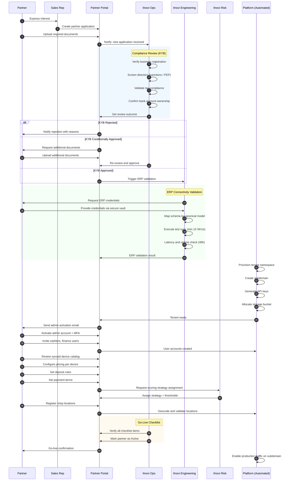

# Merchant / Partner Onboarding Process

## 1. Overview

Merchant onboarding is the process by which a telco, reseller, authorized dealer, or retail chain is registered as a **tenant** on the IInovi platform. Each onboarded partner receives an isolated environment -- including a dedicated namespace, subdomain, user accounts, device catalog, and payment configuration -- enabling them to offer buy-now-pay-later (BNPL) device financing to their end customers.

This document describes every stage of the onboarding lifecycle, from initial application through go-live, along with the data models, validation rules, and integration checks that govern the process.

---

## 2. Onboarding Stages at a Glance

| Stage | Owner | Gate |
|-------|-------|------|
| 1. Partner Application | Partner | Submission complete |
| 2. Compliance Review | IInovi Ops | KYB passed |
| 3. ERP Connectivity Validation | IInovi Engineering | Sync test green |
| 4. Tenant Provisioning | Platform (automated) | Namespace live |
| 5. User Invitation | Partner Admin | At least one admin activated |
| 6. Catalog Sync and Pricing Setup | Partner Admin / Ops | Devices visible |
| 7. Payment Terms Configuration | Partner Admin / Ops | Terms published |
| 8. Credit Scoring Strategy Assignment | IInovi Risk | Strategy bound |
| 9. Shop Location Registration | Partner Admin | Locations geocoded |
| 10. Go-Live Checklist | IInovi Ops | All items green |

---

## 3. Partner Application and Review

### 3.1 Application Submission

A prospective partner initiates the process through the **Partner Portal** or via an IInovi sales representative. The application collects:

- Legal business name and trading name
- Country and jurisdiction of incorporation
- Partner category (see Section 4)
- Primary contact person (name, email, phone)
- Estimated monthly device volume
- Existing mobile money or payment integrations

### 3.2 Required Documentation

All partners must provide the following before compliance review can begin:

| Document | Description | Format |
|----------|-------------|--------|
| Business Registration / License | Proof of legal entity registration | PDF / scanned image |
| Tax Identification Number (TIN) | Tax authority-issued ID | Text + supporting document |
| Bank Account Details | Settlement account for reconciliation | Bank letter or voided cheque |
| Proof of Address | Utility bill or lease agreement for HQ | PDF / scanned image |
| Director / Shareholder ID | Government-issued ID of beneficial owners | PDF / scanned image |
| ERP Credentials or API Spec | Access to the partner's inventory system | Secure credential vault entry |
| Mobile Money Merchant Details | Merchant short code, till number, or API keys | Text + supporting document |

Additional documents may be required depending on the partner category (see `partner-categories.md`).

### 3.3 Compliance Review (KYB)

IInovi Operations performs a **Know Your Business (KYB)** review:

1. Verify business registration against the national registry.
2. Screen directors and shareholders against sanctions and PEP lists.
3. Validate tax compliance status.
4. Confirm bank account ownership via micro-deposit or bank letter.
5. Assign a **risk tier** (Low / Medium / High) that influences credit limits and deposit rules.

Outcomes:

- **Approved** -- proceed to ERP validation.
- **Conditionally Approved** -- partner must resolve specific items within 14 days.
- **Rejected** -- partner is notified with reasons; may re-apply after 90 days.

---

## 4. Partner Categories

Each partner is classified into exactly one category at onboarding time. The category determines default configuration values, integration depth, and operational workflows.

| Category | Examples | Key Characteristics |
|----------|----------|---------------------|
| **Telco** | Safaricom, MTN, Airtel | Direct subscriber base, deep API integration, real-time airtime/data bundle checks |
| **Reseller** | Regional distributors | Purchases devices from OEMs/distributors, lighter integration, batch catalog sync |
| **Authorized Dealer** | Franchise operators | Operates under an OEM or telco brand, franchise-level compliance |
| **Retail Chain** | Multi-branch electronics retailers | Multiple physical locations, centralized ERP, chain-wide pricing |

Full category definitions, scoring implications, and extensibility guidance are documented in `partner-categories.md`.

---

## 5. ERP Connectivity Validation

Before provisioning a tenant, the platform must confirm it can synchronize the partner's device catalog from their ERP or inventory management system.

### 5.1 Supported Integration Patterns

| Pattern | Description | Typical Use |
|---------|-------------|-------------|
| REST API Pull | Platform polls partner ERP on a schedule | Most resellers and retail chains |
| REST API Push | Partner ERP pushes catalog updates via webhook | Telcos with event-driven systems |
| SFTP Batch | CSV/JSON files dropped on a secure SFTP endpoint | Legacy ERP systems |
| Direct DB Connector | Read-only connection to partner inventory DB | Large telcos with on-premise ERP |

### 5.2 Validation Steps

1. **Credential Exchange** -- partner provides API keys, certificates, or SFTP credentials via the secure onboarding vault.
2. **Schema Mapping** -- IInovi maps partner-specific fields (SKU, model, IMEI, stock level, RRP) to the canonical `DeviceCatalogItem` schema.
3. **Test Sync** -- a trial synchronization is executed in a sandbox environment:
   - Minimum 10 SKUs must sync successfully.
   - IMEI-level stock must be retrievable for at least one SKU.
   - Price fields must be present and parseable.
4. **Latency and Reliability Check** -- the sync endpoint must respond within 5 seconds (p95) and be available 99.5% of the time during a 48-hour monitoring window.

If validation fails, the integration team works with the partner to resolve connectivity or schema issues before proceeding.

---

## 6. Tenant Provisioning

Once compliance review and ERP validation pass, the platform automatically provisions a new tenant.

### 6.1 What Gets Created

| Resource | Details |
|----------|---------|
| **Tenant ID** | UUID, immutable, used as the foreign key across all tenant-scoped data |
| **Namespace** | Isolated database schema or logical partition (e.g., `tenant_<short_code>`) |
| **Subdomain** | `<partner_slug>.iinovi.app` -- serves the partner-branded portal |
| **API Keys** | Partner-scoped API key pair (public + secret) for server-to-server calls |
| **Storage Bucket** | Isolated object storage prefix for KYC documents, contracts, and reports |
| **Feature Flags** | Default flag set based on partner category and risk tier |
| **Webhook Endpoints** | Pre-configured callback URLs for catalog sync, payment notifications, and Knox events |

### 6.2 Data Isolation

All tenant data is logically isolated. Queries are scoped by `tenant_id` at the ORM/repository layer, enforced by row-level security policies in the database. Cross-tenant data access is prohibited at the application level and audited.

---

## 7. User Invitation and Role Assignment

The partner's primary contact (captured during application) receives an email invitation to activate their **Admin** account. From there, they can invite additional users.

### 7.1 Roles

| Role | Permissions |
|------|-------------|
| **Admin** | Full tenant configuration, user management, reporting, catalog and pricing management |
| **Cashier** | POS operations: KYC capture, deposit collection, IMEI scan, contract signing, device issuance |
| **Finance** | View transactions, reconciliation reports, payout history, refund approvals |
| **Support** | Customer lookup, payment history, lock/unlock requests, ticket management |
| **Viewer** | Read-only access to dashboards and reports |

### 7.2 Invitation Flow

1. Admin enters invitee email and selects role(s).
2. Platform sends a secure invitation link (expires in 72 hours).
3. Invitee sets password, completes MFA enrollment.
4. Account is activated and audit-logged.

---

## 8. Device Catalog Sync and Pricing Setup

### 8.1 Initial Catalog Sync

After tenant provisioning, the first full catalog sync is triggered:

1. Platform pulls all active SKUs from the partner ERP.
2. Each SKU is mapped to the `DeviceCatalogItem` model (see Section 14).
3. Devices are enriched with GSMA TAC data (brand, model, OS, LTE bands).
4. Stock levels are recorded at the IMEI level where available.

### 8.2 Pricing Configuration

For each device in the catalog, the partner sets:

- **Recommended Retail Price (RRP)** -- the cash sale price.
- **BNPL Price** -- may include a financing markup.
- **Minimum Deposit Percentage** -- floor deposit required from the customer.
- **Deposit Tiers** -- optional graduated deposit schedule based on credit score.
- **Payment Plan Options** -- which tenors (e.g., 3, 6, 9, 12 months) are available for that device.
- **Daily / Weekly / Monthly Flag** -- which repayment frequencies are supported.

Pricing is versioned; changes take effect on a specified activation date and do not retroactively alter existing contracts.

---

## 9. Deposit Rules and Payment Terms Configuration

### 9.1 Deposit Rules

| Parameter | Description | Example |
|-----------|-------------|---------|
| `min_deposit_pct` | Minimum deposit as a percentage of BNPL price | 10% |
| `max_deposit_pct` | Maximum deposit (prevents overpayment) | 50% |
| `deposit_methods` | Accepted deposit channels | `[mobile_money, cash]` |
| `deposit_hold_hours` | Time to hold a pre-order before deposit expires | 48 |

### 9.2 Payment Terms

| Parameter | Description | Example |
|-----------|-------------|---------|
| `tenor_options` | Available repayment durations | `[90, 180, 270, 360]` days |
| `frequency` | Repayment cadence | `daily`, `weekly`, `monthly` |
| `grace_period_days` | Days after due date before penalty | 3 |
| `late_fee_type` | Flat or percentage-based late fee | `percentage` |
| `late_fee_value` | Fee amount or rate | 2% of installment |
| `early_settlement_discount` | Discount for early full repayment | 5% of remaining balance |
| `lock_trigger_days` | Days overdue before Knox lock is initiated | 7 |
| `unlock_on_payment` | Auto-unlock on catch-up payment | `true` |

---

## 10. Credit Scoring Strategy Assignment

IInovi supports multiple credit scoring strategies. During onboarding, IInovi Risk assigns one or more strategies to the partner based on their category, market, and risk appetite.

### 10.1 Available Strategies

| Strategy | Data Sources | Typical Partner |
|----------|-------------|-----------------|
| **Telco Score** | Airtime/data usage, MoMo history, network tenure | Telcos |
| **Bureau Score** | Credit reference bureau pull | All (where bureau available) |
| **Alternative Score** | App telemetry, SMS analysis, social signals | Resellers in underbanked markets |
| **Hybrid Score** | Weighted blend of two or more of the above | Large telcos, retail chains |

### 10.2 Configuration

- **Score Thresholds** -- minimum score for auto-approval, manual review band, and auto-decline.
- **Device Tier Mapping** -- which device price brackets are available at each score band.
- **Deposit Adjustment** -- lower-score customers may face higher deposit requirements.
- **Tenor Restrictions** -- shorter tenors for riskier profiles.

---

## 11. Shop Location Registration

Partners with physical retail presence must register their shop locations.

### 11.1 Location Data

| Field | Description |
|-------|-------------|
| `shop_name` | Display name |
| `address` | Street address |
| `city` | City or town |
| `region` | Province, state, or county |
| `country` | ISO 3166-1 alpha-2 |
| `latitude` | GPS latitude |
| `longitude` | GPS longitude |
| `operating_hours` | JSON object with day-of-week hours |
| `assigned_cashiers` | User IDs of cashiers assigned to this location |
| `stock_source` | ERP warehouse ID that feeds this shop |

### 11.2 Geocoding and Validation

- Addresses are geocoded via a mapping provider to derive lat/long if not supplied.
- Duplicate detection prevents registering the same physical location twice.
- Each location is assigned a unique `shop_id` used in POS transactions.

---

## 12. Go-Live Checklist

Before a partner is marked as **Active**, all items on the go-live checklist must pass:

| # | Check | Owner | Automated |
|---|-------|-------|-----------|
| 1 | KYB review approved | IInovi Ops | No |
| 2 | ERP sync test passed | Engineering | Yes |
| 3 | Tenant namespace provisioned | Platform | Yes |
| 4 | Admin account activated | Partner | Yes |
| 5 | At least one cashier invited and activated | Partner | Yes |
| 6 | Catalog contains at least 5 active devices | Partner / Ops | Yes |
| 7 | Pricing configured for all active devices | Partner | Yes |
| 8 | Deposit rules published | Partner / Ops | Yes |
| 9 | Payment terms published | Partner / Ops | Yes |
| 10 | Credit scoring strategy assigned | IInovi Risk | No |
| 11 | At least one shop location registered (if physical) | Partner | Yes |
| 12 | Test transaction completed in sandbox | Partner / QA | Yes |
| 13 | Knox Guard API connectivity confirmed | Engineering | Yes |
| 14 | Mobile money settlement account verified | Finance | No |
| 15 | Partner agreement signed | Legal | No |

When all checks are green, the partner status transitions from `onboarding` to `active`, and the subdomain begins serving production traffic.

---

## 13. Onboarding Sequence Diagram

---

## 14. Partner Profile Data Model

The following table describes all fields stored on the `Partner` entity. Fields marked with an asterisk (*) are required at application time; all others are populated during onboarding or after go-live.

| Field | Type | Required | Description |
|-------|------|----------|-------------|
| `id` | UUID | Auto | Primary key |
| `tenant_id` | UUID | Auto | References the provisioned tenant |
| `legal_name` | string(255) | * | Registered legal name |
| `trading_name` | string(255) | * | Public-facing brand name |
| `category` | enum | * | `telco`, `reseller`, `authorized_dealer`, `retail_chain` |
| `country` | string(2) | * | ISO 3166-1 alpha-2 country code |
| `registration_number` | string(64) | * | Business registration / incorporation number |
| `tax_id` | string(64) | * | Tax identification number |
| `primary_contact_name` | string(128) | * | Full name of primary contact |
| `primary_contact_email` | string(255) | * | Email of primary contact |
| `primary_contact_phone` | string(20) | * | Phone number of primary contact (E.164) |
| `address_line_1` | string(255) | * | Registered office address line 1 |
| `address_line_2` | string(255) | | Address line 2 |
| `city` | string(128) | * | City |
| `region` | string(128) | | State, province, or county |
| `postal_code` | string(16) | | Postal or ZIP code |
| `bank_name` | string(128) | * | Settlement bank name |
| `bank_account_number` | string(34) | * | IBAN or local account number |
| `bank_branch_code` | string(16) | | Branch or sort code |
| `bank_swift_bic` | string(11) | | SWIFT/BIC for international settlement |
| `mobile_money_provider` | string(64) | | MoMo provider name |
| `mobile_money_merchant_code` | string(32) | | MoMo merchant short code or till |
| `erp_integration_type` | enum | | `rest_pull`, `rest_push`, `sftp_batch`, `direct_db` |
| `erp_endpoint_url` | string(512) | | ERP API base URL or SFTP host |
| `erp_credentials_vault_ref` | string(255) | | Reference to credentials in secure vault |
| `erp_sync_schedule_cron` | string(64) | | Cron expression for sync frequency |
| `erp_last_sync_at` | timestamp | | Last successful sync timestamp |
| `scoring_strategy_ids` | UUID[] | | Assigned credit scoring strategy references |
| `default_min_deposit_pct` | decimal(5,2) | | Default minimum deposit percentage |
| `default_max_deposit_pct` | decimal(5,2) | | Default maximum deposit percentage |
| `default_tenor_options` | int[] | | Default available tenor durations in days |
| `default_frequency` | enum | | `daily`, `weekly`, `monthly` |
| `grace_period_days` | int | | Days after due date before penalty |
| `late_fee_type` | enum | | `flat`, `percentage` |
| `late_fee_value` | decimal(10,2) | | Fee amount or percentage |
| `lock_trigger_days` | int | | Days overdue before Knox lock |
| `unlock_on_payment` | boolean | | Auto-unlock when catch-up payment received |
| `subdomain_slug` | string(63) | Auto | Subdomain prefix (`<slug>.iinovi.app`) |
| `api_key_public` | string(64) | Auto | Public API key |
| `api_key_secret_hash` | string(128) | Auto | Hashed secret API key |
| `risk_tier` | enum | | `low`, `medium`, `high` |
| `kyb_status` | enum | | `pending`, `in_review`, `approved`, `conditionally_approved`, `rejected` |
| `kyb_reviewed_by` | UUID | | User ID of the reviewer |
| `kyb_reviewed_at` | timestamp | | Review completion timestamp |
| `kyb_notes` | text | | Internal review notes |
| `status` | enum | | `draft`, `onboarding`, `active`, `suspended`, `terminated` |
| `partner_agreement_signed_at` | timestamp | | Date the partner agreement was executed |
| `go_live_at` | timestamp | | Date the partner went live |
| `created_at` | timestamp | Auto | Record creation timestamp |
| `updated_at` | timestamp | Auto | Last modification timestamp |
| `created_by` | UUID | Auto | User who created the record |
| `updated_by` | UUID | Auto | User who last modified the record |

---

## 15. Post-Onboarding Operations

After go-live, the following ongoing processes apply:

- **Catalog Re-sync** -- runs on the configured cron schedule; delta syncs update stock and pricing.
- **Periodic KYB Refresh** -- annually or when triggered by a material change (e.g., change of directors).
- **Partner Performance Review** -- quarterly review of portfolio quality, default rates, and customer satisfaction.
- **Suspension and Termination** -- partners may be suspended for compliance breaches or terminated by mutual agreement, with a defined wind-down period for outstanding contracts.
