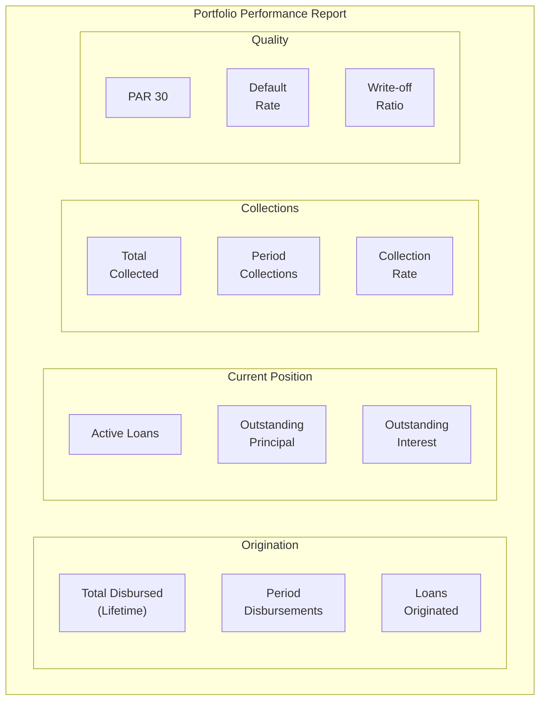
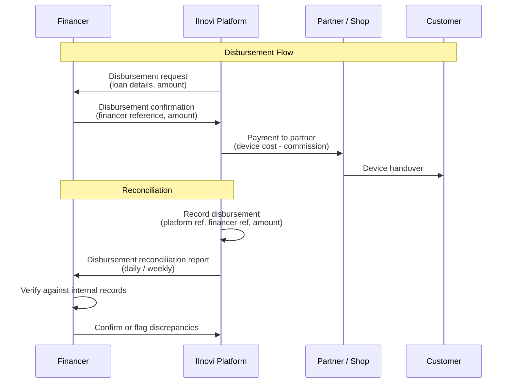
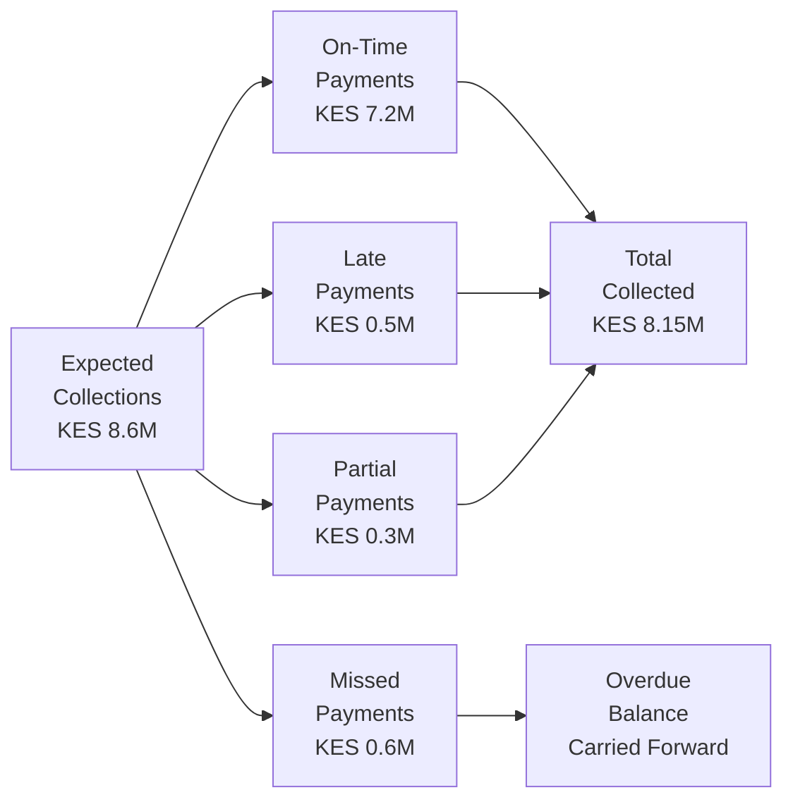
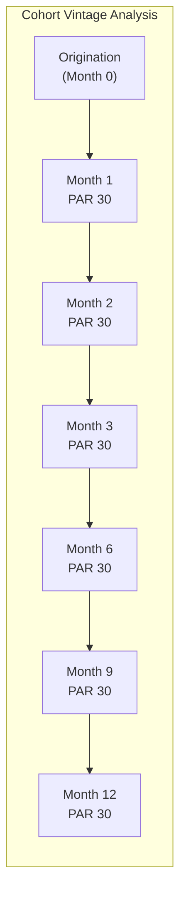
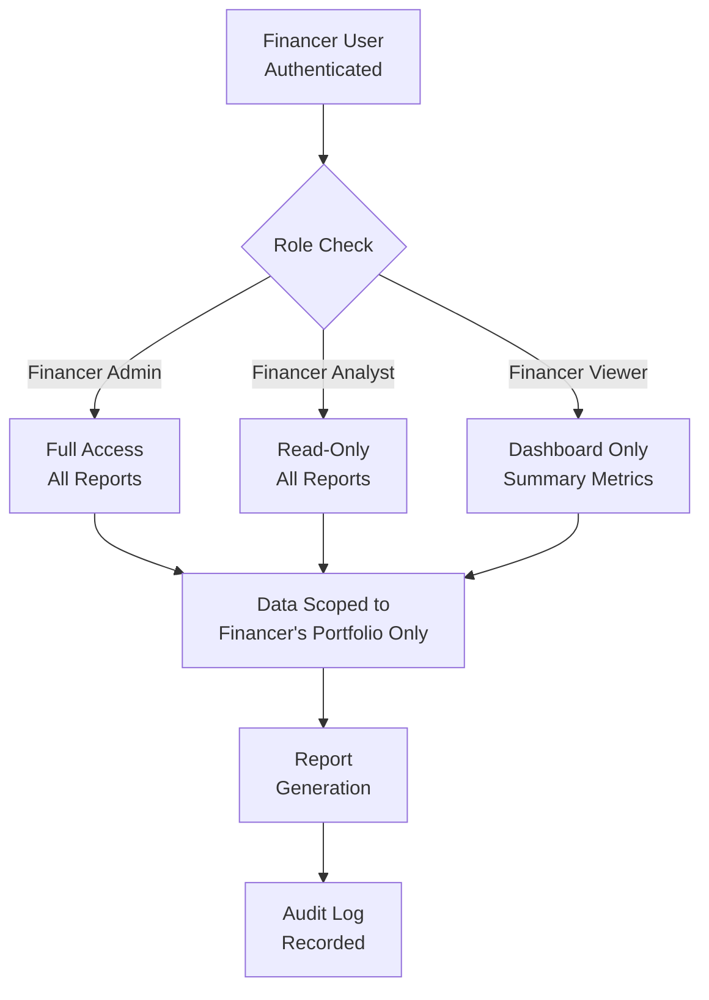

# Financer (Capital Provider) Reporting

## Overview

Financers -- the capital providers who fund device loans on the IInovi platform -- require comprehensive, accurate, and timely reporting on the performance of the portfolios they finance. The platform generates and delivers financer-specific reports that cover disbursement reconciliation, portfolio performance, collection outcomes, and portfolio quality metrics.

Each financer receives reporting scoped exclusively to the loans they fund. Multi-financer tenants maintain strict data segregation so that each capital provider sees only their own portfolio, while platform operators retain an aggregate view.

### Reporting Principles

| Principle | Application |
|---|---|
| **Data Isolation** | Each financer sees only loans funded by their capital; no cross-financer data leakage |
| **Timeliness** | Reports are delivered per agreed schedule; delays trigger automated escalation |
| **Accuracy** | All figures reconcile to underlying transaction records; discrepancies are flagged and resolved |
| **Transparency** | Calculation methodologies are documented and consistent across reporting periods |
| **Auditability** | Every report is versioned, timestamped, and archived for a minimum of seven years |

---

## Portfolio Performance Summary

The portfolio performance summary is the primary report delivered to financers. It provides a comprehensive view of the financer's funded portfolio as of the reporting date.

### Summary Structure

### Portfolio Position Report

| Field | Description | Example Value |
|---|---|---|
| **Reporting Date** | As-of date for the report | 2025-06-30 |
| **Financer** | Capital provider name and identifier | Financer Alpha (FIN-001) |
| **Total Loans Originated (Lifetime)** | Cumulative count of loans funded since inception | 4,250 |
| **Total Disbursed (Lifetime)** | Cumulative principal disbursed | KES 127,500,000 |
| **Active Loans** | Loans in CURRENT, OVERDUE, or RESTRUCTURED status | 1,384 |
| **Outstanding Principal** | Remaining principal balance on active loans | KES 35,400,000 |
| **Outstanding Interest** | Accrued interest receivable | KES 2,850,000 |
| **Total Outstanding** | Principal + interest + fees outstanding | KES 39,120,000 |
| **Total Collected (Lifetime)** | Cumulative collections received | KES 91,200,000 |
| **Period Collections** | Collections received in the current reporting period | KES 8,450,000 |
| **Loans in Default** | Loans classified as DEFAULT (typically 90+ DPD) | 12 |
| **Defaulted Principal** | Outstanding principal of loans in DEFAULT status | KES 480,000 |
| **Written-Off (Lifetime)** | Cumulative principal written off | KES 1,350,000 |
| **Recovered from Write-Offs** | Amount recovered from previously written-off loans | KES 405,000 |
| **Net Credit Losses** | Write-offs minus recoveries | KES 945,000 |

---

## Disbursement Reconciliation

The disbursement reconciliation report ensures that every disbursement funded by the financer is accurately recorded and matched against the financer's capital outflows.

### Reconciliation Process

### Disbursement Reconciliation Report

| Field | Description |
|---|---|
| **Loan Reference** | Platform loan identifier |
| **Financer Reference** | Financer's internal reference for the disbursement |
| **Customer Name** | Borrower name |
| **Device** | Device model and IMEI |
| **Partner** | Originating partner / shop |
| **Disbursement Date** | Date the financer released funds |
| **Principal Amount** | Loan principal funded by the financer |
| **Financer Fee / Margin** | Expected margin or interest income for the financer |
| **Platform Fee** | Platform's origination or service fee |
| **Partner Commission** | Commission paid to the originating partner |
| **Net Disbursed** | Amount transferred to the partner for the device |
| **Status** | CONFIRMED, PENDING, FAILED, REVERSED |

### Reconciliation Summary

| Metric | Current Period | Cumulative |
|---|---|---|
| **Disbursements Requested** | 142 | 4,250 |
| **Disbursements Confirmed** | 140 | 4,245 |
| **Disbursements Pending** | 2 | 2 |
| **Disbursements Failed / Reversed** | 0 | 3 |
| **Total Amount Disbursed** | KES 4,260,000 | KES 127,500,000 |
| **Discrepancies** | 0 | 0 |

---

## Expected vs. Actual Collections

This report compares the expected repayment schedule against actual collections received, enabling the financer to assess collection efficiency and forecast cash flows.

### Comparison Report Structure

| Period | Expected Collections (KES) | Actual Collections (KES) | Variance (KES) | Variance % | Collection Rate |
|---|---|---|---|---|---|
| Week 1 (Jun 1-7) | 2,100,000 | 1,995,000 | -105,000 | -5.0% | 95.0% |
| Week 2 (Jun 8-14) | 2,050,000 | 1,886,000 | -164,000 | -8.0% | 92.0% |
| Week 3 (Jun 15-21) | 2,150,000 | 2,064,000 | -86,000 | -4.0% | 96.0% |
| Week 4 (Jun 22-30) | 2,300,000 | 2,208,000 | -92,000 | -4.0% | 96.0% |
| **Month Total** | **8,600,000** | **8,153,000** | **-447,000** | **-5.2%** | **94.8%** |

### Variance Analysis

The report categorizes collection variances by cause:

| Variance Category | Amount (KES) | % of Total Variance |
|---|---|---|
| **Late payments (collected after period end)** | 180,000 | 40.3% |
| **Partial payments** | 95,000 | 21.3% |
| **Missed payments (no payment received)** | 120,000 | 26.8% |
| **Prepayments (collected ahead of schedule)** | +48,000 | -10.7% |
| **Early settlements** | +100,000 | -22.4% |
| **Net Variance** | **-447,000** | **100%** |

### Collections Waterfall

---

## Portfolio Quality Metrics

### PAR Report for Financer

The financer-specific PAR report mirrors the platform-wide PAR methodology but is scoped exclusively to the financer's funded portfolio.

| Metric | Value | Trend (vs. Prior Month) | Benchmark |
|---|---|---|---|
| **PAR 1** | 12.5% | +0.8% | < 15% |
| **PAR 7** | 6.8% | +0.3% | < 10% |
| **PAR 30** | 3.2% | -0.2% | < 5% |
| **PAR 60** | 1.4% | +0.1% | < 3% |
| **PAR 90** | 0.6% | 0.0% | < 1% |

### Aging Distribution for Financer

| Bucket | Loan Count | Outstanding (KES) | % of Portfolio | Provision (KES) |
|---|---|---|---|---|
| Current | 1,245 | 31,200,000 | 88.1% | 156,000 |
| 1 - 7 days | 68 | 1,800,000 | 5.1% | 90,000 |
| 8 - 30 days | 42 | 1,300,000 | 3.7% | 195,000 |
| 31 - 60 days | 18 | 640,000 | 1.8% | 224,000 |
| 61 - 90 days | 7 | 280,000 | 0.8% | 168,000 |
| 90+ days | 4 | 180,000 | 0.5% | 162,000 |
| **Total** | **1,384** | **35,400,000** | **100%** | **995,000** |

### Default and Recovery Summary

| Metric | Current Month | Prior Month | YTD |
|---|---|---|---|
| **New Defaults** | 2 | 1 | 12 |
| **Default Amount (KES)** | 75,000 | 32,000 | 480,000 |
| **Write-Offs** | 1 | 0 | 5 |
| **Write-Off Amount (KES)** | 28,000 | 0 | 180,000 |
| **Recoveries (KES)** | 15,000 | 8,000 | 54,000 |
| **Recovery Rate** | 20.0% | 25.0% | 30.0% |
| **Net Loss Rate (Annualized)** | 0.4% | 0.0% | 0.4% |

---

## Cohort Analysis

Cohort analysis groups loans by their origination month and tracks performance over time, allowing the financer to assess vintage quality.

### Cohort Performance Table

| Cohort (Month) | Loans | Disbursed (KES) | Collected (KES) | Outstanding (KES) | Defaulted (KES) | Written Off (KES) | PAR 30 |
|---|---|---|---|---|---|---|---|
| Jan 2025 | 280 | 8,400,000 | 5,880,000 | 2,100,000 | 120,000 | 42,000 | 2.8% |
| Feb 2025 | 310 | 9,300,000 | 5,580,000 | 3,255,000 | 95,000 | 0 | 3.1% |
| Mar 2025 | 340 | 10,200,000 | 5,100,000 | 4,590,000 | 65,000 | 0 | 2.5% |
| Apr 2025 | 325 | 9,750,000 | 3,900,000 | 5,460,000 | 40,000 | 0 | 2.9% |
| May 2025 | 350 | 10,500,000 | 2,100,000 | 7,875,000 | 15,000 | 0 | 1.8% |
| Jun 2025 | 352 | 10,560,000 | 880,000 | 9,240,000 | 0 | 0 | 0.5% |

### Cohort Vintage Curve

Each cohort's PAR 30 is tracked at monthly intervals to produce a vintage curve. Cohorts with steeper deterioration curves indicate weaker credit quality at origination.

---

## Report Generation Schedule

| Report | Frequency | Delivery Deadline | Contents |
|---|---|---|---|
| **Daily Collections Summary** | Daily | By 08:00 next business day | Collections received, missed payments, collection rate |
| **Daily Disbursement Summary** | Daily | By 08:00 next business day | New loans originated, amounts disbursed |
| **Weekly Portfolio Update** | Weekly (Monday) | By 10:00 Monday | Aging snapshot, PAR metrics, collection rate, disbursement summary |
| **Monthly Portfolio Performance** | Monthly | By 5th business day of following month | Full performance report: position, aging, PAR, collections, defaults, cohort analysis |
| **Monthly Disbursement Reconciliation** | Monthly | By 5th business day of following month | All disbursements with reconciliation status |
| **Quarterly Executive Summary** | Quarterly | By 10th business day of following quarter | Portfolio trends, loss analysis, recovery report, cohort vintage analysis |
| **Annual Portfolio Review** | Annually | By 15th business day of following year | Full-year performance, write-off review, strategy recommendations |

---

## Report Delivery Channels

### Delivery Methods

| Channel | Format | Use Case | Authentication |
|---|---|---|---|
| **API** | JSON | Programmatic consumption; integration with financer systems | JWT Bearer token; financer-specific API credentials |
| **Dashboard** | Interactive web UI | Real-time monitoring; ad-hoc analysis | SSO / username-password with MFA |
| **Email Export** | PDF, CSV, Excel | Scheduled report delivery to stakeholders | Encrypted email; password-protected attachments |
| **SFTP** | CSV, JSON | Automated file-based integration | SSH key authentication |
| **Webhook** | JSON | Real-time event notifications (disbursement, default, write-off) | Webhook secret; HMAC signature verification |

### API Report Endpoints

| Endpoint | Method | Description |
|---|---|---|
| `/api/v1/financers/{id}/reports/portfolio-summary` | GET | Current portfolio position and summary metrics |
| `/api/v1/financers/{id}/reports/aging` | GET | Aging distribution report |
| `/api/v1/financers/{id}/reports/collections` | GET | Collection performance by period |
| `/api/v1/financers/{id}/reports/disbursements` | GET | Disbursement log with reconciliation status |
| `/api/v1/financers/{id}/reports/par` | GET | PAR metrics with trend data |
| `/api/v1/financers/{id}/reports/cohort` | GET | Cohort analysis by origination period |
| `/api/v1/financers/{id}/reports/defaults` | GET | Default and write-off summary |

All API endpoints support query parameters for date range (`from`, `to`), granularity (`daily`, `weekly`, `monthly`), and export format (`json`, `csv`).

### Report Access Control

---

## Report Archival and Retention

| Report Type | Retention Period | Storage | Access After Archive |
|---|---|---|---|
| Daily reports | 2 years online; 5 years archive | Object storage (encrypted) | Request via support |
| Weekly reports | 3 years online; 7 years archive | Object storage (encrypted) | Request via support |
| Monthly reports | 5 years online; 10 years archive | Object storage (encrypted) | Self-service retrieval |
| Quarterly / Annual | 10 years online | Object storage (encrypted) | Self-service retrieval |

---

## Related Documents

- [Portfolio Reporting and Analytics](portfolio-reporting.md) -- platform-wide portfolio metrics and KPI definitions
- [Regulatory Reporting](regulatory-reporting.md) -- CRB and regulatory submission requirements
- [Portfolio Management](../financial-lending/portfolio-management.md) -- loan aging, status tracking, and collections
- [Payment Reconciliation](../payments/reconciliation.md) -- payment matching and application
- [Disbursement Flow](../financial-lending/disbursement-flow.md) -- end-to-end disbursement process
- [Financial Flows](../financial-lending/financial-flows.md) -- fund flows between parties
- [Documentation Index](../README.md) -- full documentation map
