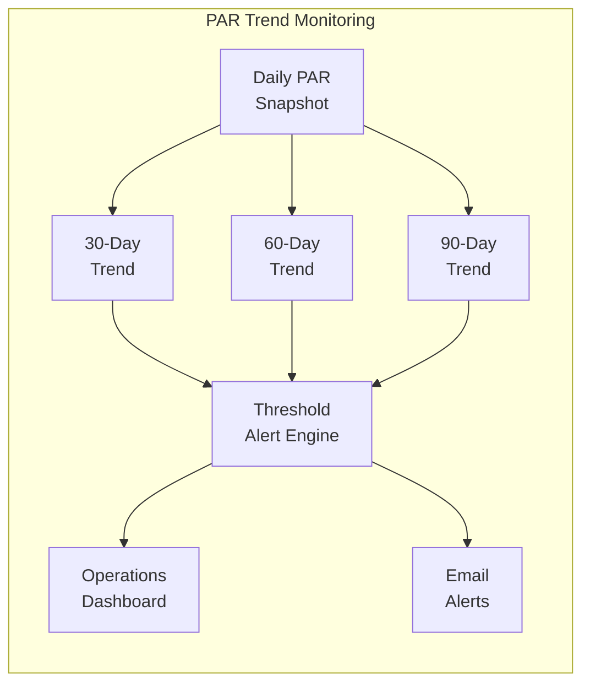
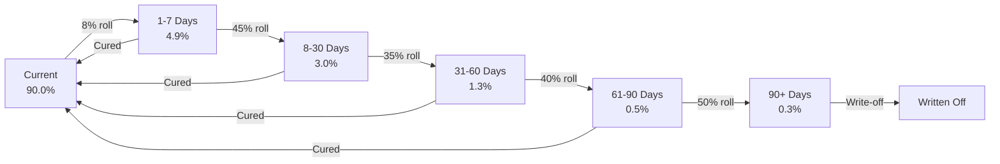
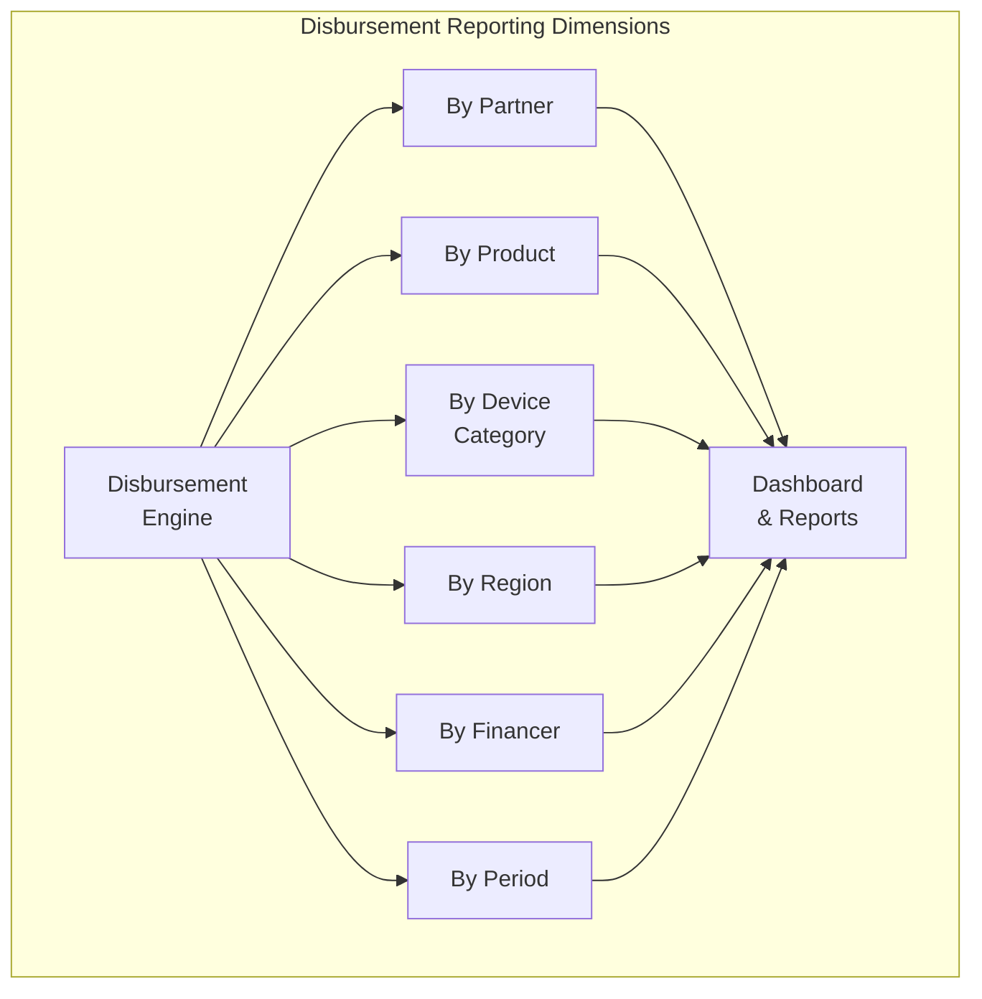
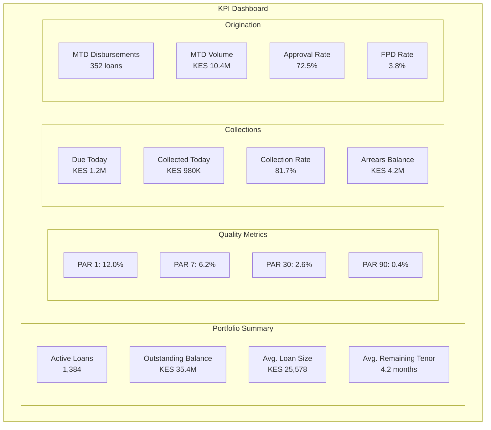
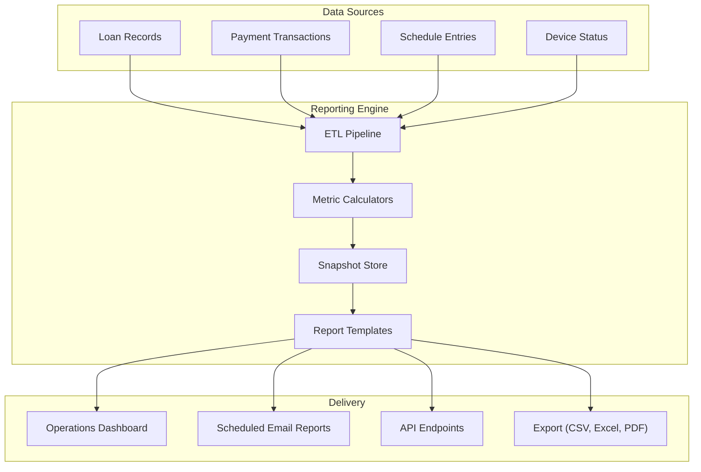

# Portfolio Reporting and Analytics

## Overview

Portfolio reporting provides the quantitative foundation for managing the health of the IInovi lending operation. The reporting engine aggregates loan-level data into portfolio-wide metrics, enabling operations teams, credit managers, and executive leadership to monitor performance, identify trends, and take corrective action before risks materialize.

All portfolio reports are computed per tenant and can be further segmented by partner, product, financer, region, or time period. Reports are generated on a scheduled basis (daily, weekly, monthly) and are also available on demand through the operations dashboard and API.

---

## Portfolio at Risk (PAR)

PAR is the primary measure of portfolio quality in microfinance and device lending. It expresses the proportion of the total outstanding portfolio that is at risk of loss, based on how many days past due (DPD) the constituent loans are.

### PAR Calculation Formula

```
PAR(x) = Outstanding principal balance of all loans with DPD > x days
         ---------------------------------------------------------------
         Total outstanding principal balance of the active portfolio
```

Where `x` is the threshold in days. The numerator includes the **entire** outstanding balance of each qualifying loan, not just the overdue instalment amount. This reflects the principle that once a loan is delinquent beyond a threshold, the full remaining balance is considered at risk.

### PAR Variants

| Metric | Threshold | Formula | Healthy Target | Interpretation |
|---|---|---|---|---|
| **PAR 1** | > 1 day | Loans DPD > 1 / Total portfolio | < 15% | Early delinquency; operational efficiency indicator |
| **PAR 7** | > 7 days | Loans DPD > 7 / Total portfolio | < 10% | Short-term arrears; collection effectiveness |
| **PAR 30** | > 30 days | Loans DPD > 30 / Total portfolio | < 5% | Material delinquency; credit quality indicator |
| **PAR 60** | > 60 days | Loans DPD > 60 / Total portfolio | < 3% | Serious delinquency; provisioning trigger |
| **PAR 90** | > 90 days | Loans DPD > 90 / Total portfolio | < 1% | Default territory; write-off review threshold |

### PAR Calculation -- Worked Example

Consider a portfolio with the following loans on the reporting date:

| Loan ID | Outstanding Principal (KES) | Days Past Due | Status |
|---|---|---|---|
| LN-001 | 25,000 | 0 | Current |
| LN-002 | 18,000 | 0 | Current |
| LN-003 | 12,000 | 3 | Overdue |
| LN-004 | 30,000 | 0 | Current |
| LN-005 | 15,000 | 12 | Overdue |
| LN-006 | 22,000 | 0 | Current |
| LN-007 | 8,000 | 35 | Overdue |
| LN-008 | 20,000 | 0 | Current |
| LN-009 | 10,000 | 5 | Overdue |
| LN-010 | 40,000 | 0 | Current |

**Total outstanding principal**: KES 200,000

**PAR 1 calculation:**

Loans with DPD > 1: LN-003 (3 days), LN-005 (12 days), LN-007 (35 days), LN-009 (5 days)

```
PAR 1 = (12,000 + 15,000 + 8,000 + 10,000) / 200,000
      = 45,000 / 200,000
      = 22.5%
```

**PAR 7 calculation:**

Loans with DPD > 7: LN-005 (12 days), LN-007 (35 days)

```
PAR 7 = (15,000 + 8,000) / 200,000
      = 23,000 / 200,000
      = 11.5%
```

**PAR 30 calculation:**

Loans with DPD > 30: LN-007 (35 days)

```
PAR 30 = 8,000 / 200,000
       = 4.0%
```

**PAR 60 and PAR 90**: 0.0% (no loans exceed these thresholds in this example).

### PAR Trend Analysis

PAR is tracked over time to identify deterioration or improvement trends. The reporting engine maintains daily PAR snapshots and generates trend charts over 30-day, 60-day, and 90-day windows.



### PAR Threshold Alerts

| Metric | Warning Threshold | Critical Threshold | Alert Recipients |
|---|---|---|---|
| PAR 1 | > 20% | > 30% | Operations team |
| PAR 7 | > 12% | > 20% | Operations team, credit manager |
| PAR 30 | > 6% | > 10% | Credit manager, head of lending |
| PAR 60 | > 4% | > 7% | Head of lending, executive team |
| PAR 90 | > 2% | > 5% | Executive team, financer reporting |

---

## Collection Rate

The collection rate measures how effectively the platform collects payments that are due in a given period. It is the single most important operational efficiency metric.

### Collection Rate Formula

```
Collection Rate = Total amount collected during the period
                  ----------------------------------------
                  Total amount due during the period
```

### Collection Rate Variants

| Variant | Numerator | Denominator | Purpose |
|---|---|---|---|
| **Current Period Collection Rate** | Collections received in the period for instalments due in that period | Total instalments due in the period | Measures real-time collection efficiency |
| **Cumulative Collection Rate** | All collections received to date for a cohort | All instalments due to date for that cohort | Measures lifetime collection performance |
| **Arrears Collection Rate** | Collections received against overdue instalments | Total overdue balance at period start | Measures recovery of arrears |

### Collection Rate by Segmentation

Collection rates are calculated and reported across the following dimensions:

| Dimension | Example Segments | Use Case |
|---|---|---|
| **Partner** | Shop A, Shop B, Chain C | Identify underperforming origination channels |
| **Product** | 6-month Samsung A14, 12-month Samsung A25 | Compare product performance |
| **Region** | Nairobi, Mombasa, Western Kenya | Geographic collection challenges |
| **Financer** | Capital Provider X, Fund Y | Per-financer portfolio reporting |
| **Period** | Daily, weekly, monthly | Operational vs. strategic views |

---

## Default Rate and Write-Off Ratio

### Default Rate

```
Default Rate = Number of loans classified as DEFAULT in the period
               ---------------------------------------------------
               Total number of active loans at the start of the period
```

A loan is classified as `DEFAULT` when it exceeds the contractual default threshold (typically 90 DPD). The default rate is a lagging indicator that reflects credit quality decisions made months earlier.

### Write-Off Ratio

```
Write-Off Ratio = Total principal written off during the period
                  ---------------------------------------------
                  Average outstanding portfolio balance during the period
```

Write-offs represent confirmed credit losses. The write-off ratio is annualized for comparability and reported monthly.

### Recovery Rate

```
Recovery Rate = Amount recovered from defaulted / written-off loans
                -------------------------------------------------
                Total defaulted / written-off principal
```

Recovery rate tracks how much value is recouped from loans that have been classified as defaulted or written off, including through device recovery, payment plans, or third-party collections.

### Default and Loss Metrics Summary

| Metric | Formula | Healthy Target | Reporting Frequency |
|---|---|---|---|
| Default Rate | Defaults / Active loans | < 3% | Monthly |
| Write-Off Ratio | Write-offs / Avg. portfolio | < 2% annualized | Monthly |
| Recovery Rate | Recovered / Defaulted amount | > 30% | Quarterly |
| Net Loss Rate | (Write-offs - Recoveries) / Avg. portfolio | < 1.5% annualized | Monthly |
| First Payment Default | Loans missing 1st payment / Originated in cohort | < 5% | Monthly (cohort) |

---

## Aging Analysis

Aging analysis classifies the outstanding portfolio into time-based buckets according to how many days past due each loan is. It provides a snapshot of portfolio quality and guides collection intensity and provisioning decisions.

### Aging Buckets

| Bucket | Days Past Due | Risk Classification | Collection Strategy | Provisioning Rate |
|---|---|---|---|---|
| **Current** | 0 | Performing | Standard automated collection | 0% - 1% |
| **1 - 7 days** | 1 - 7 | Watch | Automated reminders, SMS nudges | 5% |
| **8 - 30 days** | 8 - 30 | Substandard | Agent phone calls, Knox Guard warning | 10% - 25% |
| **31 - 60 days** | 31 - 60 | Doubtful | Intensive follow-up, Knox Guard lock | 25% - 50% |
| **61 - 90 days** | 61 - 90 | Loss imminent | Final notice, promise-to-pay negotiations | 50% - 75% |
| **90+ days** | > 90 | Loss / Default | Default classification, write-off review | 75% - 100% |

### Aging Report Format

The aging report presents both count and value distributions:

| Metric | Current | 1-7 | 8-30 | 31-60 | 61-90 | 90+ | Total |
|---|---|---|---|---|---|---|---|
| **Loan Count** | 1,245 | 68 | 42 | 18 | 7 | 4 | 1,384 |
| **Outstanding (KES)** | 31.2M | 1.8M | 1.3M | 640K | 280K | 150K | 35.4M |
| **% of Portfolio (Count)** | 90.0% | 4.9% | 3.0% | 1.3% | 0.5% | 0.3% | 100% |
| **% of Portfolio (Value)** | 88.1% | 5.1% | 3.7% | 1.8% | 0.8% | 0.4% | 100% |
| **Provision Amount** | 156K | 90K | 195K | 224K | 168K | 131K | 964K |

### Roll Rate Analysis

Roll rates measure the rate at which loans migrate from one aging bucket to the next between reporting periods. They are a leading indicator of portfolio deterioration.

```
Roll Rate (Bucket N -> N+1) = Loans that moved from Bucket N to Bucket N+1
                              -----------------------------------------------
                              Total loans in Bucket N at the start of the period
```

| From Bucket | To Bucket | Example Roll Rate | Interpretation |
|---|---|---|---|
| Current | 1-7 days | 8% | 8% of current loans became overdue |
| 1-7 days | 8-30 days | 45% | 45% of early arrears deteriorated further |
| 8-30 days | 31-60 days | 35% | 35% of moderate arrears worsened |
| 31-60 days | 61-90 days | 40% | 40% of doubtful loans continued declining |
| 61-90 days | 90+ days | 50% | 50% of severely overdue loans defaulted |

### Aging Migration Diagram



---

## Disbursement Volumes

Disbursement reporting tracks the volume and value of new loans originated across all dimensions.

### Disbursement Metrics

| Metric | Description | Frequency |
|---|---|---|
| **Total Disbursed (Value)** | Sum of principal amounts disbursed | Daily, weekly, monthly |
| **Total Disbursed (Count)** | Number of loans originated | Daily, weekly, monthly |
| **Average Loan Size** | Total disbursed value / Total disbursed count | Weekly, monthly |
| **Approval Rate** | Approved applications / Total applications | Daily, weekly |
| **Disbursement Completion Rate** | Fully disbursed loans / Approved loans | Daily, weekly |
| **Average Time to Disburse** | Mean time from approval to disbursement completion | Weekly |

### Disbursement by Partner

| Partner | Loans Originated | Total Disbursed (KES) | Avg. Loan Size | Approval Rate | FPD Rate |
|---|---|---|---|---|---|
| Partner A -- Nairobi CBD | 142 | 4,260,000 | 30,000 | 72% | 3.5% |
| Partner B -- Westlands | 98 | 3,430,000 | 35,000 | 68% | 4.1% |
| Partner C -- Mombasa | 67 | 1,675,000 | 25,000 | 75% | 2.8% |
| Partner D -- Kisumu | 45 | 990,000 | 22,000 | 78% | 5.2% |
| **Total** | **352** | **10,355,000** | **29,418** | **72.5%** | **3.8%** |

### Disbursement by Device Category

| Category | Loans | Total Disbursed (KES) | Avg. Price | % of Volume |
|---|---|---|---|---|
| Entry-level (< KES 15K) | 85 | 1,062,500 | 12,500 | 10.3% |
| Mid-range (KES 15K - 30K) | 168 | 4,200,000 | 25,000 | 40.6% |
| Upper mid-range (KES 30K - 50K) | 72 | 2,880,000 | 40,000 | 27.8% |
| Premium (> KES 50K) | 27 | 2,212,500 | 81,944 | 21.4% |
| **Total** | **352** | **10,355,000** | **29,418** | **100%** |

### Disbursement by Period

Disbursement volumes are tracked over time to identify growth trends, seasonality, and the impact of marketing or operational changes.



---

## Key Performance Indicators Dashboard

The KPI dashboard provides a consolidated real-time view of the most critical portfolio metrics.

### Dashboard Layout



### KPI Definitions and Targets

| KPI | Definition | Target | Alert Threshold |
|---|---|---|---|
| **Active Portfolio Size** | Count of loans in CURRENT, OVERDUE, or RESTRUCTURED status | Growth target per plan | N/A |
| **Outstanding Balance** | Sum of outstanding principal across all active loans | Growth target per plan | N/A |
| **PAR 30** | Outstanding balance of loans DPD > 30 / Total outstanding | < 5% | > 6% |
| **Collection Rate** | Amount collected / Amount due in the period | > 95% | < 90% |
| **Default Rate** | Loans entering DEFAULT status / Active loans | < 3% | > 4% |
| **Write-Off Ratio** | Written-off principal / Average portfolio (annualized) | < 2% | > 3% |
| **Disbursement Volume** | Count and value of new loans originated | Per business plan | < 80% of target |
| **Approval Rate** | Approved / Total applications | 65% - 80% | < 60% or > 85% |
| **First Payment Default** | Loans missing first payment / Cohort originations | < 5% | > 7% |
| **Average Days to Collect** | Average DPD at time of payment | < 3 days | > 7 days |
| **Customer Retention Rate** | Repeat borrowers / Total eligible for repeat | > 40% | < 25% |

---

## Report Generation Architecture



### Report Schedule

| Report | Frequency | Generation Time | Recipients |
|---|---|---|---|
| Daily Portfolio Summary | Daily | 06:00 local | Operations team |
| Daily Collections Report | Daily | 18:00 local | Operations team, collections |
| Weekly Aging Report | Weekly (Monday) | 07:00 local | Credit manager, operations |
| Weekly Disbursement Report | Weekly (Monday) | 07:00 local | Business development, operations |
| Monthly Portfolio Performance | Monthly (2nd business day) | 08:00 local | Executive team, financers |
| Monthly PAR Trend Report | Monthly (2nd business day) | 08:00 local | Credit manager, executive team |
| Quarterly Write-Off Review | Quarterly | 5th business day | Executive team, board |

---

## Data Freshness and Computation

| Metric Category | Data Freshness | Computation Method |
|---|---|---|
| **PAR metrics** | Real-time (updated on every payment event) | Incremental recalculation on payment/status change |
| **Collection rate** | Real-time for current day; snapshot for historical | Running total during the day; end-of-day snapshot |
| **Aging analysis** | End-of-day snapshot | Batch recalculation during nightly processing |
| **Disbursement volumes** | Real-time | Running totals; end-of-day snapshot |
| **Default/write-off rates** | End-of-day | Batch calculation during nightly processing |
| **Roll rates** | Monthly | Comparison of consecutive month-end snapshots |

---

## Related Documents

- [Portfolio Management](../financial-lending/portfolio-management.md) -- loan aging, status tracking, and PAR definitions
- [Payment Reconciliation](../payments/reconciliation.md) -- payment matching and collection processing
- [Financer Reporting](financer-reporting.md) -- capital provider-specific reporting
- [Regulatory Reporting](regulatory-reporting.md) -- CRB and regulatory submissions
- [Credit Bureau Integration](../compliance/credit-bureau-integration.md) -- CRB data submission and reporting obligations
- [Dunning and Escalation](../notifications/dunning-escalation.md) -- collection escalation tiers
- [Documentation Index](../README.md) -- full documentation map
