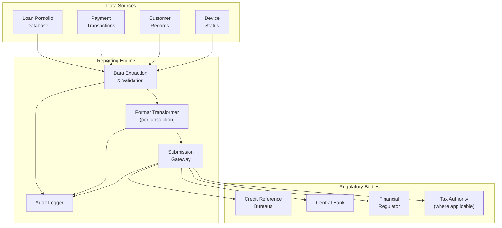
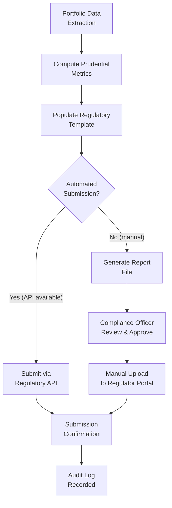
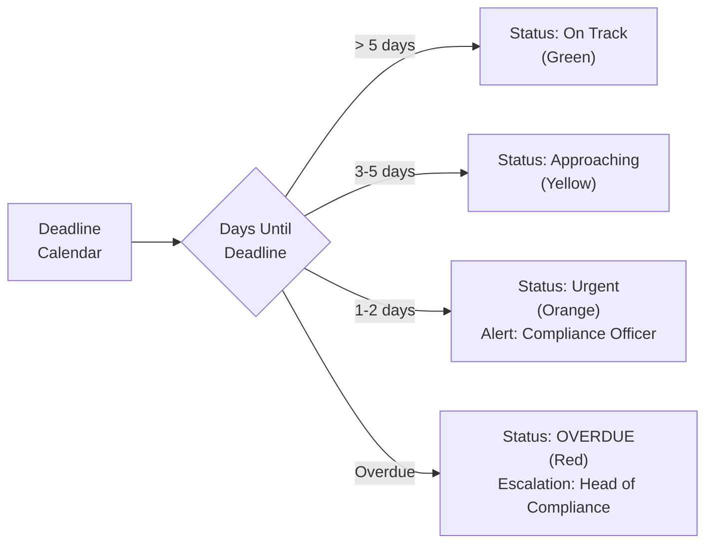
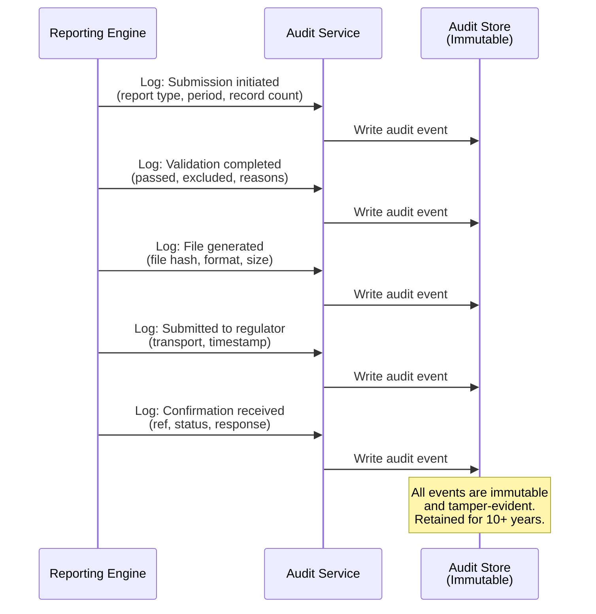

# Regulatory Reporting

## Overview

The IInovi platform is subject to regulatory reporting obligations in each market where it operates. These obligations require the timely and accurate submission of portfolio performance data, default notifications, and financial reports to credit reference bureaus (CRBs), central banks, and financial regulators.

This document covers the regulatory reporting framework, submission processes, data formats, timelines, automation capabilities, and audit trail requirements. It complements the platform's Credit Bureau Integration documentation, which addresses the mechanics of CRB data submission at the technical level.

### Reporting Principles

| Principle | Application |
|---|---|
| **Regulatory Compliance** | All submissions meet the specific requirements of each jurisdiction's regulatory body |
| **Timeliness** | Reports are submitted within prescribed deadlines; automated alerts prevent missed submissions |
| **Data Accuracy** | Pre-submission validation ensures data quality; reconciliation with internal records before submission |
| **Completeness** | Every reportable loan account is included; no omissions or under-reporting |
| **Audit Trail** | Every submission is logged with full traceability: who, when, what, and the outcome |
| **Automation First** | Submissions are automated wherever possible; manual steps are documented and exception-based |

---

## Regulatory Reporting Architecture



---

## CRB Monthly Submissions

### Submission Content

The platform submits monthly portfolio performance data to licensed credit reference bureaus in each market. Each loan account is classified into one of the following performance categories:

| Performance Category | Platform Status Mapping | DPD Range | CRB Code |
|---|---|---|---|
| **Current / Performing** | `CURRENT` | 0 | `PERFORMING` |
| **Arrears (1-30)** | `OVERDUE`, DPD 1-30 | 1-30 | `ARREARS_30` |
| **Arrears (31-60)** | `OVERDUE`, DPD 31-60 | 31-60 | `ARREARS_60` |
| **Arrears (61-90)** | `OVERDUE`, DPD 61-90 | 61-90 | `ARREARS_90` |
| **Default** | `DEFAULT` | 90+ | `DEFAULT` |
| **Restructured** | `RESTRUCTURED` | Any | `RESTRUCTURED` |
| **Settled** | `PAID_OFF`, `EARLY_SETTLED` | N/A | `CLOSED_NORMAL` / `CLOSED_EARLY` |
| **Written Off** | `WRITTEN_OFF` | N/A | `WRITE_OFF` |
| **Cancelled** | `CANCELLED` | N/A | `CLOSED_CANCELLED` |

### Monthly Submission Record

Each loan account in the submission includes the following data:

| Field | Description | Example |
|---|---|---|
| **Account Reference** | Unique loan identifier | LN-2025-00142 |
| **Customer ID** | National ID or passport number | 12345678 |
| **Customer Name** | Full name as per KYC records | Jane M. Wanjiku |
| **Account Open Date** | Loan origination date | 2025-01-15 |
| **Original Amount** | Loan principal at origination | 30,000 |
| **Current Balance** | Outstanding balance as of reporting date | 18,500 |
| **Instalment Amount** | Monthly instalment due | 5,500 |
| **Account Status** | Performance category code | PERFORMING |
| **Days Past Due** | Current DPD (0 if current) | 0 |
| **Last Payment Date** | Date of most recent payment | 2025-06-28 |
| **Last Payment Amount** | Amount of most recent payment | 5,500 |
| **Account Type** | Type of credit facility | ASSET_FINANCE |
| **Currency** | ISO 4217 currency code | KES |
| **Maturity Date** | Contractual end date of the loan | 2025-07-15 |

### CRB Submission Flow

```mermaid
sequenceDiagram
    participant SCHED as Scheduler
    participant RPT as Reporting Engine
    participant VAL as Validator
    participant FMT as Format Transformer
    participant CRB as CRB Adapter
    participant BUREAU as Credit Bureau
    participant AUDIT as Audit Logger

    SCHED->>RPT: Trigger monthly submission<br/>(1st business day)

    RPT->>RPT: Extract all active and<br/>recently closed accounts
    RPT->>VAL: Validate records

    VAL->>VAL: Check completeness,<br/>format, logical consistency
    VAL-->>RPT: Validation results<br/>(passed, failed, warnings)

    RPT->>RPT: Exclude failed records;<br/>flag for correction

    RPT->>FMT: Transform to bureau format<br/>(XML, CSV, or JSON)
    FMT-->>RPT: Formatted submission file

    RPT->>CRB: Submit via adapter
    CRB->>BUREAU: Transmit (SFTP / API)

    alt Submission Accepted
        BUREAU-->>CRB: Acceptance confirmation
        CRB-->>RPT: Success
    else Submission Rejected
        BUREAU-->>CRB: Rejection with error details
        CRB-->>RPT: Failure (error list)
        RPT->>RPT: Flag for correction and resubmission
    end

    RPT->>AUDIT: Log submission details<br/>(records, outcome, timestamp)
```

### Pre-Submission Validation Rules

| Validation | Description | Action on Failure |
|---|---|---|
| **Mandatory fields** | All required fields populated | Exclude record; flag for correction |
| **ID number format** | National ID matches expected format per market | Exclude record; alert data quality team |
| **Balance consistency** | Current balance is consistent with payment history | Flag for manual review |
| **Status-DPD alignment** | Account status matches the reported DPD range | Auto-correct if mapping is deterministic |
| **Duplicate detection** | No duplicate accounts in the same submission | Remove duplicate; log warning |
| **Record count reconciliation** | Total records match expected active portfolio count | Hold submission if variance exceeds 5% |
| **Date validity** | All dates are valid and logically consistent | Exclude record; flag for correction |

---

## Central Bank Reporting

### Applicability

Central bank reporting requirements vary by market and depend on the licensing status of the platform and its financer partners.

| Market | Central Bank | Reporting Required | Basis |
|---|---|---|---|
| **Kenya** | Central Bank of Kenya (CBK) | Yes, for licensed digital lenders | Digital Credit Providers Regulations, 2022 |
| **Nigeria** | Central Bank of Nigeria (CBN) | Yes, for licensed OFIs and microfinance banks | CBN Prudential Guidelines |
| **South Africa** | South African Reserve Bank (SARB) | Yes, for registered credit providers (via NCR) | National Credit Act (NCA) |
| **Ghana** | Bank of Ghana (BoG) | Yes, for licensed non-bank financial institutions | Banks and Specialised Deposit-Taking Institutions Act, 2016 |

### Central Bank Report Types

| Report | Content | Frequency | Format |
|---|---|---|---|
| **Prudential Returns** | Capital adequacy, asset quality, earnings, liquidity | Monthly or quarterly | Prescribed templates (Excel / XML) |
| **Loan Portfolio Report** | Portfolio summary: outstanding, arrears, defaults, write-offs | Monthly | Prescribed templates |
| **Large Exposure Report** | Loans exceeding a percentage of capital base | Quarterly | Prescribed templates |
| **Interest Rate Report** | Effective interest rates charged by product | Quarterly or as changed | Prescribed format |
| **Customer Complaints Report** | Volume, nature, and resolution of complaints | Quarterly | Prescribed templates |
| **AML / CFT Reports** | Suspicious transaction reports (STRs), currency transaction reports (CTRs) | As triggered | Per FIU requirements |

### Central Bank Submission Flow



---

## Financial Regulator Submissions

### Non-Bank Financial Institution (NBFI) Reporting

Where the platform operator or its financer partners hold NBFI licenses, additional regulatory reporting may be required.

| Regulator | Market | Report | Content | Frequency |
|---|---|---|---|---|
| **CBK (Digital Lender)** | Kenya | Digital Credit Provider Returns | Portfolio size, interest rates, default rates, customer count | Quarterly |
| **NCR** | South Africa | Form 39 (Registered Credit Provider) | Portfolio statistics, affordability assessments, complaints | Annually |
| **CBN** | Nigeria | OFI Returns | Portfolio quality, capital adequacy, provisioning | Monthly |
| **BoG** | Ghana | NBFI Prudential Returns | Asset quality, provisioning, capital adequacy | Monthly |

### Consumer Protection Reporting

| Report | Content | Regulator | Frequency |
|---|---|---|---|
| **Total Cost of Credit** | Disclosed APR and total cost for each product | Financial regulator | On product change |
| **Customer Complaints** | Volume, category, resolution time, outcomes | Financial regulator / ombudsman | Quarterly |
| **Affordability Assessment** | Summary of affordability checks performed | NCR (South Africa) | Annually |
| **Cooling-Off Period Exercises** | Count of customers who exercised cooling-off rights | Financial regulator | Annually |

---

## Report Formats by Jurisdiction

| Jurisdiction | Regulator | Submission Format | Transport | Notes |
|---|---|---|---|---|
| **Kenya** | CBK | Excel templates / XML | Regulatory portal upload | Some returns via CBK's electronic regulatory returns system |
| **Kenya** | CRB (TransUnion, Metropol) | CSV / XML via SFTP; JSON via API | SFTP or REST API | See [CRB Integration](../compliance/credit-bureau-integration.md) |
| **Nigeria** | CBN | Excel templates | FINSERVE portal upload | Electronic Financial Analysis and Surveillance System (eFASS) |
| **Nigeria** | CRB (CRC, FirstCentral) | XML / CSV via SFTP | SFTP or REST API | Per bureau specification |
| **South Africa** | NCR | Prescribed Excel templates (Form 39, Form 40) | NCR portal upload | Annual submission |
| **South Africa** | CRB (TransUnion, Experian) | CSV via SFTP | SFTP with SSH key auth | Monthly |
| **Ghana** | BoG | Excel templates | Regulatory portal upload | Per BoG prescribed format |
| **Ghana** | CRB (XDS Data) | CSV via SFTP | SFTP with SSH key auth | Monthly |

---

## Submission Timelines and Deadlines

### CRB Submission Deadlines

| Market | Submission | Deadline | Penalty for Late Submission |
|---|---|---|---|
| **Kenya** | Monthly portfolio data | 5th business day of following month | Regulatory censure; potential fine |
| **Kenya** | Default notification | Within 5 business days of default classification | Non-compliance notice |
| **Kenya** | New account notification | Within 24 hours of loan activation | Non-compliance notice |
| **Nigeria** | Monthly portfolio data | Within 5 business days of month-end | Regulatory notice |
| **Nigeria** | Default notification | Promptly after classification | Regulatory notice |
| **South Africa** | Monthly portfolio data | Per bureau agreement (typically by 10th) | Contractual penalty; NCR notice |
| **South Africa** | Pre-adverse listing notice | Before submitting adverse data | NCA Section 72 breach |
| **Ghana** | Monthly portfolio data | Within 5 business days of month-end | Regulatory notice |

### Central Bank and Regulator Deadlines

| Market | Report | Deadline | Penalty |
|---|---|---|---|
| **Kenya** | CBK Quarterly Returns | 15th business day after quarter-end | Regulatory sanction |
| **Kenya** | Digital Lender Returns | Per CBK circular | License conditions |
| **Nigeria** | CBN Monthly Returns | 10th business day of following month | Regulatory action |
| **South Africa** | NCR Annual Return (Form 39) | 90 days after financial year-end | NCR enforcement action |
| **Ghana** | BoG Monthly Returns | 15th calendar day of following month | Regulatory sanction |

### Deadline Monitoring



---

## Automated vs. Manual Reporting

### Automation Matrix

| Submission | Automation Level | Manual Steps Required |
|---|---|---|
| **CRB monthly data (via API)** | Fully automated | None; automated extraction, validation, submission |
| **CRB monthly data (via SFTP)** | Fully automated | None; automated file generation and SFTP upload |
| **CRB default notification** | Fully automated | Triggered by loan status change event |
| **CRB new account notification** | Fully automated | Triggered by loan activation event |
| **Central bank prudential returns** | Semi-automated | Data extracted automatically; compliance officer reviews and submits |
| **NCR Form 39 (South Africa)** | Semi-automated | Data pre-populated; compliance officer validates and uploads |
| **Customer complaints report** | Semi-automated | Data aggregated automatically; compliance officer reviews |
| **AML / STR reports** | Manual with system support | System flags suspicious activity; compliance officer investigates and files |

### Automation Flow

```mermaid
flowchart TD
    subgraph "Fully Automated"
        A1["Event Trigger\nor Schedule"] --> A2["Data\nExtraction"]
        A2 --> A3["Validation"]
        A3 --> A4["Format &\nSubmit"]
        A4 --> A5["Confirmation\n& Audit Log"]
    end

    subgraph "Semi-Automated"
        B1["Schedule\nTrigger"] --> B2["Data\nExtraction"]
        B2 --> B3["Pre-populate\nTemplate"]
        B3 --> B4["Compliance Officer\nReview"]
        B4 --> B5["Manual Upload\nto Portal"]
        B5 --> B6["Confirmation\n& Audit Log"]
    end

    subgraph "Manual with System Support"
        C1["System\nFlags Activity"] --> C2["Investigation\nby Compliance"]
        C2 --> C3["Report\nDrafted"]
        C3 --> C4["Senior\nApproval"]
        C4 --> C5["Submission\nto Authority"]
        C5 --> C6["Audit Log"]
    end
```



---

## Audit Trail for Regulatory Submissions

Every regulatory submission generates a comprehensive audit trail that captures the full lifecycle of the report from generation through submission and confirmation.

### Audit Record Structure

| Field | Description | Example |
|---|---|---|
| **Submission ID** | Unique identifier for the submission | SUB-2025-06-CRB-001 |
| **Report Type** | Type of regulatory report | CRB_MONTHLY_PORTFOLIO |
| **Regulator / Bureau** | Target regulatory body or CRB | TransUnion Africa |
| **Jurisdiction** | Market / country | Kenya |
| **Reporting Period** | Period covered by the report | 2025-06-01 to 2025-06-30 |
| **Record Count** | Number of accounts included | 4,250 |
| **Records Excluded** | Number of records excluded due to validation failures | 3 |
| **Exclusion Reasons** | Summary of why records were excluded | 2x incomplete ID, 1x balance mismatch |
| **File Hash (SHA-256)** | Cryptographic hash of the submitted file | a3f2b7c9... |
| **Submission Timestamp** | Date and time of submission | 2025-07-03T09:15:22Z |
| **Submitted By** | User or system process that initiated the submission | SYSTEM (automated) |
| **Approved By** | User who approved the submission (for semi-automated) | john.compliance@iinovi.com |
| **Transport Method** | How the submission was delivered | SFTP |
| **Confirmation Reference** | Acknowledgement from the receiving body | TU-ACK-2025-07-12345 |
| **Submission Status** | Current status of the submission | ACCEPTED |
| **Resubmission Of** | Reference to prior submission if this is a correction | SUB-2025-06-CRB-000 |

### Audit Trail Flow



### Audit Retention and Access

| Requirement | Implementation |
|---|---|
| **Immutability** | Audit records are append-only; no modification or deletion |
| **Tamper evidence** | Records are cryptographically chained (hash of prior record included) |
| **Retention period** | Minimum 10 years or per jurisdictional requirement (whichever is longer) |
| **Access control** | Read access limited to compliance officers and auditors |
| **Export** | Audit records exportable for external audit or regulatory inspection |
| **Search** | Indexed by submission ID, report type, jurisdiction, period, and status |

---

## Submission Monitoring Dashboard

The compliance team monitors all regulatory submissions through a dedicated dashboard.

### Dashboard Metrics

| Metric | Description |
|---|---|
| **Submissions Due (This Month)** | Count of regulatory submissions due in the current month |
| **Submissions Completed** | Count of submissions successfully delivered and acknowledged |
| **Submissions Pending** | Count of submissions not yet initiated |
| **Submissions Overdue** | Count of submissions past their deadline |
| **Validation Failure Rate** | Percentage of records excluded from submissions due to validation errors |
| **Resubmission Count** | Number of submissions that required correction and resubmission |

### Compliance Calendar

| Week | Submission | Jurisdiction | Deadline | Status |
|---|---|---|---|---|
| Week 1 | CRB Monthly (TransUnion) | Kenya | 5th business day | Automated |
| Week 1 | CRB Monthly (Metropol) | Kenya | 5th business day | Automated |
| Week 1 | CRB Monthly (CRC) | Nigeria | 5th business day | Automated |
| Week 1 | CBN Monthly Returns | Nigeria | 10th business day | Semi-automated |
| Week 2 | CRB Monthly (TransUnion SA) | South Africa | 10th calendar day | Automated |
| Week 2 | CRB Monthly (XDS) | Ghana | 5th business day | Automated |
| Week 2 | BoG Monthly Returns | Ghana | 15th calendar day | Semi-automated |
| Quarter-end | CBK Quarterly Returns | Kenya | 15th business day | Semi-automated |
| Year-end | NCR Form 39 | South Africa | 90 days after FY end | Semi-automated |

---

## Related Documents

- [Credit Bureau Integration](../compliance/credit-bureau-integration.md) -- CRB adapter architecture, data formats, and dispute resolution
- [KYC/AML Compliance](../compliance/kyc-aml.md) -- identity verification and AML reporting obligations
- [Data Privacy and Consent Management](../compliance/data-privacy-consent.md) -- consent for CRB queries and data handling
- [Portfolio Reporting and Analytics](portfolio-reporting.md) -- platform-wide portfolio metrics and KPI definitions
- [Financer Reporting](financer-reporting.md) -- capital provider-specific reporting
- [Audit Trail](../audit/audit-trail.md) -- platform-wide audit logging architecture
- [Licensing Requirements](../compliance/licensing.md) -- per-market licensing and regulatory obligations
- [Documentation Index](../README.md) -- full documentation map
